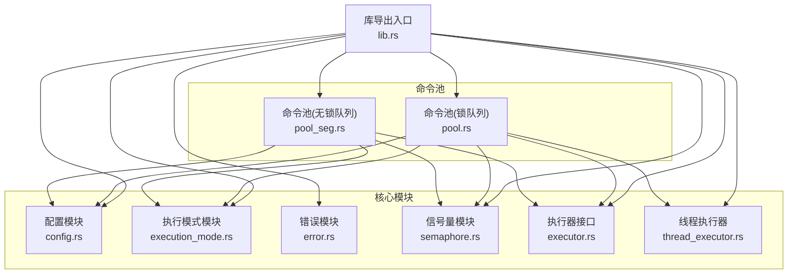
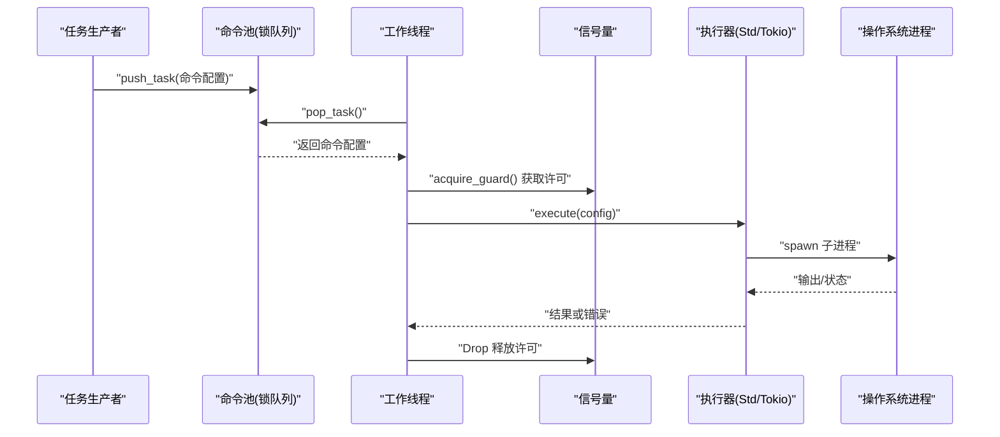
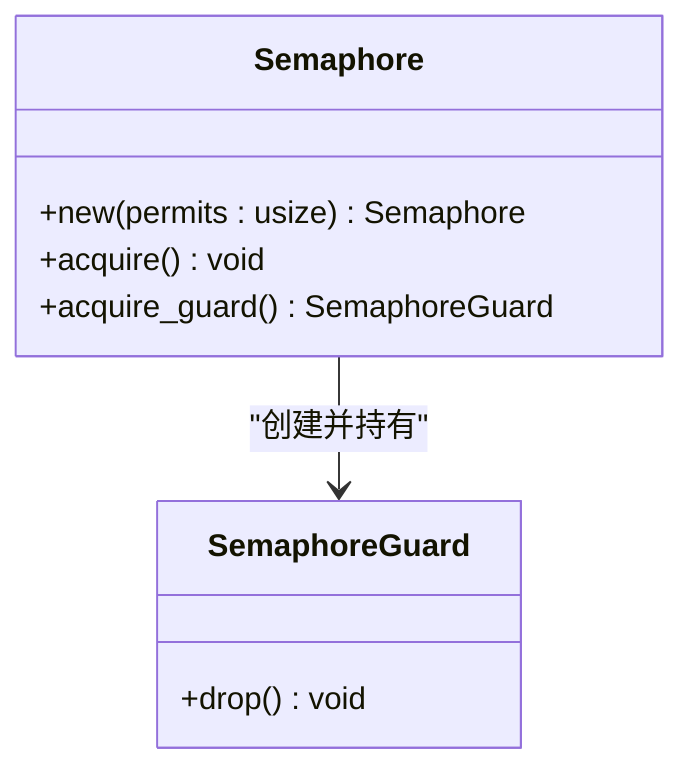
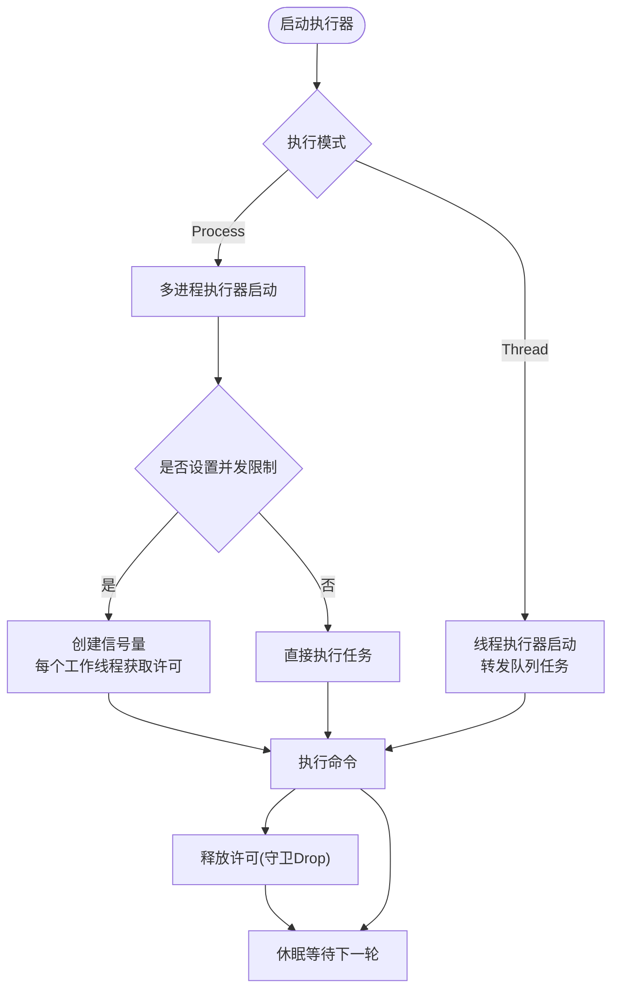
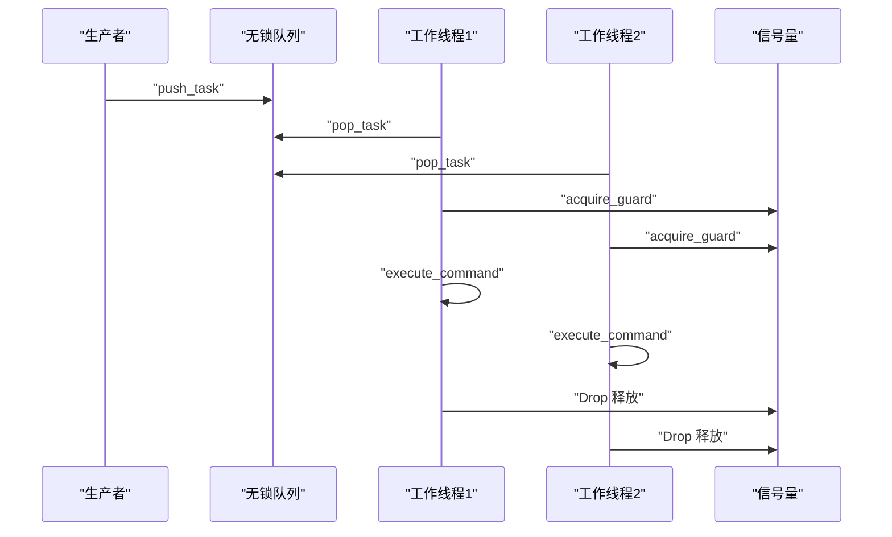
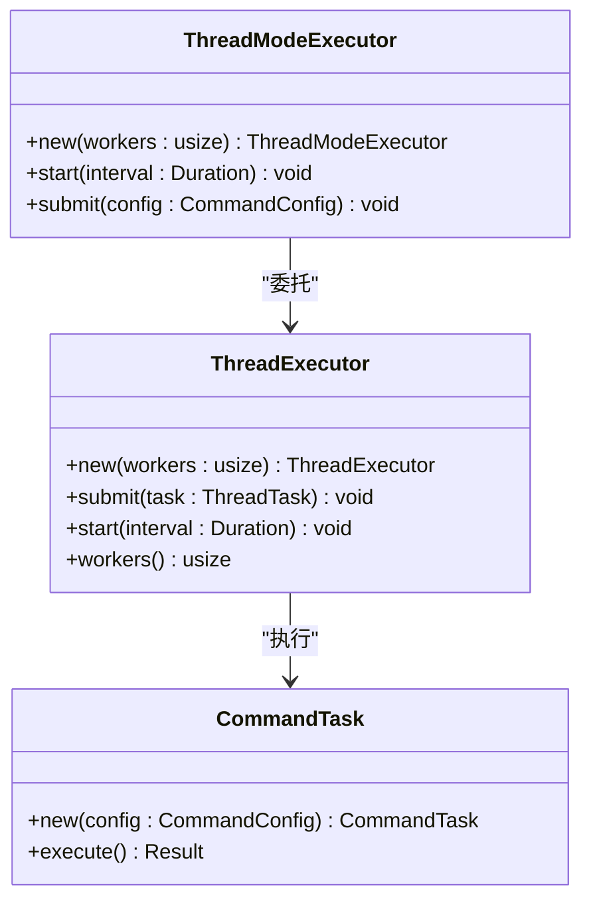
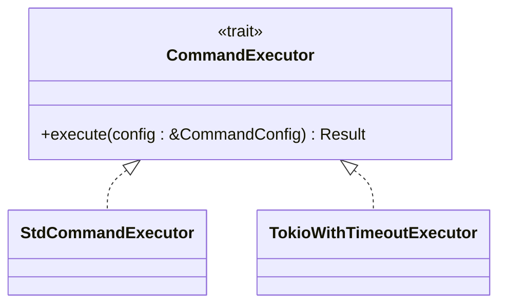
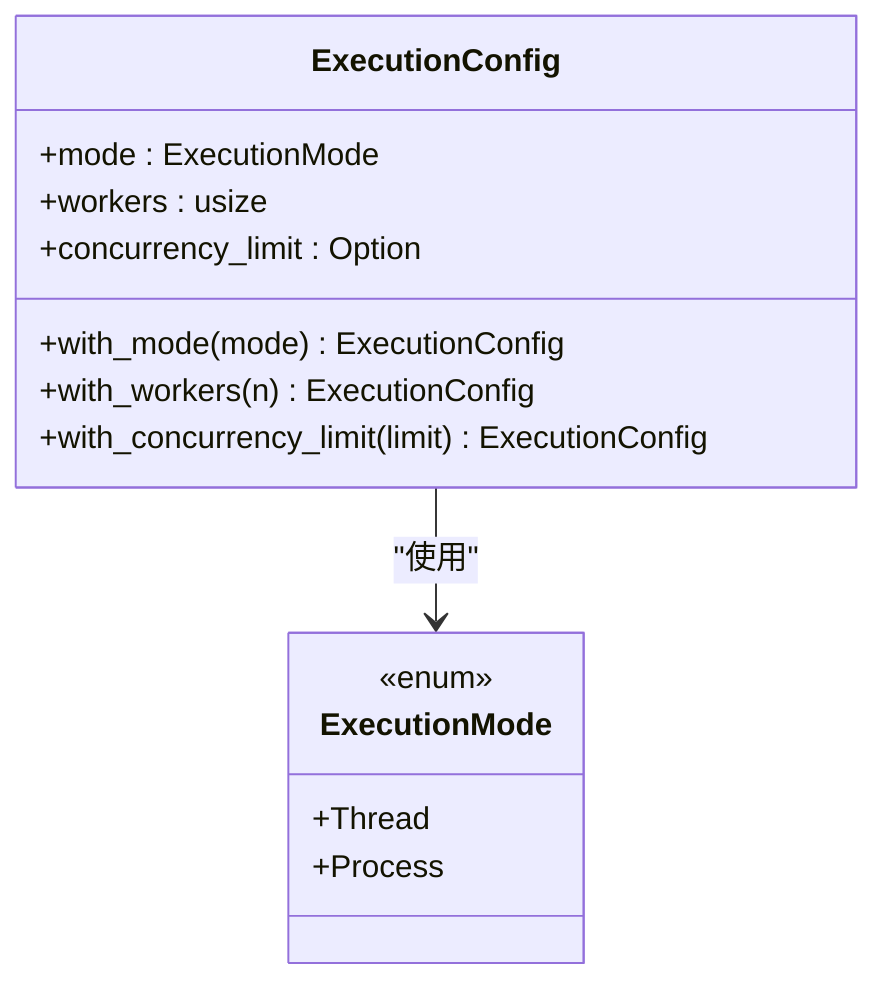
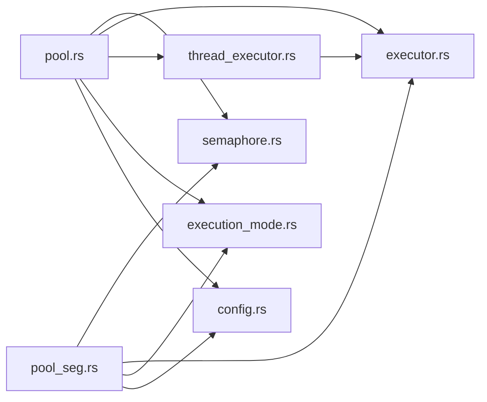

# 并发控制机制

<cite>
**本文引用的文件**
- [src/lib.rs](file://src/lib.rs)
- [src/semaphore.rs](file://src/semaphore.rs)
- [src/pool.rs](file://src/pool.rs)
- [src/pool_seg.rs](file://src/pool_seg.rs)
- [src/thread_executor.rs](file://src/thread_executor.rs)
- [src/config.rs](file://src/config.rs)
- [src/execution_mode.rs](file://src/execution_mode.rs)
- [src/executor.rs](file://src/executor.rs)
- [src/error.rs](file://src/error.rs)
- [Cargo.toml](file://Cargo.toml)
- [tests/pool_tests.rs](file://tests/pool_tests.rs)
- [examples/tokio_integration.rs](file://examples/tokio_integration.rs)
- [benches/command_pool_bench.rs](file://benches/command_pool_bench.rs)
- [EXECUTOR_CUSTOM.md](file://EXECUTOR_CUSTOM.md)
- [README.md](file://README.md)
</cite>

## 目录
1. [简介](#简介)
2. [项目结构](#项目结构)
3. [核心组件](#核心组件)
4. [架构总览](#架构总览)
5. [详细组件分析](#详细组件分析)
6. [依赖关系分析](#依赖关系分析)
7. [性能考量](#性能考量)
8. [故障排除指南](#故障排除指南)
9. [结论](#结论)
10. [附录](#附录)

## 简介
本文件围绕并发控制机制展开，重点解释信号量的实现原理与工作机制，详述线程池管理与并发限制策略，提供资源管理最佳实践与性能优化技巧，并结合具体配置示例与调优指南，帮助读者在多线程与多进程模式下安全高效地执行外部命令。同时，文档涵盖并发控制对系统性能的影响与权衡，以及故障排除与调试并发问题的方法。

## 项目结构
该项目采用模块化组织，围绕“命令配置”“执行器接口”“线程池/无锁队列”“信号量并发限制”“执行模式配置”等核心模块构建，形成可插拔、可扩展的命令执行框架。

图表来源
- [src/lib.rs](file://src/lib.rs#L1-L17)
- [src/config.rs](file://src/config.rs#L1-L109)
- [src/execution_mode.rs](file://src/execution_mode.rs#L1-L70)
- [src/error.rs](file://src/error.rs#L1-L18)
- [src/semaphore.rs](file://src/semaphore.rs#L1-L53)
- [src/executor.rs](file://src/executor.rs#L1-L100)
- [src/thread_executor.rs](file://src/thread_executor.rs#L1-L148)
- [src/pool.rs](file://src/pool.rs#L1-L296)
- [src/pool_seg.rs](file://src/pool_seg.rs#L1-L157)

章节来源
- [src/lib.rs](file://src/lib.rs#L1-L17)
- [README.md](file://README.md#L1-L60)

## 核心组件
- 信号量与守卫：提供轻量级并发许可控制，基于互斥锁与条件变量实现阻塞式获取与自动释放。
- 命令池（锁队列）：基于互斥保护的双端队列，支持多线程生产与消费，提供多线程/多进程两种执行模式。
- 命令池（无锁队列）：基于无锁跨线程队列，提升多生产者场景下的吞吐量。
- 线程执行器：在共享进程内管理一组工作线程，执行封装的任务。
- 执行器接口：抽象命令执行，支持标准库、Tokio 等不同运行时。
- 执行模式与配置：统一管理执行模式、工作线程/进程数、并发限制等参数。

章节来源
- [src/semaphore.rs](file://src/semaphore.rs#L1-L53)
- [src/pool.rs](file://src/pool.rs#L1-L296)
- [src/pool_seg.rs](file://src/pool_seg.rs#L1-L157)
- [src/thread_executor.rs](file://src/thread_executor.rs#L1-L148)
- [src/executor.rs](file://src/executor.rs#L1-L100)
- [src/execution_mode.rs](file://src/execution_mode.rs#L1-L70)
- [src/config.rs](file://src/config.rs#L1-L109)

## 架构总览
下图展示命令池在不同执行模式下的并发控制流程，包括信号量对并发进程的限制、线程池的任务分发与执行。

图表来源
- [src/pool.rs](file://src/pool.rs#L134-L210)
- [src/pool_seg.rs](file://src/pool_seg.rs#L70-L91)
- [src/semaphore.rs](file://src/semaphore.rs#L16-L52)
- [src/executor.rs](file://src/executor.rs#L26-L70)

## 详细组件分析

### 信号量与守卫（Semaphore）
- 设计要点
  - 基于互斥锁与条件变量，提供阻塞式获取与通知唤醒。
  - RAII 守卫在生命周期结束时自动释放许可，避免死锁与资源泄漏。
  - 通过原子引用计数共享，允许多工作线程协同使用。
- 关键行为
  - 获取许可：若无可用许可则阻塞等待，直至被通知。
  - 释放许可：在守卫 Drop 时递增计数并通知一个等待者。
- 复杂度
  - 获取/释放均为 O(1)，等待通过条件变量实现，避免忙等。
- 并发限制
  - 通过初始化不同的许可数，限制同时执行的外部进程数量，防止系统资源耗尽。

图表来源
- [src/semaphore.rs](file://src/semaphore.rs#L7-L52)

章节来源
- [src/semaphore.rs](file://src/semaphore.rs#L1-L53)

### 命令池（锁队列）与并发限制
- 功能概述
  - 支持多线程生产任务与多线程消费任务。
  - 提供多线程模式与多进程模式两种执行路径。
  - 支持固定工作线程数与并发限制（信号量）。
- 关键流程
  - 启动执行器：根据执行模式选择线程执行器或多进程执行器。
  - 线程模式：通过线程执行器提交任务，内部仍使用子进程执行命令。
  - 多进程模式：可选并发限制，通过信号量控制同时执行的外部进程数。
- 并发控制点
  - 信号量守卫在执行任务前获取许可，执行完成后自动释放。
  - 可与自定义执行器组合，实现异步运行时（如 Tokio）的并发控制。

图表来源
- [src/pool.rs](file://src/pool.rs#L134-L210)
- [src/thread_executor.rs](file://src/thread_executor.rs#L120-L137)

章节来源
- [src/pool.rs](file://src/pool.rs#L1-L296)
- [src/thread_executor.rs](file://src/thread_executor.rs#L1-L148)

### 命令池（无锁队列）与并发限制
- 设计优势
  - 基于跨线程无锁队列，减少锁竞争，提升多生产者场景吞吐量。
  - 与信号量配合，同样实现并发限制与自动释放。
- 使用场景
  - 高并发生产者、低延迟消费的场景优先选择无锁变体。
- 一致性
  - 与锁队列变体共享相同的并发限制与执行器接口。

图表来源
- [src/pool_seg.rs](file://src/pool_seg.rs#L56-L91)
- [src/semaphore.rs](file://src/semaphore.rs#L16-L52)

章节来源
- [src/pool_seg.rs](file://src/pool_seg.rs#L1-L157)

### 线程执行器与线程模式
- 线程执行器
  - 维护共享任务队列与工作线程，定期轮询并执行任务。
  - 适合计算密集型或需要共享内存的场景。
- 线程模式执行器
  - 将命令封装为可执行任务，复用线程池进行调度。
  - 仍通过子进程执行外部命令，隔离资源与环境。
- 适用性
  - 当任务间存在共享数据或需要细粒度控制时，线程模式更合适。

图表来源
- [src/thread_executor.rs](file://src/thread_executor.rs#L21-L137)

章节来源
- [src/thread_executor.rs](file://src/thread_executor.rs#L1-L148)

### 执行器接口与自定义执行器
- 接口设计
  - 统一的命令执行接口，支持不同运行时（标准库、Tokio 等）。
- 标准实现
  - 基于标准库子进程执行，内置超时与安全等待。
- 自定义实现
  - 可在同步 trait 中使用阻塞运行时或在专用线程中运行异步运行时。
  - 示例：Tokio 异步执行器与带超时的实现。

图表来源
- [src/executor.rs](file://src/executor.rs#L9-L24)
- [examples/tokio_integration.rs](file://examples/tokio_integration.rs#L10-L40)

章节来源
- [src/executor.rs](file://src/executor.rs#L1-L100)
- [examples/tokio_integration.rs](file://examples/tokio_integration.rs#L1-L62)
- [EXECUTOR_CUSTOM.md](file://EXECUTOR_CUSTOM.md#L1-L228)

### 执行模式与配置
- 执行模式
  - 多线程：共享进程内线程池执行，适合计算/共享内存场景。
  - 多进程：每个命令独立子进程执行，隔离资源与环境。
- 配置项
  - 工作线程/进程数、并发限制、默认超时等。
- 默认行为
  - 默认多进程模式，工作线程数自动检测 CPU 并发度。

图表来源
- [src/execution_mode.rs](file://src/execution_mode.rs#L25-L63)

章节来源
- [src/execution_mode.rs](file://src/execution_mode.rs#L1-L70)
- [src/config.rs](file://src/config.rs#L1-L109)

## 依赖关系分析
- 内部依赖
  - 命令池依赖信号量、执行器、执行模式与配置模块。
  - 线程执行器与线程模式执行器作为可选执行路径。
- 外部依赖
  - 无锁队列、等待超时工具与错误处理库。
- 模块耦合
  - 通过执行器接口解耦运行时实现，提升可扩展性。
  - 信号量作为通用并发限制组件，被两类命令池共享。

图表来源
- [src/pool.rs](file://src/pool.rs#L6-L11)
- [src/pool_seg.rs](file://src/pool_seg.rs#L7-L9)
- [src/thread_executor.rs](file://src/thread_executor.rs#L1-L3)

章节来源
- [Cargo.toml](file://Cargo.toml#L6-L12)
- [src/pool.rs](file://src/pool.rs#L1-L296)
- [src/pool_seg.rs](file://src/pool_seg.rs#L1-L157)

## 性能考量
- 队列选择
  - 锁队列：实现简单，适用于一般场景。
  - 无锁队列：多生产者高并发场景吞吐更高，减少锁竞争。
- 线程/进程模式
  - 多线程：共享内存，适合计算/共享数据场景；注意 GIL 与数据竞争。
  - 多进程：资源隔离，适合 I/O 密集与稳定性要求高的场景。
- 并发限制
  - 使用信号量限制外部进程数量，避免系统资源耗尽与上下文切换开销过大。
- 执行器选择
  - 标准库：简单可靠，适合同步场景。
  - 异步运行时：在同步接口中使用阻塞运行时或专用线程，平衡性能与复杂度。
- 调优建议
  - 工作线程数：I/O 密集可适当增加；CPU 密集接近 CPU 核心数。
  - 轮询间隔：根据任务吞吐与延迟需求折中。
  - 超时设置：为命令配置合理超时，避免僵尸进程与资源占用。

章节来源
- [src/pool_seg.rs](file://src/pool_seg.rs#L46-L51)
- [EXECUTOR_CUSTOM.md](file://EXECUTOR_CUSTOM.md#L173-L179)
- [benches/command_pool_bench.rs](file://benches/command_pool_bench.rs#L1-L93)

## 故障排除指南
- 常见错误类型
  - IO 错误：进程启动失败、权限不足、路径不存在等。
  - 超时错误：命令执行超过设定时间，触发终止并返回超时。
  - 子进程异常：子进程状态异常或非零退出码。
- 排查步骤
  - 检查命令与参数、工作目录与权限。
  - 调整并发限制与工作线程数，观察系统负载与资源占用。
  - 为命令配置合适的超时，避免长时间阻塞。
  - 使用测试用例验证基本功能与边界条件。
- 调试建议
  - 在自定义执行器中记录执行日志与错误详情。
  - 使用基准测试对比不同队列与执行器的性能差异。
  - 结合系统监控工具观察 CPU、内存与进程数变化。

章节来源
- [src/error.rs](file://src/error.rs#L7-L17)
- [src/executor.rs](file://src/executor.rs#L26-L70)
- [tests/pool_tests.rs](file://tests/pool_tests.rs#L1-L90)

## 结论
本项目通过信号量实现轻量级并发许可控制，结合线程池与多线程/多进程执行模式，提供了灵活且高效的命令执行框架。无锁队列变体进一步提升了多生产者场景的吞吐能力。通过自定义执行器接口，用户可在标准库与异步运行时之间自由选择，满足多样化的性能与可靠性需求。合理配置并发限制与工作线程数，能够在保证系统稳定的同时最大化吞吐与响应速度。

## 附录

### 配置示例与调优指南
- 快速开始（标准库执行器）
  - 创建命令池，添加任务，启动执行器。
  - 参考路径：[README 示例](file://README.md#L28-L37)
- 多线程模式
  - 使用线程模式执行器，设置工作线程数与并发限制。
  - 参考路径：[线程模式配置与测试](file://tests/pool_tests.rs#L39-L64)
- 多进程模式与并发限制
  - 设置并发限制，限制同时执行的外部进程数量。
  - 参考路径：[多进程与并发限制](file://src/pool.rs#L165-L210)
- 无锁队列变体
  - 使用无锁队列提升多生产者场景吞吐。
  - 参考路径：[无锁队列实现](file://src/pool_seg.rs#L20-L91)
- 自定义执行器（Tokio 集成）
  - 实现异步执行器，支持超时控制与错误处理。
  - 参考路径：[Tokio 示例](file://examples/tokio_integration.rs#L1-L62)、[自定义执行器指南](file://EXECUTOR_CUSTOM.md#L1-L228)

### 并发控制对系统性能的影响与权衡
- 并发度与资源
  - 过高并发可能导致上下文切换与资源争用，影响整体吞吐。
  - 合理的并发限制可避免系统过载，提升稳定性。
- I/O 密集 vs CPU 密集
  - I/O 密集场景可适度提高并发度与工作线程数。
  - CPU 密集场景应谨慎增加并发，避免过度调度。
- 队列与执行器
  - 无锁队列在高并发生产者场景收益明显。
  - 异步执行器可减少线程阻塞，但需注意运行时创建成本。

章节来源
- [src/pool.rs](file://src/pool.rs#L165-L210)
- [src/pool_seg.rs](file://src/pool_seg.rs#L70-L91)
- [examples/tokio_integration.rs](file://examples/tokio_integration.rs#L1-L62)
- [EXECUTOR_CUSTOM.md](file://EXECUTOR_CUSTOM.md#L173-L179)