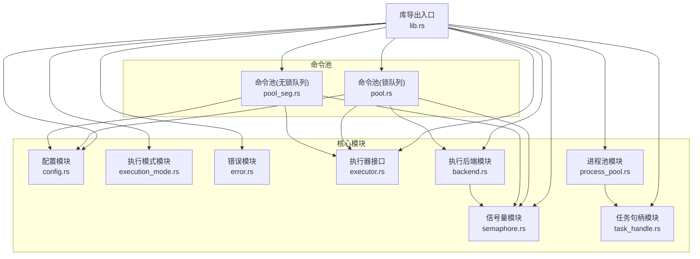
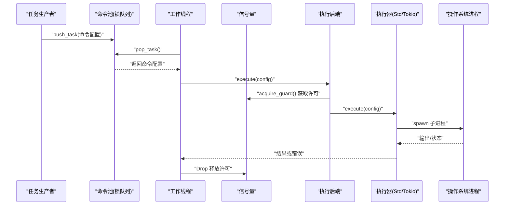
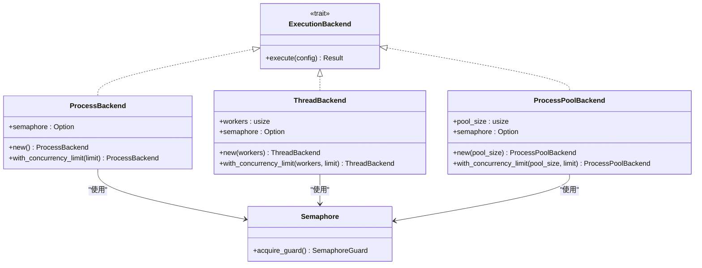
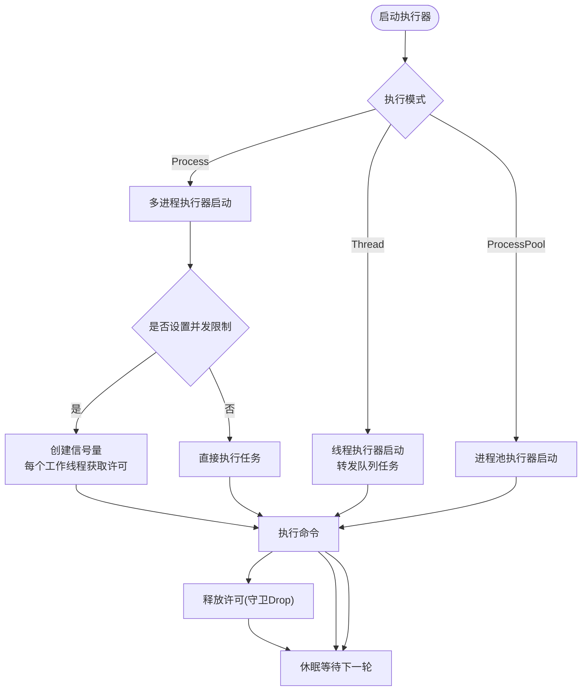
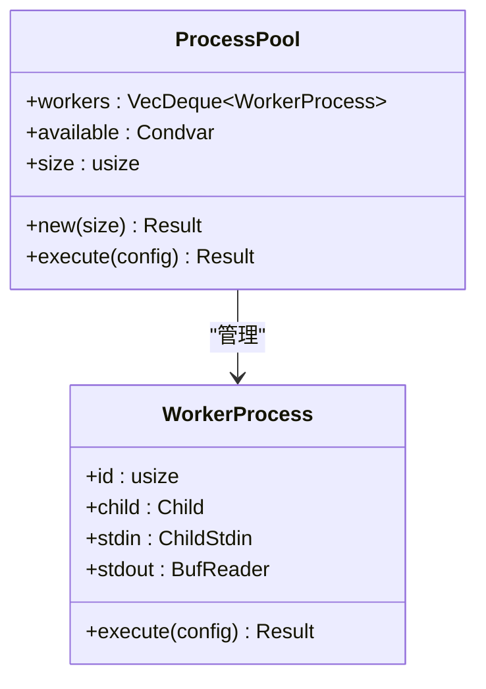
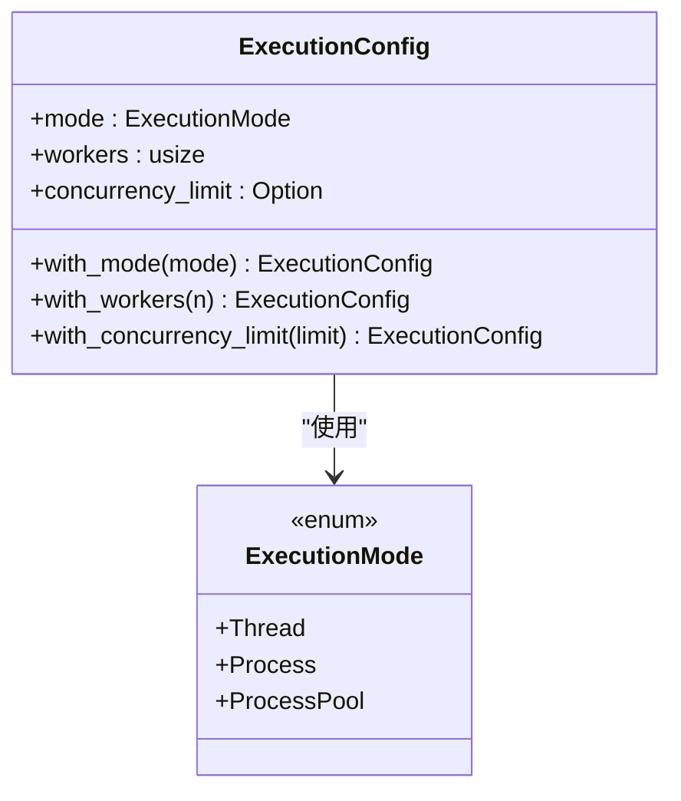
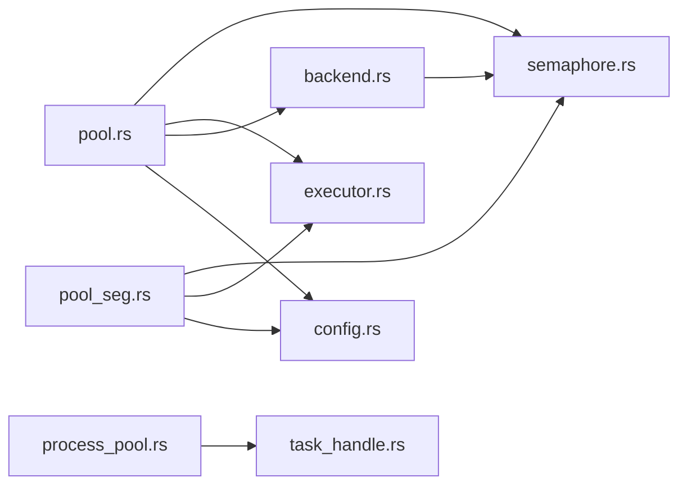

# 并发控制机制

<cite>
**本文引用的文件**
- [src/lib.rs](file://src/lib.rs)
- [src/semaphore.rs](file://src/semaphore.rs)
- [src/pool.rs](file://src/pool.rs)
- [src/pool_seg.rs](file://src/pool_seg.rs)
- [src/backend.rs](file://src/backend.rs)
- [src/config.rs](file://src/config.rs)
- [src/executor.rs](file://src/executor.rs)
- [src/error.rs](file://src/error.rs)
- [src/process_pool.rs](file://src/process_pool.rs)
- [src/task_handle.rs](file://src/task_handle.rs)
- [Cargo.toml](file://Cargo.toml)
- [tests/pool_tests.rs](file://tests/pool_tests.rs)
- [examples/tokio_integration.rs](file://examples/tokio_integration.rs)
- [benches/command_pool_bench.rs](file://benches/command_pool_bench.rs)
- [README.md](file://README.md)
</cite>

## 目录
1. [简介](#简介)
2. [项目结构](#项目结构)
3. [核心组件](#核心组件)
4. [架构总览](#架构总览)
5. [详细组件分析](#详细组件分析)
6. [依赖关系分析](#依赖关系分析)
7. [性能考量](#性能考量)
8. [故障排除指南](#故障排除指南)
9. [结论](#结论)
10. [附录](#附录)

## 简介
本文件围绕并发控制机制展开，重点解释信号量的实现原理与工作机制，详述线程池管理与并发限制策略，提供资源管理最佳实践与性能优化技巧，并结合具体配置示例与调优指南，帮助读者在多线程与多进程模式下安全高效地执行外部命令。同时，文档涵盖并发控制对系统性能的影响与权衡，以及故障排除与调试并发问题的方法。

## 项目结构
该项目采用模块化组织，围绕"命令配置""执行器接口""线程池/无锁队列""信号量并发限制""执行模式配置"等核心模块构建，形成可插拔、可扩展的命令执行框架。

**图表来源**
- [src/lib.rs](file://src/lib.rs#L1-L22)
- [src/semaphore.rs](file://src/semaphore.rs#L1-L53)
- [src/pool.rs](file://src/pool.rs#L1-L324)
- [src/pool_seg.rs](file://src/pool_seg.rs#L1-L157)
- [src/backend.rs](file://src/backend.rs#L1-L277)

**章节来源**
- [src/lib.rs](file://src/lib.rs#L1-L22)
- [README.md](file://README.md#L1-L60)

## 核心组件
- **信号量与守卫**：提供轻量级并发许可控制，基于互斥锁与条件变量实现阻塞式获取与自动释放。
- **命令池（锁队列）**：基于互斥保护的双端队列，支持多线程生产与消费，提供多线程/多进程两种执行模式。
- **命令池（无锁队列）**：基于无锁跨线程队列，提升多生产者场景下的吞吐量。
- **执行后端**：统一的执行后端接口，支持多进程、多线程和进程池三种模式，均支持并发限制。
- **进程池**：预创建常驻子进程，复用执行命令，减少进程创建开销。
- **任务句柄**：提供异步任务执行和结果获取机制。

**章节来源**
- [src/semaphore.rs](file://src/semaphore.rs#L1-L53)
- [src/pool.rs](file://src/pool.rs#L1-L324)
- [src/pool_seg.rs](file://src/pool_seg.rs#L1-L157)
- [src/backend.rs](file://src/backend.rs#L1-L277)
- [src/process_pool.rs](file://src/process_pool.rs#L1-L173)
- [src/task_handle.rs](file://src/task_handle.rs#L1-L211)

## 架构总览
下图展示命令池在不同执行模式下的并发控制流程，包括信号量对并发进程的限制、线程池的任务分发与执行。

**图表来源**
- [src/pool.rs](file://src/pool.rs#L230-L273)
- [src/pool_seg.rs](file://src/pool_seg.rs#L70-L91)
- [src/semaphore.rs](file://src/semaphore.rs#L16-L52)
- [src/backend.rs](file://src/backend.rs#L156-L161)

## 详细组件分析

### 信号量与守卫（Semaphore）
- **设计要点**
  - 基于互斥锁与条件变量，提供阻塞式获取与通知唤醒。
  - RAII 守卫在生命周期结束时自动释放许可，避免死锁与资源泄漏。
  - 通过原子引用计数共享，允许多工作线程协同使用。
- **关键行为**
  - 获取许可：若无可用许可则阻塞等待，直至被通知。
  - 释放许可：在守卫 Drop 时递增计数并通知一个等待者。
- **复杂度**
  - 获取/释放均为 O(1)，等待通过条件变量实现，避免忙等。
- **并发限制**
  - 通过初始化不同的许可数，限制同时执行的外部进程数量，防止系统资源耗尽。

**图表来源**
- [src/semaphore.rs](file://src/semaphore.rs#L7-L52)

**章节来源**
- [src/semaphore.rs](file://src/semaphore.rs#L1-L53)

### 执行后端与并发限制集成
- **设计概述**
  - 统一的 ExecutionBackend trait，支持三种执行模式：Process、Thread、ProcessPool。
  - 每种后端都支持可选的并发限制，通过信号量实现。
- **关键特性**
  - ProcessBackend：每个命令独立子进程，支持并发限制。
  - ThreadBackend：线程池调度任务，命令仍通过子进程执行。
  - ProcessPoolBackend：预创建常驻子进程池，支持并发限制。
- **并发控制实现**
  - 在后端创建时注入信号量实例。
  - 执行命令前获取许可，执行完成后自动释放。
  - 支持动态配置并发限制。

**图表来源**
- [src/backend.rs](file://src/backend.rs#L12-L277)
- [src/semaphore.rs](file://src/semaphore.rs#L1-L53)

**章节来源**
- [src/backend.rs](file://src/backend.rs#L1-L277)

### 命令池（锁队列）与并发限制
- **功能概述**
  - 支持多线程生产任务与多线程消费任务。
  - 提供多线程模式与多进程模式两种执行路径。
  - 支持固定工作线程数与并发限制（信号量）。
- **关键流程**
  - 启动执行器：根据执行模式选择对应的后端实现。
  - 线程模式：通过线程执行器提交任务，内部仍使用子进程执行命令。
  - 多进程模式：可选并发限制，通过信号量控制同时执行的外部进程数。
- **并发控制点**
  - 信号量守卫在执行任务前获取许可，执行完成后自动释放。
  - 可与自定义执行器组合，实现异步运行时（如 Tokio）的并发控制。

**图表来源**
- [src/pool.rs](file://src/pool.rs#L180-L210)
- [src/backend.rs](file://src/backend.rs#L244-L276)

**章节来源**
- [src/pool.rs](file://src/pool.rs#L1-L324)
- [src/backend.rs](file://src/backend.rs#L1-L277)

### 命令池（无锁队列）与并发限制
- **设计优势**
  - 基于跨线程无锁队列，减少锁竞争，提升多生产者场景吞吐量。
  - 与信号量配合，同样实现并发限制与自动释放。
- **使用场景**
  - 高并发生产者、低延迟消费的场景优先选择无锁变体。
- **一致性**
  - 与锁队列变体共享相同的并发限制与执行器接口。

**图表来源**
- [src/pool_seg.rs](file://src/pool_seg.rs#L70-L91)
- [src/semaphore.rs](file://src/semaphore.rs#L16-L52)

**章节来源**
- [src/pool_seg.rs](file://src/pool_seg.rs#L1-L157)

### 进程池与并发控制
- **设计概述**
  - 预创建常驻子进程，复用执行命令，减少进程创建开销。
  - 适用于高频短命令场景，可以显著减少进程创建开销。
- **实现特点**
  - 使用条件变量管理可用工作进程。
  - 支持工作进程的获取、执行和归还。
  - 提供进程池大小的配置和管理。
- **并发控制**
  - 通过内部的进程池大小限制并发执行数量。
  - 支持与信号量的组合使用。

**图表来源**
- [src/process_pool.rs](file://src/process_pool.rs#L9-L148)

**章节来源**
- [src/process_pool.rs](file://src/process_pool.rs#L1-L173)

### 任务句柄与异步执行
- **设计目的**
  - 提供异步任务执行和结果获取机制。
  - 支持任务完成状态查询和结果等待。
- **核心功能**
  - TaskHandle：用于获取异步执行的任务结果。
  - TaskWithResult：内部使用，将任务配置与结果发送器绑定。
- **使用场景**
  - 异步任务执行和结果收集。
  - 任务状态跟踪和管理。

**章节来源**
- [src/task_handle.rs](file://src/task_handle.rs#L1-L211)

### 执行器接口与自定义执行器
- **接口设计**
  - 统一的命令执行接口，支持不同运行时（标准库、Tokio 等）。
- **标准实现**
  - 基于标准库子进程执行，内置超时与安全等待。
- **自定义实现**
  - 可在同步 trait 中使用阻塞运行时或在专用线程中运行异步运行时。
  - 示例：Tokio 异步执行器与带超时的实现。

**图表来源**
- [src/executor.rs](file://src/executor.rs#L9-L24)
- [examples/tokio_integration.rs](file://examples/tokio_integration.rs#L10-L40)

**章节来源**
- [src/executor.rs](file://src/executor.rs#L1-L100)
- [examples/tokio_integration.rs](file://examples/tokio_integration.rs#L1-L62)

### 执行模式与配置
- **执行模式**
  - 多线程：共享进程内线程池执行，适合计算/共享内存场景。
  - 多进程：每个命令独立子进程执行，隔离资源与环境。
  - 进程池：预创建常驻子进程池，复用执行命令。
- **配置项**
  - 工作线程/进程数、并发限制、默认超时等。
- **默认行为**
  - 默认多进程模式，工作线程数自动检测 CPU 并发度。

**图表来源**
- [src/backend.rs](file://src/backend.rs#L28-L128)

**章节来源**
- [src/backend.rs](file://src/backend.rs#L1-L277)
- [src/config.rs](file://src/config.rs#L1-L109)

## 依赖关系分析
- **内部依赖**
  - 命令池依赖信号量、执行器、执行后端与配置模块。
  - 执行后端作为可选执行路径，支持并发限制。
  - 任务句柄模块提供异步执行支持。
- **外部依赖**
  - crossbeam_queue 用于无锁队列实现。
  - wait_timeout 用于子进程超时控制。
  - tokio 用于异步执行器示例。
- **模块耦合**
  - 通过执行器接口解耦运行时实现，提升可扩展性。
  - 信号量作为通用并发限制组件，被所有执行后端共享。

**图表来源**
- [src/pool.rs](file://src/pool.rs#L1-L11)
- [src/pool_seg.rs](file://src/pool_seg.rs#L1-L9)
- [src/backend.rs](file://src/backend.rs#L1-L6)

**章节来源**
- [Cargo.toml](file://Cargo.toml#L6-L12)
- [src/pool.rs](file://src/pool.rs#L1-L324)
- [src/pool_seg.rs](file://src/pool_seg.rs#L1-L157)

## 性能考量
- **队列选择**
  - 锁队列：实现简单，适用于一般场景。
  - 无锁队列：多生产者高并发场景吞吐更高，减少锁竞争。
- **线程/进程模式**
  - 多线程：共享内存，适合计算/共享数据场景；注意 GIL 与数据竞争。
  - 多进程：资源隔离，适合 I/O 密集与稳定性要求高的场景。
  - 进程池：预创建常驻进程，减少进程创建开销，适合高频短命令。
- **并发限制**
  - 使用信号量限制外部进程数量，避免系统资源耗尽与上下文切换开销过大。
  - 合理设置并发限制可平衡吞吐量与资源消耗。
- **执行器选择**
  - 标准库：简单可靠，适合同步场景。
  - 异步运行时：在同步接口中使用阻塞运行时或专用线程，平衡性能与复杂度。
- **调优建议**
  - 工作线程数：I/O 密集可适当增加；CPU 密集接近 CPU 核心数。
  - 轮询间隔：根据任务吞吐与延迟需求折中。
  - 超时设置：为命令配置合理超时，避免僵尸进程与资源占用。
  - 并发限制：根据系统资源和任务特性设置合适的并发上限。

**章节来源**
- [src/pool_seg.rs](file://src/pool_seg.rs#L46-L51)
- [src/backend.rs](file://src/backend.rs#L67-L128)
- [benches/command_pool_bench.rs](file://benches/command_pool_bench.rs#L1-L93)

## 故障排除指南
- **常见错误类型**
  - IO 错误：进程启动失败、权限不足、路径不存在等。
  - 超时错误：命令执行超过设定时间，触发终止并返回超时。
  - 子进程异常：子进程状态异常或非零退出码。
  - 队列满错误：当设置队列大小限制时，队列满会返回 WouldBlock 错误。
- **排查步骤**
  - 检查命令与参数、工作目录与权限。
  - 调整并发限制与工作线程数，观察系统负载与资源占用。
  - 为命令配置合适的超时，避免长时间阻塞。
  - 使用测试用例验证基本功能与边界条件。
  - 监控系统资源使用情况，避免过度并发导致系统过载。
- **调试建议**
  - 在自定义执行器中记录执行日志与错误详情。
  - 使用基准测试对比不同队列与执行器的性能差异。
  - 结合系统监控工具观察 CPU、内存与进程数变化。
  - 检查信号量的获取和释放是否正确配对。

**章节来源**
- [src/error.rs](file://src/error.rs#L7-L17)
- [src/executor.rs](file://src/executor.rs#L26-L70)
- [tests/pool_tests.rs](file://tests/pool_tests.rs#L1-L155)

## 结论
本项目通过信号量实现轻量级并发许可控制，结合线程池与多线程/多进程执行模式，提供了灵活且高效的命令执行框架。执行后端的统一接口设计使得并发限制可以在所有执行模式中一致应用。无锁队列变体进一步提升了多生产者场景的吞吐能力。通过自定义执行器接口，用户可在标准库与异步运行时之间自由选择，满足多样化的性能与可靠性需求。合理配置并发限制与工作线程数，能够在保证系统稳定的同时最大化吞吐与响应速度。

## 附录

### 配置示例与调优指南
- **快速开始（标准库执行器）**
  - 创建命令池，添加任务，启动执行器。
  - 参考路径：[README 示例](file://README.md#L28-L37)
- **多线程模式**
  - 使用线程模式执行器，设置工作线程数与并发限制。
  - 参考路径：[线程模式配置与测试](file://tests/pool_tests.rs#L36-L45)
- **多进程模式与并发限制**
  - 设置并发限制，限制同时执行的外部进程数量。
  - 参考路径：[多进程与并发限制](file://src/backend.rs#L149-L153)
- **进程池模式**
  - 预创建常驻子进程池，复用执行命令。
  - 参考路径：[进程池实现](file://src/process_pool.rs#L104-L147)
- **无锁队列变体**
  - 使用无锁队列提升多生产者场景吞吐。
  - 参考路径：[无锁队列实现](file://src/pool_seg.rs#L20-L91)
- **自定义执行器（Tokio 集成）**
  - 实现异步执行器，支持超时控制与错误处理。
  - 参考路径：[Tokio 示例](file://examples/tokio_integration.rs#L1-L62)

### 并发控制对系统性能的影响与权衡
- **并发度与资源**
  - 过高并发可能导致上下文切换与资源争用，影响整体吞吐。
  - 合理的并发限制可避免系统过载，提升稳定性。
- **I/O 密集 vs CPU 密集**
  - I/O 密集场景可适度提高并发度与工作线程数。
  - CPU 密集场景应谨慎增加并发，避免过度调度。
- **队列与执行器**
  - 无锁队列在高并发生产者场景收益明显。
  - 异步执行器可减少线程阻塞，但需注意运行时创建成本。
- **信号量性能**
  - 信号量的获取和释放操作为 O(1)，对性能影响较小。
  - 合理设置信号量大小可有效控制资源使用。

**章节来源**
- [src/backend.rs](file://src/backend.rs#L149-L153)
- [src/pool_seg.rs](file://src/pool_seg.rs#L70-L91)
- [examples/tokio_integration.rs](file://examples/tokio_integration.rs#L1-L62)
- [src/semaphore.rs](file://src/semaphore.rs#L16-L52)