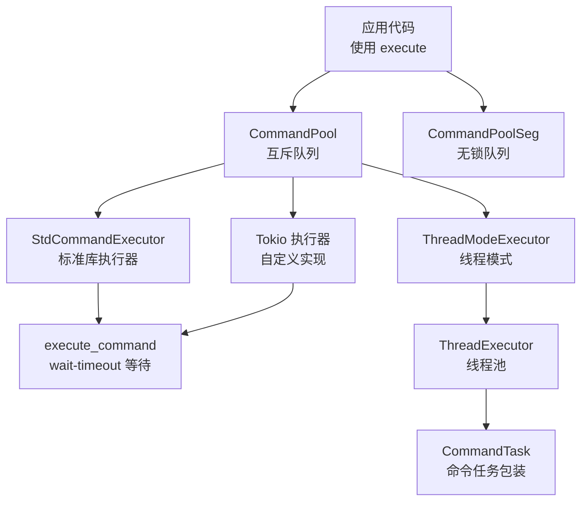
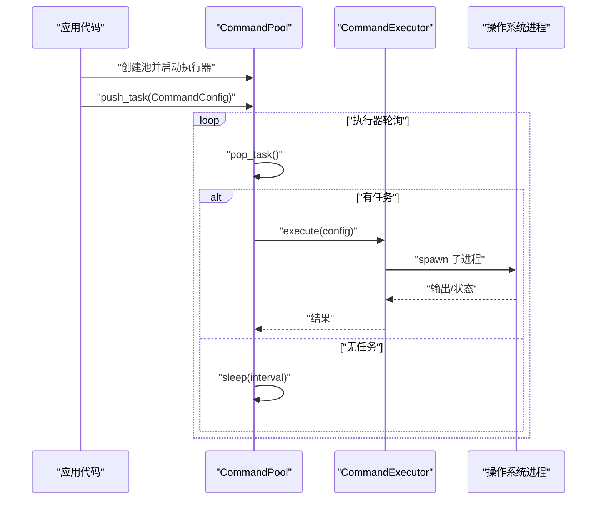
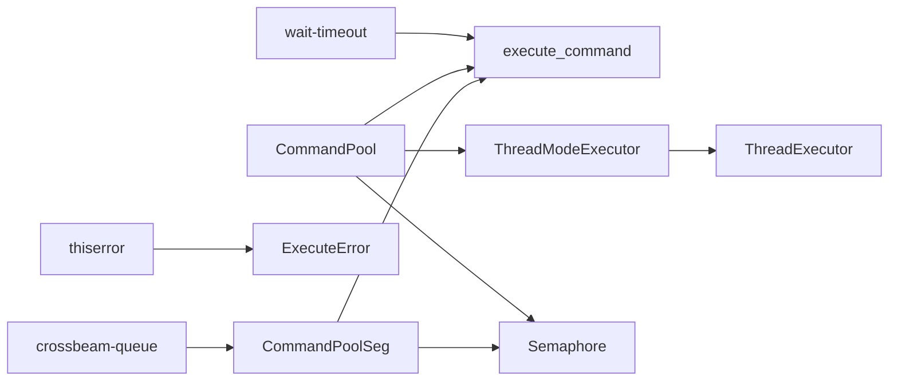

# 快速开始

<cite>
**本文引用的文件**
- [Cargo.toml](file://Cargo.toml)
- [README.md](file://README.md)
- [src/lib.rs](file://src/lib.rs)
- [src/config.rs](file://src/config.rs)
- [src/executor.rs](file://src/executor.rs)
- [src/pool.rs](file://src/pool.rs)
- [src/pool_seg.rs](file://src/pool_seg.rs)
- [src/thread_executor.rs](file://src/thread_executor.rs)
- [src/execution_mode.rs](file://src/execution_mode.rs)
- [src/semaphore.rs](file://src/semaphore.rs)
- [src/error.rs](file://src/error.rs)
- [src/main.rs](file://src/main.rs)
- [examples/tokio_integration.rs](file://examples/tokio_integration.rs)
</cite>

## 目录
1. [简介](#简介)
2. [项目结构](#项目结构)
3. [核心组件](#核心组件)
4. [架构总览](#架构总览)
5. [详细组件分析](#详细组件分析)
6. [依赖关系分析](#依赖关系分析)
7. [性能注意事项](#性能注意事项)
8. [故障排查指南](#故障排查指南)
9. [结论](#结论)
10. [附录](#附录)

## 简介
本指南面向首次接触 execute 库的新用户，帮助你在 5 分钟内完成安装、配置与运行第一个命令执行池程序。你将学会：
- 如何在 Cargo.toml 中添加依赖（execute、crossbeam-queue、wait-timeout、thiserror）
- 如何创建 CommandPool、添加任务、启动执行器
- 如何使用 CommandConfig 配置命令、工作目录与超时
- 如何使用标准库执行器与 Tokio 执行器
- 常见使用场景与预期输出说明

## 项目结构
execute 是一个轻量的命令池库，提供可插拔的命令执行器、锁/无锁任务队列、线程池与并发限制策略。核心模块如下：
- lib.rs：导出公共 API（CommandConfig、CommandPool、CommandPoolSeg、CommandExecutor、ThreadExecutor、ThreadModeExecutor、ExecuteError、ExecutionConfig、ExecutionMode）
- config.rs：命令配置 CommandConfig（程序名、参数、工作目录、超时）
- executor.rs：命令执行器 trait 与标准库实现 StdCommandExecutor，以及内部 execute_command 函数
- pool.rs：基于互斥队列的命令池 CommandPool（支持多线程/多进程模式）
- pool_seg.rs：基于无锁队列的命令池 CommandPoolSeg（高性能多生产者场景）
- thread_executor.rs：线程池与线程模式执行器（ThreadExecutor、ThreadModeExecutor、CommandTask）
- execution_mode.rs：执行模式 ExecutionMode（Thread/Process）与 ExecutionConfig
- semaphore.rs：简单计数信号量，用于并发限制
- error.rs：错误类型 ExecuteError（IO、超时、子进程错误）
- examples/tokio_integration.rs：Tokio 集成示例（自定义执行器）
- src/main.rs：完整示例程序（演示多任务、超时与输出）

图表来源
- [src/lib.rs](file://src/lib.rs#L10-L16)
- [src/pool.rs](file://src/pool.rs#L13-L21)
- [src/pool_seg.rs](file://src/pool_seg.rs#L11-L18)
- [src/executor.rs](file://src/executor.rs#L5-L24)
- [src/thread_executor.rs](file://src/thread_executor.rs#L16-L24)

章节来源
- [src/lib.rs](file://src/lib.rs#L1-L17)
- [src/pool.rs](file://src/pool.rs#L13-L21)
- [src/pool_seg.rs](file://src/pool_seg.rs#L11-L18)
- [src/executor.rs](file://src/executor.rs#L5-L24)
- [src/thread_executor.rs](file://src/thread_executor.rs#L16-L24)

## 核心组件
- CommandConfig：描述一次命令执行的所有信息（程序名、参数、工作目录、超时），支持链式配置。
- CommandPool：基于互斥队列的命令池，支持多线程/多进程两种执行模式，提供多种启动方式。
- CommandPoolSeg：基于无锁队列的命令池，适合高并发多生产者场景。
- CommandExecutor：执行器 trait，标准库实现 StdCommandExecutor，可自定义（如 Tokio）。
- ThreadExecutor/ThreadModeExecutor：线程模式下的线程池与执行器，适合共享内存场景。
- ExecutionConfig/ExecutionMode：执行模式配置（Thread/Process），可设置工作线程数与并发限制。
- ExecuteError：统一错误类型（IO、超时、子进程错误）。

章节来源
- [src/config.rs](file://src/config.rs#L19-L108)
- [src/pool.rs](file://src/pool.rs#L14-L21)
- [src/pool_seg.rs](file://src/pool_seg.rs#L16-L18)
- [src/executor.rs](file://src/executor.rs#L9-L24)
- [src/thread_executor.rs](file://src/thread_executor.rs#L21-L24)
- [src/execution_mode.rs](file://src/execution_mode.rs#L25-L32)
- [src/error.rs](file://src/error.rs#L7-L17)

## 架构总览
下面的序列图展示了从创建命令池到启动执行器、添加任务、执行命令的完整流程。该流程适用于标准库执行器与自定义执行器（如 Tokio）。

图表来源
- [src/pool.rs](file://src/pool.rs#L134-L143)
- [src/pool.rs](file://src/pool.rs#L175-L187)
- [src/executor.rs](file://src/executor.rs#L20-L24)
- [src/executor.rs](file://src/executor.rs#L30-L70)

## 详细组件分析

### 安装与依赖配置
- 在 Cargo.toml 中添加 execute 与必要依赖：
  - execute：本库
  - crossbeam-queue：无锁队列（用于 CommandPoolSeg）
  - wait-timeout：子进程超时等待（避免额外等待线程）
  - thiserror：错误派生宏（统一错误类型）
- 开发依赖（可选）：tokio（用于示例中的异步执行器）

章节来源
- [Cargo.toml](file://Cargo.toml#L6-L12)
- [README.md](file://README.md#L18-L26)

### 最简单的命令执行（5 分钟上手）
- 步骤
  1) 创建命令池：使用默认配置创建 CommandPool
  2) 创建命令配置：使用 CommandConfig.new 指定程序与参数
  3) 添加任务：调用 push_task 将任务加入池
  4) 启动执行器：调用 start_executor 并设置轮询间隔
- 预期输出
  - echo 输出“hello”等文本（具体取决于你的系统环境）
  - 程序不会立即退出，执行器会持续轮询并执行任务

章节来源
- [README.md](file://README.md#L28-L37)
- [src/pool.rs](file://src/pool.rs#L36-L40)
- [src/pool.rs](file://src/pool.rs#L79-L96)
- [src/pool.rs](file://src/pool.rs#L118-L143)

### CommandConfig 基础与高级用法
- 基本用法：CommandConfig::new("echo", vec!["hello".to_string()])
- 高级用法：
  - 设置工作目录：with_working_dir(".")
  - 设置超时：with_timeout(Duration::from_secs(5))
- 注意：超时为可选，未设置时将无限等待子进程完成

章节来源
- [src/config.rs](file://src/config.rs#L27-L46)
- [src/config.rs](file://src/config.rs#L48-L66)
- [src/config.rs](file://src/config.rs#L68-L87)
- [src/config.rs](file://src/config.rs#L89-L107)

### CommandPool：创建、任务添加与执行器启动
- 创建池：CommandPool::new 或 with_config
- 添加任务：push_task
- 启动执行器：
  - start_executor(interval)
  - start_executor_with_workers(interval, workers)
  - start_executor_with_workers_and_limit(interval, workers, limit)
  - start_executor_with_executor(...)
  - start_executor_with_executor_and_limit(...)
- 执行模式：
  - Process（默认）：每个命令在独立子进程中执行
  - Thread：在共享进程内的线程池中执行（需要 ThreadModeExecutor）

章节来源
- [src/pool.rs](file://src/pool.rs#L36-L67)
- [src/pool.rs](file://src/pool.rs#L79-L96)
- [src/pool.rs](file://src/pool.rs#L118-L143)
- [src/pool.rs](file://src/pool.rs#L174-L210)
- [src/pool.rs](file://src/pool.rs#L229-L288)
- [src/execution_mode.rs](file://src/execution_mode.rs#L5-L13)

### CommandPoolSeg：无锁队列的高性能命令池
- 适用于多生产者高并发场景，避免互斥锁竞争
- 支持与 CommandPool 相同的启动方式（含自定义执行器与并发限制）

章节来源
- [src/pool_seg.rs](file://src/pool_seg.rs#L11-L18)
- [src/pool_seg.rs](file://src/pool_seg.rs#L20-L41)
- [src/pool_seg.rs](file://src/pool_seg.rs#L43-L91)
- [src/pool_seg.rs](file://src/pool_seg.rs#L93-L149)

### 执行器与超时控制
- 标准库执行器 StdCommandExecutor：基于 std::process::Command，使用 wait-timeout 进行超时等待
- 超时行为：到达超时后尝试杀死子进程并返回 ExecuteError::Timeout
- 自定义执行器：实现 CommandExecutor trait，可在 Tokio、async-std 等运行时中执行命令

章节来源
- [src/executor.rs](file://src/executor.rs#L9-L24)
- [src/executor.rs](file://src/executor.rs#L26-L70)
- [src/error.rs](file://src/error.rs#L7-L17)

### 线程模式与线程池
- ThreadModeExecutor：在线程池中执行命令任务
- ThreadExecutor：管理一组工作线程，定期轮询任务队列
- CommandTask：将 CommandConfig 包装为可在线程池执行的任务

章节来源
- [src/thread_executor.rs](file://src/thread_executor.rs#L16-L24)
- [src/thread_executor.rs](file://src/thread_executor.rs#L26-L76)
- [src/thread_executor.rs](file://src/thread_executor.rs#L87-L110)
- [src/thread_executor.rs](file://src/thread_executor.rs#L112-L137)

### 并发限制与信号量
- Semaphore：基于 Mutex+Condvar 的简单计数信号量
- 用途：限制同时执行的外部进程数量，防止资源耗尽
- 使用：在启动执行器时传入 limit 参数

章节来源
- [src/semaphore.rs](file://src/semaphore.rs#L7-L43)
- [src/semaphore.rs](file://src/semaphore.rs#L45-L52)

### 完整示例：标准库执行器
- 功能：创建池、启动执行器、在后台线程中添加多个任务（含超时演示）、等待执行完成
- 输出：控制台打印任务执行日志与最终结束信息

章节来源
- [src/main.rs](file://src/main.rs#L16-L47)

### 示例：Tokio 集成与超时控制
- 功能：实现自定义执行器（TokioWithTimeoutExecutor），支持超时与错误处理
- 使用：将自定义执行器注入 CommandPool，设置工作线程与并发限制
- 输出：控制台打印任务执行日志与最终结束信息

章节来源
- [examples/tokio_integration.rs](file://examples/tokio_integration.rs#L10-L40)
- [examples/tokio_integration.rs](file://examples/tokio_integration.rs#L42-L61)

## 依赖关系分析
- 外部依赖
  - crossbeam-queue：用于无锁队列 CommandPoolSeg
  - wait-timeout：用于子进程超时等待，避免额外等待线程
  - thiserror：用于统一错误类型派生
- 内部模块耦合
  - pool.rs 与 executor.rs：通过 execute_command 与 CommandExecutor 协作
  - pool_seg.rs 与 executor.rs：同样通过 execute_command 协作
  - thread_executor.rs 与 pool.rs：在 Thread 模式下协作
  - semaphore.rs：被 pool.rs 与 pool_seg.rs 用于并发限制

图表来源
- [Cargo.toml](file://Cargo.toml#L7-L9)
- [src/pool_seg.rs](file://src/pool_seg.rs#L5-L9)
- [src/executor.rs](file://src/executor.rs#L46-L69)
- [src/error.rs](file://src/error.rs#L2-L17)
- [src/pool.rs](file://src/pool.rs#L14-L21)
- [src/thread_executor.rs](file://src/thread_executor.rs#L116-L118)
- [src/thread_executor.rs](file://src/thread_executor.rs#L21-L24)
- [src/semaphore.rs](file://src/semaphore.rs#L7-L9)

章节来源
- [Cargo.toml](file://Cargo.toml#L6-L12)
- [src/pool_seg.rs](file://src/pool_seg.rs#L5-L9)
- [src/executor.rs](file://src/executor.rs#L46-L69)
- [src/error.rs](file://src/error.rs#L2-L17)
- [src/pool.rs](file://src/pool.rs#L14-L21)
- [src/thread_executor.rs](file://src/thread_executor.rs#L116-L118)
- [src/semaphore.rs](file://src/semaphore.rs#L7-L9)

## 性能注意事项
- 互斥队列 vs 无锁队列
  - CommandPool 基于 Mutex<VecDeque>，适合一般场景
  - CommandPoolSeg 基于 crossbeam_queue::SegQueue，适合高并发多生产者场景
- 轮询间隔
  - 合理设置 interval，过小会增加 CPU 占用，过大会影响响应性
- 并发限制
  - 使用 with_concurrency_limit 限制同时执行的外部进程数量，避免系统资源耗尽
- 线程模式
  - Thread 模式共享内存，适合计算密集型任务；Process 模式隔离性强，适合命令执行

## 故障排查指南
- 常见错误类型
  - IO 错误：命令不存在、权限不足、工作目录无效
  - 超时错误：命令执行超过设定的超时时间
  - 子进程错误：子进程状态异常
- 排查建议
  - 检查程序名与参数是否正确
  - 检查工作目录是否存在
  - 调整超时时间或并发限制
  - 在 Tokio 执行器中检查运行时初始化与错误映射

章节来源
- [src/error.rs](file://src/error.rs#L7-L17)
- [src/executor.rs](file://src/executor.rs#L42-L69)
- [examples/tokio_integration.rs](file://examples/tokio_integration.rs#L15-L18)

## 结论
通过本快速开始指南，你已经完成了 execute 库的安装与基础使用，理解了 CommandConfig、CommandPool、执行器与并发限制的基本概念，并掌握了标准库与 Tokio 的使用方法。建议进一步阅读示例与自定义执行器文档，探索更复杂的使用场景。

## 附录

### 常见使用场景
- 标准库执行器：适合大多数命令执行需求，无需额外运行时
- Tokio 执行器：适合需要异步运行时的场景，支持超时与错误处理
- 无锁队列：适合高并发多生产者场景，减少锁竞争
- 线程模式：适合共享内存、计算密集型任务

### 代码片段路径参考
- 最简示例（标准库执行器）
  - [README.md](file://README.md#L28-L37)
- 完整示例（标准库执行器）
  - [src/main.rs](file://src/main.rs#L16-L47)
- Tokio 集成示例
  - [examples/tokio_integration.rs](file://examples/tokio_integration.rs#L42-L61)
- 自定义执行器实现
  - [examples/tokio_integration.rs](file://examples/tokio_integration.rs#L10-L40)