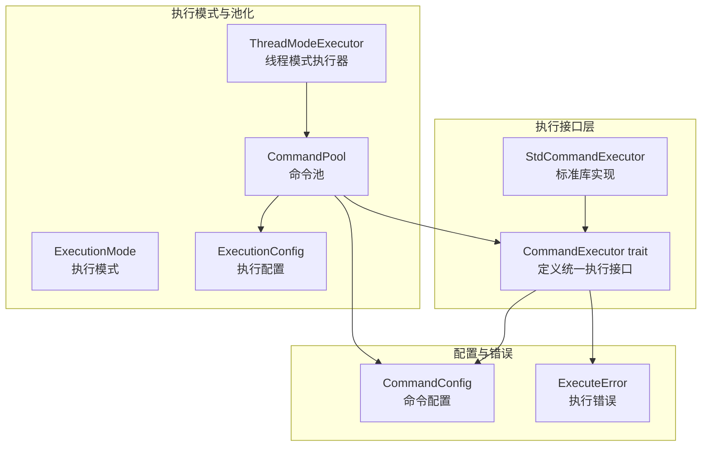
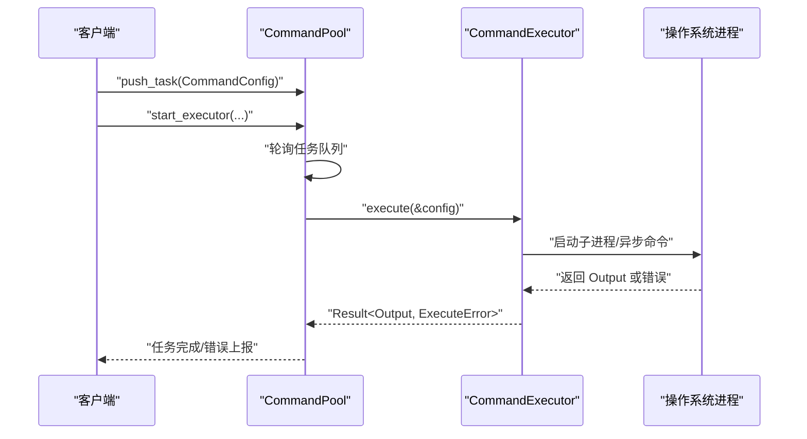
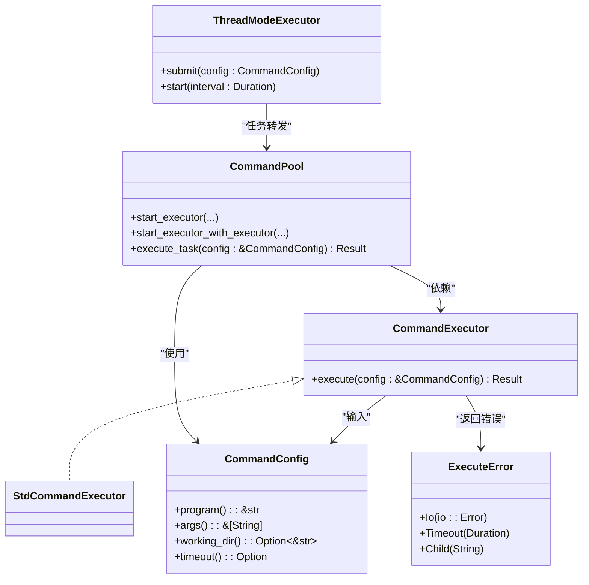
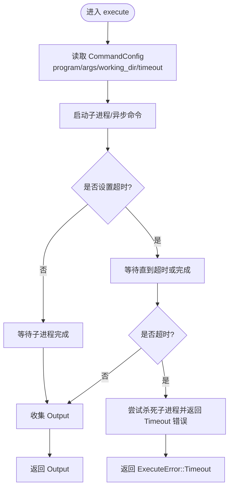

# CommandExecutor 接口

<cite>
**本文档引用的文件**
- [src/lib.rs](file://src/lib.rs)
- [src/executor.rs](file://src/executor.rs)
- [src/config.rs](file://src/config.rs)
- [src/error.rs](file://src/error.rs)
- [src/pool.rs](file://src/pool.rs)
- [src/thread_executor.rs](file://src/thread_executor.rs)
- [examples/tokio_integration.rs](file://examples/tokio_integration.rs)
- [EXECUTOR_CUSTOM.md](file://EXECUTOR_CUSTOM.md)
</cite>

## 目录
1. [简介](#简介)
2. [项目结构](#项目结构)
3. [核心组件](#核心组件)
4. [架构总览](#架构总览)
5. [详细组件分析](#详细组件分析)
6. [依赖关系分析](#依赖关系分析)
7. [性能考量](#性能考量)
8. [故障排查指南](#故障排查指南)
9. [结论](#结论)
10. [附录](#附录)

## 简介
本文件围绕 CommandExecutor trait 接口展开，系统性阐述其设计目的、核心方法签名、参数与返回值语义、线程安全约束、最佳实践与实现注意事项，并结合仓库中的具体实现与示例，帮助读者正确理解并扩展该接口。

## 项目结构
该接口位于执行模块的核心位置，配合命令配置、错误类型、执行模式与命令池等组件共同构成完整的命令执行体系。

图表来源
- [src/executor.rs](file://src/executor.rs#L9-L24)
- [src/config.rs](file://src/config.rs#L19-L108)
- [src/error.rs](file://src/error.rs#L7-L17)
- [src/execution_mode.rs](file://src/execution_mode.rs#L5-L69)
- [src/pool.rs](file://src/pool.rs#L13-L296)
- [src/thread_executor.rs](file://src/thread_executor.rs#L16-L148)

章节来源
- [src/lib.rs](file://src/lib.rs#L1-L17)
- [src/executor.rs](file://src/executor.rs#L1-L100)
- [src/config.rs](file://src/config.rs#L1-L109)
- [src/error.rs](file://src/error.rs#L1-L18)
- [src/execution_mode.rs](file://src/execution_mode.rs#L1-L70)
- [src/pool.rs](file://src/pool.rs#L1-L296)
- [src/thread_executor.rs](file://src/thread_executor.rs#L1-L148)

## 核心组件
- CommandExecutor trait：抽象命令执行接口，要求实现者提供同步的 execute 方法，接收命令配置并返回标准库 Output 或对应错误。
- StdCommandExecutor：基于标准库 std::process::Command 的同步实现，内部使用 wait-timeout crate 实现超时控制。
- CommandConfig：封装要执行的命令及其参数、工作目录、超时等配置信息。
- ExecuteError：统一的执行错误类型，涵盖 IO 错误、超时、子进程异常等。
- CommandPool：支持多线程/多进程两种模式的命令池，可注入任意 CommandExecutor 实现。
- ThreadModeExecutor：在线程模式下将命令包装为任务并提交到线程池执行。
- ExecutionMode/ExecutionConfig：控制执行模式（线程/进程）、工作线程/进程数、并发限制等。

章节来源
- [src/executor.rs](file://src/executor.rs#L9-L24)
- [src/config.rs](file://src/config.rs#L19-L108)
- [src/error.rs](file://src/error.rs#L7-L17)
- [src/pool.rs](file://src/pool.rs#L13-L296)
- [src/thread_executor.rs](file://src/thread_executor.rs#L16-L148)
- [src/execution_mode.rs](file://src/execution_mode.rs#L5-L69)

## 架构总览
CommandExecutor 作为统一抽象，被 CommandPool 与 ThreadModeExecutor 等上层组件消费。CommandPool 支持三种执行模式：线程模式、进程模式、自定义执行器模式；线程模式下，命令通过线程池执行；进程模式下，命令通过子进程执行；自定义执行器模式下，用户可注入任意 CommandExecutor 实现（例如基于 Tokio 的异步实现）。

图表来源
- [src/pool.rs](file://src/pool.rs#L134-L143)
- [src/pool.rs](file://src/pool.rs#L222-L227)
- [src/executor.rs](file://src/executor.rs#L20-L24)

## 详细组件分析

### CommandExecutor trait 设计与签名
- 设计目的
  - 统一不同运行时（标准库、Tokio、async-std 等）的命令执行接口，使上层组件无需关心底层实现细节。
  - 通过 trait 抽象，允许用户注入自定义执行器，满足多样化的执行需求。
- 核心方法
  - execute(&self, config: &CommandConfig) -> Result<Output, ExecuteError>
    - 输入：不可变引用的 CommandConfig，包含程序名、参数、工作目录、超时等。
    - 输出：标准库 Output（包含退出状态、标准输出、标准错误），或 ExecuteError。
- 线程安全约束
  - trait 上限 Send + Sync，确保在多线程环境中安全共享与调用。
  - 这意味着实现类必须保证在多线程环境下是安全的（例如不持有非 Send/Sync 的内部状态）。

章节来源
- [src/executor.rs](file://src/executor.rs#L9-L12)

### StdCommandExecutor 实现
- 实现要点
  - 基于 std::process::Command 启动子进程，重定向 stdout/stderr。
  - 支持超时：使用 wait-timeout crate 在当前线程等待，避免额外线程开销。
  - 超时处理：超时后尝试杀死子进程并返回 ExecuteError::Timeout。
- 适用场景
  - 简单、稳定的同步执行需求，无需引入异步运行时。
- 注意事项
  - 由于是同步阻塞实现，建议在独立线程中运行，避免阻塞事件循环。

章节来源
- [src/executor.rs](file://src/executor.rs#L18-L24)
- [src/executor.rs](file://src/executor.rs#L30-L70)

### CommandConfig 参数详解
- 字段与作用
  - program：要执行的可执行程序名或路径。
  - args：传递给程序的参数列表。
  - working_dir：可选的工作目录，未设置时使用当前目录。
  - timeout：可选的超时时间，未设置时无限等待。
- 使用建议
  - 对于需要超时控制的命令，务必显式设置 timeout。
  - 对于需要隔离工作环境的命令，设置 working_dir。
- 访问器
  - program()/args()/working_dir()/timeout() 提供只读访问。

章节来源
- [src/config.rs](file://src/config.rs#L19-L108)

### Output 返回值结构
- 结构说明
  - 包含子进程退出状态、标准输出、标准错误等。
  - 上层可通过该结构判断命令执行结果与输出内容。
- 与错误类型的协作
  - 当执行失败或超时时，返回 ExecuteError；成功时返回 Output。

章节来源
- [src/executor.rs](file://src/executor.rs#L11)
- [src/error.rs](file://src/error.rs#L7-L17)

### 线程安全性与 Send + Sync 约束
- Send + Sync 的含义
  - Send：允许跨线程移动所有权，实现者内部状态可安全转移。
  - Sync：允许跨线程共享引用，实现者内部状态可安全并发访问。
- 为什么需要该约束
  - CommandPool 在多线程环境中调用 execute，需要保证实现对象可安全共享。
  - 若实现包含非 Send/Sync 的内部状态，编译器会报错，有助于提前发现潜在问题。
- 实现注意事项
  - 避免持有非 Send/Sync 的内部可变状态。
  - 如需使用异步运行时，应避免在 execute 内部频繁创建运行时实例，推荐复用或使用全局运行时。

章节来源
- [src/executor.rs](file://src/executor.rs#L9)
- [src/pool.rs](file://src/pool.rs#L233-L237)
- [EXECUTOR_CUSTOM.md](file://EXECUTOR_CUSTOM.md#L173-L179)

### 自定义执行器实现示例与最佳实践
- 示例：Tokio 异步执行器
  - 在 execute 中使用 block_on 或在异步上下文调用，以适配同步 trait。
  - 支持超时控制，超时返回 ExecuteError::Timeout。
- 最佳实践
  - 复用运行时实例，避免在每次 execute 调用中创建新运行时。
  - 明确处理超时与错误映射，保持与标准实现一致的错误语义。
  - 保持实现的幂等性与可重入性，避免副作用。
- 与 CommandPool 的集成
  - 通过 start_executor_with_executor/start_executor_with_executor_and_limit 注入自定义执行器。
  - 可与并发限制配合，控制外部进程数量，避免资源耗尽。

章节来源
- [examples/tokio_integration.rs](file://examples/tokio_integration.rs#L10-L40)
- [EXECUTOR_CUSTOM.md](file://EXECUTOR_CUSTOM.md#L31-L107)
- [EXECUTOR_CUSTOM.md](file://EXECUTOR_CUSTOM.md#L109-L155)

### 线程模式下的命令执行
- ThreadModeExecutor
  - 将 CommandConfig 包装为 CommandTask，提交到线程池执行。
  - 仍使用 execute_command 执行外部命令，但任务调度在多线程环境中进行。
- 适用场景
  - 需要在共享内存空间内并发执行任务，适合计算密集型或需要共享状态的场景。

章节来源
- [src/thread_executor.rs](file://src/thread_executor.rs#L87-L110)
- [src/thread_executor.rs](file://src/thread_executor.rs#L112-L148)

## 依赖关系分析
CommandExecutor 与各模块的依赖关系如下：

图表来源
- [src/executor.rs](file://src/executor.rs#L9-L24)
- [src/config.rs](file://src/config.rs#L19-L108)
- [src/error.rs](file://src/error.rs#L7-L17)
- [src/pool.rs](file://src/pool.rs#L13-L296)
- [src/thread_executor.rs](file://src/thread_executor.rs#L16-L148)

章节来源
- [src/executor.rs](file://src/executor.rs#L1-L100)
- [src/pool.rs](file://src/pool.rs#L1-L296)
- [src/thread_executor.rs](file://src/thread_executor.rs#L1-L148)

## 性能考量
- 同步实现的开销
  - StdCommandExecutor 在当前线程等待子进程，避免额外线程，降低系统开销。
  - 对于大量 I/O 密集型命令，建议使用并发限制与工作线程数合理配置。
- 异步运行时的权衡
  - 自定义执行器若使用异步运行时，应在 execute 内部避免频繁创建运行时，推荐复用或使用全局运行时。
  - 超时控制建议使用异步超时机制，避免阻塞线程。
- 并发限制
  - 通过信号量限制同时执行的外部进程数量，防止资源耗尽与系统过载。

章节来源
- [src/executor.rs](file://src/executor.rs#L26-L70)
- [EXECUTOR_CUSTOM.md](file://EXECUTOR_CUSTOM.md#L173-L179)

## 故障排查指南
- 常见错误类型
  - ExecuteError::Io：IO 错误，通常由进程启动、等待或读取输出失败导致。
  - ExecuteError::Timeout：超时错误，表示命令在指定时间内未完成。
  - ExecuteError::Child：子进程异常，通常由子进程状态异常导致。
- 排查步骤
  - 检查 CommandConfig 的 program、args、working_dir、timeout 是否正确设置。
  - 对于超时问题，确认 timeout 设置是否合理，必要时增大超时或优化命令执行时间。
  - 对于异步执行器，检查运行时初始化与 block_on 使用是否正确。
- 单元测试参考
  - 可参考仓库中的测试用例，验证命令执行与超时行为。

章节来源
- [src/error.rs](file://src/error.rs#L7-L17)
- [src/executor.rs](file://src/executor.rs#L72-L99)
- [tests/config_tests.rs](file://tests/config_tests.rs#L1-L28)

## 结论
CommandExecutor 通过简洁而强大的抽象，为命令执行提供了统一且可扩展的接口。结合 CommandConfig、ExecuteError、ExecutionMode/ExecutionConfig 与 CommandPool/ThreadModeExecutor，用户可以在多种运行时与执行模式之间灵活切换，并通过自定义执行器满足特定需求。遵循 Send + Sync 约束与最佳实践，可确保接口在多线程环境下的稳定性与高性能。

## 附录
- 快速开始
  - 使用默认的 StdCommandExecutor：参见 [EXECUTOR_CUSTOM.md](file://EXECUTOR_CUSTOM.md#L15-L29)。
  - 自定义执行器：参见 [examples/tokio_integration.rs](file://examples/tokio_integration.rs#L10-L40) 与 [EXECUTOR_CUSTOM.md](file://EXECUTOR_CUSTOM.md#L31-L107)。
- 关键流程图：execute 方法的执行路径

图表来源
- [src/executor.rs](file://src/executor.rs#L30-L70)
- [src/error.rs](file://src/error.rs#L12-L13)