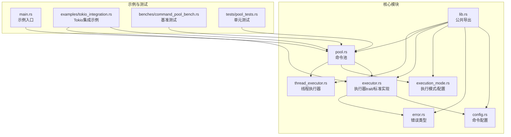
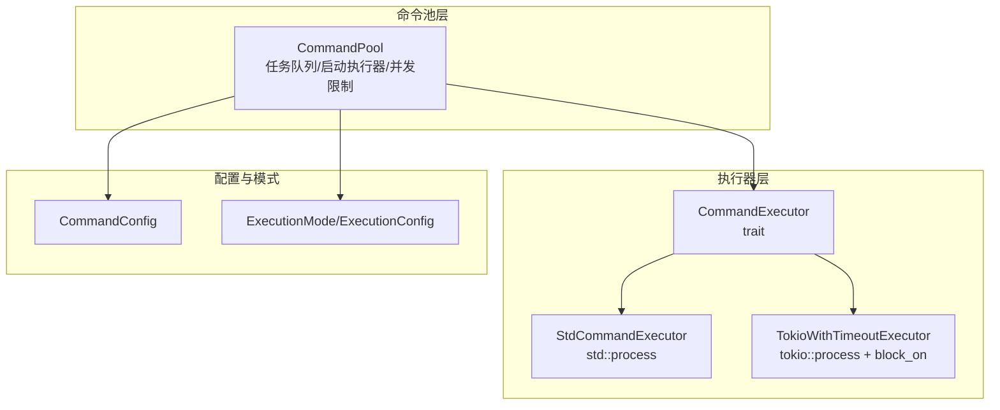
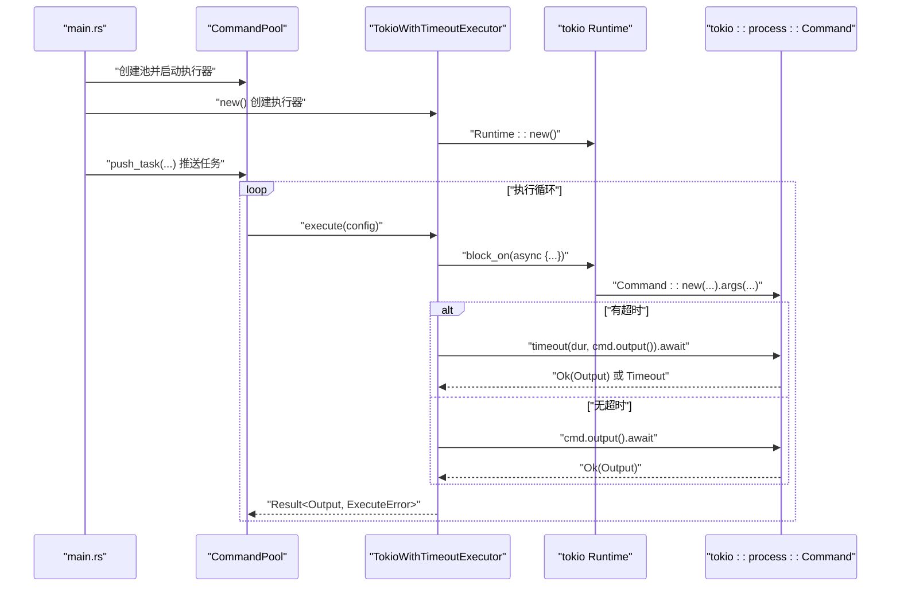
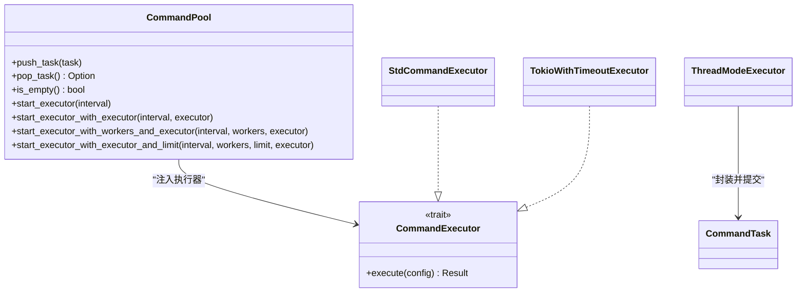
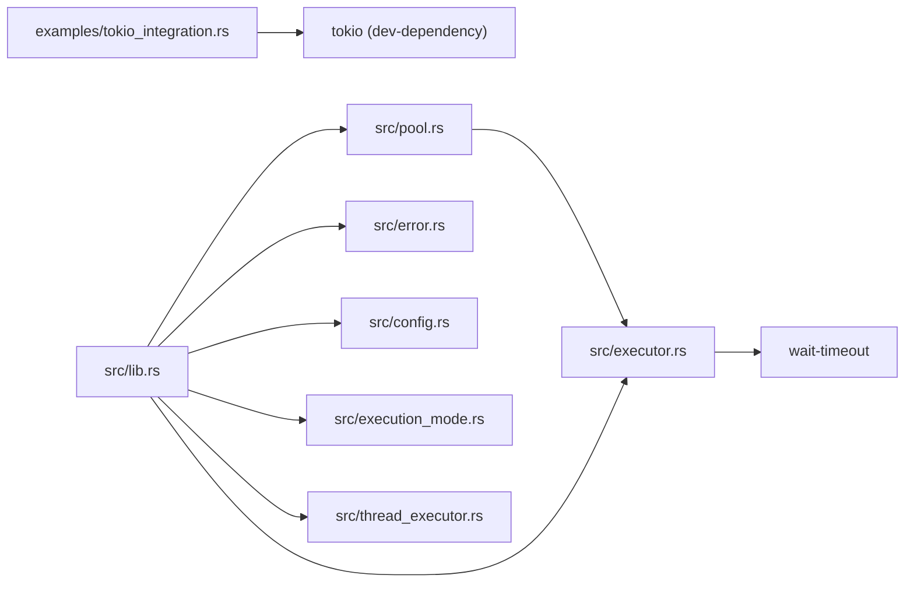

# 异步执行器集成

<cite>
**本文引用的文件**
- [examples/tokio_integration.rs](file://examples/tokio_integration.rs)
- [src/lib.rs](file://src/lib.rs)
- [src/main.rs](file://src/main.rs)
- [src/pool.rs](file://src/pool.rs)
- [src/thread_executor.rs](file://src/thread_executor.rs)
- [src/executor.rs](file://src/executor.rs)
- [src/config.rs](file://src/config.rs)
- [src/error.rs](file://src/error.rs)
- [src/execution_mode.rs](file://src/execution_mode.rs)
- [Cargo.toml](file://Cargo.toml)
- [benches/command_pool_bench.rs](file://benches/command_pool_bench.rs)
- [tests/pool_tests.rs](file://tests/pool_tests.rs)
- [README.md](file://README.md)
</cite>

## 目录
1. [简介](#简介)
2. [项目结构](#项目结构)
3. [核心组件](#核心组件)
4. [架构总览](#架构总览)
5. [详细组件分析](#详细组件分析)
6. [依赖关系分析](#依赖关系分析)
7. [性能考量](#性能考量)
8. [故障排查指南](#故障排查指南)
9. [结论](#结论)
10. [附录](#附录)

## 简介
本文件围绕“异步执行器集成”主题，系统性阐述如何将 tokio 等异步运行时无缝集成到命令执行池中，重点解析 tokio_integration.rs 示例的实现原理与使用方法，对比异步执行器与标准执行器的差异与优势，并给出多运行时支持的架构设计与实现策略。内容涵盖异步任务管理、错误传播、资源清理、性能对比与使用场景建议，帮助读者在 Rust 生态中高效构建可扩展的命令执行系统。

## 项目结构
该项目采用模块化组织，核心模块如下：
- lib.rs：导出公共 API（命令配置、错误类型、执行器、执行池、线程执行器等）
- config.rs：命令配置数据结构与链式构建方法
- error.rs：统一的执行错误类型
- execution_mode.rs：执行模式与配置（线程/进程模式、工作线程/进程数、并发限制）
- executor.rs：执行器 trait 与标准执行器实现，以及内部命令执行函数
- pool.rs：命令池实现，支持多线程/多进程模式、自定义执行器注入、并发限制
- thread_executor.rs：线程模式下的线程池与命令任务封装
- main.rs：示例程序入口，展示默认执行器的使用
- examples/tokio_integration.rs：Tokio 异步运行时集成示例
- benches/command_pool_bench.rs：基准测试
- tests/pool_tests.rs：单元测试
- Cargo.toml：依赖声明（含 tokio 开发依赖）

图表来源
- [src/lib.rs](file://src/lib.rs#L1-L17)
- [src/pool.rs](file://src/pool.rs#L1-L296)
- [src/executor.rs](file://src/executor.rs#L1-L100)
- [src/config.rs](file://src/config.rs#L1-L109)
- [src/error.rs](file://src/error.rs#L1-L18)
- [src/execution_mode.rs](file://src/execution_mode.rs#L1-L70)
- [src/thread_executor.rs](file://src/thread_executor.rs#L1-L148)
- [src/main.rs](file://src/main.rs#L1-L48)
- [examples/tokio_integration.rs](file://examples/tokio_integration.rs#L1-L62)
- [benches/command_pool_bench.rs](file://benches/command_pool_bench.rs#L1-L93)
- [tests/pool_tests.rs](file://tests/pool_tests.rs#L1-L90)

章节来源
- [src/lib.rs](file://src/lib.rs#L1-L17)
- [src/pool.rs](file://src/pool.rs#L1-L296)
- [src/executor.rs](file://src/executor.rs#L1-L100)
- [src/config.rs](file://src/config.rs#L1-L109)
- [src/error.rs](file://src/error.rs#L1-L18)
- [src/execution_mode.rs](file://src/execution_mode.rs#L1-L70)
- [src/thread_executor.rs](file://src/thread_executor.rs#L1-L148)
- [src/main.rs](file://src/main.rs#L1-L48)
- [examples/tokio_integration.rs](file://examples/tokio_integration.rs#L1-L62)
- [benches/command_pool_bench.rs](file://benches/command_pool_bench.rs#L1-L93)
- [tests/pool_tests.rs](file://tests/pool_tests.rs#L1-L90)
- [README.md](file://README.md#L1-L60)

## 核心组件
- 命令配置 CommandConfig：封装程序名、参数、工作目录、超时等，支持链式构建与查询。
- 执行器 trait CommandExecutor：抽象命令执行接口，允许注入不同运行时（标准库、tokio、async-std 等）。
- 标准执行器 StdCommandExecutor：基于 std::process 的同步实现，内部使用 wait-timeout 进行超时等待。
- 命令池 CommandPool：支持多线程/多进程模式，提供启动执行器、并发限制、自定义执行器注入等能力。
- 线程执行器 ThreadModeExecutor：在线程模式下将命令封装为任务并在线程池中执行。
- 错误类型 ExecuteError：统一的错误表示（IO、超时、子进程异常）。
- 执行模式 ExecutionMode/ExecutionConfig：控制线程/进程模式、工作线程/进程数、并发限制。

章节来源
- [src/config.rs](file://src/config.rs#L1-L109)
- [src/executor.rs](file://src/executor.rs#L1-L100)
- [src/pool.rs](file://src/pool.rs#L1-L296)
- [src/thread_executor.rs](file://src/thread_executor.rs#L1-L148)
- [src/error.rs](file://src/error.rs#L1-L18)
- [src/execution_mode.rs](file://src/execution_mode.rs#L1-L70)

## 架构总览
整体架构围绕“命令池 + 执行器”的解耦设计展开。命令池负责任务的生产与消费，执行器负责具体命令的执行。通过 CommandExecutor trait，可灵活替换为不同运行时（如 tokio）。命令池在启动执行器时，既可使用内置的标准执行器，也可注入自定义执行器（如 TokioWithTimeoutExecutor），并支持并发限制与工作线程数配置。

图表来源
- [src/pool.rs](file://src/pool.rs#L1-L296)
- [src/executor.rs](file://src/executor.rs#L1-L100)
- [src/config.rs](file://src/config.rs#L1-L109)
- [src/execution_mode.rs](file://src/execution_mode.rs#L1-L70)
- [examples/tokio_integration.rs](file://examples/tokio_integration.rs#L1-L62)

## 详细组件分析

### 异步执行器与标准执行器的差异与优势
- 标准执行器（StdCommandExecutor）
  - 基于 std::process::Command，同步阻塞等待子进程完成。
  - 使用 wait-timeout 在当前线程中等待，避免为每个任务额外创建等待线程，降低系统开销。
  - 适合 CPU 密集型或需要严格同步语义的场景。
- 异步执行器（TokioWithTimeoutExecutor）
  - 基于 tokio::process::Command，通过 tokio::runtime::Runtime 的 block_on 在同步 trait 中运行异步逻辑。
  - 支持在异步上下文中进行超时控制（tokio::time::timeout），提升与现有异步生态的兼容性。
  - 适合需要与 tokio 生态协同、或希望在执行命令的同时处理其他异步任务的场景。

章节来源
- [src/executor.rs](file://src/executor.rs#L1-L100)
- [examples/tokio_integration.rs](file://examples/tokio_integration.rs#L1-L62)

### tokio_integration.rs 示例详解
该示例展示了如何在 CommandPool 中使用 Tokio 异步执行器，并支持超时与错误处理。关键点：
- 自定义执行器 TokioWithTimeoutExecutor
  - 维护一个 tokio::runtime::Runtime 实例，通过 block_on 在同步 trait 中运行异步命令执行。
  - 使用 tokio::process::Command 构建命令，支持参数、工作目录、超时等配置。
  - 超时处理：当配置了超时时，使用 tokio::time::timeout 包裹命令执行，超时则返回 ExecuteError::Timeout。
- 主流程
  - 创建 CommandPool，实例化 TokioWithTimeoutExecutor 并封装为 Arc。
  - 向池中推送若干任务（含超时配置）。
  - 调用 start_executor_with_executor_and_limit 启动执行器，指定轮询间隔、工作线程数、并发限制与自定义执行器。
  - 等待一段时间以观察任务执行结果。

图表来源
- [examples/tokio_integration.rs](file://examples/tokio_integration.rs#L1-L62)
- [src/pool.rs](file://src/pool.rs#L265-L288)
- [src/executor.rs](file://src/executor.rs#L1-L100)

章节来源
- [examples/tokio_integration.rs](file://examples/tokio_integration.rs#L1-L62)
- [src/pool.rs](file://src/pool.rs#L265-L288)
- [src/executor.rs](file://src/executor.rs#L1-L100)

### 命令池与自定义执行器的集成
- 自定义执行器注入
  - start_executor_with_executor：根据可用并行度自动选择工作线程数，将任务分发给自定义执行器。
  - start_executor_with_workers_and_executor：允许显式指定工作线程数。
  - start_executor_with_executor_and_limit：在注入自定义执行器的同时应用并发限制（信号量）。
- 与线程模式的协作
  - 线程模式下，命令仍通过子进程执行，但任务调度在共享内存的线程池中进行。
  - 线程模式执行器 ThreadModeExecutor 将 CommandConfig 封装为 CommandTask 并提交到线程池。

图表来源
- [src/pool.rs](file://src/pool.rs#L1-L296)
- [src/executor.rs](file://src/executor.rs#L1-L100)
- [src/thread_executor.rs](file://src/thread_executor.rs#L1-L148)
- [examples/tokio_integration.rs](file://examples/tokio_integration.rs#L1-L62)

章节来源
- [src/pool.rs](file://src/pool.rs#L233-L288)
- [src/thread_executor.rs](file://src/thread_executor.rs#L112-L148)

### 异步任务管理、错误传播与资源清理
- 异步任务管理
  - 在 TokioWithTimeoutExecutor 中，通过 Runtime::block_on 在同步 trait 上运行异步命令执行，避免跨运行时切换带来的复杂性。
  - 命令池在启动执行器时，按工作线程数创建后台线程，每个线程循环从队列取出任务并调用执行器的 execute 方法。
- 错误传播
  - tokio::time::timeout 的超时分支返回 ExecuteError::Timeout，标准执行器在 wait-timeout 超时后也返回相同错误类型。
  - 所有执行器均将底层 IO 错误转换为 ExecuteError::Io，保证上层统一处理。
- 资源清理
  - 标准执行器在超时后尝试杀死子进程并等待其退出，避免僵尸进程。
  - 线程模式下，命令通过子进程执行，线程池仅负责任务调度与回收。

章节来源
- [examples/tokio_integration.rs](file://examples/tokio_integration.rs#L21-L40)
- [src/executor.rs](file://src/executor.rs#L26-L70)
- [src/error.rs](file://src/error.rs#L1-L18)

### 多运行时支持的架构设计与实现策略
- 设计原则
  - 通过 CommandExecutor trait 解耦执行逻辑，使命令池与具体运行时无关。
  - 在命令池启动阶段注入执行器，支持线程/进程模式与并发限制的组合。
- 实现策略
  - 标准运行时：StdCommandExecutor 使用 wait-timeout 在当前线程等待，减少额外线程开销。
  - 异步运行时：TokioWithTimeoutExecutor 在 block_on 中运行 tokio::process::Command，支持 tokio 超时与异步生态。
  - 线程模式：ThreadModeExecutor 将命令封装为线程任务，适合共享内存场景。
- 扩展建议
  - 可新增 async-std、smol 等运行时的执行器实现，保持相同的 trait 接口。
  - 对于需要更高并发的场景，可在专用线程中运行异步运行时，避免与主线程阻塞混用。

章节来源
- [src/executor.rs](file://src/executor.rs#L1-L100)
- [src/pool.rs](file://src/pool.rs#L134-L172)
- [src/thread_executor.rs](file://src/thread_executor.rs#L112-L148)
- [README.md](file://README.md#L44-L49)

## 依赖关系分析
- tokio 依赖
  - examples/tokio_integration.rs 使用 tokio::process::Command 与 tokio::time::timeout。
  - Cargo.toml 在 dev-dependencies 中声明 tokio 特性（process、time、rt-multi-thread），用于示例与基准测试。
- 核心依赖
  - thiserror：统一错误类型派生。
  - crossbeam-queue：无锁队列变体（CommandPoolSeg）。
  - wait-timeout：在标准执行器中进行超时等待，避免额外等待线程。

图表来源
- [examples/tokio_integration.rs](file://examples/tokio_integration.rs#L1-L62)
- [src/pool.rs](file://src/pool.rs#L1-L296)
- [src/executor.rs](file://src/executor.rs#L1-L100)
- [src/error.rs](file://src/error.rs#L1-L18)
- [src/config.rs](file://src/config.rs#L1-L109)
- [src/execution_mode.rs](file://src/execution_mode.rs#L1-L70)
- [src/thread_executor.rs](file://src/thread_executor.rs#L1-L148)
- [Cargo.toml](file://Cargo.toml#L1-L13)

章节来源
- [Cargo.toml](file://Cargo.toml#L1-L13)
- [src/pool.rs](file://src/pool.rs#L1-L296)
- [src/executor.rs](file://src/executor.rs#L1-L100)

## 性能考量
- 等待策略
  - 标准执行器使用 wait-timeout 在当前线程等待，避免为每个任务创建额外等待线程，降低系统开销。
  - 异步执行器通过 tokio::time::timeout 在异步上下文中等待，适合与异步生态协同，减少阻塞。
- 并发与吞吐
  - 命令池支持工作线程数与并发限制配置，可通过 start_executor_with_workers_and_limit 控制同时执行的外部进程数量。
  - 线程模式下，任务调度在共享内存的线程池中进行，适合计算密集型或需要共享状态的场景。
- 基准测试
  - benches/command_pool_bench.rs 提供 push/pop、执行真实命令等基准，可用于评估不同配置下的性能表现。

章节来源
- [src/executor.rs](file://src/executor.rs#L26-L70)
- [src/pool.rs](file://src/pool.rs#L189-L210)
- [benches/command_pool_bench.rs](file://benches/command_pool_bench.rs#L1-L93)

## 故障排查指南
- 常见错误类型
  - ExecuteError::Io：底层 IO 错误，通常由命令启动失败或管道读写异常引起。
  - ExecuteError::Timeout：命令执行超时，标准执行器与异步执行器均会返回此错误。
  - ExecuteError::Child：子进程状态异常（示例中未在 tokio 示例中直接触发）。
- 排查步骤
  - 检查命令是否存在、权限是否正确、工作目录是否有效。
  - 调整超时时间或并发限制，避免资源争用导致的超时。
  - 在 tokio 示例中确认 Runtime 正常创建且 block_on 调用路径正确。
- 单元测试与示例
  - tests/pool_tests.rs 验证命令池的基本行为与执行模式切换。
  - examples/tokio_integration.rs 提供端到端示例，便于对照排查。

章节来源
- [src/error.rs](file://src/error.rs#L1-L18)
- [examples/tokio_integration.rs](file://examples/tokio_integration.rs#L1-L62)
- [tests/pool_tests.rs](file://tests/pool_tests.rs#L1-L90)

## 结论
通过 CommandExecutor trait，命令池实现了对多运行时的可插拔支持。标准执行器以 wait-timeout 优化等待策略，异步执行器（如 TokioWithTimeoutExecutor）在同步 trait 中运行异步逻辑，兼顾与异步生态的协同与超时控制。结合工作线程数与并发限制配置，可在不同场景下取得良好的吞吐与稳定性。建议在需要与 tokio 生态深度集成的场景优先考虑异步执行器，在追求最小系统开销与简单性的场景优先考虑标准执行器。

## 附录
- 使用场景建议
  - 异步生态集成：当应用已大量使用 tokio，且需要在执行命令的同时处理其他异步任务时，优先选择异步执行器。
  - 最小开销与简单性：当不需要异步生态参与，且希望减少线程等待开销时，选择标准执行器。
  - 线程共享与状态共享：当任务间需要共享内存状态或执行计算密集型逻辑时，考虑线程模式。
- 相关文件路径
  - 示例：examples/tokio_integration.rs
  - 基准：benches/command_pool_bench.rs
  - 测试：tests/pool_tests.rs
  - 文档：README.md