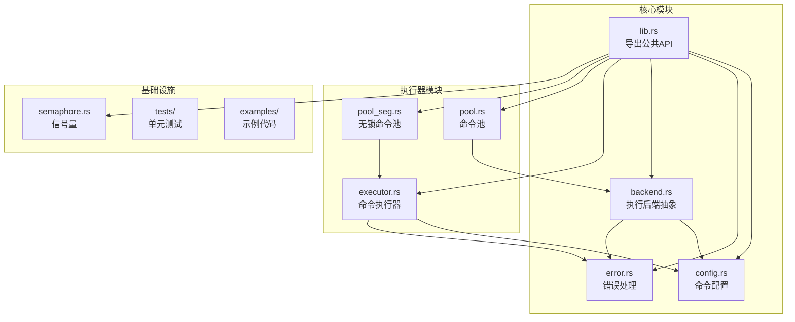
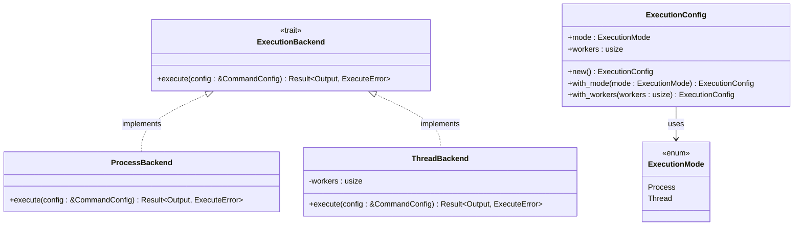
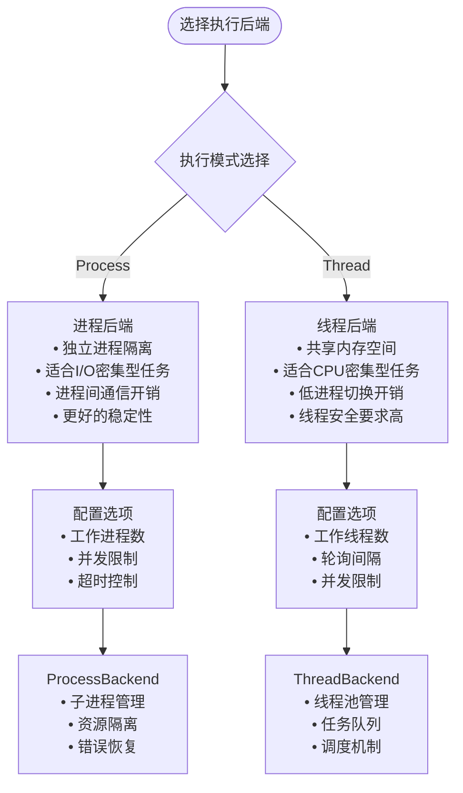
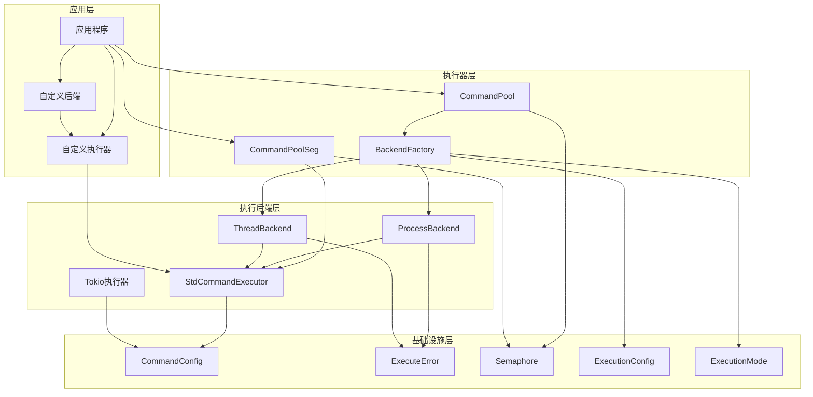
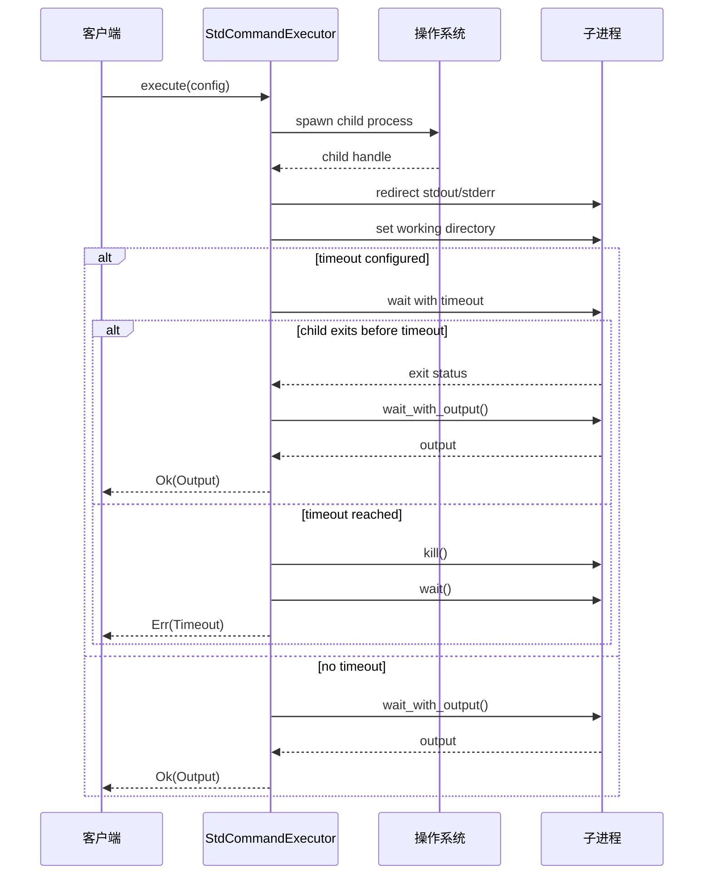
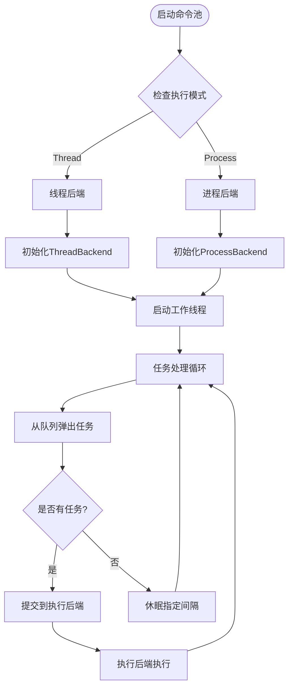
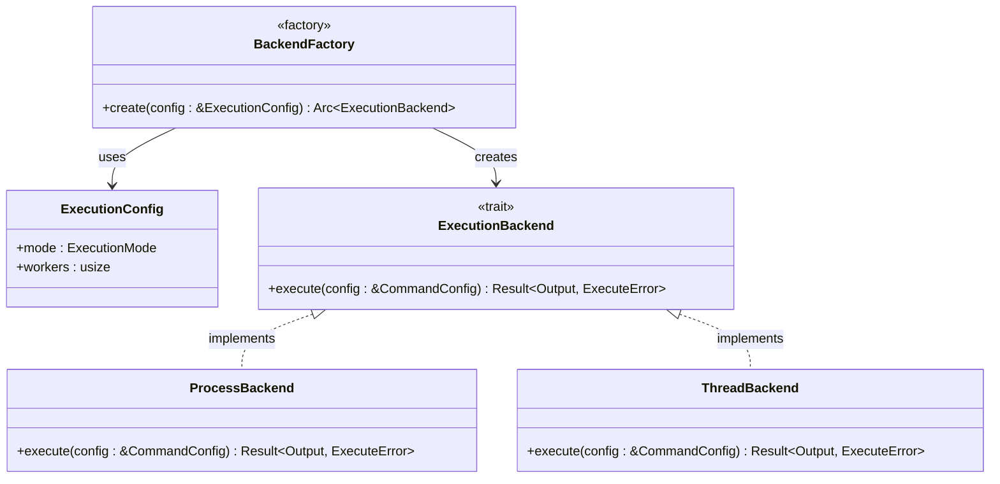
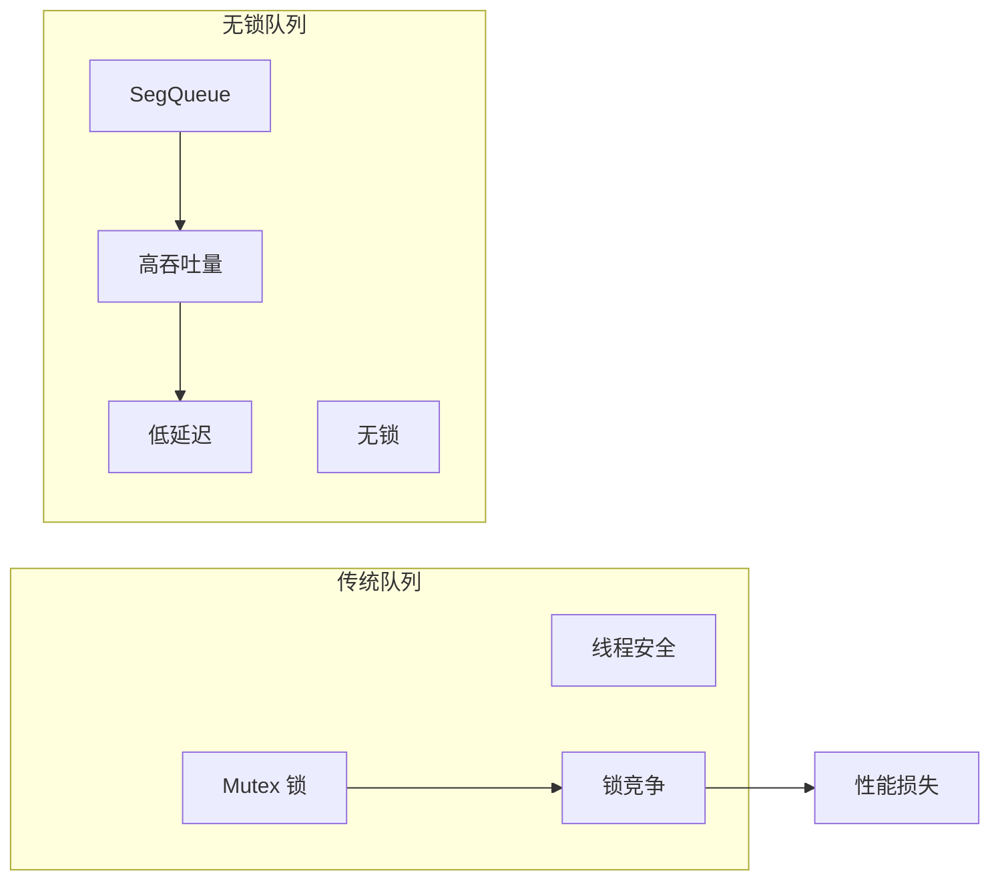
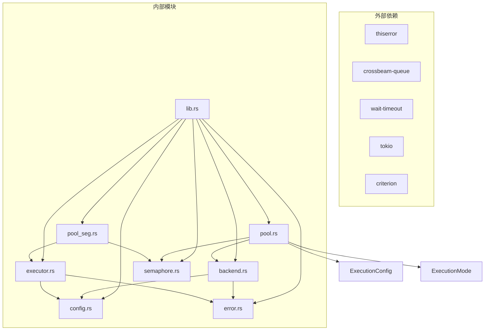

# 执行器系统

<cite>
**本文档引用的文件**
- [src/lib.rs](file://src/lib.rs)
- [src/backend.rs](file://src/backend.rs)
- [src/executor.rs](file://src/executor.rs)
- [src/pool.rs](file://src/pool.rs)
- [src/pool_seg.rs](file://src/pool_seg.rs)
- [src/config.rs](file://src/config.rs)
- [src/error.rs](file://src/error.rs)
- [src/semaphore.rs](file://src/semaphore.rs)
- [examples/tokio_integration.rs](file://examples/tokio_integration.rs)
- [tests/pool_tests.rs](file://tests/pool_tests.rs)
- [Cargo.toml](file://Cargo.toml)
</cite>

## 目录
1. [简介](#简介)
2. [项目结构](#项目结构)
3. [核心组件](#核心组件)
4. [架构概览](#架构概览)
5. [详细组件分析](#详细组件分析)
6. [依赖关系分析](#依赖关系分析)
7. [性能考虑](#性能考虑)
8. [故障排除指南](#故障排除指南)
9. [结论](#结论)
10. [附录](#附录)

## 简介

执行器系统是一个高性能的命令执行框架，提供了灵活的命令执行策略和多种运行时支持。该系统的核心设计目标是：

- **统一接口**：通过 `CommandExecutor` trait 提供一致的命令执行接口
- **多运行时支持**：支持标准库、Tokio、async-std 等不同异步运行时
- **灵活的执行后端**：支持多线程和多进程两种执行后端
- **高性能并发**：提供基于锁的队列和无锁队列两种实现
- **完善的错误处理**：统一的错误类型和超时机制

系统主要面向需要批量执行外部命令的应用场景，如构建系统、CI/CD 流水线、数据处理管道等。

## 项目结构

执行器系统采用模块化设计，主要包含以下核心模块：



**图表来源**
- [src/lib.rs](file://src/lib.rs#L1-L15)
- [src/backend.rs](file://src/backend.rs#L1-L108)
- [src/pool.rs](file://src/pool.rs#L1-L120)

**章节来源**
- [src/lib.rs](file://src/lib.rs#L1-L15)
- [Cargo.toml](file://Cargo.toml#L1-L13)

## 核心组件

### ExecutionBackend Trait 接口

`ExecutionBackend` 是新的执行后端抽象接口，定义了命令执行的标准规范：



**图表来源**
- [src/backend.rs](file://src/backend.rs#L8-L10)
- [src/backend.rs](file://src/backend.rs#L56-L75)
- [src/backend.rs](file://src/backend.rs#L77-L95)
- [src/backend.rs](file://src/backend.rs#L22-L48)

### 执行后端系统

系统支持两种执行后端，每种后端都有其特定的适用场景：



**图表来源**
- [src/backend.rs](file://src/backend.rs#L13-L20)
- [src/backend.rs](file://src/backend.rs#L56-L75)
- [src/backend.rs](file://src/backend.rs#L77-L95)

**章节来源**
- [src/backend.rs](file://src/backend.rs#L8-L108)
- [src/config.rs](file://src/config.rs#L19-L108)
- [src/error.rs](file://src/error.rs#L7-L17)

## 架构概览

执行器系统采用分层架构设计，从底层到上层依次为：



**图表来源**
- [src/pool.rs](file://src/pool.rs#L12-L17)
- [src/pool_seg.rs](file://src/pool_seg.rs#L1-L15)
- [src/backend.rs](file://src/backend.rs#L97-L107)
- [src/executor.rs](file://src/executor.rs#L9-L24)

## 详细组件分析

### 标准命令执行器

`StdCommandExecutor` 是默认的命令执行器实现，基于标准库的 `std::process::Command`：

#### 核心实现原理



**图表来源**
- [src/executor.rs](file://src/executor.rs#L30-L70)

#### 关键特性

1. **超时处理**：使用 `wait-timeout` crate 实现精确的超时控制
2. **资源清理**：超时后自动终止子进程并清理资源
3. **输出捕获**：同时捕获标准输出和标准错误
4. **工作目录支持**：支持自定义工作目录

**章节来源**
- [src/executor.rs](file://src/executor.rs#L18-L70)

### 命令池系统

命令池是系统的核心调度组件，负责任务的排队和执行：

#### 多后端模式实现



**图表来源**
- [src/pool.rs](file://src/pool.rs#L60-L89)
- [src/pool.rs](file://src/pool.rs#L91-L94)

#### 并发控制机制

系统提供了多种并发控制策略：

1. **固定工作线程数**：预分配固定数量的工作线程
2. **并发限制**：通过信号量限制同时执行的外部进程数量
3. **自动调节**：根据 CPU 核心数自动调整工作线程数

**章节来源**
- [src/pool.rs](file://src/pool.rs#L19-L113)
- [src/semaphore.rs](file://src/semaphore.rs#L16-L52)

### 执行后端工厂

`BackendFactory` 是执行后端的工厂类，负责根据配置创建相应的执行后端：

#### 工厂模式优势



**图表来源**
- [src/backend.rs](file://src/backend.rs#L97-L107)
- [src/backend.rs](file://src/backend.rs#L22-L48)

**章节来源**
- [src/backend.rs](file://src/backend.rs#L97-L108)

### 无锁命令池

`CommandPoolSeg` 提供了基于无锁队列的高性能实现：

#### 无锁队列优势



**图表来源**
- [src/pool_seg.rs](file://src/pool_seg.rs#L11-L15)

**章节来源**
- [src/pool_seg.rs](file://src/pool_seg.rs#L20-L150)

## 依赖关系分析

执行器系统的依赖关系体现了清晰的分层架构：



**图表来源**
- [Cargo.toml](file://Cargo.toml#L6-L12)
- [src/lib.rs](file://src/lib.rs#L1-L15)

**章节来源**
- [Cargo.toml](file://Cargo.toml#L6-L12)
- [src/lib.rs](file://src/lib.rs#L1-L15)

## 性能考虑

### 执行后端对比

| 特性 | 进程后端 | 线程后端 | 无锁队列 |
|------|----------|----------|----------|
| 内存共享 | ✗ | ✓ | ✓ |
| 进程隔离 | ✓ | ✗ | ✗ |
| 线程安全 | 自动隔离 | 需要同步 | 无锁 |
| 资源开销 | 高 | 低 | 最低 |
| 吞吐量 | 高 | 中等 | 最高 |
| 稳定性 | 最高 | 中等 | 高 |

### 性能优化建议

1. **选择合适的执行后端**：
   - CPU密集型任务：优先考虑线程后端
   - I/O密集型任务：优先考虑进程后端
   - 大量短任务：考虑无锁队列实现

2. **合理配置工作线程数**：
   ```rust
   // 基于CPU核心数自动调整
   let workers = std::thread::available_parallelism()
       .map(|n| n.get())
       .unwrap_or(4);
   ```

3. **并发限制策略**：
   - 使用信号量限制同时执行的外部进程数量
   - 防止系统资源耗尽
   - 平衡吞吐量和资源使用

4. **超时配置**：
   - 为长时间运行的命令设置合理的超时
   - 避免僵尸进程
   - 提供优雅的错误处理

**章节来源**
- [src/pool.rs](file://src/pool.rs#L60-L89)
- [src/pool_seg.rs](file://src/pool_seg.rs#L70-L91)
- [src/semaphore.rs](file://src/semaphore.rs#L16-L52)

## 故障排除指南

### 常见问题及解决方案

#### 1. 命令执行超时

**问题描述**：命令执行超过预期时间仍未完成

**解决方案**：
- 检查命令本身的执行时间
- 调整超时配置
- 使用并发限制避免资源争用

#### 2. 进程无法启动

**问题描述**：命令无法找到或权限不足

**解决方案**：
- 验证命令路径和可执行权限
- 检查工作目录配置
- 确认环境变量设置

#### 3. 内存泄漏

**问题描述**：长时间运行后内存使用持续增长

**解决方案**：
- 检查自定义执行器的资源管理
- 确保正确处理异步运行时
- 验证信号量的正确释放

#### 4. 线程死锁

**问题描述**：多线程模式下出现死锁

**解决方案**：
- 检查任务队列的锁竞争
- 避免在任务中进行阻塞操作
- 使用适当的超时机制

**章节来源**
- [src/error.rs](file://src/error.rs#L7-L17)
- [src/executor.rs](file://src/executor.rs#L30-L70)

### 调试技巧

1. **启用详细日志**：在开发环境中启用详细的执行日志
2. **监控资源使用**：定期检查CPU和内存使用情况
3. **测试边界条件**：测试极端情况下的系统行为
4. **性能基准测试**：使用基准测试工具评估性能

## 结论

执行器系统提供了一个灵活、高效且易于扩展的命令执行框架。其核心优势包括：

1. **统一抽象**：通过 `ExecutionBackend` trait 提供一致的接口
2. **多运行时支持**：轻松集成不同的异步运行时
3. **灵活的执行后端**：适应不同类型的执行需求
4. **高性能实现**：提供多种性能优化策略
5. **完善的错误处理**：统一的错误类型和超时机制

系统的设计充分考虑了实际应用场景的需求，既保证了易用性，又提供了足够的灵活性。通过自定义执行器接口，开发者可以根据具体需求实现特定的执行策略，如异步运行时集成、自定义超时处理、资源管理等。

## 附录

### 自定义执行器开发指南

#### 基本实现步骤

1. **实现 CommandExecutor trait**：
   ```rust
   struct MyExecutor;
   
   impl CommandExecutor for MyExecutor {
       fn execute(&self, config: &CommandConfig) -> Result<Output, ExecuteError> {
           // 实现自定义执行逻辑
       }
   }
   ```

2. **处理异步运行时**：
   - 在同步 trait 方法中创建运行时实例
   - 考虑使用线程本地存储避免重复创建
   - 正确处理超时和错误

3. **集成到命令池**：
   ```rust
   let pool = CommandPool::new();
   let executor = Arc::new(MyExecutor);
   pool.start_executor_with_executor(Duration::from_millis(100), executor);
   ```

#### 最佳实践

1. **资源管理**：确保正确清理临时资源和连接
2. **错误处理**：提供详细的错误信息和恢复策略
3. **性能优化**：避免不必要的阻塞和资源竞争
4. **测试覆盖**：编写全面的单元测试和集成测试

**章节来源**
- [examples/tokio_integration.rs](file://examples/tokio_integration.rs#L10-L40)