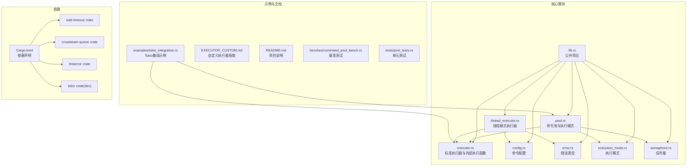
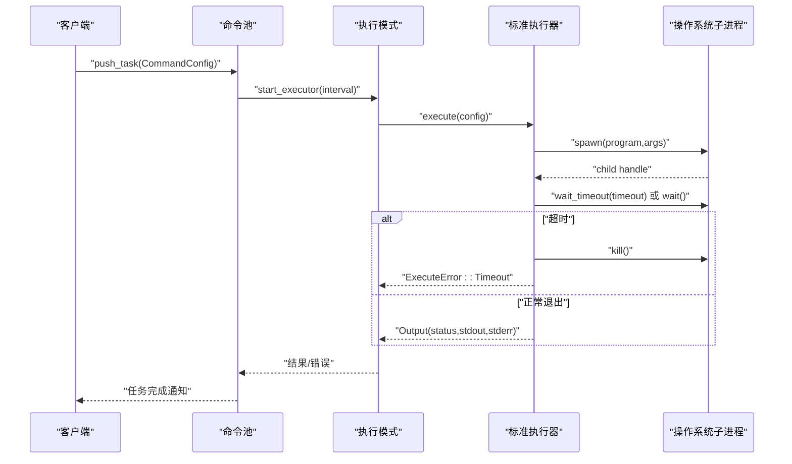
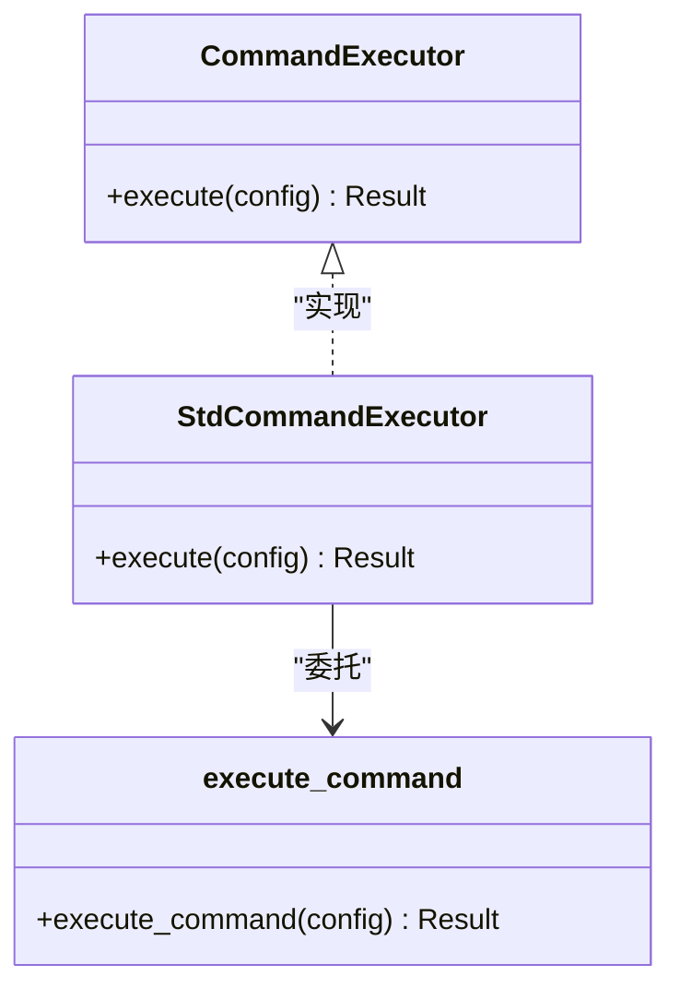
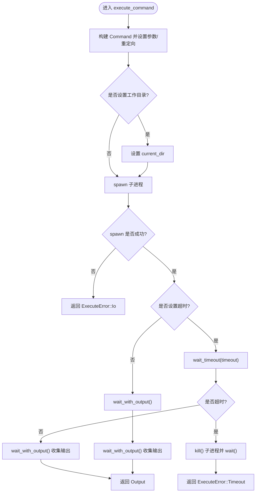
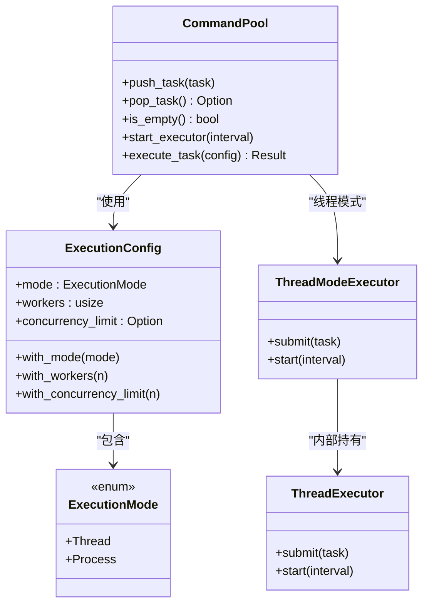
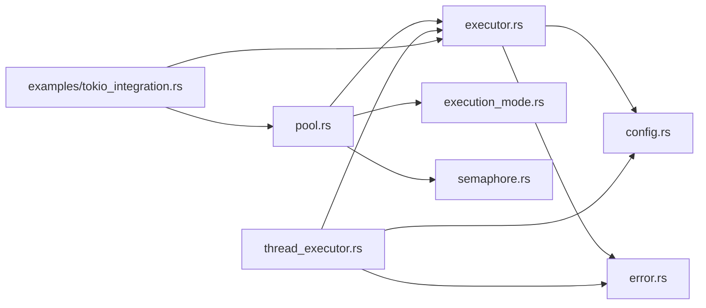

# 标准执行器实现

<cite>
**本文引用的文件**
- [src/lib.rs](file://src/lib.rs)
- [src/executor.rs](file://src/executor.rs)
- [src/config.rs](file://src/config.rs)
- [src/error.rs](file://src/error.rs)
- [src/pool.rs](file://src/pool.rs)
- [src/thread_executor.rs](file://src/thread_executor.rs)
- [src/execution_mode.rs](file://src/execution_mode.rs)
- [src/semaphore.rs](file://src/semaphore.rs)
- [Cargo.toml](file://Cargo.toml)
- [README.md](file://README.md)
- [examples/tokio_integration.rs](file://examples/tokio_integration.rs)
- [EXECUTOR_CUSTOM.md](file://EXECUTOR_CUSTOM.md)
- [tests/pool_tests.rs](file://tests/pool_tests.rs)
- [benches/command_pool_bench.rs](file://benches/command_pool_bench.rs)
</cite>

## 目录
1. [简介](#简介)
2. [项目结构](#项目结构)
3. [核心组件](#核心组件)
4. [架构总览](#架构总览)
5. [详细组件分析](#详细组件分析)
6. [依赖关系分析](#依赖关系分析)
7. [性能考量](#性能考量)
8. [故障排查指南](#故障排查指南)
9. [结论](#结论)
10. [附录](#附录)

## 简介
本文件围绕标准执行器 StdCommandExecutor 的实现进行系统化说明，重点解释其基于 std::process::Command 的工作机制，深入剖析内部函数 execute_command 的实现细节（子进程启动、输出重定向、工作目录设置、超时处理与进程清理），并结合 wait-timeout crate 的使用，总结性能优化与资源管理的最佳实践。文末提供使用示例与常见问题解决方案，帮助读者在不同场景下正确、高效地使用命令执行能力。

## 项目结构
该项目采用模块化组织，核心模块如下：
- 执行器接口与标准实现：executor.rs
- 命令配置：config.rs
- 错误类型：error.rs
- 命令池与执行模式：pool.rs、execution_mode.rs
- 线程模式执行器：thread_executor.rs
- 并发控制信号量：semaphore.rs
- 公共导出入口：lib.rs
- 示例与自定义执行器指南：examples/tokio_integration.rs、EXECUTOR_CUSTOM.md
- 测试与基准：tests/pool_tests.rs、benches/command_pool_bench.rs
- 依赖声明：Cargo.toml
- 顶层说明：README.md

图表来源
- [src/lib.rs](file://src/lib.rs#L1-L17)
- [src/executor.rs](file://src/executor.rs#L1-L100)
- [src/config.rs](file://src/config.rs#L1-L109)
- [src/error.rs](file://src/error.rs#L1-L18)
- [src/pool.rs](file://src/pool.rs#L1-L296)
- [src/thread_executor.rs](file://src/thread_executor.rs#L1-L148)
- [src/execution_mode.rs](file://src/execution_mode.rs#L1-L70)
- [src/semaphore.rs](file://src/semaphore.rs#L1-L53)
- [Cargo.toml](file://Cargo.toml#L1-L13)
- [examples/tokio_integration.rs](file://examples/tokio_integration.rs#L1-L62)
- [EXECUTOR_CUSTOM.md](file://EXECUTOR_CUSTOM.md#L1-L228)

章节来源
- [src/lib.rs](file://src/lib.rs#L1-L17)
- [Cargo.toml](file://Cargo.toml#L1-L13)
- [README.md](file://README.md#L1-L60)

## 核心组件
- 标准执行器 StdCommandExecutor：基于 std::process::Command 的同步执行器，实现 CommandExecutor trait。
- 内部执行函数 execute_command：负责启动子进程、重定向输出、设置工作目录、处理超时与清理。
- 命令配置 CommandConfig：封装程序名、参数、工作目录、超时等执行参数。
- 错误类型 ExecuteError：统一表示 IO 错误、超时错误、子进程错误等。
- 命令池 CommandPool：支持多线程与多进程两种执行模式，配合并发限制与线程模式执行器。
- 执行模式 ExecutionMode/ExecutionConfig：控制执行模式、工作线程/进程数、并发限制。
- 线程模式执行器 ThreadModeExecutor：将命令任务包装为线程任务，在线程池中执行。
- 信号量 Semaphore：轻量级并发控制，限制同时执行的外部子进程数量。

章节来源
- [src/executor.rs](file://src/executor.rs#L1-L100)
- [src/config.rs](file://src/config.rs#L1-L109)
- [src/error.rs](file://src/error.rs#L1-L18)
- [src/pool.rs](file://src/pool.rs#L1-L296)
- [src/execution_mode.rs](file://src/execution_mode.rs#L1-L70)
- [src/thread_executor.rs](file://src/thread_executor.rs#L1-L148)
- [src/semaphore.rs](file://src/semaphore.rs#L1-L53)

## 架构总览
标准执行器位于“命令池”与“操作系统子进程”之间，作为同步执行器实现，提供稳定的命令执行能力。命令池根据执行模式选择线程模式或进程模式，线程模式下通过线程池调度任务，进程模式下直接在工作线程中调用 execute_command。

图表来源
- [src/pool.rs](file://src/pool.rs#L134-L143)
- [src/pool.rs](file://src/pool.rs#L222-L227)
- [src/executor.rs](file://src/executor.rs#L20-L70)

## 详细组件分析

### 标准执行器 StdCommandExecutor
- 角色定位：实现 CommandExecutor trait，提供基于 std::process::Command 的同步执行能力。
- 关键行为：
  - 将配置转换为 std::process::Command，设置参数与输出重定向。
  - 根据配置决定是否设置工作目录。
  - 使用 wait-timeout crate 在同一线程中等待子进程，避免额外等待线程。
  - 超时后尝试杀死子进程并返回超时错误。

图表来源
- [src/executor.rs](file://src/executor.rs#L9-L24)
- [src/executor.rs](file://src/executor.rs#L20-L70)

章节来源
- [src/executor.rs](file://src/executor.rs#L1-L100)

### 内部执行函数 execute_command
- 子进程启动与输出重定向
  - 使用 Command::new 与 args 设置命令与参数。
  - stdout/stderr 设置为管道，以便捕获输出。
  - 若配置了工作目录，则设置 current_dir。
- 超时处理与进程清理
  - 若配置了超时：使用 wait-timeout 在当前线程等待。
    - 子进程在超时前退出：收集输出并返回。
    - 超时未退出：尝试 kill 子进程并 wait，随后返回超时错误。
  - 若未配置超时：直接 wait_with_output 收集输出。
- 错误处理
  - spawn 失败或 wait-timeout 失败映射为 ExecuteError::Io。
  - 超时错误映射为 ExecuteError::Timeout。

图表来源
- [src/executor.rs](file://src/executor.rs#L30-L70)

章节来源
- [src/executor.rs](file://src/executor.rs#L26-L70)

### 命令配置 CommandConfig
- 字段与方法
  - program：可执行程序名或路径。
  - args：参数列表。
  - working_dir：可选工作目录。
  - timeout：可选超时时间。
  - with_working_dir/with_timeout：链式设置方法。
  - program/args/working_dir/timeout：读取方法。
- 设计要点
  - 默认超时通常设置为较短时间，避免长时间阻塞。
  - 通过链式 API 提升可读性与易用性。

章节来源
- [src/config.rs](file://src/config.rs#L1-L109)

### 错误类型 ExecuteError
- 变体
  - Io(std::io::Error)：IO 相关错误。
  - Timeout(Duration)：超时错误。
  - Child(String)：子进程状态异常。
- 用途
  - 统一错误表达，便于上层处理与日志记录。

章节来源
- [src/error.rs](file://src/error.rs#L1-L18)

### 命令池 CommandPool 与执行模式
- 执行模式
  - Process：多进程模式，每个命令在独立子进程中执行。
  - Thread：线程模式，任务在共享进程内的线程池中执行。
- 并发控制
  - 支持固定工作线程数与可选并发限制。
  - 并发限制通过信号量实现，避免系统资源耗尽。
- 线程模式执行器
  - 将 CommandConfig 包装为线程任务，通过线程池调度执行。
  - 线程模式下仍使用子进程执行外部命令，但任务调度在用户态线程中进行。

图表来源
- [src/execution_mode.rs](file://src/execution_mode.rs#L1-L70)
- [src/pool.rs](file://src/pool.rs#L1-L296)
- [src/thread_executor.rs](file://src/thread_executor.rs#L1-L148)

章节来源
- [src/execution_mode.rs](file://src/execution_mode.rs#L1-L70)
- [src/pool.rs](file://src/pool.rs#L1-L296)
- [src/thread_executor.rs](file://src/thread_executor.rs#L1-L148)

### 信号量 Semaphore
- 功能
  - 基于 Mutex 与 Condvar 实现，提供轻量级并发控制。
  - acquire_guard 提供 RAII 语义，在作用域结束时自动释放许可证。
- 应用
  - 在进程模式下限制同时执行的外部子进程数量，防止资源耗尽。

章节来源
- [src/semaphore.rs](file://src/semaphore.rs#L1-L53)

### 自定义执行器与 Tokio 集成
- 自定义执行器
  - 实现 CommandExecutor trait，即可注入到命令池。
  - 可在同步 trait 中使用 block_on 或在专用线程中运行异步运行时。
- Tokio 集成示例
  - 在异步环境中使用 tokio::process::Command。
  - 结合 tokio::time::timeout 实现超时控制。
  - 通过 CommandPool.start_executor_with_executor_and_limit 控制并发。

章节来源
- [examples/tokio_integration.rs](file://examples/tokio_integration.rs#L1-L62)
- [EXECUTOR_CUSTOM.md](file://EXECUTOR_CUSTOM.md#L1-L228)

## 依赖关系分析
- 外部依赖
  - wait-timeout：提供 wait_timeout 能力，避免额外等待线程。
  - crossbeam-queue：无锁队列变体（在其他模块中使用）。
  - thiserror：错误派生宏，简化错误类型定义。
  - tokio（开发依赖）：用于异步集成示例与基准测试。
- 内部模块耦合
  - executor 与 config、error 紧密协作，形成最小可执行单元。
  - pool 依赖 executor、execution_mode、semaphore，承担调度与并发控制。
  - thread_executor 依赖 executor，实现线程模式下的任务执行。

图表来源
- [src/executor.rs](file://src/executor.rs#L1-L100)
- [src/config.rs](file://src/config.rs#L1-L109)
- [src/error.rs](file://src/error.rs#L1-L18)
- [src/pool.rs](file://src/pool.rs#L1-L296)
- [src/execution_mode.rs](file://src/execution_mode.rs#L1-L70)
- [src/semaphore.rs](file://src/semaphore.rs#L1-L53)
- [src/thread_executor.rs](file://src/thread_executor.rs#L1-L148)
- [examples/tokio_integration.rs](file://examples/tokio_integration.rs#L1-L62)

章节来源
- [Cargo.toml](file://Cargo.toml#L6-L12)

## 性能考量
- wait-timeout 的使用
  - 在同一线程中等待子进程，避免为每个任务生成额外等待线程，降低系统开销。
- 并发限制
  - 使用信号量限制同时执行的外部子进程数量，防止资源耗尽与上下文切换开销过大。
- 线程模式 vs 进程模式
  - 线程模式共享内存，适合计算密集型任务；进程模式隔离性强，适合 I/O 密集型任务。
- 工作线程数
  - 根据 CPU 核心数与任务类型调整工作线程数，I/O 密集型可适当增加。
- 输出捕获
  - stdout/stderr 管道捕获会带来额外的缓冲与拷贝成本，建议仅在必要时启用。
- 超时策略
  - 合理设置超时时间，避免过长阻塞；超时后及时 kill 子进程并清理。

章节来源
- [src/executor.rs](file://src/executor.rs#L28-L30)
- [src/pool.rs](file://src/pool.rs#L189-L210)
- [src/semaphore.rs](file://src/semaphore.rs#L1-L53)

## 故障排查指南
- 常见错误类型
  - ExecuteError::Io：通常由 spawn 或 wait-timeout 失败导致，检查权限、路径与环境。
  - ExecuteError::Timeout：超时触发，确认命令执行时间与超时设置是否合理。
  - ExecuteError::Child：子进程状态异常，检查命令返回码与日志。
- 超时处理问题
  - 若 wait-timeout 返回 None，执行 kill 并 wait，确保子进程被清理。
  - 检查工作目录设置是否正确，避免相对路径导致的执行失败。
- 并发限制问题
  - 当并发过高时，信号量可能导致阻塞，适当增大并发限制或减少工作线程数。
- 线程模式问题
  - 线程模式下任务仍通过子进程执行外部命令，注意子进程数量与系统资源上限。

章节来源
- [src/error.rs](file://src/error.rs#L1-L18)
- [src/executor.rs](file://src/executor.rs#L42-L70)
- [src/pool.rs](file://src/pool.rs#L189-L210)

## 结论
标准执行器 StdCommandExecutor 通过简洁而稳健的设计，提供了基于 std::process::Command 的同步命令执行能力。其内部函数 execute_command 在启动子进程、重定向输出、设置工作目录与超时处理方面实现了清晰的流程控制，并借助 wait-timeout crate 有效降低了系统开销。配合命令池的多线程/多进程模式与信号量并发控制，可在不同场景下实现高性能与高可靠性的命令执行。对于需要异步运行时的场景，可通过自定义执行器注入到命令池，实现灵活的运行时适配。

## 附录

### 使用示例
- 基础使用（标准库执行器）
  - 创建命令池，添加任务，启动执行器。
  - 参考路径：[README.md](file://README.md#L28-L37)
- Tokio 集成示例
  - 自定义执行器实现，结合 tokio::time::timeout。
  - 参考路径：[examples/tokio_integration.rs](file://examples/tokio_integration.rs#L1-L62)
- 自定义执行器完整示例
  - 通过 CommandPool.start_executor_with_executor_and_limit 控制并发。
  - 参考路径：[EXECUTOR_CUSTOM.md](file://EXECUTOR_CUSTOM.md#L181-L227)

章节来源
- [README.md](file://README.md#L28-L37)
- [examples/tokio_integration.rs](file://examples/tokio_integration.rs#L1-L62)
- [EXECUTOR_CUSTOM.md](file://EXECUTOR_CUSTOM.md#L181-L227)

### 测试与基准
- 单元测试
  - 验证命令池的推入、弹出、空状态与执行模式切换。
  - 参考路径：[tests/pool_tests.rs](file://tests/pool_tests.rs#L1-L90)
- 基准测试
  - 对 push/pop 与 execute_task 进行性能评估。
  - 参考路径：[benches/command_pool_bench.rs](file://benches/command_pool_bench.rs#L1-L93)

章节来源
- [tests/pool_tests.rs](file://tests/pool_tests.rs#L1-L90)
- [benches/command_pool_bench.rs](file://benches/command_pool_bench.rs#L1-L93)