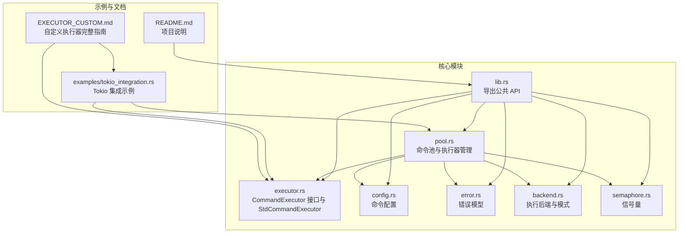
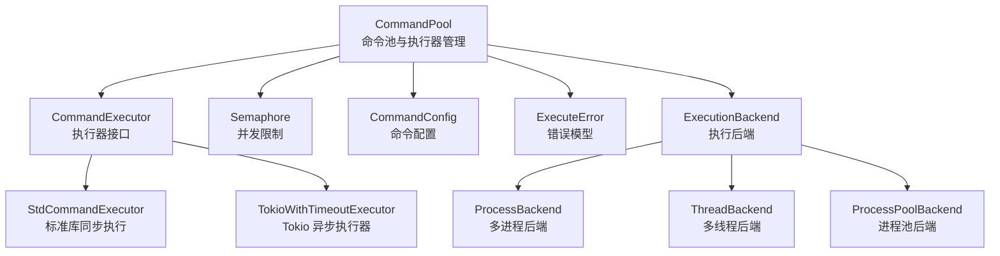
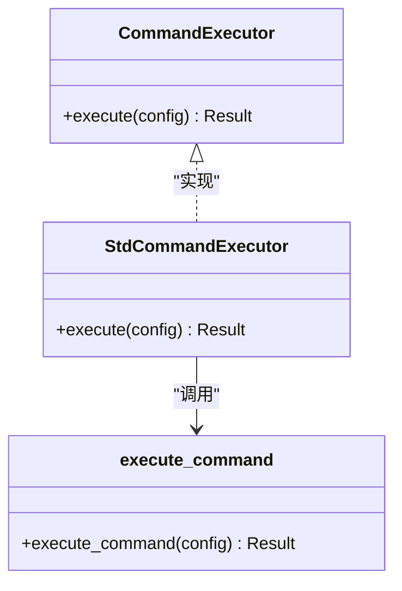
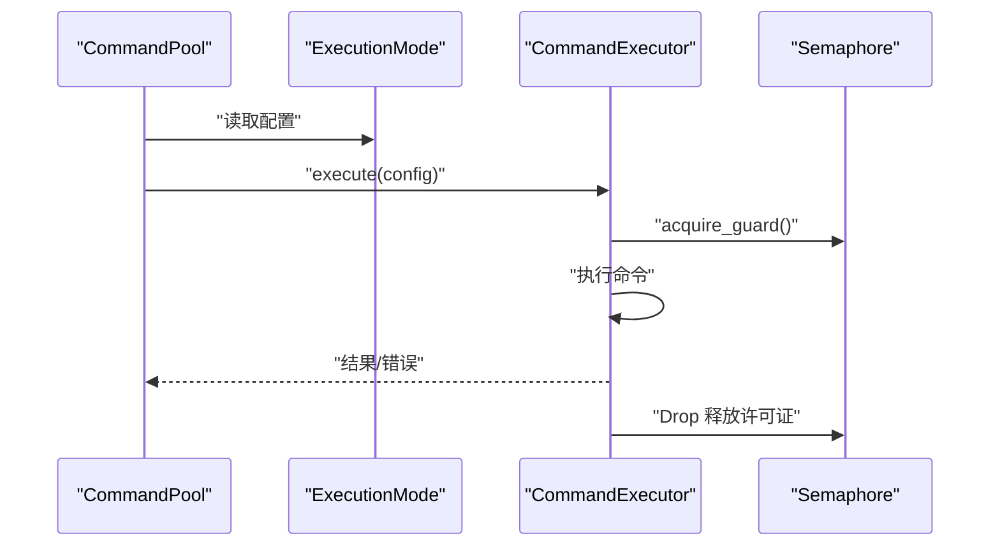
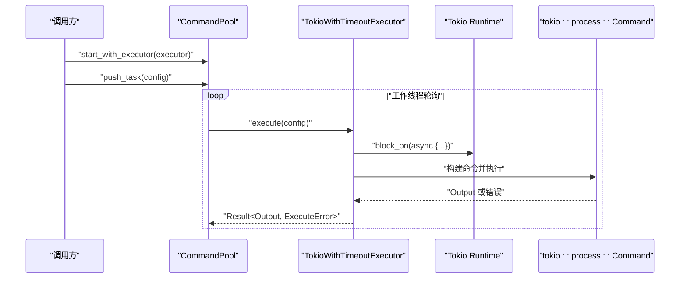
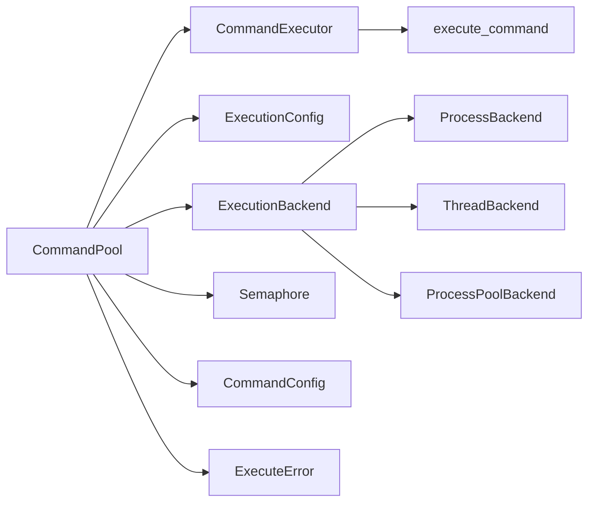

# 自定义执行器开发

<cite>
**本文档引用的文件**
- [src/lib.rs](file://src/lib.rs)
- [src/executor.rs](file://src/executor.rs)
- [src/pool.rs](file://src/pool.rs)
- [src/config.rs](file://src/config.rs)
- [src/error.rs](file://src/error.rs)
- [src/backend.rs](file://src/backend.rs)
- [src/semaphore.rs](file://src/semaphore.rs)
- [examples/tokio_integration.rs](file://examples/tokio_integration.rs)
- [EXECUTOR_CUSTOM.md](file://EXECUTOR_CUSTOM.md)
- [README.md](file://README.md)
- [Cargo.toml](file://Cargo.toml)
</cite>

## 更新摘要
**变更内容**
- 新增了完整的自定义执行器实现指南，包含 Tokio 异步执行器和带超时的异步执行器
- 更新了异步运行时集成章节，增加了性能优化建议
- 完善了执行器选择策略和错误处理最佳实践
- 增加了无锁队列变体的使用说明

## 目录
1. [简介](#简介)
2. [项目结构](#项目结构)
3. [核心组件](#核心组件)
4. [架构总览](#架构总览)
5. [详细组件分析](#详细组件分析)
6. [依赖关系分析](#依赖关系分析)
7. [性能考量](#性能考量)
8. [故障排除指南](#故障排除指南)
9. [结论](#结论)
10. [附录](#附录)

## 简介
本指南面向希望为命令池系统开发自定义执行器的开发者，重点围绕 CommandExecutor trait 的实现展开，涵盖同步与异步运行时（如 tokio）的集成策略、执行器选择与并发控制、错误处理与资源管理最佳实践，以及调试与故障排除技巧。随着 EXECUTOR_CUSTOM.md 的发布，现在提供了完整的自定义执行器实现指南，包括 Tokio 异步执行器、带超时的异步执行器和性能优化建议。

## 项目结构
该项目采用模块化组织，核心模块包括：
- 执行器接口与默认实现：executor.rs
- 命令池与并发控制：pool.rs
- 配置与错误模型：config.rs、error.rs
- 执行后端与模式：backend.rs
- 并发控制信号量：semaphore.rs
- 示例与完整指南：examples/tokio_integration.rs、EXECUTOR_CUSTOM.md、README.md
- 依赖声明：Cargo.toml

**图表来源**
- [src/lib.rs](file://src/lib.rs#L1-L24)
- [src/executor.rs](file://src/executor.rs#L1-L100)
- [src/pool.rs](file://src/pool.rs#L1-L324)
- [src/config.rs](file://src/config.rs#L1-L109)
- [src/error.rs](file://src/error.rs#L1-L18)
- [src/backend.rs](file://src/backend.rs#L1-L277)
- [src/semaphore.rs](file://src/semaphore.rs#L1-L53)
- [examples/tokio_integration.rs](file://examples/tokio_integration.rs#L1-L62)
- [EXECUTOR_CUSTOM.md](file://EXECUTOR_CUSTOM.md#L1-L228)
- [README.md](file://README.md#L1-L166)

**章节来源**
- [src/lib.rs](file://src/lib.rs#L1-L24)
- [README.md](file://README.md#L1-L166)

## 核心组件
- CommandExecutor trait：定义统一的命令执行接口，支持不同运行时实现（std::process、tokio、async-std 等）。默认实现 StdCommandExecutor 基于标准库同步执行。
- CommandPool：命令队列与执行器管理器，支持多线程与多进程两种模式，可注入自定义执行器并配合信号量进行并发限制。
- CommandConfig：封装命令程序名、参数、工作目录与超时配置。
- ExecuteError：统一的错误模型，覆盖 IO 错误、超时与子进程异常。
- ExecutionMode/ExecutionConfig：执行模式（线程/进程/进程池）与工作线程/进程数、并发限制等配置。
- Semaphore：基于 Mutex+Condvar 的简单计数信号量，用于限制同时执行的外部进程数量。
- ExecutionBackend：执行后端抽象，支持多进程、多线程和进程池三种执行模式。

**章节来源**
- [src/executor.rs](file://src/executor.rs#L1-L100)
- [src/pool.rs](file://src/pool.rs#L1-L324)
- [src/config.rs](file://src/config.rs#L1-L109)
- [src/error.rs](file://src/error.rs#L1-L18)
- [src/backend.rs](file://src/backend.rs#L1-L277)
- [src/semaphore.rs](file://src/semaphore.rs#L1-L53)

## 架构总览
下图展示了命令池如何通过 CommandExecutor 接口与不同运行时集成，以及线程模式与进程模式的差异。

**图表来源**
- [src/pool.rs](file://src/pool.rs#L1-L324)
- [src/executor.rs](file://src/executor.rs#L1-L100)
- [examples/tokio_integration.rs](file://examples/tokio_integration.rs#L1-L62)
- [src/semaphore.rs](file://src/semaphore.rs#L1-L53)
- [src/config.rs](file://src/config.rs#L1-L109)
- [src/error.rs](file://src/error.rs#L1-L18)
- [src/backend.rs](file://src/backend.rs#L1-L277)

## 详细组件分析

### CommandExecutor 接口与默认实现
- 接口职责：抽象命令执行，要求实现者提供同步 execute 方法，返回标准库 Output 或统一 ExecuteError。
- 默认实现 StdCommandExecutor：直接委托内部 execute_command 函数，使用 wait-timeout 在当前线程等待并处理超时，避免额外等待线程，提升性能。
- 内部 execute_command：启动子进程，重定向 stdout/stderr，按配置处理超时与子进程终止，返回标准输出与状态码。

**图表来源**
- [src/executor.rs](file://src/executor.rs#L1-L100)

**章节来源**
- [src/executor.rs](file://src/executor.rs#L1-L100)

### 命令池与并发控制
- CommandPool：基于 Mutex<VecDeque> 的线程安全队列，支持多线程与多进程两种模式；可注入自定义执行器并配合信号量限制并发。
- 启动流程：根据 ExecutionConfig 决定模式；线程模式下启动线程执行器并将队列任务转发给线程执行器；进程模式下启动工作线程并调用 execute_task；支持固定工作线程数与并发限制两种启动方式。
- 并发限制：通过 Semaphore.acquire_guard 在执行前获取许可证，执行完成后自动释放，避免过多外部进程同时运行。

**图表来源**
- [src/pool.rs](file://src/pool.rs#L267-L303)
- [src/semaphore.rs](file://src/semaphore.rs#L1-L53)
- [src/backend.rs](file://src/backend.rs#L156-L161)

**章节来源**
- [src/pool.rs](file://src/pool.rs#L1-L324)
- [src/semaphore.rs](file://src/semaphore.rs#L1-L53)
- [src/backend.rs](file://src/backend.rs#L1-L277)

### 异步运行时集成（Tokio）
- 示例实现 TokioWithTimeoutExecutor：在同步 trait execute 中创建 tokio Runtime 并使用 block_on 运行异步命令执行；支持超时控制与错误映射。
- 与命令池集成：通过 CommandPool 的 start_with_executor 系列方法注入自定义执行器，实现异步运行时下的同步接口适配。
- 性能优化：EXECUTOR_CUSTOM.md 提供了使用全局运行时而非每次创建新运行时的建议，以减少运行时创建成本。

**图表来源**
- [examples/tokio_integration.rs](file://examples/tokio_integration.rs#L1-L62)
- [src/pool.rs](file://src/pool.rs#L275-L303)

**章节来源**
- [examples/tokio_integration.rs](file://examples/tokio_integration.rs#L1-L62)
- [src/pool.rs](file://src/pool.rs#L275-L303)
- [EXECUTOR_CUSTOM.md](file://EXECUTOR_CUSTOM.md#L33-L107)

### 自定义执行器实现指南
- 基础实现：实现 CommandExecutor trait，提供 execute 方法处理命令执行。
- Tokio 异步执行器：在同步 trait 中使用 block_on 运行异步命令，支持工作目录和参数配置。
- 带超时的异步执行器：集成 tokio::time::timeout 实现超时控制，提供更好的资源管理。
- 完整示例：包含自定义执行器的完整实现，展示如何处理命令参数、工作目录和错误映射。

**章节来源**
- [EXECUTOR_CUSTOM.md](file://EXECUTOR_CUSTOM.md#L31-L107)
- [EXECUTOR_CUSTOM.md](file://EXECUTOR_CUSTOM.md#L181-L227)

### 执行器选择策略与性能考虑
- 同步 vs 异步：若使用异步运行时（如 tokio），需在同步 trait 中进行运行时适配（如 block_on）。建议复用全局运行时以减少创建成本。
- 并发限制：通过 Semaphore 控制同时执行的外部进程数量，避免系统资源耗尽；在 I/O 密集型任务中适当提高并发。
- 工作线程数：根据 CPU 核心数与任务类型调整；I/O 密集型可使用更多线程；CPU 密集型线程数接近核心数更合适。
- 超时与资源回收：使用 wait-timeout 在同一线程等待并处理超时，避免额外等待线程；超时后主动终止子进程并清理。

**章节来源**
- [src/executor.rs](file://src/executor.rs#L26-L70)
- [src/semaphore.rs](file://src/semaphore.rs#L1-L53)
- [EXECUTOR_CUSTOM.md](file://EXECUTOR_CUSTOM.md#L173-L180)

### 错误处理与资源管理最佳实践
- 错误模型：ExecuteError 统一处理 IO 错误、超时与子进程异常，便于上层统一处理。
- 资源管理：在超时场景主动终止子进程并等待其退出；使用信号量保证许可证正确释放；线程模式下通过 RAII 守卫自动释放。
- 配置健壮性：CommandConfig 支持工作目录与超时配置，建议为长时间运行命令设置合理超时。

**章节来源**
- [src/error.rs](file://src/error.rs#L1-L18)
- [src/executor.rs](file://src/executor.rs#L42-L70)
- [src/semaphore.rs](file://src/semaphore.rs#L45-L52)
- [src/config.rs](file://src/config.rs#L68-L87)

### 调试技巧与故障排除
- 日志与最小化复现：在自定义执行器中打印命令与参数，定位问题；使用短超时与简单命令快速验证集成。
- 并发问题排查：检查并发限制是否过低导致饥饿；确认信号量在异常路径也能释放。
- 超时与终止：确认超时后子进程被正确终止；避免僵尸进程占用资源。
- 运行时适配：在同步 trait 中正确使用 block_on；检查 tokio 特性是否启用。

**章节来源**
- [examples/tokio_integration.rs](file://examples/tokio_integration.rs#L21-L40)
- [EXECUTOR_CUSTOM.md](file://EXECUTOR_CUSTOM.md#L173-L180)

## 依赖关系分析
- 外部依赖：thiserror 用于错误派生；crossbeam-queue 用于无锁队列变体；wait-timeout 用于子进程超时等待；tokio 作为可选异步运行时。
- 内部模块耦合：CommandPool 依赖 CommandExecutor、ExecutionConfig、ExecutionBackend、Semaphore、CommandConfig、ExecuteError。

**图表来源**
- [src/pool.rs](file://src/pool.rs#L1-L324)
- [src/executor.rs](file://src/executor.rs#L1-L100)
- [src/backend.rs](file://src/backend.rs#L1-L277)
- [src/semaphore.rs](file://src/semaphore.rs#L1-L53)
- [src/config.rs](file://src/config.rs#L1-L109)
- [src/error.rs](file://src/error.rs#L1-L18)

**章节来源**
- [Cargo.toml](file://Cargo.toml#L1-L13)
- [src/pool.rs](file://src/pool.rs#L1-L324)

## 性能考量
- 避免额外等待线程：使用 wait-timeout 在当前线程等待子进程，减少线程开销。
- 并发限制：通过信号量限制外部进程数量，平衡吞吐与资源占用。
- 工作线程数：根据任务类型与硬件条件调整；I/O 密集型可适度增加线程数。
- 运行时适配：在同步 trait 中进行运行时适配时，尽量复用运行时实例，避免频繁创建销毁。
- 异步运行时优化：EXECUTOR_CUSTOM.md 建议使用全局运行时而非每次创建新运行时，以减少运行时创建成本。

**章节来源**
- [src/executor.rs](file://src/executor.rs#L26-L70)
- [src/semaphore.rs](file://src/semaphore.rs#L1-L53)
- [EXECUTOR_CUSTOM.md](file://EXECUTOR_CUSTOM.md#L173-L180)

## 故障排除指南
- 命令未执行或卡死：检查超时配置与线程/进程模式；确认工作线程是否在轮询队列。
- 超时未生效：确认超时逻辑是否正确触发并终止子进程；检查错误映射是否为 ExecuteError::Timeout。
- 并发过高导致系统资源耗尽：启用并发限制并通过信号量控制外部进程数量。
- 异步运行时集成失败：确认在同步 trait 中正确使用 block_on；检查 tokio 特性是否启用。
- 自定义执行器性能问题：检查运行时创建频率，考虑使用全局运行时实例。

**章节来源**
- [src/executor.rs](file://src/executor.rs#L42-L70)
- [src/pool.rs](file://src/pool.rs#L180-L210)
- [examples/tokio_integration.rs](file://examples/tokio_integration.rs#L21-L40)
- [EXECUTOR_CUSTOM.md](file://EXECUTOR_CUSTOM.md#L173-L180)

## 结论
通过 CommandExecutor 接口，项目提供了对多运行时的可插拔支持。默认的同步实现与执行后端满足大多数场景需求；对于异步运行时（如 tokio），可通过自定义执行器在同步接口中适配异步逻辑。EXECUTOR_CUSTOM.md 提供了完整的实现指南，包括 Tokio 异步执行器、带超时的异步执行器和性能优化建议。结合并发限制与合理的线程/进程配置，可在保证稳定性的同时获得良好性能。建议在实际项目中结合自身运行时与任务特征选择合适的执行器与模式，并通过测试与基准验证效果。

## 附录
- 快速开始：参考 README 中的示例，了解基本用法与依赖声明。
- 自定义执行器完整指南：参考 EXECUTOR_CUSTOM.md，包含 Tokio 异步执行器实现、带超时的异步执行器、性能优化建议等完整内容。
- 示例：Tokio 集成与超时控制，展示如何在命令池中使用自定义执行器。
- 无锁队列变体：CommandPoolSeg 提供相同的自定义执行器支持，但使用无锁队列实现。

**章节来源**
- [README.md](file://README.md#L123-L155)
- [EXECUTOR_CUSTOM.md](file://EXECUTOR_CUSTOM.md#L109-L172)
- [examples/tokio_integration.rs](file://examples/tokio_integration.rs#L42-L61)
- [src/pool.rs](file://src/pool.rs#L1-L324)