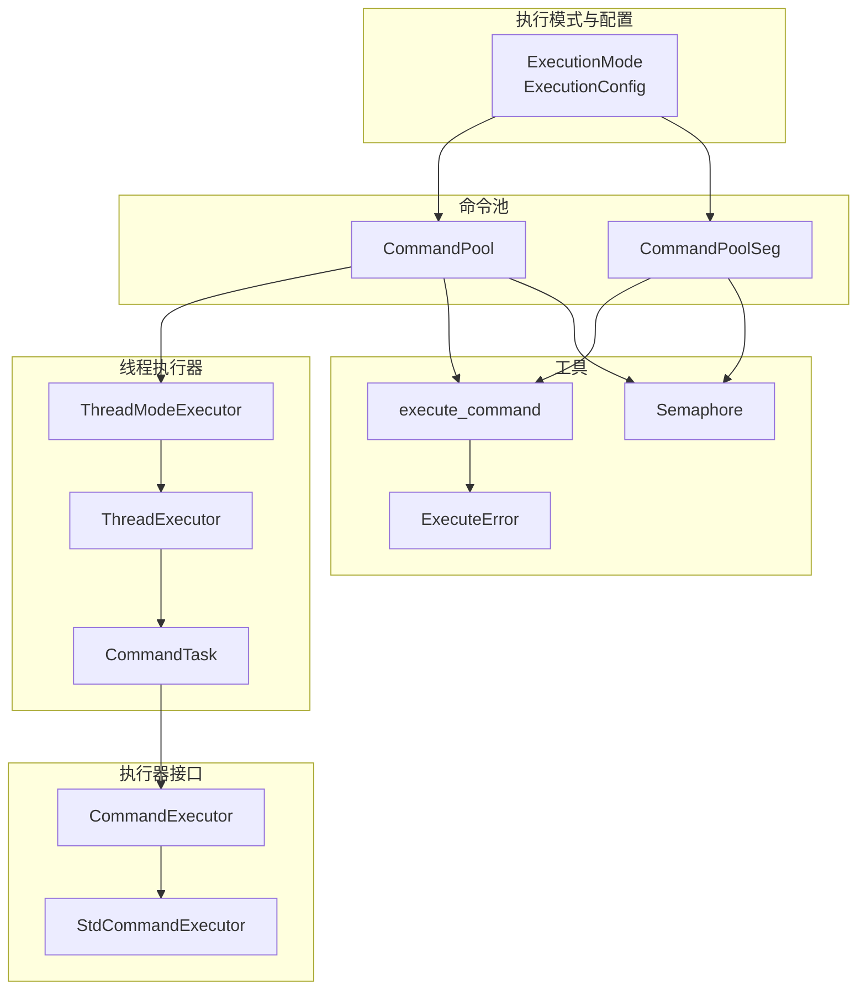
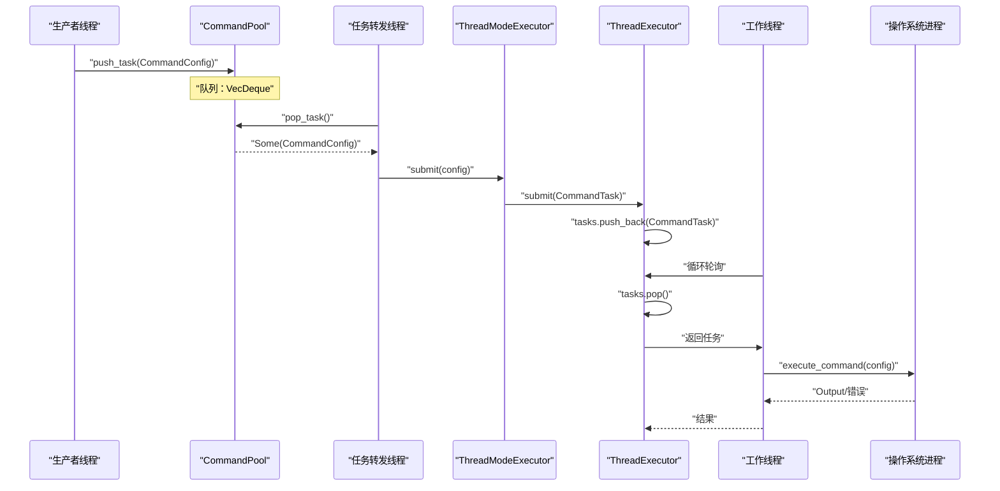
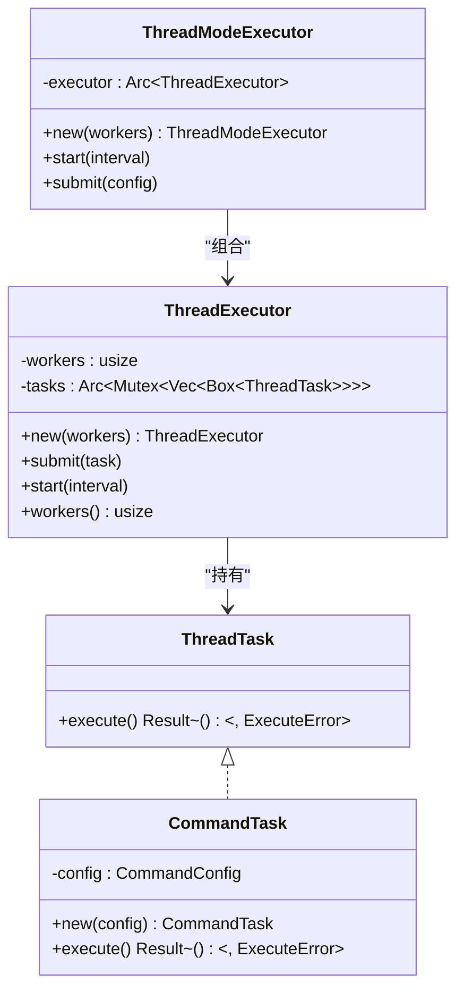
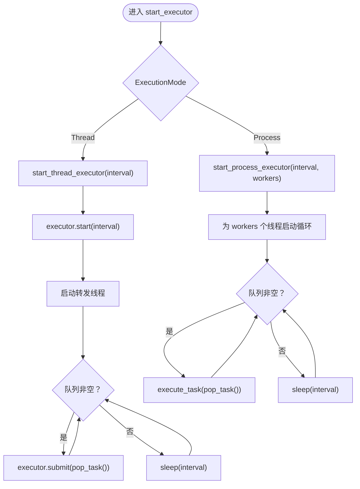
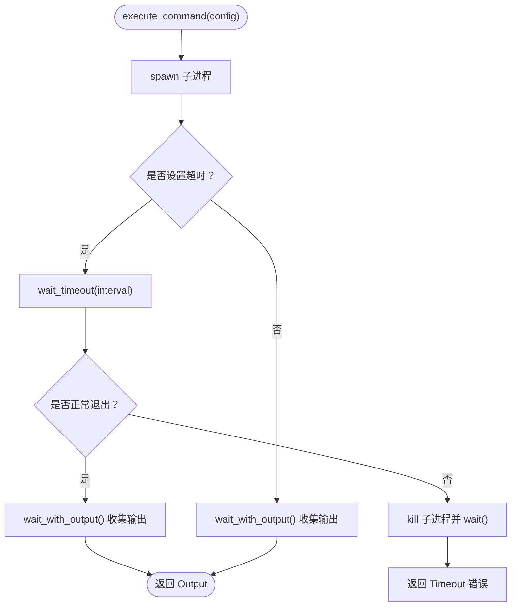
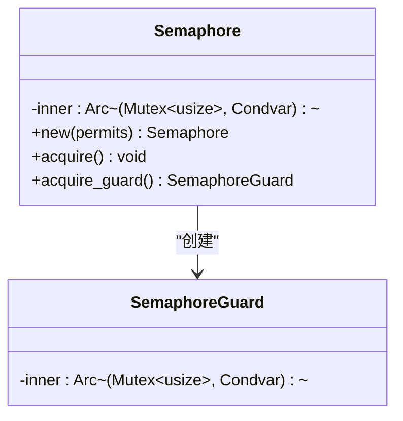
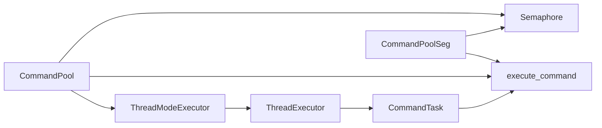

# 多线程模式

<cite>
**本文引用的文件**
- [src/lib.rs](file://src/lib.rs)
- [src/main.rs](file://src/main.rs)
- [src/thread_executor.rs](file://src/thread_executor.rs)
- [src/pool.rs](file://src/pool.rs)
- [src/executor.rs](file://src/executor.rs)
- [src/config.rs](file://src/config.rs)
- [src/execution_mode.rs](file://src/execution_mode.rs)
- [src/error.rs](file://src/error.rs)
- [src/pool_seg.rs](file://src/pool_seg.rs)
- [src/semaphore.rs](file://src/semaphore.rs)
- [examples/tokio_integration.rs](file://examples/tokio_integration.rs)
- [tests/pool_tests.rs](file://tests/pool_tests.rs)
- [benches/command_pool_bench.rs](file://benches/command_pool_bench.rs)
- [Cargo.toml](file://Cargo.toml)
- [README.md](file://README.md)
- [EXECUTOR_CUSTOM.md](file://EXECUTOR_CUSTOM.md)
</cite>

## 目录
1. [简介](#简介)
2. [项目结构](#项目结构)
3. [核心组件](#核心组件)
4. [架构总览](#架构总览)
5. [详细组件分析](#详细组件分析)
6. [依赖关系分析](#依赖关系分析)
7. [性能考量](#性能考量)
8. [故障排查指南](#故障排查指南)
9. [结论](#结论)
10. [附录](#附录)

## 简介
本文件聚焦“多线程模式”的技术文档，系统阐述线程池管理、任务调度机制与资源共享策略，详解 Thread 模式下的内存共享、线程同步与竞态条件处理，提供配置选项、性能特征与使用场景，并结合具体代码示例说明如何启用与配置多线程执行器。同时覆盖错误处理、异常传播与线程生命周期管理的最佳实践与性能优化建议。

## 项目结构
该项目围绕命令池与执行器抽象展开，提供多线程与多进程两种执行模式。核心模块包括：
- 执行模式与配置：定义 ExecutionMode 与 ExecutionConfig，支持线程/进程模式与工作线程/进程数、并发限制等参数。
- 命令池：CommandPool 支持多线程生产与后台执行器消费；CommandPoolSeg 提供无锁队列变体。
- 线程执行器：ThreadExecutor 与 ThreadModeExecutor 实现线程池与任务封装。
- 执行器接口：CommandExecutor 抽象统一不同运行时（标准库、Tokio 等）。
- 超时与错误：execute_command 统一处理子进程启动、等待与超时；ExecuteError 定义错误类型。
- 并发控制：Semaphore 提供基于 Mutex+Condvar 的简单计数信号量。

图表来源
- [src/execution_mode.rs](file://src/execution_mode.rs#L1-L70)
- [src/pool.rs](file://src/pool.rs#L1-L296)
- [src/pool_seg.rs](file://src/pool_seg.rs#L1-L157)
- [src/thread_executor.rs](file://src/thread_executor.rs#L1-L148)
- [src/executor.rs](file://src/executor.rs#L1-L100)
- [src/semaphore.rs](file://src/semaphore.rs#L1-L53)
- [src/error.rs](file://src/error.rs#L1-L18)

章节来源
- [src/lib.rs](file://src/lib.rs#L1-L17)
- [src/execution_mode.rs](file://src/execution_mode.rs#L1-L70)
- [src/pool.rs](file://src/pool.rs#L1-L296)
- [src/pool_seg.rs](file://src/pool_seg.rs#L1-L157)
- [src/thread_executor.rs](file://src/thread_executor.rs#L1-L148)
- [src/executor.rs](file://src/executor.rs#L1-L100)
- [src/semaphore.rs](file://src/semaphore.rs#L1-L53)
- [src/error.rs](file://src/error.rs#L1-L18)

## 核心组件
- 执行模式与配置
  - ExecutionMode：Thread（线程模式）、Process（进程模式）。
  - ExecutionConfig：包含 mode、workers、concurrency_limit，支持链式构建。
- 命令池
  - CommandPool：基于 Mutex<VecDeque> 的线程安全队列，支持多线程生产与后台执行器消费；支持线程/进程两种模式的执行器启动。
  - CommandPoolSeg：基于 crossbeam 的无锁队列 SegQueue，吞吐更高，尤其在多生产者场景。
- 线程执行器
  - ThreadExecutor：内部维护共享任务队列与工作线程数，提供 submit/start。
  - ThreadModeExecutor：对外暴露 submit/start，内部持有 Arc<ThreadExecutor>。
  - CommandTask：将 CommandConfig 包装为 ThreadTask，委托 StdCommandExecutor 执行。
- 执行器接口
  - CommandExecutor：统一命令执行接口，StdCommandExecutor 基于标准库子进程。
  - execute_command：统一处理 spawn、等待、超时与子进程输出收集。
- 并发控制
  - Semaphore：基于 Mutex+Condvar 的计数信号量，提供 acquire/acquire_guard，RAII 释放。
- 错误模型
  - ExecuteError：包含 IO 错误、超时、子进程异常等。

章节来源
- [src/execution_mode.rs](file://src/execution_mode.rs#L1-L70)
- [src/pool.rs](file://src/pool.rs#L1-L296)
- [src/pool_seg.rs](file://src/pool_seg.rs#L1-L157)
- [src/thread_executor.rs](file://src/thread_executor.rs#L1-L148)
- [src/executor.rs](file://src/executor.rs#L1-L100)
- [src/semaphore.rs](file://src/semaphore.rs#L1-L53)
- [src/error.rs](file://src/error.rs#L1-L18)

## 架构总览
多线程模式的核心在于：命令池作为任务源，后台线程负责轮询队列并将任务提交至线程执行器；线程执行器内部维护固定数量的工作线程，每个工作线程从共享队列中弹出任务并执行。线程模式下，命令通过子进程执行，但任务调度与线程池管理在用户线程中完成。

图表来源
- [src/pool.rs](file://src/pool.rs#L134-L163)
- [src/thread_executor.rs](file://src/thread_executor.rs#L42-L76)
- [src/executor.rs](file://src/executor.rs#L30-L70)

章节来源
- [src/pool.rs](file://src/pool.rs#L134-L163)
- [src/thread_executor.rs](file://src/thread_executor.rs#L42-L76)
- [src/executor.rs](file://src/executor.rs#L30-L70)

## 详细组件分析

### 线程执行器与任务封装
- ThreadTask：定义可执行任务接口，要求 Send + 'static。
- ThreadExecutor：
  - 维护共享任务队列（Arc<Mutex<Vec<Box<dyn ThreadTask>>>>）与工作线程数。
  - submit：将任务加入共享队列。
  - start：为每个工作线程克隆任务队列句柄，循环弹出任务执行；无任务时按间隔休眠。
  - workers：查询工作线程数。
  - Default：基于可用并行度自动设置工作线程数。
- CommandTask：将 CommandConfig 包装为 ThreadTask，执行时调用 execute_command。
- ThreadModeExecutor：
  - 持有 Arc<ThreadExecutor>，对外提供 submit/start。
  - Default：基于可用并行度自动设置工作线程数。

图表来源
- [src/thread_executor.rs](file://src/thread_executor.rs#L8-L148)
- [src/executor.rs](file://src/executor.rs#L30-L70)
- [src/config.rs](file://src/config.rs#L19-L109)

章节来源
- [src/thread_executor.rs](file://src/thread_executor.rs#L8-L148)
- [src/executor.rs](file://src/executor.rs#L30-L70)
- [src/config.rs](file://src/config.rs#L19-L109)

### 命令池与模式切换
- CommandPool：
  - with_config：根据 ExecutionConfig.mode 决定是否创建 ThreadModeExecutor。
  - start_executor：根据模式分派到 start_thread_executor 或 start_process_executor。
  - start_thread_executor：启动 ThreadModeExecutor，并启动一个转发线程将队列中的任务提交给线程执行器。
  - start_executor_with_workers/_and_limit：在进程模式下复用线程执行任务，支持并发限制。
  - execute_task：委托 execute_command 执行。
- CommandPoolSeg：无锁队列版本，提供相同 API，吞吐更高。

图表来源
- [src/pool.rs](file://src/pool.rs#L134-L210)

章节来源
- [src/pool.rs](file://src/pool.rs#L36-L210)
- [src/pool_seg.rs](file://src/pool_seg.rs#L20-L91)

### 执行器接口与超时处理
- CommandExecutor：统一 execute 接口，支持自定义实现（如 Tokio）。
- StdCommandExecutor：基于标准库子进程执行。
- execute_command：
  - 启动子进程并重定向 stdout/stderr。
  - 若配置了超时：使用 wait_timeout 在当前线程等待；超时则尝试 kill 并返回 Timeout 错误。
  - 若未配置超时：直接等待并收集输出。

图表来源
- [src/executor.rs](file://src/executor.rs#L30-L70)

章节来源
- [src/executor.rs](file://src/executor.rs#L1-L100)

### 并发限制与信号量
- Semaphore：
  - new：初始化许可证数。
  - acquire：阻塞等待直至有可用许可证。
  - acquire_guard：RAII 守护，Drop 时自动释放许可证并通知等待者。
- CommandPool/CommandPoolSeg 在进程模式与自定义执行器模式下均支持并发限制，通过在执行前获取许可证、执行后释放实现。

图表来源
- [src/semaphore.rs](file://src/semaphore.rs#L7-L53)

章节来源
- [src/semaphore.rs](file://src/semaphore.rs#L1-L53)
- [src/pool.rs](file://src/pool.rs#L190-L210)
- [src/pool_seg.rs](file://src/pool_seg.rs#L70-L91)

### 错误处理与异常传播
- ExecuteError：封装 IO 错误、超时、子进程异常。
- execute_command：捕获 spawn/等待过程中的 IO 错误，超时返回 Timeout。
- 线程模式下，任务执行错误通过 execute_command 返回，上层线程池不会因单个任务失败而崩溃，建议在业务侧记录与重试。

章节来源
- [src/error.rs](file://src/error.rs#L1-L18)
- [src/executor.rs](file://src/executor.rs#L30-L70)

### 线程生命周期管理
- 线程创建：start_thread_executor 与 start_executor_* 内部通过 thread::spawn 启动工作线程。
- 生命周期：工作线程持续循环，按 interval 休眠；线程不会主动退出，通常随进程退出而终止。
- 建议：在应用关闭时优雅停止（例如通过通道或标志位），当前实现未提供显式停止机制。

章节来源
- [src/thread_executor.rs](file://src/thread_executor.rs#L54-L76)
- [src/pool.rs](file://src/pool.rs#L174-L210)

## 依赖关系分析
- 模块耦合
  - CommandPool 与 ThreadModeExecutor：通过可选字段关联，仅在 Thread 模式启用。
  - ThreadModeExecutor 与 ThreadExecutor：组合关系，前者对外暴露 API。
  - ThreadExecutor 与 CommandTask：组合关系，后者封装 CommandConfig。
  - CommandPool/Seg 与 execute_command：通过 execute_task/execute_command 统一执行路径。
  - Semaphore：被 CommandPool/Seg 在并发限制场景使用。
- 外部依赖
  - crossbeam-queue：无锁队列。
  - wait-timeout：子进程超时等待。
  - thiserror：错误派生宏。

图表来源
- [src/pool.rs](file://src/pool.rs#L1-L296)
- [src/pool_seg.rs](file://src/pool_seg.rs#L1-L157)
- [src/thread_executor.rs](file://src/thread_executor.rs#L1-L148)
- [src/executor.rs](file://src/executor.rs#L1-L100)
- [src/semaphore.rs](file://src/semaphore.rs#L1-L53)

章节来源
- [Cargo.toml](file://Cargo.toml#L6-L12)
- [src/pool.rs](file://src/pool.rs#L1-L296)
- [src/pool_seg.rs](file://src/pool_seg.rs#L1-L157)
- [src/thread_executor.rs](file://src/thread_executor.rs#L1-L148)
- [src/executor.rs](file://src/executor.rs#L1-L100)
- [src/semaphore.rs](file://src/semaphore.rs#L1-L53)

## 性能考量
- 队列选择
  - CommandPool：基于 Mutex<VecDeque>，在高并发写入场景存在锁竞争。
  - CommandPoolSeg：基于 SegQueue，多生产者场景吞吐更高，减少锁竞争。
- 线程数
  - 默认基于可用并行度自动设置；I/O 密集型可适当增加线程数，CPU 密集型需谨慎。
- 轮询间隔
  - 合理设置 interval，过小导致忙等，过大影响响应性。
- 并发限制
  - 使用 Semaphore 控制同时执行的外部进程数量，避免系统资源耗尽。
- 超时与等待
  - execute_command 使用 wait_timeout，避免为每个任务额外创建等待线程，降低系统开销。

章节来源
- [src/pool_seg.rs](file://src/pool_seg.rs#L11-L15)
- [src/executor.rs](file://src/executor.rs#L28-L70)
- [benches/command_pool_bench.rs](file://benches/command_pool_bench.rs#L1-L93)

## 故障排查指南
- 常见问题
  - 任务不执行：检查是否调用 start_executor，确认 interval 是否过大；确认线程模式下已创建 ThreadModeExecutor。
  - 超时未生效：确认 CommandConfig 是否设置 timeout；检查 execute_command 的 wait_timeout 分支。
  - 资源耗尽：为进程模式或自定义执行器设置并发限制。
  - 线程泄漏：当前实现未提供显式停止机制，建议在应用层面优雅关闭。
- 单元测试参考
  - 测试模式切换、默认值、builder 模式等行为。

章节来源
- [tests/pool_tests.rs](file://tests/pool_tests.rs#L1-L90)
- [src/executor.rs](file://src/executor.rs#L72-L99)

## 结论
多线程模式通过线程池与共享队列实现任务的高效调度与执行，适合计算/IO 混合且需要低延迟响应的场景。配合并发限制与合理的线程数/轮询间隔，可在保证吞吐的同时避免资源耗尽。对于需要异步运行时的场景，可通过自定义执行器注入统一执行接口，保持一致的调度与错误处理模型。

## 附录

### 多线程模式配置与使用示例
- 启用线程模式
  - 通过 ExecutionConfig::new().with_mode(ExecutionMode::Thread) 创建配置。
  - 使用 CommandPool::with_config(config) 初始化命令池。
- 启动执行器
  - 调用 pool.start_executor(Duration::from_millis(...)) 启动后台轮询与转发。
- 提交任务
  - 使用 CommandConfig::new(...) 构造任务，调用 pool.push_task(...) 推入队列。
- 示例参考
  - 基本示例：参见 [src/main.rs](file://src/main.rs#L16-L47)。
  - 线程模式创建与使用：参见 [tests/pool_tests.rs](file://tests/pool_tests.rs#L39-L64)。

章节来源
- [src/main.rs](file://src/main.rs#L16-L47)
- [tests/pool_tests.rs](file://tests/pool_tests.rs#L39-L64)
- [src/pool.rs](file://src/pool.rs#L42-L67)

### 线程模式下的内存共享与同步
- 内存共享
  - 线程模式共享同一进程地址空间，任务数据通过 Arc<Mutex<Vec<Box<dyn ThreadTask>>>> 共享。
- 线程同步
  - 使用 Mutex 保护共享队列；Condvar 用于信号量的等待/通知。
- 竞态条件处理
  - 队列访问通过互斥锁串行化；无锁队列变体（CommandPoolSeg）避免锁竞争，适合高并发生产者场景。

章节来源
- [src/thread_executor.rs](file://src/thread_executor.rs#L21-L36)
- [src/semaphore.rs](file://src/semaphore.rs#L24-L51)
- [src/pool_seg.rs](file://src/pool_seg.rs#L11-L15)

### 错误处理与异常传播
- 错误类型：IO 错误、超时、子进程异常。
- 传播路径：execute_command 返回错误，上层线程池/执行器按需记录与处理。
- 建议：在业务侧对关键任务进行重试与告警。

章节来源
- [src/error.rs](file://src/error.rs#L7-L17)
- [src/executor.rs](file://src/executor.rs#L30-L70)

### 最佳实践与性能优化建议
- 队列选择：多生产者场景优先使用 CommandPoolSeg。
- 线程数：根据 CPU 核心数与任务类型调整；I/O 密集可适度增加。
- 轮询间隔：平衡响应性与 CPU 占用。
- 并发限制：为外部进程设置上限，避免系统资源耗尽。
- 运行时集成：通过自定义执行器接入 Tokio 等异步运行时，统一错误与超时处理。

章节来源
- [EXECUTOR_CUSTOM.md](file://EXECUTOR_CUSTOM.md#L173-L179)
- [examples/tokio_integration.rs](file://examples/tokio_integration.rs#L1-L62)
- [README.md](file://README.md#L8-L13)