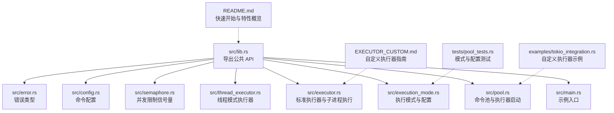
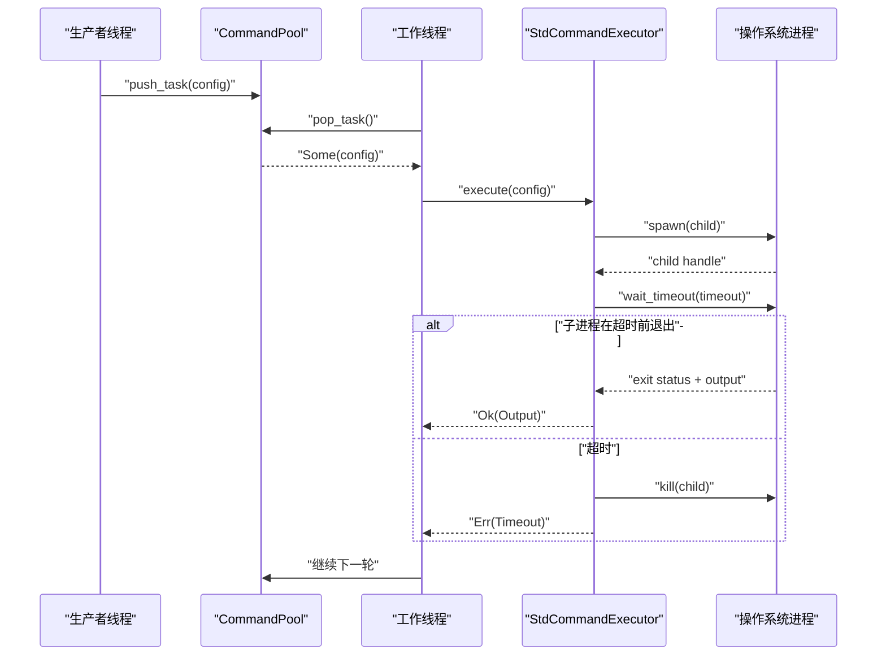
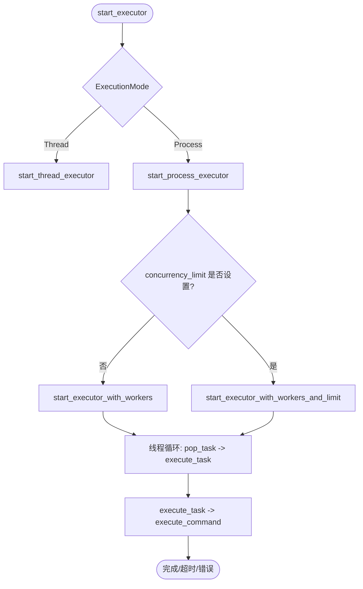
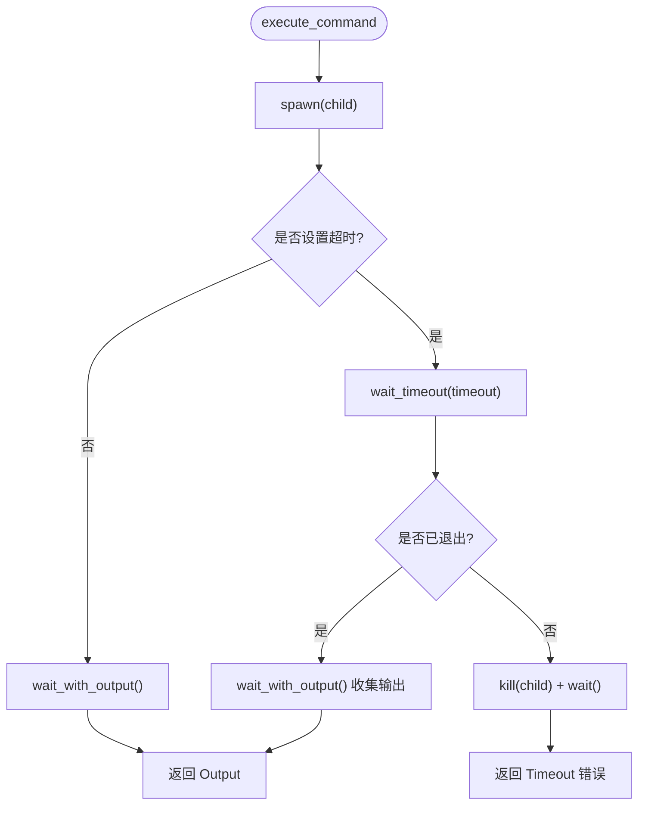
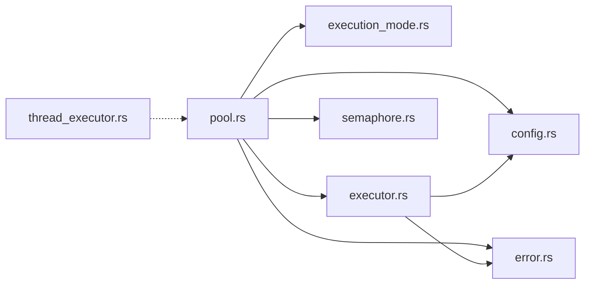

# 多进程模式

<cite>
**本文引用的文件**
- [src/lib.rs](file://src/lib.rs)
- [src/main.rs](file://src/main.rs)
- [src/executor.rs](file://src/executor.rs)
- [src/pool.rs](file://src/pool.rs)
- [src/execution_mode.rs](file://src/execution_mode.rs)
- [src/thread_executor.rs](file://src/thread_executor.rs)
- [src/semaphore.rs](file://src/semaphore.rs)
- [src/config.rs](file://src/config.rs)
- [src/error.rs](file://src/error.rs)
- [examples/tokio_integration.rs](file://examples/tokio_integration.rs)
- [tests/pool_tests.rs](file://tests/pool_tests.rs)
- [README.md](file://README.md)
- [EXECUTOR_CUSTOM.md](file://EXECUTOR_CUSTOM.md)
- [Cargo.toml](file://Cargo.toml)
</cite>

## 目录
1. [简介](#简介)
2. [项目结构](#项目结构)
3. [核心组件](#核心组件)
4. [架构总览](#架构总览)
5. [详细组件分析](#详细组件分析)
6. [依赖关系分析](#依赖关系分析)
7. [性能考量](#性能考量)
8. [故障排查指南](#故障排查指南)
9. [结论](#结论)
10. [附录](#附录)

## 简介
本文件聚焦“多进程执行模式”的技术文档，围绕以下主题展开：
- 多进程模式的工作原理：子进程创建、进程间通信与资源隔离
- Process 模式下的进程管理与进程间数据传递策略
- 多进程模式的配置项、性能特征与适用场景
- 如何启用与配置多进程执行器的具体示例路径
- 多进程模式下的错误处理、进程监控与资源清理
- 安全考虑与性能优化建议

## 项目结构
该项目是一个轻量的命令池库，提供可插拔的命令执行器、线程安全队列、线程池与并发限制策略。多进程模式通过“每个命令启动一个子进程”的方式实现资源隔离与稳定性提升。

图表来源
- [src/lib.rs](file://src/lib.rs#L1-L17)
- [src/main.rs](file://src/main.rs#L1-L48)
- [src/pool.rs](file://src/pool.rs#L1-L296)
- [src/execution_mode.rs](file://src/execution_mode.rs#L1-L70)
- [src/executor.rs](file://src/executor.rs#L1-L100)
- [src/thread_executor.rs](file://src/thread_executor.rs#L1-L148)
- [src/semaphore.rs](file://src/semaphore.rs#L1-L53)
- [src/config.rs](file://src/config.rs#L1-L109)
- [src/error.rs](file://src/error.rs#L1-L18)
- [examples/tokio_integration.rs](file://examples/tokio_integration.rs#L1-L62)
- [tests/pool_tests.rs](file://tests/pool_tests.rs#L1-L90)
- [README.md](file://README.md#L1-L60)
- [EXECUTOR_CUSTOM.md](file://EXECUTOR_CUSTOM.md#L1-L228)

章节来源
- [src/lib.rs](file://src/lib.rs#L1-L17)
- [README.md](file://README.md#L1-L60)

## 核心组件
- 执行模式与配置
  - 枚举 ExecutionMode：支持 Thread 与 Process 两种模式
  - 结构体 ExecutionConfig：包含 mode、workers、concurrency_limit
- 命令池 CommandPool：负责任务队列、执行器启动与任务执行
- 标准执行器 StdCommandExecutor：基于 std::process::Command 的同步执行
- 信号量 Semaphore：用于限制同时执行的外部子进程数量
- 错误类型 ExecuteError：统一的错误表示（IO、超时、子进程异常）

章节来源
- [src/execution_mode.rs](file://src/execution_mode.rs#L1-L70)
- [src/pool.rs](file://src/pool.rs#L1-L296)
- [src/executor.rs](file://src/executor.rs#L1-L100)
- [src/semaphore.rs](file://src/semaphore.rs#L1-L53)
- [src/error.rs](file://src/error.rs#L1-L18)

## 架构总览
多进程模式的核心思想是：每个命令配置在执行时都会启动一个新的子进程，父进程通过 wait-timeout 进行超时控制，必要时主动终止子进程并回收资源。执行器启动后，会按配置的 workers 数量创建若干工作线程，每个线程循环从队列取出任务并调用 execute_task，后者委托标准执行器完成子进程创建与等待。

图表来源
- [src/pool.rs](file://src/pool.rs#L134-L227)
- [src/executor.rs](file://src/executor.rs#L20-L70)

## 详细组件分析

### 执行模式与配置（Process 模式）
- 默认模式为 Process，workers 通常取系统可用并行度
- 支持设置并发限制 concurrency_limit，用于限制同时运行的外部子进程数量
- 通过 with_mode/with_workers/with_concurrency_limit 构建链式配置

章节来源
- [src/execution_mode.rs](file://src/execution_mode.rs#L21-L63)
- [tests/pool_tests.rs](file://tests/pool_tests.rs#L32-L64)

### 命令池与执行器启动（Process 模式）
- start_executor 根据 ExecutionMode 分派到线程模式或进程模式
- 进程模式下：
  - start_executor_with_workers：按 workers 数量创建线程，每个线程循环 pop_task 并 execute_task
  - start_executor_with_workers_and_limit：在上述基础上引入信号量，限制并发外部进程数
- execute_task 调用标准执行器的 execute_command，内部使用 std::process::Command 启动子进程并等待

图表来源
- [src/pool.rs](file://src/pool.rs#L134-L210)

章节来源
- [src/pool.rs](file://src/pool.rs#L134-L227)

### 标准执行器与子进程管理
- execute_command 使用 std::process::Command 启动子进程，重定向 stdout/stderr
- 若配置了超时，则使用 wait-timeout 在当前线程等待；超时后尝试 kill 子进程并返回超时错误
- 未设置超时则直接等待并收集输出

图表来源
- [src/executor.rs](file://src/executor.rs#L26-L70)

章节来源
- [src/executor.rs](file://src/executor.rs#L20-L70)

### 并发限制与资源隔离
- 信号量 Semaphore 提供轻量级并发控制，通过 acquire_guard 在 Drop 时自动释放
- 在进程模式下，通过并发限制避免系统资源耗尽，保证稳定性和可预测性

章节来源
- [src/semaphore.rs](file://src/semaphore.rs#L1-L53)
- [src/pool.rs](file://src/pool.rs#L189-L210)

### 错误处理与资源清理
- ExecuteError 统一表示 IO 错误、超时与子进程异常
- 子进程超时后会尝试 kill 并 wait，确保资源被回收
- 信号量守卫在作用域结束时自动通知等待者，避免死锁

章节来源
- [src/error.rs](file://src/error.rs#L1-L18)
- [src/executor.rs](file://src/executor.rs#L56-L62)
- [src/semaphore.rs](file://src/semaphore.rs#L45-L52)

### 配置选项与使用示例
- 启用多进程模式：使用默认配置或显式 with_mode(ExecutionMode::Process)
- 设置工作线程数：with_workers(n)
- 设置并发限制：with_concurrency_limit(limit)
- 示例路径：
  - 快速开始与基础用法：[README.md](file://README.md#L28-L37)
  - 多进程模式配置与行为验证：[tests/pool_tests.rs](file://tests/pool_tests.rs#L32-L64)
  - 自定义执行器与并发限制示例：[examples/tokio_integration.rs](file://examples/tokio_integration.rs#L42-L61)

章节来源
- [README.md](file://README.md#L15-L49)
- [tests/pool_tests.rs](file://tests/pool_tests.rs#L32-L64)
- [examples/tokio_integration.rs](file://examples/tokio_integration.rs#L42-L61)

## 依赖关系分析
- 模块耦合与职责
  - pool.rs 依赖 execution_mode.rs、executor.rs、semaphore.rs、config.rs、error.rs
  - executor.rs 依赖 config.rs、error.rs，并使用 std::process 与 wait-timeout
  - thread_executor.rs 与 pool.rs 的线程模式形成互补
  - semaphore.rs 为并发控制提供通用基础设施
- 外部依赖
  - wait-timeout：用于在单线程中等待子进程并支持超时
  - crossbeam-queue：无锁队列变体（不在本文重点范围内）
  - tokio：示例中用于自定义执行器（不影响默认多进程模式）

图表来源
- [src/pool.rs](file://src/pool.rs#L1-L12)
- [src/executor.rs](file://src/executor.rs#L1-L12)
- [src/execution_mode.rs](file://src/execution_mode.rs#L1-L32)
- [src/semaphore.rs](file://src/semaphore.rs#L1-L9)
- [src/config.rs](file://src/config.rs#L1-L25)
- [src/error.rs](file://src/error.rs#L1-L18)
- [src/thread_executor.rs](file://src/thread_executor.rs#L1-L24)

章节来源
- [src/pool.rs](file://src/pool.rs#L1-L12)
- [src/executor.rs](file://src/executor.rs#L1-L12)
- [src/execution_mode.rs](file://src/execution_mode.rs#L1-L32)
- [src/semaphore.rs](file://src/semaphore.rs#L1-L9)
- [src/config.rs](file://src/config.rs#L1-L25)
- [src/error.rs](file://src/error.rs#L1-L18)
- [src/thread_executor.rs](file://src/thread_executor.rs#L1-L24)

## 性能考量
- 子进程开销：每次命令启动新进程带来额外开销，适合 I/O 密集或需要强隔离的场景
- 超时等待：wait-timeout 在单线程中等待，避免为每个任务额外创建等待线程，降低系统开销
- 并发限制：通过信号量限制同时运行的外部进程数量，防止资源耗尽
- 工作线程数：根据任务类型与 CPU 核心数调整 workers，I/O 密集可适当增加
- 自定义执行器：可在异步运行时中实现，但需注意同步 trait 的异步实现方式与运行时创建成本

章节来源
- [src/executor.rs](file://src/executor.rs#L26-L70)
- [src/pool.rs](file://src/pool.rs#L189-L210)
- [EXECUTOR_CUSTOM.md](file://EXECUTOR_CUSTOM.md#L173-L179)

## 故障排查指南
- 超时问题
  - 现象：任务长时间无响应
  - 排查：检查命令本身、工作目录、超时配置；确认 wait-timeout 是否正确触发 kill
  - 参考：[src/executor.rs](file://src/executor.rs#L42-L62)
- 资源耗尽
  - 现象：系统负载高、进程过多
  - 排查：启用并发限制，合理设置 workers 与 limit
  - 参考：[src/pool.rs](file://src/pool.rs#L189-L210)
- 错误类型定位
  - 使用 ExecuteError 的具体变体区分 IO、超时、子进程异常
  - 参考：[src/error.rs](file://src/error.rs#L1-L18)
- 测试验证
  - 使用测试用例验证默认模式、模式切换与配置构建
  - 参考：[tests/pool_tests.rs](file://tests/pool_tests.rs#L32-L64)

章节来源
- [src/executor.rs](file://src/executor.rs#L42-L62)
- [src/pool.rs](file://src/pool.rs#L189-L210)
- [src/error.rs](file://src/error.rs#L1-L18)
- [tests/pool_tests.rs](file://tests/pool_tests.rs#L32-L64)

## 结论
多进程模式通过“每个命令一个子进程”的方式实现了强隔离与稳定性，结合 wait-timeout 的超时控制与信号量的并发限制，能够在复杂环境中保持可控的资源占用与可预测的性能表现。对于 I/O 密集或需要强隔离的场景尤为合适；若追求更低的进程开销，可考虑线程模式或自定义执行器方案。

## 附录

### 多进程模式配置清单
- 执行模式：Process（默认）
- 工作线程数：workers（默认取系统可用并行度）
- 并发限制：concurrency_limit（可选，推荐设置以保护系统资源）

章节来源
- [src/execution_mode.rs](file://src/execution_mode.rs#L34-L63)
- [tests/pool_tests.rs](file://tests/pool_tests.rs#L72-L77)

### 启用与配置示例路径
- 快速开始（默认多进程模式）：[README.md](file://README.md#L28-L37)
- 显式配置多进程模式与并发限制：[tests/pool_tests.rs](file://tests/pool_tests.rs#L46-L64)
- 自定义执行器与并发限制示例：[examples/tokio_integration.rs](file://examples/tokio_integration.rs#L42-L61)

章节来源
- [README.md](file://README.md#L28-L37)
- [tests/pool_tests.rs](file://tests/pool_tests.rs#L46-L64)
- [examples/tokio_integration.rs](file://examples/tokio_integration.rs#L42-L61)

### 安全考虑与最佳实践
- 超时与终止：确保超时后能 kill 子进程并回收资源，避免僵尸进程
- 并发限制：为 I/O 密集型任务设置合理的 limit，防止系统过载
- 工作线程数：根据任务类型与硬件条件调整，避免过度竞争
- 自定义执行器：在同步 trait 中实现异步逻辑时，避免频繁创建运行时

章节来源
- [src/executor.rs](file://src/executor.rs#L42-L62)
- [src/pool.rs](file://src/pool.rs#L189-L210)
- [EXECUTOR_CUSTOM.md](file://EXECUTOR_CUSTOM.md#L173-L179)