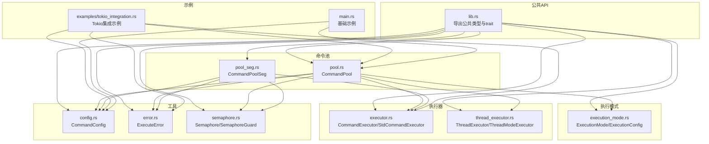
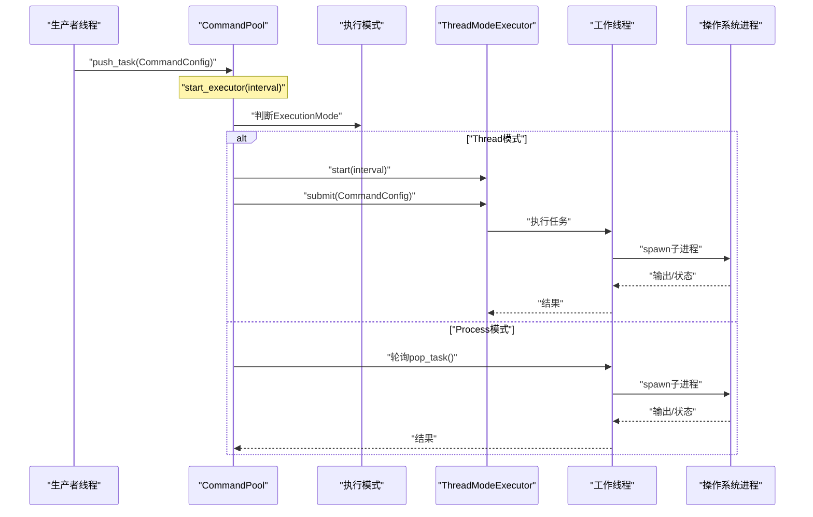
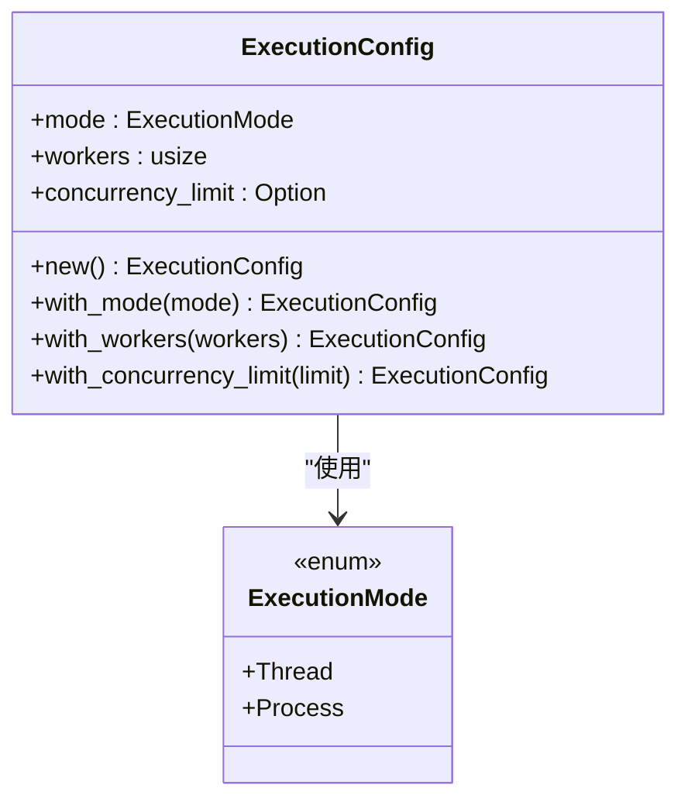
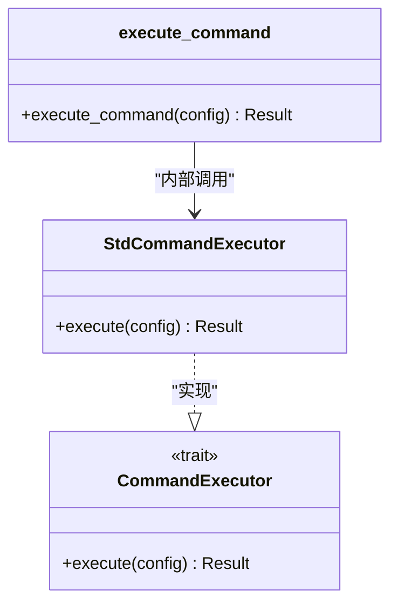
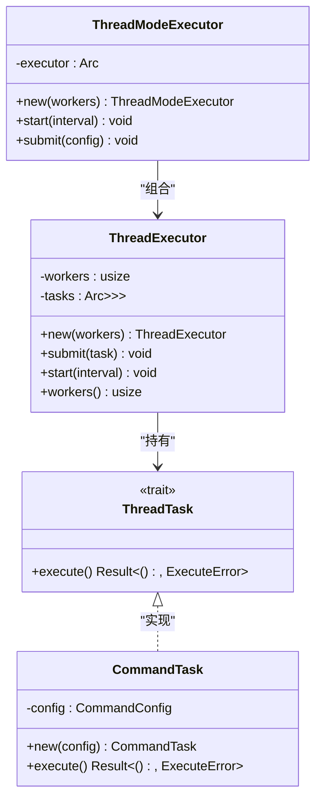
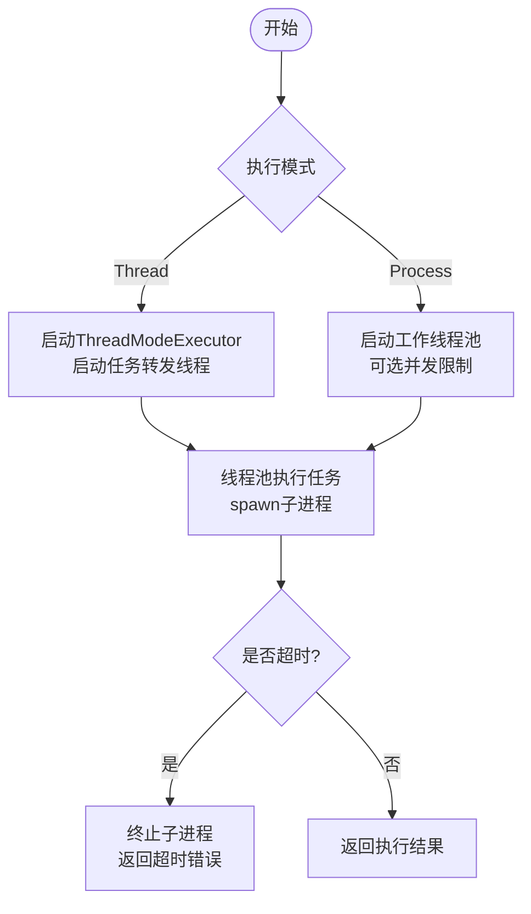
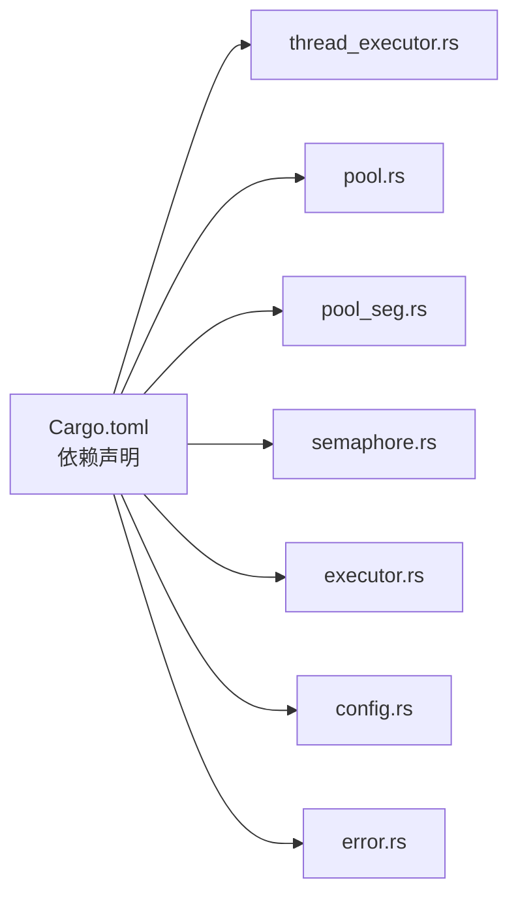

# 执行模式详解

<cite>
**本文档引用的文件**
- [src/lib.rs](file://src/lib.rs)
- [src/main.rs](file://src/main.rs)
- [src/execution_mode.rs](file://src/execution_mode.rs)
- [src/executor.rs](file://src/executor.rs)
- [src/thread_executor.rs](file://src/thread_executor.rs)
- [src/pool.rs](file://src/pool.rs)
- [src/config.rs](file://src/config.rs)
- [src/error.rs](file://src/error.rs)
- [src/semaphore.rs](file://src/semaphore.rs)
- [src/pool_seg.rs](file://src/pool_seg.rs)
- [examples/tokio_integration.rs](file://examples/tokio_integration.rs)
- [EXECUTOR_CUSTOM.md](file://EXECUTOR_CUSTOM.md)
- [Cargo.toml](file://Cargo.toml)
- [README.md](file://README.md)
</cite>

## 目录
1. [简介](#简介)
2. [项目结构](#项目结构)
3. [核心组件](#核心组件)
4. [架构总览](#架构总览)
5. [详细组件分析](#详细组件分析)
6. [依赖关系分析](#依赖关系分析)
7. [性能考量](#性能考量)
8. [故障排除指南](#故障排除指南)
9. [结论](#结论)
10. [附录](#附录)

## 简介
本项目提供了一个轻量的命令池库，支持多线程模式与多进程模式两种执行模式。通过统一的命令配置与可插拔的执行器接口，用户可以在同一套 API 下灵活切换执行策略，并结合并发限制与无锁队列实现高性能的任务调度。本文档将深入解析两种执行模式的工作原理、优缺点与适用场景，详细说明执行模式的切换机制与配置方法，并提供性能对比分析、选择指南、使用示例与最佳实践。

## 项目结构
该项目采用模块化设计，核心模块包括执行模式定义、命令配置、执行器、线程池、命令池、信号量与无锁队列变体等。对外暴露统一的公共 API，便于集成与扩展。

图表来源
- [src/lib.rs](file://src/lib.rs#L1-L17)
- [src/execution_mode.rs](file://src/execution_mode.rs#L1-L70)
- [src/executor.rs](file://src/executor.rs#L1-L100)
- [src/thread_executor.rs](file://src/thread_executor.rs#L1-L148)
- [src/pool.rs](file://src/pool.rs#L1-L296)
- [src/pool_seg.rs](file://src/pool_seg.rs#L1-L157)
- [src/config.rs](file://src/config.rs#L1-L109)
- [src/error.rs](file://src/error.rs#L1-L18)
- [src/semaphore.rs](file://src/semaphore.rs#L1-L53)
- [examples/tokio_integration.rs](file://examples/tokio_integration.rs#L1-L62)
- [src/main.rs](file://src/main.rs#L1-L48)

章节来源
- [src/lib.rs](file://src/lib.rs#L1-L17)
- [README.md](file://README.md#L1-L60)

## 核心组件
- 执行模式与配置：定义执行模式枚举与配置结构，支持多线程与多进程两种模式，并可设置工作线程/进程数与并发限制。
- 命令配置：封装程序名、参数、工作目录与超时等执行参数。
- 执行器接口：抽象命令执行接口，提供标准库实现与可插拔的自定义实现。
- 线程池执行器：在共享进程内并发执行任务，适合计算密集型或需要共享内存的任务。
- 命令池：基于互斥队列或无锁队列的任务调度器，支持定时轮询与并发限制。
- 信号量：轻量级并发控制，限制同时执行的外部进程数量。
- 错误模型：统一的错误类型，涵盖 IO 错误、超时与子进程异常。

章节来源
- [src/execution_mode.rs](file://src/execution_mode.rs#L1-L70)
- [src/config.rs](file://src/config.rs#L1-L109)
- [src/executor.rs](file://src/executor.rs#L1-L100)
- [src/thread_executor.rs](file://src/thread_executor.rs#L1-L148)
- [src/pool.rs](file://src/pool.rs#L1-L296)
- [src/pool_seg.rs](file://src/pool_seg.rs#L1-L157)
- [src/semaphore.rs](file://src/semaphore.rs#L1-L53)
- [src/error.rs](file://src/error.rs#L1-L18)

## 架构总览
系统采用“命令池 + 执行器”的分层架构。命令池负责任务的生产与调度，执行器负责实际的命令执行。执行模式通过配置决定调度策略：多线程模式下，命令池将任务转发给线程池执行器；多进程模式下，命令池直接在工作线程中启动子进程执行命令。同时，系统提供无锁队列变体以提升高并发场景下的吞吐量。

图表来源
- [src/pool.rs](file://src/pool.rs#L134-L143)
- [src/pool.rs](file://src/pool.rs#L145-L163)
- [src/pool.rs](file://src/pool.rs#L165-L172)
- [src/thread_executor.rs](file://src/thread_executor.rs#L128-L137)
- [src/executor.rs](file://src/executor.rs#L30-L70)

## 详细组件分析

### 执行模式与配置
- 执行模式枚举：提供多线程与多进程两种模式，分别适用于不同的资源与隔离需求。
- 执行配置：包含模式、工作线程/进程数、并发限制等参数，支持链式配置与默认值推断。
- 默认行为：未显式设置时，默认使用多进程模式，并根据可用并行度设置工作数。

图表来源
- [src/execution_mode.rs](file://src/execution_mode.rs#L5-L32)

章节来源
- [src/execution_mode.rs](file://src/execution_mode.rs#L1-L70)

### 命令配置
- 字段：程序名、参数列表、工作目录、超时时间。
- 方法：链式设置工作目录与超时，提供只读访问器。
- 默认超时：未显式设置时，默认超时时间为若干秒（具体数值见实现）。

章节来源
- [src/config.rs](file://src/config.rs#L1-L109)

### 执行器接口与标准实现
- 接口：CommandExecutor trait，统一命令执行入口。
- 标准实现：StdCommandExecutor，基于标准库子进程执行，支持超时与安全等待。
- 内部执行函数：execute_command，负责启动子进程、重定向输出、处理超时与终止。

图表来源
- [src/executor.rs](file://src/executor.rs#L9-L24)
- [src/executor.rs](file://src/executor.rs#L20-L24)
- [src/executor.rs](file://src/executor.rs#L30-L70)

章节来源
- [src/executor.rs](file://src/executor.rs#L1-L100)

### 线程池执行器
- 线程任务接口：ThreadTask，定义可在线程池中执行的任务。
- 线程执行器：ThreadExecutor，维护任务队列与工作线程，支持轮询与任务提交。
- 线程模式执行器：ThreadModeExecutor，封装线程执行器，提供启动与提交接口。
- 命令任务包装：CommandTask，将命令配置包装为可执行任务。

图表来源
- [src/thread_executor.rs](file://src/thread_executor.rs#L8-L14)
- [src/thread_executor.rs](file://src/thread_executor.rs#L20-L76)
- [src/thread_executor.rs](file://src/thread_executor.rs#L91-L110)
- [src/thread_executor.rs](file://src/thread_executor.rs#L115-L137)

章节来源
- [src/thread_executor.rs](file://src/thread_executor.rs#L1-L148)

### 命令池与无锁队列变体
- 命令池：支持多线程与多进程两种模式，提供定时轮询、并发限制与自定义执行器注入。
- 无锁队列变体：CommandPoolSeg 基于跨线程队列，减少锁竞争，提升多生产者场景下的吞吐量。
- 并发控制：通过信号量限制同时执行的外部进程数量，避免系统资源耗尽。

图表来源
- [src/pool.rs](file://src/pool.rs#L134-L143)
- [src/pool.rs](file://src/pool.rs#L145-L163)
- [src/pool.rs](file://src/pool.rs#L165-L172)
- [src/executor.rs](file://src/executor.rs#L30-L70)

章节来源
- [src/pool.rs](file://src/pool.rs#L1-L296)
- [src/pool_seg.rs](file://src/pool_seg.rs#L1-L157)
- [src/semaphore.rs](file://src/semaphore.rs#L1-L53)

### 错误处理策略
- 错误类型：IO 错误、超时错误、子进程错误。
- 超时处理：在超时后尝试终止子进程并返回超时错误。
- 线程安全：在锁被破坏时，通过获取内部数据的方式保证基本一致性。

章节来源
- [src/error.rs](file://src/error.rs#L1-L18)
- [src/executor.rs](file://src/executor.rs#L30-L70)

## 依赖关系分析
- 外部依赖：thiserror（错误派生）、crossbeam-queue（无锁队列）、wait-timeout（子进程超时等待）。
- 内部模块：lib.rs 统一导出公共 API；各模块职责清晰，耦合度低。
- 可扩展性：通过 CommandExecutor trait 支持自定义运行时（如 Tokio），并提供完整的集成示例。

图表来源
- [Cargo.toml](file://Cargo.toml#L6-L12)

章节来源
- [Cargo.toml](file://Cargo.toml#L1-L13)

## 性能考量
- 多线程模式
  - 优点：共享内存，线程间通信成本低，适合计算密集型任务；线程池复用减少线程创建开销。
  - 缺点：线程安全与竞态条件需要谨慎处理；GIL 与上下文切换影响 CPU 密集型任务。
  - 适用场景：CPU 密集型、需要共享状态的任务；对延迟敏感且任务规模适中。
- 多进程模式
  - 优点：进程隔离，稳定性好；天然防止单个任务影响其他任务；适合 I/O 密集型任务。
  - 缺点：进程间通信成本高；系统资源占用较大；启动与销毁开销更高。
  - 适用场景：I/O 密集型、需要强隔离的任务；大规模并发但单任务资源占用较小。
- 并发限制与信号量
  - 通过信号量限制同时执行的外部进程数量，避免系统资源耗尽，提升整体稳定性。
- 无锁队列
  - 在多生产者场景下减少锁竞争，提升吞吐量；但在高冲突场景下可能退化为伪无锁。

章节来源
- [src/pool.rs](file://src/pool.rs#L165-L172)
- [src/pool_seg.rs](file://src/pool_seg.rs#L11-L14)
- [src/semaphore.rs](file://src/semaphore.rs#L1-L53)

## 故障排除指南
- 超时问题
  - 现象：命令执行超过设定时间后返回超时错误。
  - 处理：检查超时设置是否合理；确认子进程是否正确响应终止信号。
- 进程无法终止
  - 现象：超时后子进程仍在运行。
  - 处理：确保在超时分支中调用终止操作；检查权限与进程树。
- 资源耗尽
  - 现象：系统资源不足导致新进程无法创建。
  - 处理：启用并发限制；减少工作线程数；优化任务粒度。
- 锁竞争与死锁
  - 现象：在高并发场景下出现性能下降或卡顿。
  - 处理：考虑使用无锁队列变体；减少锁持有时间；优化任务拆分。

章节来源
- [src/executor.rs](file://src/executor.rs#L30-L70)
- [src/pool.rs](file://src/pool.rs#L165-L172)
- [src/pool_seg.rs](file://src/pool_seg.rs#L70-L91)

## 结论
本项目通过统一的执行模式与可插拔执行器接口，为命令执行提供了灵活而高效的解决方案。多线程模式适合需要共享内存与较低通信开销的场景，多进程模式则更适合需要强隔离与稳定性的场景。结合并发限制与无锁队列，可在不同负载下取得良好的性能表现。开发者应根据任务类型、资源约束与稳定性要求选择合适的执行模式，并通过合理的配置与监控持续优化系统表现。

## 附录

### 执行模式切换与配置方法
- 选择模式：通过 ExecutionConfig 指定 ExecutionMode。
- 设置工作数：通过 with_workers 设置工作线程/进程数。
- 设置并发限制：通过 with_concurrency_limit 限制同时执行的外部进程数量。
- 默认行为：未显式设置时，默认使用多进程模式，并根据可用并行度设置工作数。

章节来源
- [src/execution_mode.rs](file://src/execution_mode.rs#L34-L63)

### 使用示例与最佳实践
- 基础示例：参考 main.rs 中的命令池启动与任务推送。
- Tokio 集成：参考 examples/tokio_integration.rs，展示自定义执行器与超时控制。
- 最佳实践：
  - I/O 密集型任务优先考虑多进程模式，以获得更好的稳定性。
  - CPU 密集型任务可考虑多线程模式，减少进程切换开销。
  - 启用并发限制，避免系统资源耗尽。
  - 在高并发场景下使用无锁队列变体以提升吞吐量。

章节来源
- [src/main.rs](file://src/main.rs#L16-L47)
- [examples/tokio_integration.rs](file://examples/tokio_integration.rs#L42-L61)
- [EXECUTOR_CUSTOM.md](file://EXECUTOR_CUSTOM.md#L109-L155)