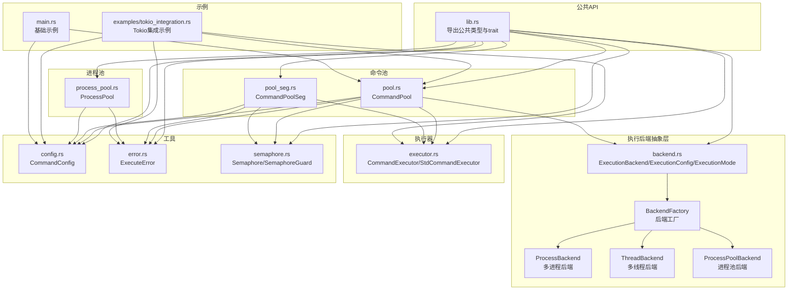
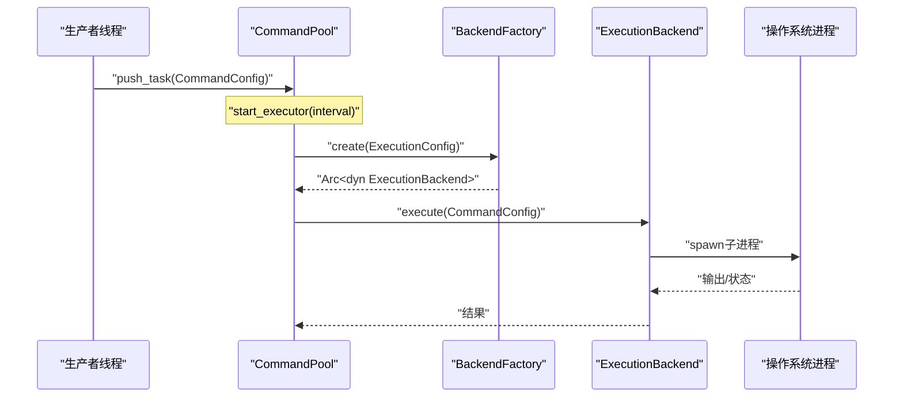
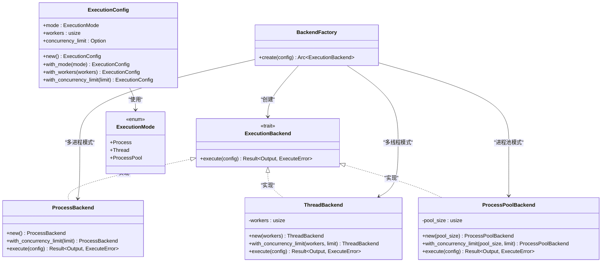
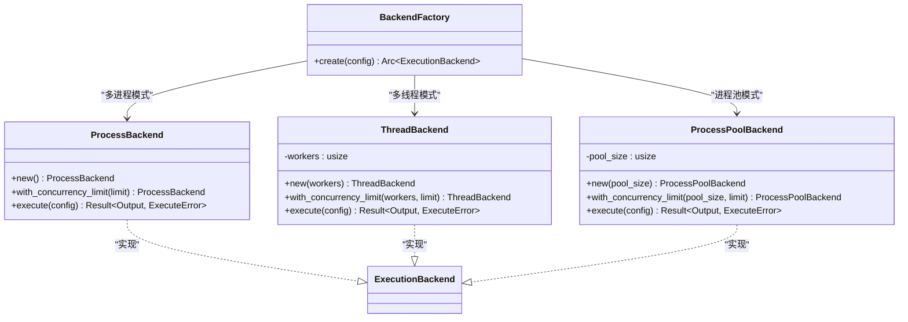
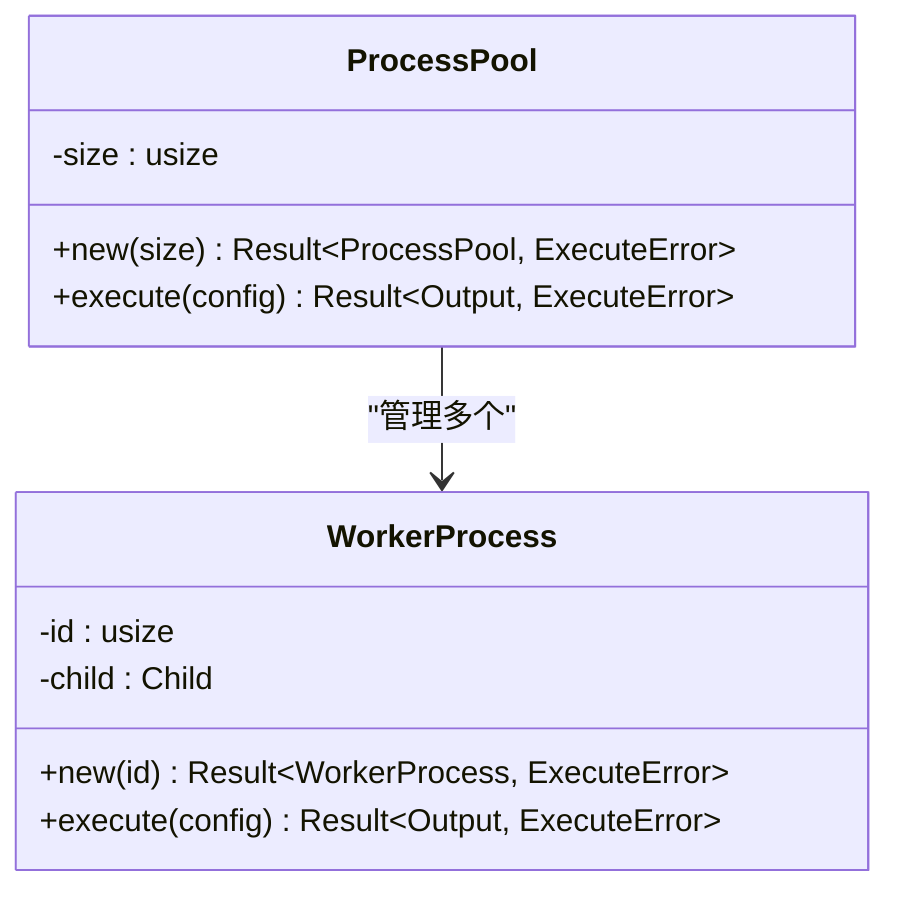
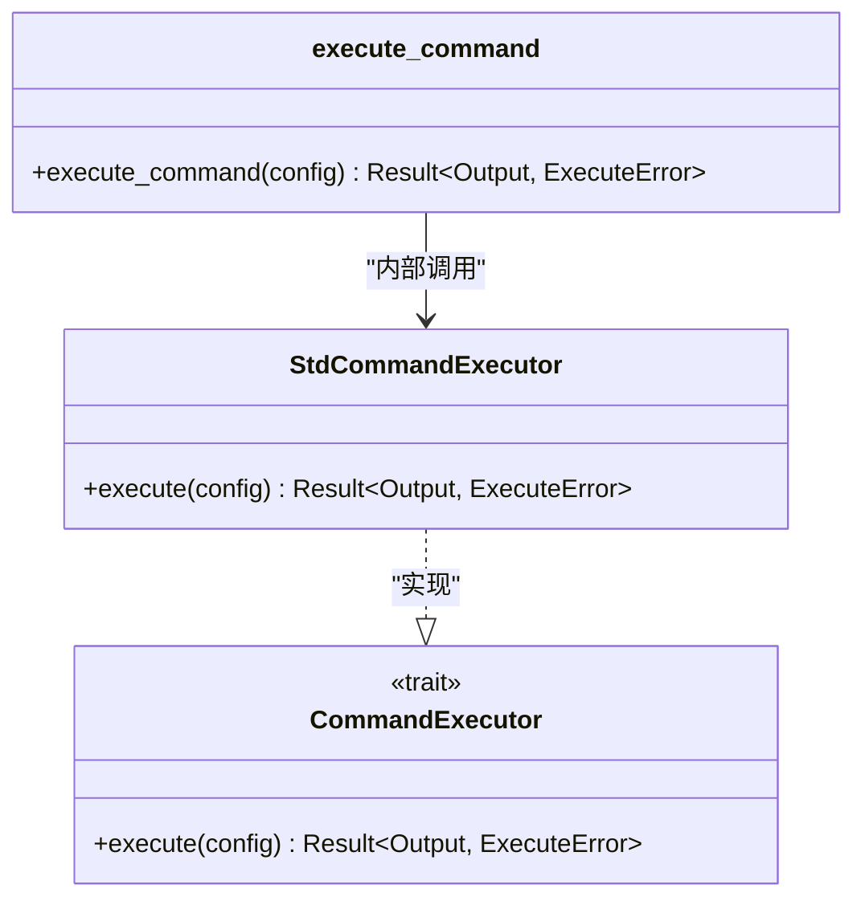
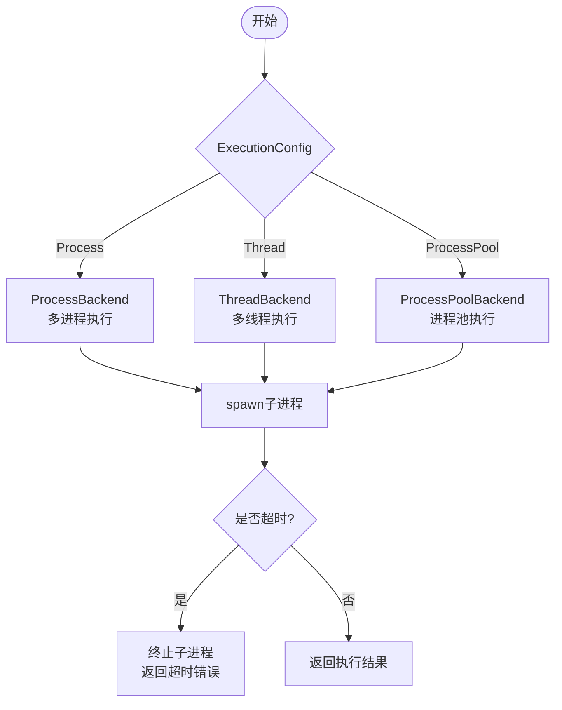
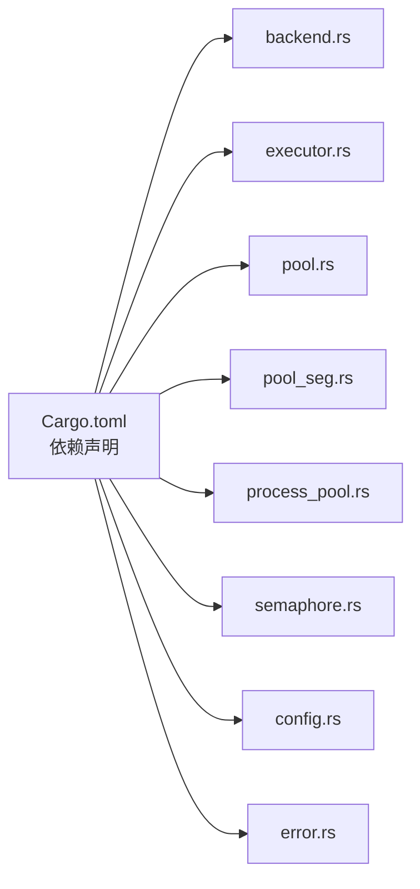

# 执行模式详解

<cite>
**本文档引用的文件**
- [src/lib.rs](file://src/lib.rs)
- [src/backend.rs](file://src/backend.rs)
- [src/config.rs](file://src/config.rs)
- [src/executor.rs](file://src/executor.rs)
- [src/pool.rs](file://src/pool.rs)
- [src/pool_seg.rs](file://src/pool_seg.rs)
- [src/process_pool.rs](file://src/process_pool.rs)
- [src/semaphore.rs](file://src/semaphore.rs)
- [src/error.rs](file://src/error.rs)
- [examples/tokio_integration.rs](file://examples/tokio_integration.rs)
- [src/main.rs](file://src/main.rs)
- [README.md](file://README.md)
- [Cargo.toml](file://Cargo.toml)
</cite>

## 更新摘要
**所做更改**
- 更新执行模式系统架构，从简单的 ExecutionMode 枚举扩展为完整的后端抽象层
- 新增 ProcessBackend、ThreadBackend 和 ProcessPoolBackend 三种具体执行后端实现
- 新增 BackendFactory 工厂模式，提供统一的后端实例创建机制
- 新增 ProcessPool 独立进程池实现，支持常驻子进程复用
- 新增并发限制功能，通过 ExecutionConfig 支持可选的并发限制配置
- 更新命令池与执行器交互机制，引入新的后端工厂模式

## 目录
1. [简介](#简介)
2. [项目结构](#项目结构)
3. [核心组件](#核心组件)
4. [架构总览](#架构总览)
5. [详细组件分析](#详细组件分析)
6. [依赖关系分析](#依赖关系分析)
7. [性能考量](#性能考量)
8. [故障排除指南](#故障排除指南)
9. [结论](#结论)
10. [附录](#附录)

## 简介
本项目提供了一个轻量的命令池库，支持多线程模式、多进程模式和进程池模式三种执行模式。通过统一的执行后端抽象层和可插拔的执行器接口，用户可以在同一套 API 下灵活切换执行策略，并结合并发限制与无锁队列实现高性能的任务调度。本文档将深入解析三种执行模式的工作原理、优缺点与适用场景，详细说明执行模式的切换机制与配置方法，并提供性能对比分析、选择指南、使用示例与最佳实践。

**更新** 执行模式系统已扩展为支持新的后端抽象层，包括 ExecutionMode 枚举和 BackendFactory 工厂模式，提供更灵活的执行后端选择机制。

## 项目结构
该项目采用模块化设计，核心模块包括执行后端抽象层、命令配置、执行器、线程池、命令池、进程池、信号量与无锁队列变体等。对外暴露统一的公共 API，便于集成与扩展。

**图表来源**
- [src/lib.rs](file://src/lib.rs#L1-L22)
- [src/backend.rs](file://src/backend.rs#L1-L277)
- [src/executor.rs](file://src/executor.rs#L1-L100)
- [src/pool.rs](file://src/pool.rs#L1-L324)
- [src/pool_seg.rs](file://src/pool_seg.rs#L1-L157)
- [src/process_pool.rs](file://src/process_pool.rs#L1-L173)
- [src/config.rs](file://src/config.rs#L1-L109)
- [src/error.rs](file://src/error.rs#L1-L18)
- [src/semaphore.rs](file://src/semaphore.rs#L1-L53)
- [examples/tokio_integration.rs](file://examples/tokio_integration.rs#L1-L62)
- [src/main.rs](file://src/main.rs#L1-L175)

**章节来源**
- [src/lib.rs](file://src/lib.rs#L1-L22)
- [README.md](file://README.md#L1-L130)

## 核心组件
- **执行后端抽象层**：定义 ExecutionBackend trait 作为统一的命令执行接口，支持多进程、多线程和进程池三种后端实现。
- **执行模式与配置**：定义 ExecutionMode 枚举与 ExecutionConfig 结构，支持多线程、多进程和进程池三种模式，并可设置工作线程数和并发限制。
- **后端工厂**：BackendFactory 提供统一的后端实例创建机制，根据 ExecutionConfig 动态选择合适的执行后端。
- **命令配置**：封装程序名、参数、工作目录与超时等执行参数。
- **执行器接口**：抽象命令执行接口，提供标准库实现与可插拔的自定义实现。
- **命令池**：基于互斥队列或无锁队列的任务调度器，支持定时轮询与并发限制。
- **进程池**：独立的常驻子进程池实现，支持 IPC 通信和命令复用。
- **信号量**：轻量级并发控制，限制同时执行的外部进程数量。
- **错误模型**：统一的错误类型，涵盖 IO 错误、超时与子进程异常。

**更新** 新增执行后端抽象层，提供更灵活的执行策略选择机制。

**章节来源**
- [src/backend.rs](file://src/backend.rs#L1-L277)
- [src/config.rs](file://src/config.rs#L1-L109)
- [src/executor.rs](file://src/executor.rs#L1-L100)
- [src/pool.rs](file://src/pool.rs#L1-L324)
- [src/pool_seg.rs](file://src/pool_seg.rs#L1-L157)
- [src/process_pool.rs](file://src/process_pool.rs#L1-L173)
- [src/semaphore.rs](file://src/semaphore.rs#L1-L53)
- [src/error.rs](file://src/error.rs#L1-L18)

## 架构总览
系统采用"命令池 + 执行后端"的分层架构。命令池负责任务的生产与调度，执行后端负责实际的命令执行。执行模式通过 ExecutionConfig 决定调度策略：多线程模式下，命令池通过 ThreadBackend 执行任务；多进程模式下，命令池通过 ProcessBackend 执行命令；进程池模式下，命令池通过 ProcessPoolBackend 执行命令。同时，系统提供无锁队列变体以提升高并发场景下的吞吐量。

**图表来源**
- [src/pool.rs](file://src/pool.rs#L28-L30)
- [src/backend.rs](file://src/backend.rs#L247-L276)
- [src/backend.rs](file://src/backend.rs#L156-L161)

## 详细组件分析

### 执行后端抽象层
- **ExecutionBackend trait**：统一的命令执行接口，定义 execute 方法处理 CommandConfig 并返回执行结果。
- **ExecutionMode 枚举**：提供多线程、多进程和进程池三种模式，分别适用于不同的资源与隔离需求。
- **ExecutionConfig 结构**：包含模式、工作线程数和并发限制等配置参数，支持链式配置与默认值推断。
- **BackendFactory 工厂**：根据 ExecutionConfig 动态创建合适的执行后端实例。

**图表来源**
- [src/backend.rs](file://src/backend.rs#L12-L22)
- [src/backend.rs](file://src/backend.rs#L27-L52)
- [src/backend.rs](file://src/backend.rs#L57-L128)
- [src/backend.rs](file://src/backend.rs#L244-L276)

**章节来源**
- [src/backend.rs](file://src/backend.rs#L1-L277)

### 执行后端实现
- **ProcessBackend**：多进程后端实现，每个命令独立启动子进程，提供进程隔离和稳定性。
- **ThreadBackend**：多线程后端实现，使用线程池调度任务，适合需要共享内存的场景。
- **ProcessPoolBackend**：进程池后端实现，预创建常驻子进程池，复用执行命令，适合高频短命令场景。
- **后端工厂**：BackendFactory 根据 ExecutionConfig.mode 动态选择合适的后端实现。

**图表来源**
- [src/backend.rs](file://src/backend.rs#L140-L167)
- [src/backend.rs](file://src/backend.rs#L173-L202)
- [src/backend.rs](file://src/backend.rs#L213-L242)
- [src/backend.rs](file://src/backend.rs#L247-L276)

**章节来源**
- [src/backend.rs](file://src/backend.rs#L140-L242)

### 独立进程池实现
- **ProcessPool**：独立的常驻子进程池实现，支持 IPC 通信和命令复用。
- **WorkerProcess**：工作进程结构，负责与主进程通信并执行命令。
- **IPC 通信**：通过 stdin/stdout 与工作进程通信，支持命令序列化和结果反序列化。

**图表来源**
- [src/process_pool.rs](file://src/process_pool.rs#L95-L148)
- [src/process_pool.rs](file://src/process_pool.rs#L9-L16)

**章节来源**
- [src/process_pool.rs](file://src/process_pool.rs#L1-L173)

### 命令配置
- 字段：程序名、参数列表、工作目录、超时时间。
- 方法：链式设置工作目录与超时，提供只读访问器。
- 默认超时：未显式设置时，默认超时时间为 10 秒。

**章节来源**
- [src/config.rs](file://src/config.rs#L1-L109)

### 执行器接口与标准实现
- 接口：CommandExecutor trait，统一命令执行入口。
- 标准实现：StdCommandExecutor，基于标准库子进程执行，支持超时与安全等待。
- 内部执行函数：execute_command，负责启动子进程、重定向输出、处理超时与终止。

**图表来源**
- [src/executor.rs](file://src/executor.rs#L9-L12)
- [src/executor.rs](file://src/executor.rs#L20-L24)
- [src/executor.rs](file://src/executor.rs#L30-L70)

**章节来源**
- [src/executor.rs](file://src/executor.rs#L1-L100)

### 命令池与无锁队列变体
- **命令池**：支持多线程、多进程和进程池三种模式，提供定时轮询、并发限制与自定义执行器注入。
- **无锁队列变体**：CommandPoolSeg 基于跨线程队列，减少锁竞争，提升多生产者场景下的吞吐量。
- **并发控制**：通过信号量限制同时执行的外部进程数量，避免系统资源耗尽。

**图表来源**
- [src/pool.rs](file://src/pool.rs#L189-L194)
- [src/backend.rs](file://src/backend.rs#L247-L276)

**章节来源**
- [src/pool.rs](file://src/pool.rs#L1-L324)
- [src/pool_seg.rs](file://src/pool_seg.rs#L1-L157)
- [src/semaphore.rs](file://src/semaphore.rs#L1-L53)

### 错误处理策略
- 错误类型：IO 错误、超时错误、子进程错误。
- 超时处理：在超时后尝试终止子进程并返回超时错误。
- 线程安全：在锁被破坏时，通过获取内部数据的方式保证基本一致性。

**章节来源**
- [src/error.rs](file://src/error.rs#L1-L18)
- [src/executor.rs](file://src/executor.rs#L30-L70)

## 依赖关系分析
- 外部依赖：thiserror（错误派生）、crossbeam-queue（无锁队列）、wait-timeout（子进程超时等待）。
- 内部模块：lib.rs 统一导出公共 API；各模块职责清晰，耦合度低。
- 可扩展性：通过 ExecutionBackend trait 支持自定义运行时（如 Tokio），并提供完整的集成示例。

**图表来源**
- [Cargo.toml](file://Cargo.toml#L6-L12)

**章节来源**
- [Cargo.toml](file://Cargo.toml#L1-L13)

## 性能考量
- **多线程模式**
  - 优点：共享内存，线程间通信成本低，适合计算密集型任务；线程池复用减少线程创建开销。
  - 缺点：线程安全与竞态条件需要谨慎处理；GIL 与上下文切换影响 CPU 密集型任务。
  - 适用场景：CPU 密集型、需要共享状态的任务；对延迟敏感且任务规模适中。
- **多进程模式**
  - 优点：进程隔离，稳定性好；天然防止单个任务影响其他任务；适合 I/O 密集型任务。
  - 缺点：进程间通信成本高；系统资源占用较大；启动与销毁开销更高。
  - 适用场景：I/O 密集型、需要强隔离的任务；大规模并发但单任务资源占用较小。
- **进程池模式**
  - 优点：复用常驻子进程，显著减少进程创建开销；适合高频短命令场景。
  - 缺点：需要实现 IPC 通信机制；内存占用相对较高。
  - 适用场景：高频短命令、需要快速响应的任务；对延迟敏感的实时系统。
- **并发限制与信号量**
  - 通过 ExecutionConfig.concurrency_limit 限制同时执行的外部进程数量，避免系统资源耗尽，提升整体稳定性。
- **无锁队列**
  - 在多生产者场景下减少锁竞争，提升吞吐量；但在高冲突场景下可能退化为伪无锁。

**章节来源**
- [src/pool.rs](file://src/pool.rs#L189-L194)
- [src/pool_seg.rs](file://src/pool_seg.rs#L56-L68)
- [src/semaphore.rs](file://src/semaphore.rs#L1-L53)
- [src/backend.rs](file://src/backend.rs#L57-L65)

## 故障排除指南
- **超时问题**
  - 现象：命令执行超过设定时间后返回超时错误。
  - 处理：检查超时设置是否合理；确认子进程是否正确响应终止信号。
- **进程无法终止**
  - 现象：超时后子进程仍在运行。
  - 处理：确保在超时分支中调用终止操作；检查权限与进程树。
- **资源耗尽**
  - 现象：系统资源不足导致新进程无法创建。
  - 处理：启用并发限制；减少工作线程数；优化任务粒度。
- **后端选择错误**
  - 现象：执行模式与预期不符。
  - 处理：检查 ExecutionConfig 配置；确认 BackendFactory 正确创建后端实例。
- **进程池通信失败**
  - 现象：IPC 通信中断或命令执行失败。
  - 处理：检查工作进程状态；验证命令序列化格式；确认进程池大小配置。

**章节来源**
- [src/executor.rs](file://src/executor.rs#L30-L70)
- [src/pool.rs](file://src/pool.rs#L189-L194)
- [src/backend.rs](file://src/backend.rs#L247-L276)
- [src/process_pool.rs](file://src/process_pool.rs#L124-L147)

## 结论
本项目通过统一的执行后端抽象层与可插拔执行器接口，为命令执行提供了灵活而高效的解决方案。执行后端抽象层将 ExecutionMode 枚举扩展为完整的后端实现体系，通过 BackendFactory 工厂模式实现了执行策略的动态选择。多线程模式适合需要共享内存与较低通信开销的场景，多进程模式则更适合需要强隔离与稳定性的场景，进程池模式则在高频短命令场景下表现出色。结合并发限制与无锁队列，可在不同负载下取得良好的性能表现。开发者应根据任务类型、资源约束与稳定性要求选择合适的执行模式，并通过合理的配置与监控持续优化系统表现。

## 附录

### 执行模式切换与配置方法
- **选择模式**：通过 ExecutionConfig 指定 ExecutionMode。
- **设置工作数**：通过 with_workers 设置工作线程数。
- **设置并发限制**：通过 with_concurrency_limit 设置最大并发执行数。
- **后端工厂**：BackendFactory::create 根据配置自动创建合适的执行后端。
- **默认行为**：未显式设置时，默认使用多进程模式，并根据可用并行度设置工作数。

**更新** 新增并发限制功能，提供更精细的资源控制机制。

**章节来源**
- [src/backend.rs](file://src/backend.rs#L67-L128)
- [src/backend.rs](file://src/backend.rs#L247-L276)

### 使用示例与最佳实践
- **基础示例**：参考 main.rs 中的命令池启动与任务推送。
- **Tokio 集成**：参考 examples/tokio_integration.rs，展示自定义执行器与超时控制。
- **进程池使用**：参考 README.md 中的进程池示例，展示常驻子进程池的使用方法。
- **最佳实践**：
  - I/O 密集型任务优先考虑多进程模式，以获得更好的稳定性。
  - CPU 密集型任务可考虑多线程模式，减少进程切换开销。
  - 高频短命令场景可考虑进程池模式，显著减少进程创建开销。
  - 启用并发限制，避免系统资源耗尽。
  - 在高并发场景下使用无锁队列变体以提升吞吐量。
  - 根据任务特点选择合适的执行模式，定期监控系统资源使用情况。

**更新** 新增进程池使用示例和最佳实践指导。

**章节来源**
- [src/main.rs](file://src/main.rs#L20-L57)
- [examples/tokio_integration.rs](file://examples/tokio_integration.rs#L42-L61)
- [README.md](file://README.md#L100-L107)
- [src/backend.rs](file://src/backend.rs#L12-L22)