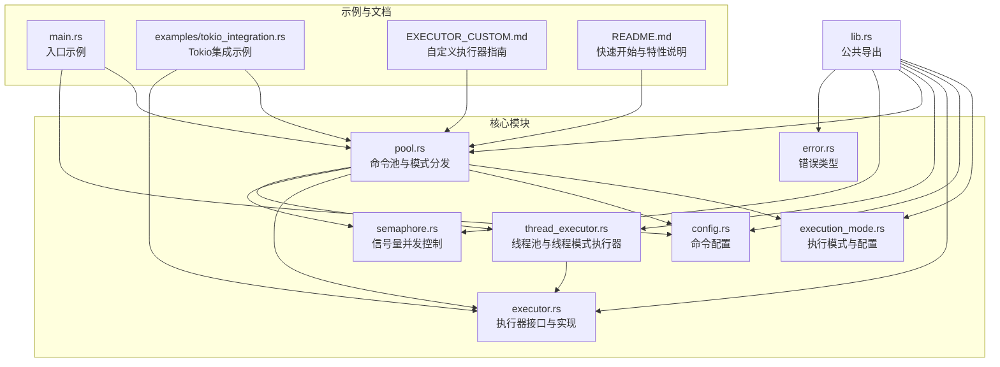
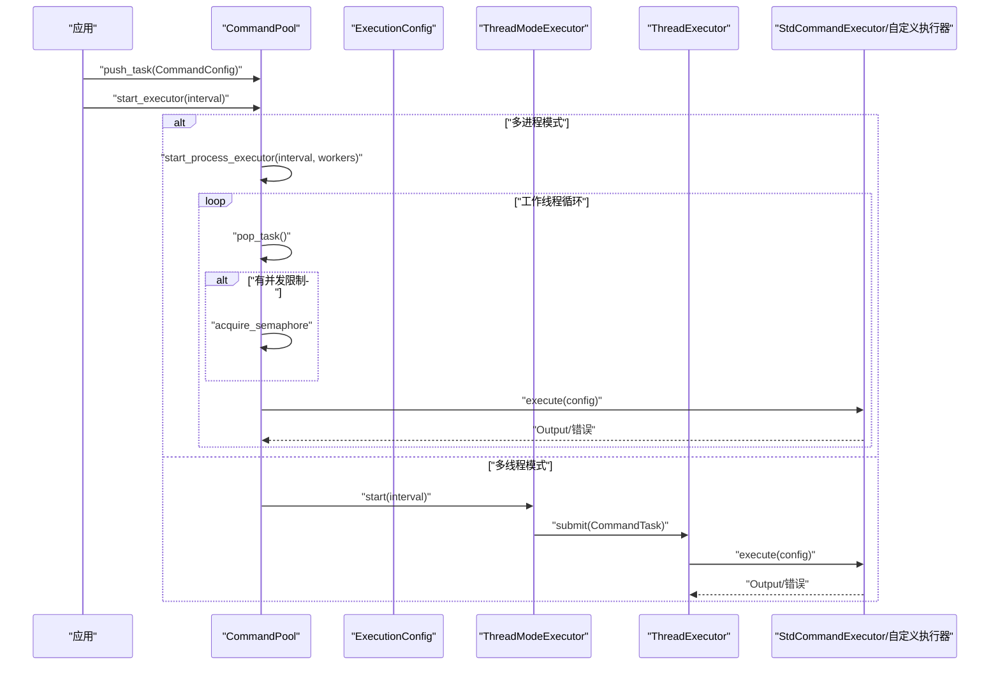
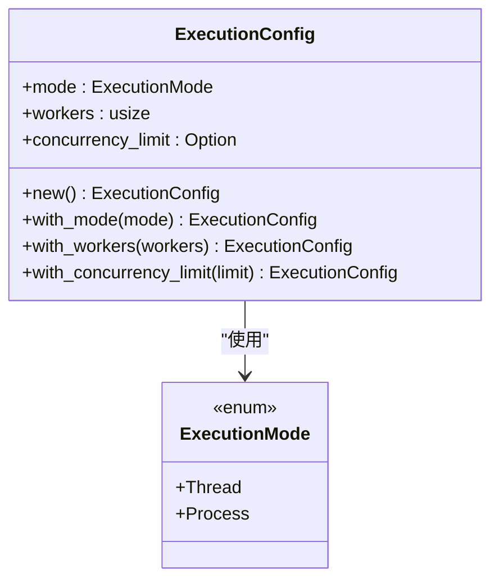
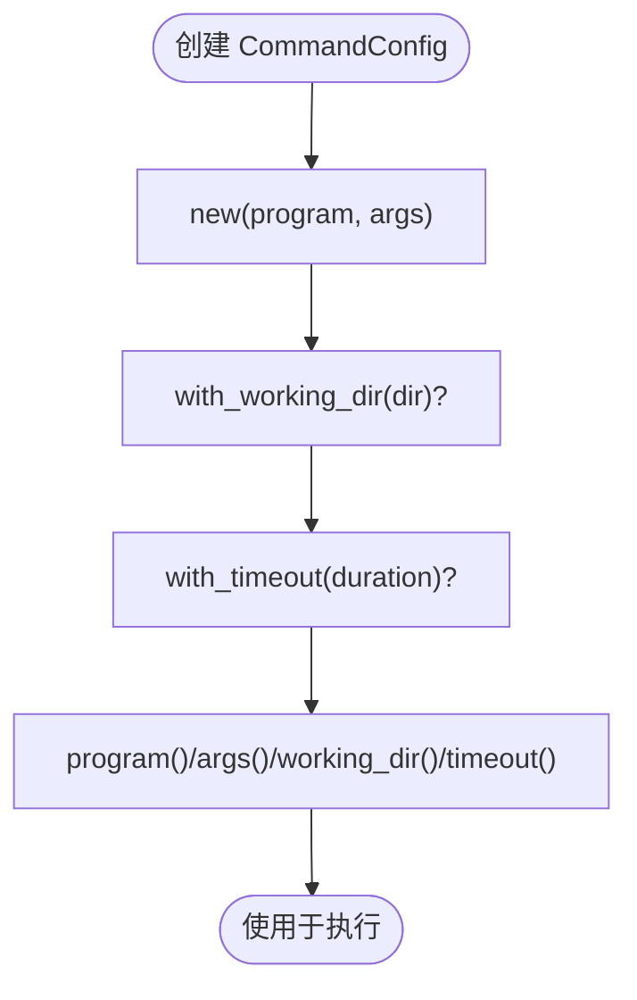
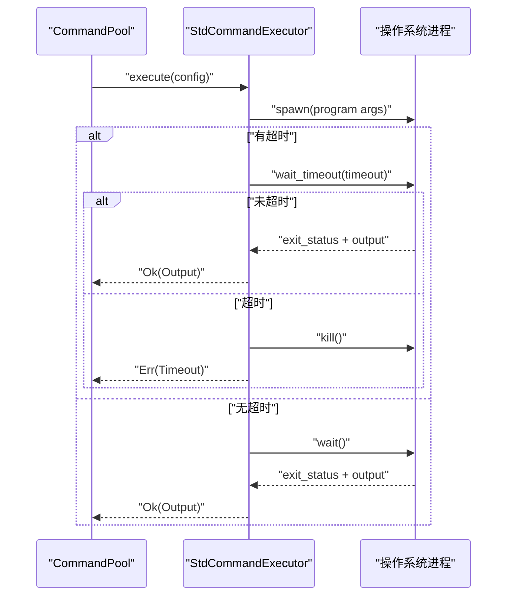
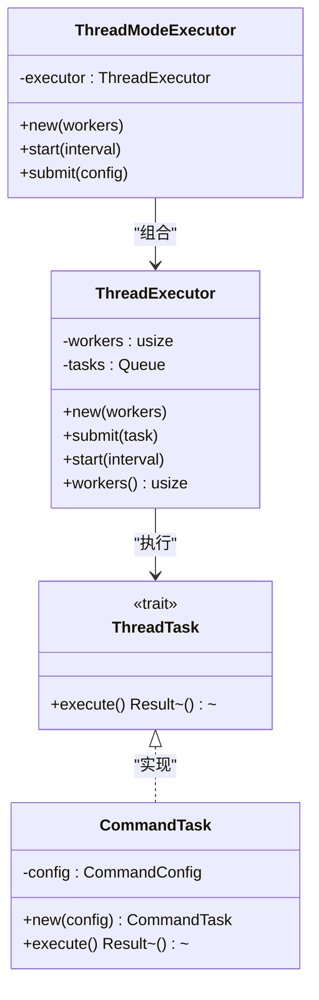
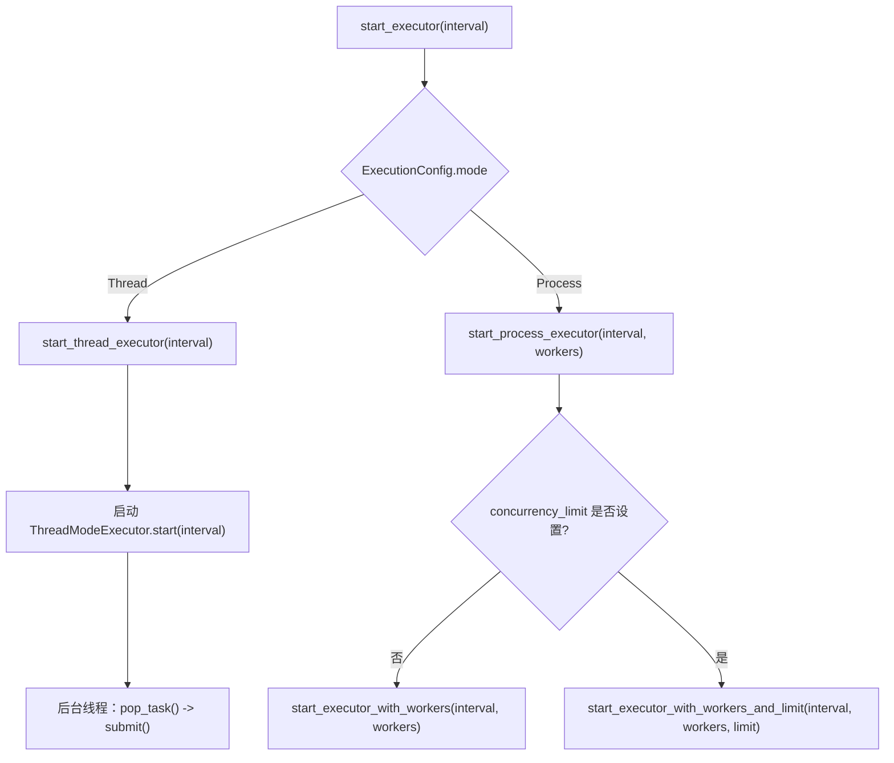
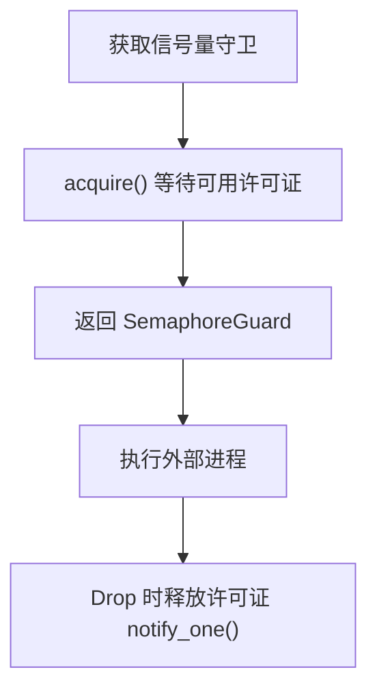
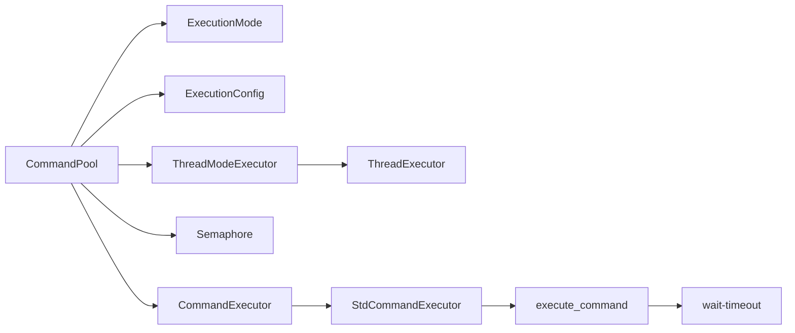

# 模式切换与配置

<cite>
**本文引用的文件**
- [src/lib.rs](file://src/lib.rs)
- [src/main.rs](file://src/main.rs)
- [src/execution_mode.rs](file://src/execution_mode.rs)
- [src/config.rs](file://src/config.rs)
- [src/executor.rs](file://src/executor.rs)
- [src/thread_executor.rs](file://src/thread_executor.rs)
- [src/pool.rs](file://src/pool.rs)
- [src/error.rs](file://src/error.rs)
- [src/semaphore.rs](file://src/semaphore.rs)
- [examples/tokio_integration.rs](file://examples/tokio_integration.rs)
- [EXECUTOR_CUSTOM.md](file://EXECUTOR_CUSTOM.md)
- [tests/config_tests.rs](file://tests/config_tests.rs)
- [tests/pool_tests.rs](file://tests/pool_tests.rs)
- [Cargo.toml](file://Cargo.toml)
- [README.md](file://README.md)
</cite>

## 目录
1. [简介](#简介)
2. [项目结构](#项目结构)
3. [核心组件](#核心组件)
4. [架构总览](#架构总览)
5. [详细组件分析](#详细组件分析)
6. [依赖关系分析](#依赖关系分析)
7. [性能考量](#性能考量)
8. [故障排查指南](#故障排查指南)
9. [结论](#结论)
10. [附录](#附录)

## 简介
本文件围绕“执行模式切换与配置”主题，系统性阐述如何在多线程模式与多进程模式之间进行切换，涵盖配置参数的设置、动态切换机制、ExecutionConfig 结构体字段含义与配置方法、模式选择的决策指南（性能对比、资源消耗与适用场景）、具体示例路径与最佳实践。目标是帮助开发者在不同业务场景下做出合理选择，并正确使用命令池与执行器。

## 项目结构
该项目采用模块化组织，核心模块如下：
- 执行模式与配置：execution_mode.rs
- 命令配置：config.rs
- 执行器接口与标准实现：executor.rs
- 线程池与线程模式执行器：thread_executor.rs
- 命令池与模式分发：pool.rs
- 信号量并发控制：semaphore.rs
- 错误类型：error.rs
- 示例与自定义执行器指南：examples/tokio_integration.rs、EXECUTOR_CUSTOM.md
- 公共导出：lib.rs
- 入口示例：main.rs
- 测试：tests/*.rs
- 依赖声明：Cargo.toml
- 说明文档：README.md

图表来源
- [src/lib.rs](file://src/lib.rs#L1-L17)
- [src/execution_mode.rs](file://src/execution_mode.rs#L1-L70)
- [src/config.rs](file://src/config.rs#L1-L109)
- [src/executor.rs](file://src/executor.rs#L1-L100)
- [src/thread_executor.rs](file://src/thread_executor.rs#L1-L148)
- [src/pool.rs](file://src/pool.rs#L1-L296)
- [src/semaphore.rs](file://src/semaphore.rs#L1-L53)
- [src/error.rs](file://src/error.rs#L1-L18)
- [src/main.rs](file://src/main.rs#L1-L48)
- [examples/tokio_integration.rs](file://examples/tokio_integration.rs#L1-L62)
- [EXECUTOR_CUSTOM.md](file://EXECUTOR_CUSTOM.md#L1-L228)
- [README.md](file://README.md#L1-L60)

章节来源
- [src/lib.rs](file://src/lib.rs#L1-L17)
- [README.md](file://README.md#L1-L60)

## 核心组件
- 执行模式与配置
  - ExecutionMode：多线程（Thread）与多进程（Process）两种模式
  - ExecutionConfig：包含 mode、workers、concurrency_limit 三个字段，支持链式构建
- 命令配置
  - CommandConfig：封装 program、args、working_dir、timeout 四个字段，支持链式设置
- 执行器
  - CommandExecutor trait：统一的命令执行接口
  - StdCommandExecutor：基于标准库 std::process 的同步实现
  - execute_command：内部函数，负责 spawn 子进程、重定向输出、超时处理
- 线程池与线程模式执行器
  - ThreadExecutor：共享内存的线程池，支持任务提交与轮询执行
  - ThreadModeExecutor：线程模式专用执行器，封装线程池
- 命令池
  - CommandPool：支持多线程与多进程两种模式的命令队列，提供多种启动方式
  - 支持自定义执行器注入与并发限制
- 信号量
  - Semaphore：基于 Mutex+Condvar 的简单计数信号量，用于限制并发外部进程数量
- 错误类型
  - ExecuteError：包含 IO 错误、超时、子进程异常等

章节来源
- [src/execution_mode.rs](file://src/execution_mode.rs#L1-L70)
- [src/config.rs](file://src/config.rs#L1-L109)
- [src/executor.rs](file://src/executor.rs#L1-L100)
- [src/thread_executor.rs](file://src/thread_executor.rs#L1-L148)
- [src/pool.rs](file://src/pool.rs#L1-L296)
- [src/semaphore.rs](file://src/semaphore.rs#L1-L53)
- [src/error.rs](file://src/error.rs#L1-L18)

## 架构总览
命令池在启动时根据 ExecutionConfig 的 mode 字段选择执行策略：
- 多进程模式：启动固定数量的工作线程，每线程循环从队列取任务并执行；可选并发限制（信号量）
- 多线程模式：创建线程模式执行器，后台线程将队列中的任务转发给线程池执行；线程池内部仍通过子进程执行命令

图表来源
- [src/pool.rs](file://src/pool.rs#L134-L143)
- [src/pool.rs](file://src/pool.rs#L145-L163)
- [src/pool.rs](file://src/pool.rs#L165-L172)
- [src/pool.rs](file://src/pool.rs#L174-L187)
- [src/pool.rs](file://src/pool.rs#L189-L210)
- [src/thread_executor.rs](file://src/thread_executor.rs#L112-L137)
- [src/executor.rs](file://src/executor.rs#L18-L24)

## 详细组件分析

### ExecutionConfig 与 ExecutionMode
- ExecutionMode
  - Thread：在同一进程内使用多个线程执行任务，线程间共享内存，适合计算密集型或需要共享状态的任务
  - Process：为每个命令启动独立子进程，隔离性更好，适合 I/O 密集或需要强隔离的场景
- ExecutionConfig
  - mode：执行模式，默认多进程
  - workers：工作线程数（多进程）或工作进程数（多线程），默认取系统可用并行度
  - concurrency_limit：可选的并发限制，用于限制同时执行的外部进程数量，防止资源耗尽
  - 提供 with_mode、with_workers、with_concurrency_limit 链式构建方法

图表来源
- [src/execution_mode.rs](file://src/execution_mode.rs#L5-L13)
- [src/execution_mode.rs](file://src/execution_mode.rs#L24-L32)
- [src/execution_mode.rs](file://src/execution_mode.rs#L34-L63)

章节来源
- [src/execution_mode.rs](file://src/execution_mode.rs#L1-L70)

### CommandConfig
- 字段
  - program：可执行程序名或路径
  - args：参数列表
  - working_dir：可选工作目录
  - timeout：可选超时时间
- 方法
  - new：创建默认配置（默认超时 10 秒）
  - with_working_dir：设置工作目录
  - with_timeout：设置超时
  - program/args/working_dir/timeout：读取器

图表来源
- [src/config.rs](file://src/config.rs#L39-L46)
- [src/config.rs](file://src/config.rs#L63-L66)
- [src/config.rs](file://src/config.rs#L84-L87)
- [src/config.rs](file://src/config.rs#L90-L107)

章节来源
- [src/config.rs](file://src/config.rs#L1-L109)

### 执行器接口与标准实现
- CommandExecutor trait
  - execute(config): 统一的命令执行接口，支持不同运行时（std、tokio 等）
- StdCommandExecutor
  - 基于 std::process::Command 的同步实现
- execute_command
  - 启动子进程、重定向 stdout/stderr、根据 working_dir 设置当前目录
  - 根据 timeout 使用 wait-timeout 进行超时等待；超时则尝试 kill 子进程并返回 Timeout 错误

图表来源
- [src/executor.rs](file://src/executor.rs#L18-L24)
- [src/executor.rs](file://src/executor.rs#L30-L70)

章节来源
- [src/executor.rs](file://src/executor.rs#L1-L100)

### 线程池与线程模式执行器
- ThreadExecutor
  - 管理共享内存的任务队列，启动多个工作线程定期轮询并执行任务
  - submit：提交任务
  - start：启动工作线程，按 interval 轮询
- CommandTask
  - 将 CommandConfig 包装为可执行任务
- ThreadModeExecutor
  - 封装 ThreadExecutor，提供 submit/start 接口

图表来源
- [src/thread_executor.rs](file://src/thread_executor.rs#L8-L14)
- [src/thread_executor.rs](file://src/thread_executor.rs#L91-L110)
- [src/thread_executor.rs](file://src/thread_executor.rs#L16-L24)
- [src/thread_executor.rs](file://src/thread_executor.rs#L112-L137)

章节来源
- [src/thread_executor.rs](file://src/thread_executor.rs#L1-L148)

### 命令池与模式分发
- CommandPool
  - with_config：根据 ExecutionConfig 初始化，若为 Thread 模式则创建 ThreadModeExecutor
  - start_executor：根据 mode 分发到线程模式或进程模式执行器
  - start_thread_executor：启动线程模式执行器并转发任务
  - start_process_executor：根据是否存在并发限制选择启动策略
  - start_executor_with_workers：固定 workers 数的进程模式执行器
  - start_executor_with_workers_and_limit：带并发限制的进程模式执行器
  - execute_task：调用 execute_command 执行单个任务
  - 支持自定义执行器注入与并发限制

图表来源
- [src/pool.rs](file://src/pool.rs#L134-L143)
- [src/pool.rs](file://src/pool.rs#L145-L163)
- [src/pool.rs](file://src/pool.rs#L165-L172)
- [src/pool.rs](file://src/pool.rs#L174-L187)
- [src/pool.rs](file://src/pool.rs#L189-L210)

章节来源
- [src/pool.rs](file://src/pool.rs#L1-L296)

### 并发限制与信号量
- Semaphore
  - 提供 acquire 与 acquire_guard 两种获取方式
  - acquire_guard 基于 RAII，在作用域结束时自动释放许可证
  - 通过 Mutex+Condvar 实现阻塞等待与通知

图表来源
- [src/semaphore.rs](file://src/semaphore.rs#L16-L43)
- [src/semaphore.rs](file://src/semaphore.rs#L45-L52)

章节来源
- [src/semaphore.rs](file://src/semaphore.rs#L1-L53)

### 错误处理
- ExecuteError
  - Io：底层 IO 错误
  - Timeout：超时错误，携带超时时间
  - Child：子进程异常信息

章节来源
- [src/error.rs](file://src/error.rs#L1-L18)

### 示例与自定义执行器
- tokio_integration.rs
  - 展示如何实现 CommandExecutor trait 使用 Tokio 运行时
  - 支持超时控制与错误处理
- EXECUTOR_CUSTOM.md
  - 详细介绍如何实现自定义执行器
  - 提供基础用法、工作线程数、并发限制等示例

章节来源
- [examples/tokio_integration.rs](file://examples/tokio_integration.rs#L1-L62)
- [EXECUTOR_CUSTOM.md](file://EXECUTOR_CUSTOM.md#L1-L228)

## 依赖关系分析
- 模块耦合
  - CommandPool 依赖 ExecutionConfig、ExecutionMode、CommandExecutor、ThreadModeExecutor、Semaphore
  - ThreadModeExecutor 依赖 ThreadExecutor 与 CommandTask
  - execute_command 依赖 std::process 与 wait-timeout
- 外部依赖
  - thiserror：错误派生宏
  - crossbeam-queue：无锁队列（在 CommandPoolSeg 中使用）
  - wait-timeout：子进程超时等待

图表来源
- [src/pool.rs](file://src/pool.rs#L1-L12)
- [src/thread_executor.rs](file://src/thread_executor.rs#L1-L11)
- [src/executor.rs](file://src/executor.rs#L1-L4)
- [Cargo.toml](file://Cargo.toml#L6-L12)

章节来源
- [Cargo.toml](file://Cargo.toml#L1-L13)

## 性能考量
- 多线程模式（Thread）
  - 优点：线程间共享内存，适合需要共享状态或计算密集型任务；减少进程创建开销
  - 缺点：线程调度与锁竞争可能带来额外开销；隔离性不如多进程模式
  - 适用：CPU 密集、需要共享状态、低延迟场景
- 多进程模式（Process）
  - 优点：强隔离，稳定性好；可有效防止崩溃扩散
  - 缺点：进程创建与销毁开销较大；IPC 与共享状态较复杂
  - 适用：I/O 密集、需要强隔离、稳定性优先场景
- 并发限制
  - 使用信号量限制同时执行的外部进程数量，避免系统资源耗尽
- 超时与等待
  - 使用 wait-timeout 在单线程中等待，避免额外等待线程，降低系统开销

章节来源
- [src/executor.rs](file://src/executor.rs#L26-L70)
- [src/pool.rs](file://src/pool.rs#L189-L210)

## 故障排查指南
- 超时问题
  - 检查 CommandConfig 的 timeout 设置是否合理
  - 查看 ExecuteError::Timeout 的超时时间
- 进程无法终止
  - 确认超时后是否调用了 kill 并等待子进程退出
- 并发过高导致资源耗尽
  - 通过 concurrency_limit 限制并发数
- 线程模式任务未执行
  - 确认 ThreadModeExecutor.start(interval) 已启动
  - 检查任务是否成功提交至线程池

章节来源
- [src/error.rs](file://src/error.rs#L1-L18)
- [src/executor.rs](file://src/executor.rs#L56-L62)
- [src/pool.rs](file://src/pool.rs#L145-L163)

## 结论
- ExecutionConfig 提供了清晰的模式与资源配置入口，支持链式构建与默认值
- CommandPool 在启动时根据模式分发到线程或进程执行策略，兼顾灵活性与易用性
- 通过并发限制与信号量，可在高负载场景下保持系统稳定
- 建议优先使用多进程模式以获得更好的隔离性，必要时再考虑多线程模式

## 附录

### 配置参数详解与示例路径
- ExecutionConfig 字段
  - mode：ExecutionMode::Thread 或 ExecutionMode::Process
  - workers：工作线程/进程数
  - concurrency_limit：可选并发限制
  - 示例路径：[tests/pool_tests.rs](file://tests/pool_tests.rs#L46-L64)
- CommandConfig 字段
  - program/args/working_dir/timeout
  - 示例路径：[src/config.rs](file://src/config.rs#L39-L46)、[src/config.rs](file://src/config.rs#L63-L66)、[src/config.rs](file://src/config.rs#L84-L87)
- 启动执行器
  - 多进程模式：[src/pool.rs](file://src/pool.rs#L174-L187)
  - 多线程模式：[src/pool.rs](file://src/pool.rs#L145-L163)
  - 带并发限制：[src/pool.rs](file://src/pool.rs#L189-L210)
- 自定义执行器
  - Tokio 示例：[examples/tokio_integration.rs](file://examples/tokio_integration.rs#L21-L40)
  - 自定义执行器指南：[EXECUTOR_CUSTOM.md](file://EXECUTOR_CUSTOM.md#L33-L107)

### 模式选择决策指南
- 选择多线程模式的情况
  - 需要共享状态或内存数据
  - 计算密集型任务
  - 对延迟敏感且进程创建成本较高
- 选择多进程模式的情况
  - 需要强隔离与稳定性
  - I/O 密集或外部命令不稳定
  - 崩溃隔离与资源保护优先

### 最佳实践
- 合理设置 workers：根据 CPU 核心数与任务类型调整
- 使用并发限制：防止大量 I/O 密集任务导致资源耗尽
- 明确超时策略：为每个任务设置合理的 timeout
- 优先使用默认配置：ExecutionConfig::new() 提供合理的默认值
- 使用自定义执行器：在需要异步运行时或特殊执行策略时注入

章节来源
- [src/execution_mode.rs](file://src/execution_mode.rs#L34-L63)
- [src/pool.rs](file://src/pool.rs#L174-L187)
- [src/pool.rs](file://src/pool.rs#L189-L210)
- [EXECUTOR_CUSTOM.md](file://EXECUTOR_CUSTOM.md#L173-L179)