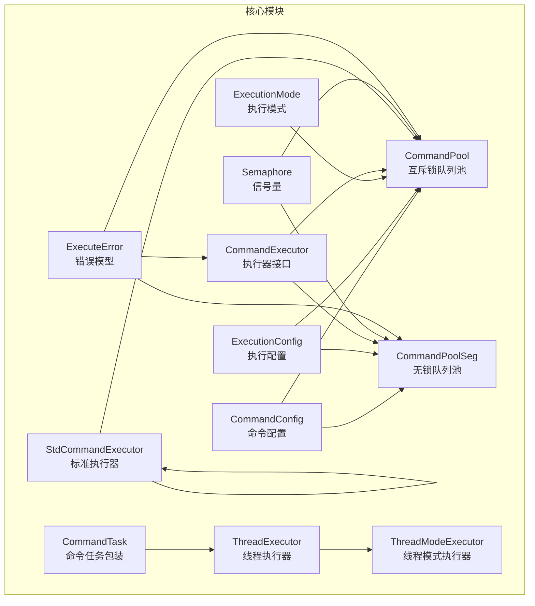
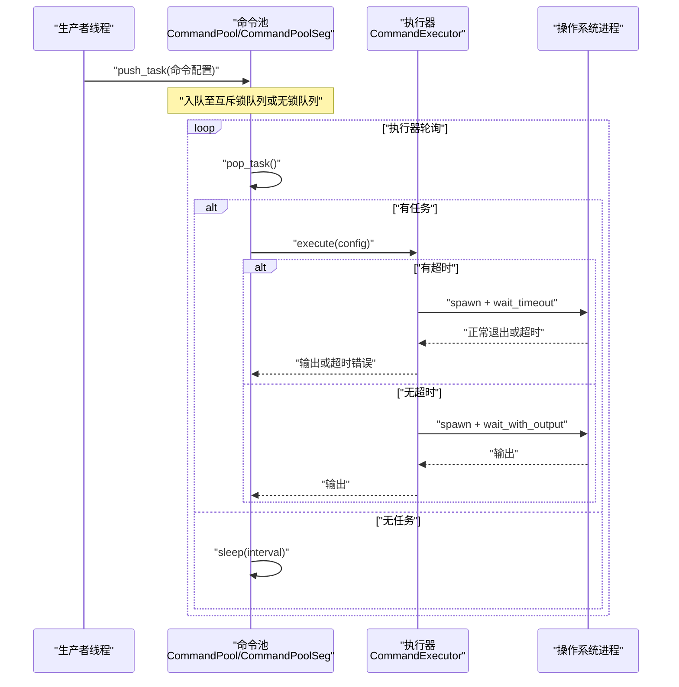
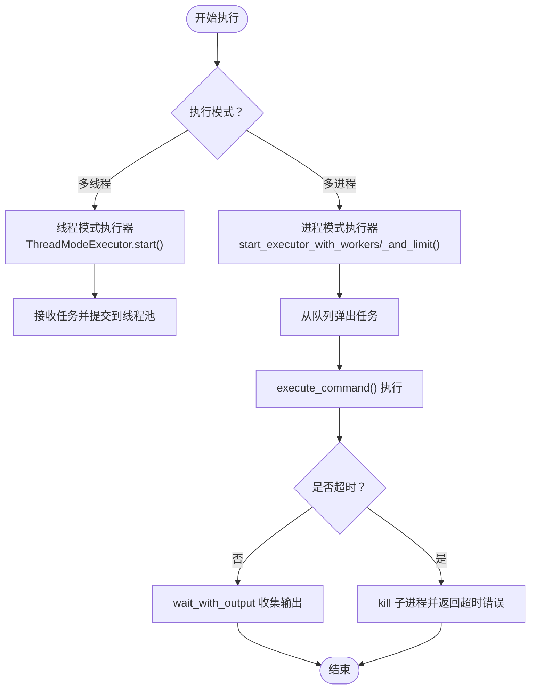
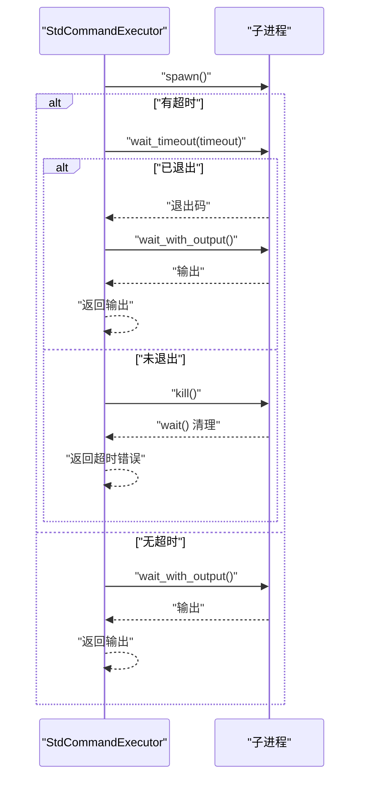
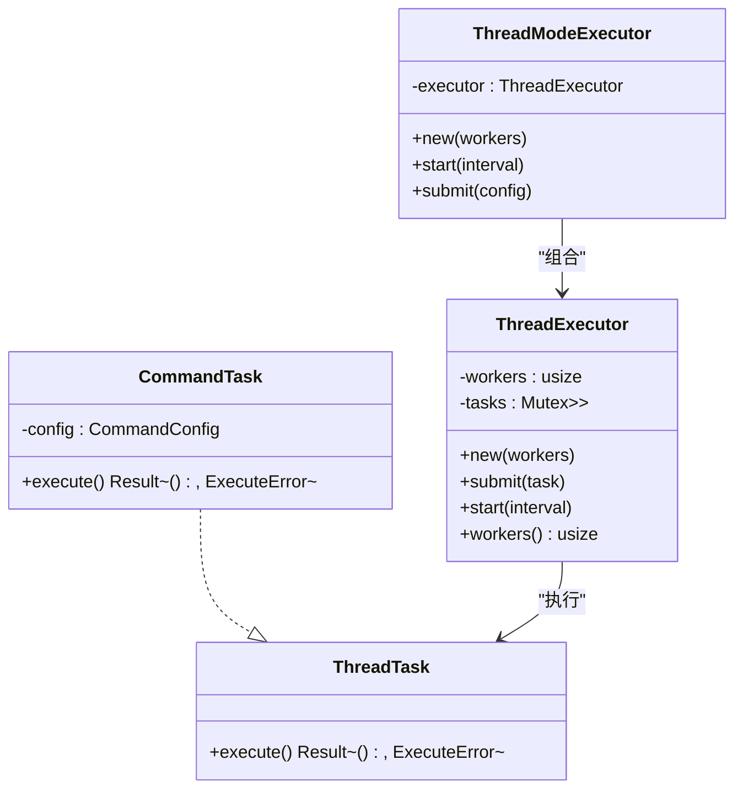
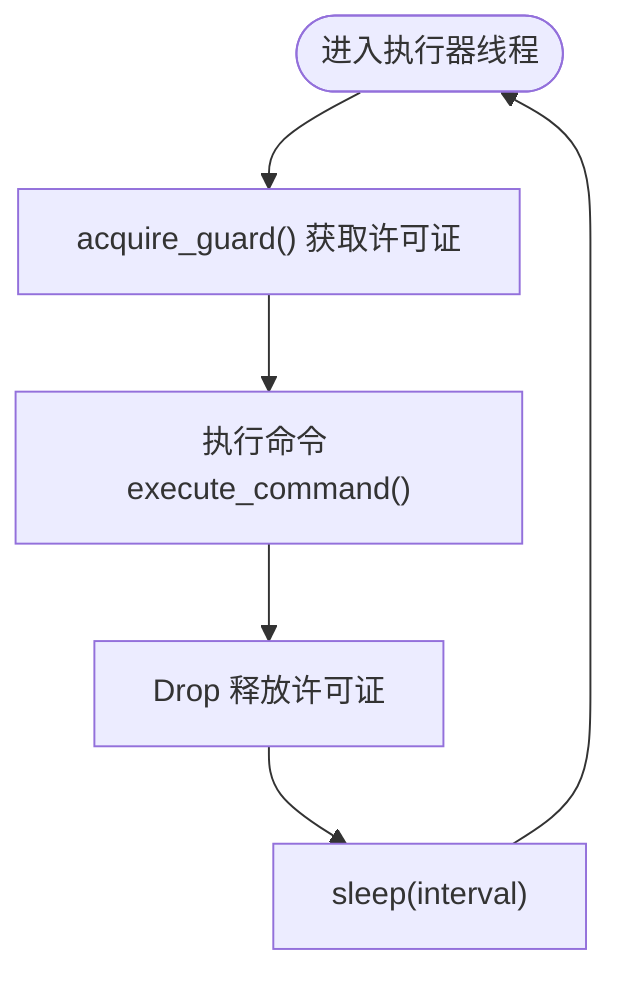
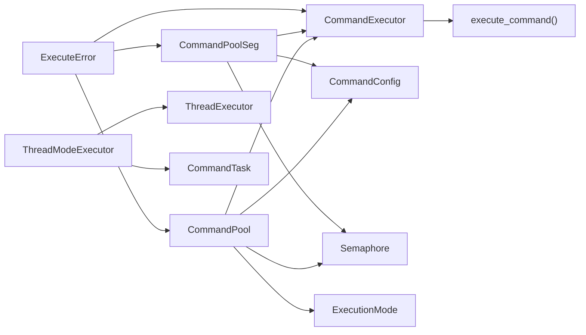

# 故障排除

<cite>
**本文引用的文件**
- [README.md](file://README.md)
- [src/lib.rs](file://src/lib.rs)
- [src/error.rs](file://src/error.rs)
- [src/main.rs](file://src/main.rs)
- [src/pool.rs](file://src/pool.rs)
- [src/pool_seg.rs](file://src/pool_seg.rs)
- [src/executor.rs](file://src/executor.rs)
- [src/thread_executor.rs](file://src/thread_executor.rs)
- [src/config.rs](file://src/config.rs)
- [src/execution_mode.rs](file://src/execution_mode.rs)
- [src/semaphore.rs](file://src/semaphore.rs)
- [examples/tokio_integration.rs](file://examples/tokio_integration.rs)
- [EXECUTOR_CUSTOM.md](file://EXECUTOR_CUSTOM.md)
- [benches/command_pool_bench.rs](file://benches/command_pool_bench.rs)
- [Cargo.toml](file://Cargo.toml)
</cite>

## 目录
1. [简介](#简介)
2. [项目结构](#项目结构)
3. [核心组件](#核心组件)
4. [架构总览](#架构总览)
5. [详细组件分析](#详细组件分析)
6. [依赖关系分析](#依赖关系分析)
7. [性能考量](#性能考量)
8. [故障排除指南](#故障排除指南)
9. [结论](#结论)
10. [附录](#附录)

## 简介
本指南面向开发者与运维人员，系统化梳理 execute 库在命令池执行过程中的常见问题、诊断方法、调试技巧与优化建议。内容覆盖错误类型与处理策略、性能问题排查、日志与监控最佳实践，以及快速定位问题的工具与方法。

## 项目结构
execute 是一个轻量的命令池库，提供可插拔的命令执行器、锁/无锁任务队列、线程池与并发限制策略。核心模块包括：
- 命令配置与执行模式：CommandConfig、ExecutionConfig、ExecutionMode
- 执行器接口与默认实现：CommandExecutor、StdCommandExecutor
- 两种命令池实现：基于互斥锁的 CommandPool 与基于无锁队列的 CommandPoolSeg
- 线程模式执行器：ThreadExecutor、ThreadModeExecutor、CommandTask
- 并发控制：Semaphore
- 错误模型：ExecuteError

图表来源
- [src/lib.rs](file://src/lib.rs#L1-L17)
- [src/config.rs](file://src/config.rs#L1-L109)
- [src/execution_mode.rs](file://src/execution_mode.rs#L1-L70)
- [src/executor.rs](file://src/executor.rs#L1-L100)
- [src/pool.rs](file://src/pool.rs#L1-L296)
- [src/pool_seg.rs](file://src/pool_seg.rs#L1-L157)
- [src/thread_executor.rs](file://src/thread_executor.rs#L1-L148)
- [src/semaphore.rs](file://src/semaphore.rs#L1-L53)
- [src/error.rs](file://src/error.rs#L1-L18)

章节来源
- [src/lib.rs](file://src/lib.rs#L1-L17)
- [README.md](file://README.md#L1-L60)

## 核心组件
- 命令配置 CommandConfig：封装程序名、参数、工作目录、超时等，支持链式设置。
- 执行模式 ExecutionConfig/ExecutionMode：支持多线程与多进程两种模式，可配置工作线程/进程数与并发限制。
- 执行器 CommandExecutor：抽象命令执行接口，标准实现 StdCommandExecutor。
- 命令池 CommandPool/CommandPoolSeg：提供任务入队、出队与执行器启动；后者基于无锁队列提升吞吐。
- 线程模式执行器 ThreadExecutor/ThreadModeExecutor/CommandTask：在线程池中执行命令任务。
- 并发控制 Semaphore：基于条件变量的轻量信号量，限制同时执行的外部进程数量。
- 错误模型 ExecuteError：统一表示 IO 错误、超时、子进程异常等。

章节来源
- [src/config.rs](file://src/config.rs#L1-L109)
- [src/execution_mode.rs](file://src/execution_mode.rs#L1-L70)
- [src/executor.rs](file://src/executor.rs#L1-L100)
- [src/pool.rs](file://src/pool.rs#L1-L296)
- [src/pool_seg.rs](file://src/pool_seg.rs#L1-L157)
- [src/thread_executor.rs](file://src/thread_executor.rs#L1-L148)
- [src/semaphore.rs](file://src/semaphore.rs#L1-L53)
- [src/error.rs](file://src/error.rs#L1-L18)

## 架构总览
下图展示命令池在不同模式下的执行路径与关键组件交互。

图表来源
- [src/pool.rs](file://src/pool.rs#L134-L288)
- [src/pool_seg.rs](file://src/pool_seg.rs#L56-L149)
- [src/executor.rs](file://src/executor.rs#L30-L70)
- [src/semaphore.rs](file://src/semaphore.rs#L16-L43)

## 详细组件分析

### 命令池与队列
- CommandPool：基于 Mutex<VecDeque> 的互斥锁队列，支持多线程安全入队与出队；提供多种启动方式，含并发限制。
- CommandPoolSeg：基于 crossbeam_queue::SegQueue 的无锁队列，适合高并发多生产者场景，减少锁竞争。

图表来源
- [src/pool.rs](file://src/pool.rs#L134-L288)
- [src/pool_seg.rs](file://src/pool_seg.rs#L56-L149)
- [src/executor.rs](file://src/executor.rs#L30-L70)

章节来源
- [src/pool.rs](file://src/pool.rs#L1-L296)
- [src/pool_seg.rs](file://src/pool_seg.rs#L1-L157)

### 执行器与超时控制
- CommandExecutor：抽象接口，StdCommandExecutor 基于标准库子进程执行。
- execute_command：统一的执行逻辑，使用 wait-timeout 在当前线程等待，避免额外等待线程，降低系统开销。
- 超时处理：超时后尝试杀死子进程并返回 ExecuteError::Timeout。

图表来源
- [src/executor.rs](file://src/executor.rs#L30-L70)
- [src/error.rs](file://src/error.rs#L8-L17)

章节来源
- [src/executor.rs](file://src/executor.rs#L1-L100)
- [src/error.rs](file://src/error.rs#L1-L18)

### 线程模式执行器
- ThreadExecutor：在共享进程内管理一组工作线程，执行 Box<dyn ThreadTask>。
- ThreadModeExecutor：封装线程执行器，负责启动与提交命令任务。
- CommandTask：将 CommandConfig 包装为可执行任务，内部仍通过 execute_command 执行外部命令。

图表来源
- [src/thread_executor.rs](file://src/thread_executor.rs#L8-L148)

章节来源
- [src/thread_executor.rs](file://src/thread_executor.rs#L1-L148)

### 并发限制与信号量
- Semaphore：基于 Mutex+Condvar 的简单计数信号量，提供 acquire 与 RAII 守护 SemaphoreGuard，自动释放许可证。
- 在进程模式下，通过在执行器线程中持有信号量守卫，限制同时执行的外部进程数量。

图表来源
- [src/semaphore.rs](file://src/semaphore.rs#L16-L53)
- [src/pool.rs](file://src/pool.rs#L190-L210)
- [src/pool_seg.rs](file://src/pool_seg.rs#L70-L91)

章节来源
- [src/semaphore.rs](file://src/semaphore.rs#L1-L53)
- [src/pool.rs](file://src/pool.rs#L165-L210)
- [src/pool_seg.rs](file://src/pool_seg.rs#L70-L91)

## 依赖关系分析
- 外部依赖：thiserror、crossbeam-queue、wait-timeout。
- 内部模块耦合：命令池依赖执行器接口、配置、执行模式与信号量；线程模式执行器依赖线程执行器与命令任务包装；错误模型贯穿各模块。

图表来源
- [src/pool.rs](file://src/pool.rs#L1-L296)
- [src/pool_seg.rs](file://src/pool_seg.rs#L1-L157)
- [src/executor.rs](file://src/executor.rs#L1-L100)
- [src/thread_executor.rs](file://src/thread_executor.rs#L1-L148)
- [src/error.rs](file://src/error.rs#L1-L18)

章节来源
- [Cargo.toml](file://Cargo.toml#L6-L12)
- [src/lib.rs](file://src/lib.rs#L1-L17)

## 性能考量
- 队列选择：在多生产者高并发场景优先使用 CommandPoolSeg 以减少锁竞争。
- 工作线程数：根据 CPU 核心数与任务类型调整 workers；I/O 密集可适当增加线程数。
- 并发限制：通过并发限制避免系统资源耗尽，特别是在大量 I/O 密集命令时。
- 超时等待：使用 wait-timeout 在当前线程等待，避免额外等待线程带来的开销。
- 基准测试：提供 Criterion 基准，可用于对比不同队列与模式的性能差异。

章节来源
- [src/pool_seg.rs](file://src/pool_seg.rs#L46-L51)
- [src/executor.rs](file://src/executor.rs#L28-L70)
- [benches/command_pool_bench.rs](file://benches/command_pool_bench.rs#L1-L93)

## 故障排除指南

### 一、错误类型与含义
- IO 错误：通常由 spawn、wait、读取输出等系统调用失败引发，检查权限、路径、环境变量与资源配额。
- 超时错误：wait-timeout 检测到命令未在指定时间内退出，系统尝试 kill 子进程；常见于长时间运行或死锁命令。
- 子进程错误：命令返回非零退出码或异常状态，需结合命令输出与业务语义判断。

章节来源
- [src/error.rs](file://src/error.rs#L8-L17)

### 二、常见问题与解决步骤

#### 1) 任务无法出队或执行器未消费
- 症状：任务持续堆积，队列不为空。
- 排查要点：
  - 确认执行器已启动且 interval 设置合理。
  - 检查执行模式是否正确（Process/Thread），线程模式需配合 ThreadModeExecutor。
  - 查看是否有并发限制导致执行器线程阻塞。
- 解决建议：
  - 使用 start_executor_with_workers 或 start_executor_with_workers_and_limit 明确工作线程数与并发限制。
  - 对于线程模式，确认 ThreadModeExecutor.start 已调用。

章节来源
- [src/pool.rs](file://src/pool.rs#L134-L172)
- [src/pool_seg.rs](file://src/pool_seg.rs#L56-L91)
- [src/thread_executor.rs](file://src/thread_executor.rs#L128-L136)

#### 2) 命令超时频繁发生
- 症状：大量 ExecuteError::Timeout。
- 排查要点：
  - 检查 CommandConfig.timeout 是否过短。
  - 观察命令本身是否阻塞或存在死循环。
  - 确认 wait-timeout 机制是否生效（当前线程等待）。
- 解决建议：
  - 适当增大超时时间或分批执行。
  - 优化命令逻辑，避免长时间阻塞。
  - 对 I/O 密集命令启用并发限制，防止资源争用。

章节来源
- [src/executor.rs](file://src/executor.rs#L42-L69)
- [src/config.rs](file://src/config.rs#L68-L87)

#### 3) 子进程无法终止导致资源泄漏
- 症状：超时后仍有僵尸进程或句柄未释放。
- 排查要点：
  - 确认 kill 调用是否成功，wait 是否清理子进程。
  - 检查操作系统对进程组/会话的限制。
- 解决建议：
  - 确保 wait-timeout 后调用 kill 并 wait 清理。
  - 在复杂场景下考虑使用进程组或超时策略增强。

章节来源
- [src/executor.rs](file://src/executor.rs#L56-L62)

#### 4) 线程模式下任务未被执行
- 症状：线程模式下任务未被线程池消费。
- 排查要点：
  - 确认 ThreadModeExecutor.submit 已被调用。
  - 检查 ThreadExecutor.start 是否启动，interval 是否过大。
- 解决建议：
  - 使用 ThreadModeExecutor.start(interval) 启动线程池。
  - 减小 interval，确保及时轮询任务队列。

章节来源
- [src/thread_executor.rs](file://src/thread_executor.rs#L128-L136)
- [src/pool.rs](file://src/pool.rs#L145-L162)

#### 5) 并发过高导致系统资源耗尽
- 症状：CPU/内存/文件描述符飙升，命令执行缓慢或失败。
- 排查要点：
  - 检查 workers 与 concurrency_limit 设置。
  - 观察信号量是否正确释放。
- 解决建议：
  - 通过 start_executor_with_workers_and_limit 或 start_executor_with_executor_and_limit 设置并发上限。
  - 降低 workers 或增加 limit，观察系统负载变化。

章节来源
- [src/pool.rs](file://src/pool.rs#L189-L210)
- [src/pool_seg.rs](file://src/pool_seg.rs#L70-L91)
- [src/semaphore.rs](file://src/semaphore.rs#L16-L53)

#### 6) 自定义执行器异常
- 症状：自定义 CommandExecutor.execute 返回错误或阻塞。
- 排查要点：
  - 检查运行时初始化与超时处理逻辑。
  - 确认与命令配置的 working_dir、args 传递正确。
- 解决建议：
  - 参考 tokio 集成示例，确保 block_on 或 async 调用正确。
  - 在示例基础上逐步替换为自定义实现，验证每一步。

章节来源
- [examples/tokio_integration.rs](file://examples/tokio_integration.rs#L21-L40)
- [EXECUTOR_CUSTOM.md](file://EXECUTOR_CUSTOM.md#L31-L107)

### 三、调试技巧与工具
- 日志输出：在生产者线程与执行器线程中打印任务入队/出队与执行结果，定位卡点。
- 基准测试：使用 benches 中的基准对比不同队列与模式的性能，识别瓶颈。
- 资源监控：观察 CPU、内存、文件描述符与进程数，结合并发限制参数分析。
- 超时策略：为关键命令设置合理超时，避免长时间阻塞影响整体吞吐。

章节来源
- [benches/command_pool_bench.rs](file://benches/command_pool_bench.rs#L1-L93)
- [src/main.rs](file://src/main.rs#L16-L47)

### 四、性能问题排查与优化
- 队列选择：多生产者高并发场景优先使用 CommandPoolSeg。
- 线程数调优：根据任务类型与硬件资源动态调整 workers。
- 并发限制：通过信号量限制外部进程数量，避免系统过载。
- 等待策略：使用 wait-timeout 避免额外等待线程，降低系统开销。

章节来源
- [src/pool_seg.rs](file://src/pool_seg.rs#L46-L51)
- [src/executor.rs](file://src/executor.rs#L42-L69)
- [src/semaphore.rs](file://src/semaphore.rs#L16-L53)

### 五、日志分析与监控最佳实践
- 结构化日志：记录任务 ID、命令、工作目录、超时、执行耗时与退出码。
- 分层监控：队列长度、执行器活跃度、超时率、错误分布。
- 告警阈值：设定队列长度、超时率、错误率的告警阈值，结合日志快速定位。

章节来源
- [src/pool.rs](file://src/pool.rs#L93-L116)
- [src/pool_seg.rs](file://src/pool_seg.rs#L28-L41)

## 结论
通过系统化的错误分类、诊断流程与优化策略，可有效提升命令池的稳定性与性能。建议在生产环境中结合日志与监控，配合合理的并发限制与队列选择，持续优化执行器参数与任务设计。

## 附录

### A. 快速定位清单
- 执行器是否启动且 interval 合理？
- 队列是否为空？是否使用了正确的池实现？
- 是否设置了并发限制？限制是否过严？
- 命令是否存在超时风险？是否需要放宽超时或拆分任务？
- 自定义执行器是否正确处理超时与错误？

### B. 参考示例与文档
- tokio 集成示例：examples/tokio_integration.rs
- 自定义执行器指南：EXECUTOR_CUSTOM.md
- 基准测试：benches/command_pool_bench.rs

章节来源
- [examples/tokio_integration.rs](file://examples/tokio_integration.rs#L1-L62)
- [EXECUTOR_CUSTOM.md](file://EXECUTOR_CUSTOM.md#L1-L228)
- [benches/command_pool_bench.rs](file://benches/command_pool_bench.rs#L1-L93)