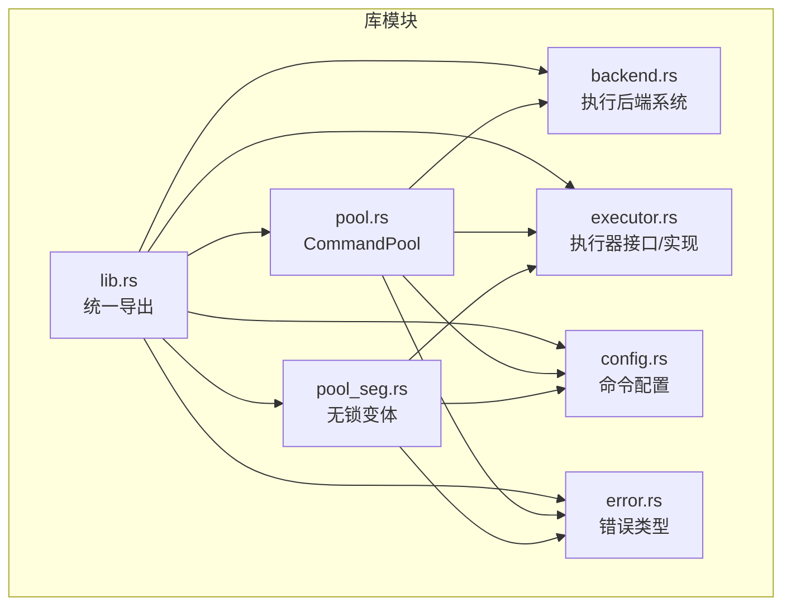
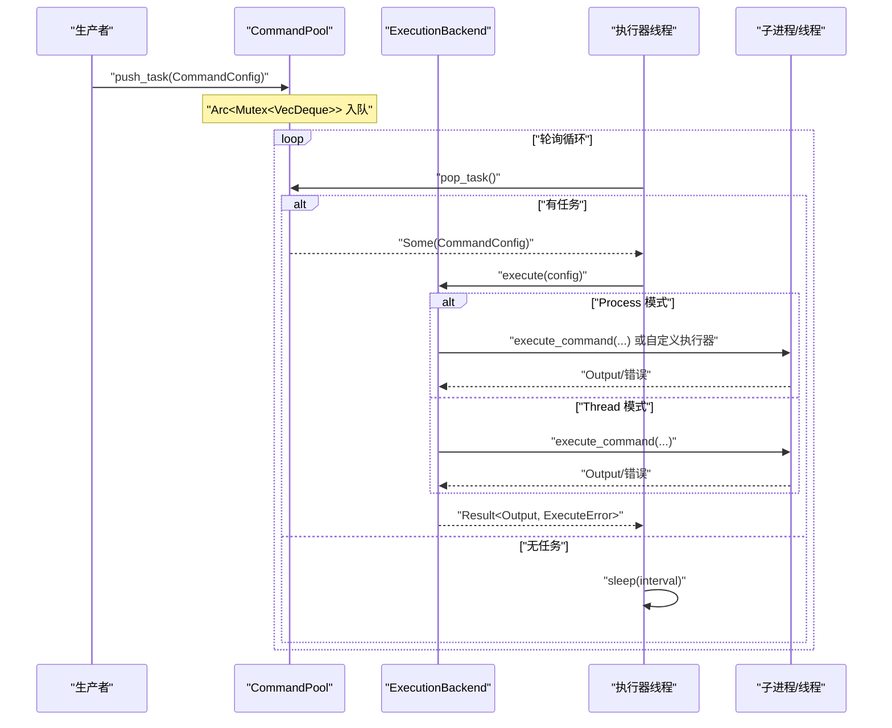
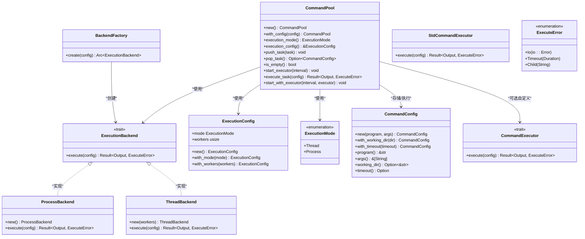
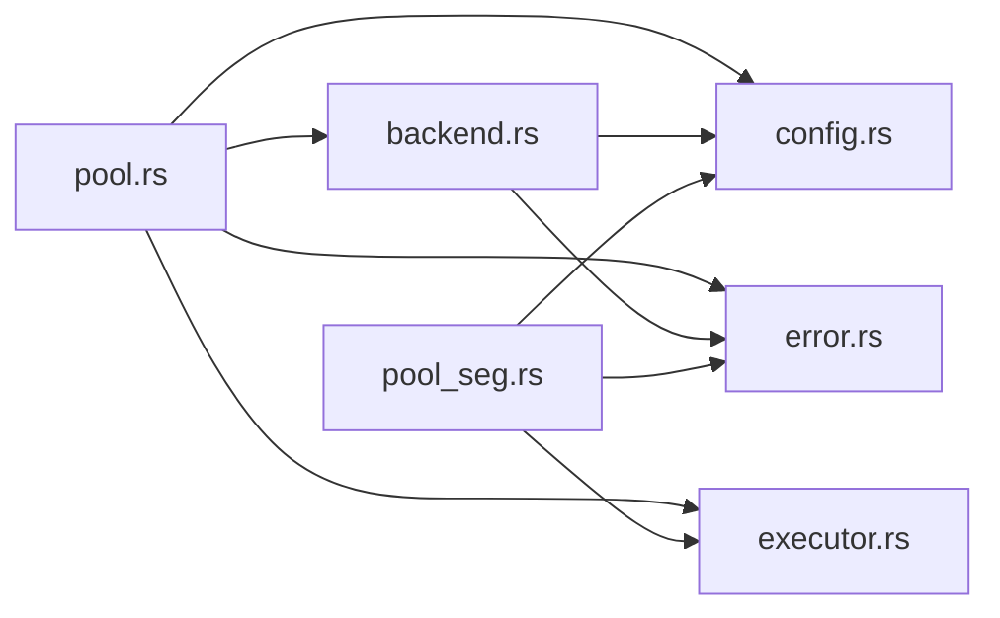

# CommandPool API

<cite>
**本文引用的文件**
- [src/lib.rs](file://src/lib.rs)
- [src/pool.rs](file://src/pool.rs)
- [src/backend.rs](file://src/backend.rs)
- [src/config.rs](file://src/config.rs)
- [src/error.rs](file://src/error.rs)
- [src/executor.rs](file://src/executor.rs)
- [src/pool_seg.rs](file://src/pool_seg.rs)
- [examples/tokio_integration.rs](file://examples/tokio_integration.rs)
- [tests/pool_tests.rs](file://tests/pool_tests.rs)
- [README.md](file://README.md)
- [Cargo.toml](file://Cargo.toml)
</cite>

## 目录
1. [简介](#简介)
2. [项目结构](#项目结构)
3. [核心组件](#核心组件)
4. [架构总览](#架构总览)
5. [详细组件分析](#详细组件分析)
6. [依赖关系分析](#依赖关系分析)
7. [性能考量](#性能考量)
8. [故障排查指南](#故障排查指南)
9. [结论](#结论)
10. [附录](#附录)

## 简介
本文件为 CommandPool API 的权威参考文档，面向使用者与维护者，系统性阐述 CommandPool 结构体的公共接口、数据模型、线程安全机制与内部工作原理，并提供使用示例、性能建议与最佳实践。CommandPool 提供命令队列与后台执行器，支持多线程与多进程两种执行模式，亦可通过自定义执行器扩展至异步运行时（如 Tokio）。**更新**：现在支持可插拔的执行后端系统，通过 ExecutionBackend trait 实现多种执行策略的抽象化。

## 项目结构
- 库入口导出：通过 lib.rs 统一导出对外 API（CommandPool、ExecutionConfig、ExecutionMode、CommandExecutor 等）。
- 核心实现：pool.rs 定义 CommandPool；backend.rs 定义执行后端系统；executor.rs 定义执行器接口与标准实现；config.rs 定义命令配置；error.rs 定义错误类型；semaphore.rs 提供并发限制信号量；pool_seg.rs 提供无锁队列变体。
- 示例与测试：examples/tokio_integration.rs 展示自定义执行器集成；tests/pool_tests.rs 验证基本行为。

**图表来源**
- [src/lib.rs](file://src/lib.rs#L1-L15)
- [src/pool.rs](file://src/pool.rs#L1-L120)
- [src/backend.rs](file://src/backend.rs#L1-L108)
- [src/pool_seg.rs](file://src/pool_seg.rs#L1-L157)
- [src/executor.rs](file://src/executor.rs#L1-L100)
- [src/config.rs](file://src/config.rs#L1-L109)
- [src/error.rs](file://src/error.rs#L1-L18)

**章节来源**
- [src/lib.rs](file://src/lib.rs#L1-L15)
- [README.md](file://README.md#L1-L60)

## 核心组件
- CommandPool：命令池，基于 Arc<Mutex<VecDeque<CommandConfig>>> 实现，支持多线程安全的任务入队与出队，**更新**：现在通过 ExecutionBackend 抽象层管理执行策略。
- ExecutionBackend：执行后端 trait，定义统一的命令执行接口，支持多种执行策略的抽象化。
- ExecutionConfig：执行配置，描述执行模式与工作线程数。
- ExecutionMode：执行模式枚举，支持 Thread 与 Process 两种模式。
- CommandConfig：命令配置，描述要执行的程序、参数、工作目录与超时。
- CommandExecutor：执行器接口，允许注入自定义执行器（如 Tokio）。
- ExecuteError：执行过程中的错误类型，包含 IO 错误、超时与子进程错误。
- Semaphore：基于 Mutex+Condvar 的简单计数信号量，用于限制外部进程并发数。

**章节来源**
- [src/pool.rs](file://src/pool.rs#L13-L120)
- [src/backend.rs](file://src/backend.rs#L7-L108)
- [src/config.rs](file://src/config.rs#L19-L109)
- [src/executor.rs](file://src/executor.rs#L5-L24)
- [src/error.rs](file://src/error.rs#L7-L18)

## 架构总览
CommandPool 的核心流程：
- 生产者将 CommandConfig 推入池（push_task），消费者线程周期性轮询（pop_task）并执行。
- **更新**：执行策略通过 ExecutionBackend 抽象层管理，根据 ExecutionConfig.mode 决定：
  - Process：多进程模式，使用 ProcessBackend 执行命令。
  - Thread：多线程模式，使用 ThreadBackend 执行命令。
- 自定义执行器：通过 CommandExecutor trait 注入任意运行时（如 Tokio），实现异步执行与超时控制。

**图表来源**
- [src/pool.rs](file://src/pool.rs#L60-L94)
- [src/backend.rs](file://src/backend.rs#L56-L95)
- [src/executor.rs](file://src/executor.rs#L26-L70)

## 详细组件分析

### CommandPool 结构体与公共方法
- 结构体字段
  - tasks: Arc<Mutex<VecDeque<CommandConfig>>>，存储待执行任务。
  - config: ExecutionConfig，执行模式与并发参数。
  - backend: Arc<dyn ExecutionBackend>，**新增**：执行后端抽象层。
- 关键方法
  - new(): 使用默认 ExecutionConfig 创建池。
  - with_config(config): 使用指定 ExecutionConfig 创建池。
  - execution_mode(): 返回当前执行模式。
  - execution_config(): 返回执行配置引用。
  - push_task(task): 将任务推入队尾。
  - pop_task(): 从队头弹出任务，若空返回 None。
  - is_empty(): 判断池是否为空。
  - start_executor(interval): 根据模式启动执行器。
  - execute_task(config): **更新**：通过 ExecutionBackend 执行单个任务。
  - start_with_executor/with_workers_and_executor/with_executor_and_limit: 使用自定义执行器的变体。

**章节来源**
- [src/pool.rs](file://src/pool.rs#L13-L113)

#### 方法详解与使用说明

- new()
  - 功能：创建默认的命令池（多进程模式）。
  - 参数：无。
  - 返回：CommandPool 实例。
  - 注意事项：默认工作线程数来自系统可用并行度。
  - 示例路径：[README 快速开始示例](file://README.md#L28-L37)

- with_config(config)
  - 功能：使用指定 ExecutionConfig 创建命令池。
  - 参数：ExecutionConfig。
  - 返回：CommandPool 实例。
  - **更新**：通过 BackendFactory 创建对应的 ExecutionBackend 实例。
  - 示例路径：[测试用例：线程模式创建](file://tests/pool_tests.rs#L36-L40)

- execution_mode()
  - 功能：查询当前执行模式。
  - 参数：无。
  - 返回：ExecutionMode。
  - 示例路径：[测试用例：默认模式为 Process](file://tests/pool_tests.rs#L29-L33)

- execution_config()
  - 功能：获取执行配置引用。
  - 参数：无。
  - 返回：&ExecutionConfig。
  - 示例路径：[测试用例：配置构建器模式](file://tests/pool_tests.rs#L47-L55)

- push_task(task)
  - 功能：将任务推入队尾。
  - 参数：CommandConfig。
  - 返回：无。
  - 线程安全：通过 Mutex 保护 VecDeque。
  - 示例路径：[README 快速开始示例](file://README.md#L30-L37)

- pop_task()
  - 功能：从队头弹出任务。
  - 参数：无。
  - 返回：Option<CommandConfig>。
  - 线程安全：通过 Mutex 保护 VecDeque。
  - 示例路径：[单元测试：push/pop/is_empty](file://tests/pool_tests.rs#L4-L14)

- is_empty()
  - 功能：判断池是否为空。
  - 参数：无。
  - 返回：bool。
  - 线程安全：通过 Mutex 保护 VecDeque。
  - 示例路径：[单元测试：push/pop/is_empty](file://tests/pool_tests.rs#L4-L14)

- start_executor(interval)
  - 功能：根据 ExecutionConfig.mode 启动执行器。
  - 参数：Duration。
  - 返回：无。
  - 线程安全：内部使用 Arc/Clone 传递共享状态。
  - **更新**：内部调用 start_thread_executor 或 start_process_executor，最终通过 ExecutionBackend 执行任务。
  - 示例路径：[README 快速开始示例](file://README.md#L30-L37)

- execute_task(config)
  - 功能：**更新**：通过 ExecutionBackend 执行单个任务。
  - 参数：&CommandConfig。
  - 返回：Result<Output, ExecuteError>。
  - **更新**：委托给 backend.execute(config)，支持多进程和多线程后端。
  - 示例路径：[基准测试：execute_true](file://benches/command_pool_bench.rs#L84-L96)

- start_with_executor/with_workers_and_executor/with_executor_and_limit
  - 功能：使用自定义 CommandExecutor 启动执行器。
  - 参数：Duration, Arc<E>（E: CommandExecutor）。
  - 返回：无。
  - 适用场景：集成 Tokio、async-std 等异步运行时。
  - 示例路径：[Tokio 集成示例](file://examples/tokio_integration.rs#L42-L61)

#### 线程安全与内部机制
- 互斥保护：VecDeque 通过 Arc<Mutex<_>> 保护，保证多线程安全的 push/pop。
- **更新**：后端抽象层：通过 ExecutionBackend trait 抽象化执行策略，BackendFactory 根据 ExecutionConfig.mode 创建对应的后端实例。
- 线程模式：当模式为 Thread 时，ThreadBackend 通过线程池执行命令，但底层仍使用 execute_command。
- 并发限制：通过 Semaphore 控制外部进程并发数，避免系统资源耗尽。
- 超时等待：execute_command 使用 wait-timeout 在当前线程等待，减少额外线程开销。

**章节来源**
- [src/pool.rs](file://src/pool.rs#L60-L94)
- [src/backend.rs](file://src/backend.rs#L7-L108)
- [src/executor.rs](file://src/executor.rs#L26-L70)

#### 使用示例与最佳实践
- 创建命令池与添加任务
  - 参考：[README 快速开始示例](file://README.md#L28-L37)
- 使用线程模式
  - 参考：[测试用例：线程模式创建](file://tests/pool_tests.rs#L36-L40)
- 使用自定义执行器（Tokio）
  - 参考：[Tokio 集成示例](file://examples/tokio_integration.rs#L42-L61)
- **新增**：自定义执行后端
  - 实现 ExecutionBackend trait，通过 BackendFactory.create(config) 注册新后端类型。
- 最佳实践
  - 选择合适的执行模式：CPU 密集型任务优先考虑 Thread 模式；I/O 密集型任务可考虑 Process 模式或自定义异步执行器。
  - 合理设置 workers：根据 CPU 核心数与任务特性调整工作线程数。
  - 并发限制：为外部进程设置合理的并发上限，避免系统资源耗尽。
  - 超时控制：为命令配置超时，防止长时间阻塞。

**章节来源**
- [README.md](file://README.md#L15-L49)
- [examples/tokio_integration.rs](file://examples/tokio_integration.rs#L42-L61)
- [tests/pool_tests.rs](file://tests/pool_tests.rs#L36-L55)

### 数据模型与类图

**图表来源**
- [src/pool.rs](file://src/pool.rs#L13-L113)
- [src/backend.rs](file://src/backend.rs#L7-L108)
- [src/config.rs](file://src/config.rs#L19-L109)
- [src/executor.rs](file://src/executor.rs#L5-L24)
- [src/error.rs](file://src/error.rs#L7-L18)

## 依赖关系分析
- 内部依赖
  - pool.rs 依赖 backend.rs、config.rs、error.rs、executor.rs。
  - backend.rs 依赖 config.rs、error.rs。
  - pool_seg.rs 依赖 config.rs、executor.rs、semaphore.rs。
- 外部依赖
  - wait-timeout：用于在当前线程等待子进程并处理超时。
  - crossbeam-queue：用于无锁队列变体。
  - thiserror：用于错误派生。

**图表来源**
- [src/pool.rs](file://src/pool.rs#L6-L9)
- [src/backend.rs](file://src/backend.rs#L4-L5)
- [src/pool_seg.rs](file://src/pool_seg.rs#L7-L9)
- [src/config.rs](file://src/config.rs#L1)
- [src/error.rs](file://src/error.rs#L1)

**章节来源**
- [Cargo.toml](file://Cargo.toml#L6-L12)
- [src/pool.rs](file://src/pool.rs#L6-L9)
- [src/pool_seg.rs](file://src/pool_seg.rs#L7-L9)

## 性能考量
- 队列选择
  - CommandPool：基于 Mutex<VecDeque>，适用于通用场景，简单可靠。
  - CommandPoolSeg：基于 crossbeam_queue::SegQueue，多生产者场景下吞吐更高，减少锁竞争。
- **更新**：执行后端性能
  - ProcessBackend：每个任务在独立子进程中执行，隔离性强，但进程创建/销毁开销较大。
  - ThreadBackend：共享内存，线程切换开销低，适合计算密集型或需要共享状态的任务。
- 并发限制
  - 使用 Semaphore 控制外部进程并发数，避免系统资源耗尽。
- 超时等待
  - execute_command 使用 wait-timeout 在当前线程等待，避免为每个任务生成额外等待线程，降低系统开销。
- 基准测试
  - 提供 push/pop、execute 等基准，可用于评估不同配置下的性能表现。

**章节来源**
- [README.md](file://README.md#L8-L13)
- [src/pool_seg.rs](file://src/pool_seg.rs#L11-L15)
- [src/backend.rs](file://src/backend.rs#L56-L95)
- [src/executor.rs](file://src/executor.rs#L26-L70)

## 故障排查指南
- 常见错误类型
  - ExecuteError::Io：IO 错误，通常由 spawn/wait 等系统调用失败引起。
  - ExecuteError::Timeout：命令执行超时，检查超时设置与命令本身耗时。
  - ExecuteError::Child：子进程状态异常，检查命令返回码与日志。
- 排查步骤
  - 检查命令是否存在且可执行。
  - 检查工作目录与参数是否正确。
  - 调整超时时间或并发限制。
  - 使用 is_empty() 与 pop_task() 验证队列状态。
  - **更新**：检查 ExecutionConfig.mode 与对应的 ExecutionBackend 实现。
- 相关实现
  - 错误类型定义与派生：参见 [error.rs](file://src/error.rs#L7-L18)。
  - 超时等待与错误处理：参见 [executor.rs](file://src/executor.rs#L26-L70)。

**章节来源**
- [src/error.rs](file://src/error.rs#L7-L18)
- [src/executor.rs](file://src/executor.rs#L26-L70)
- [tests/pool_tests.rs](file://tests/pool_tests.rs#L4-L14)

## 结论
CommandPool 提供了简洁而强大的命令队列与执行框架，支持多线程与多进程两种执行模式，并可通过自定义执行器扩展到异步运行时。**更新**：新的执行后端系统通过 ExecutionBackend 抽象层实现了更好的可扩展性，支持多种执行策略的统一管理。其线程安全设计、并发限制与超时控制使其在实际工程中具备良好的稳定性与可扩展性。建议根据任务特性选择合适的执行模式与并发参数，并结合基准测试持续优化性能。

## 附录
- API 一览
  - new(), with_config(), execution_mode(), execution_config(), push_task(), pop_task(), is_empty(), start_executor(), execute_task(), start_with_executor()/with_workers_and_executor()/with_executor_and_limit()
- **新增**：后端系统 API
  - ExecutionBackend trait, ExecutionConfig, ExecutionMode, ProcessBackend, ThreadBackend, BackendFactory
- 相关文件
  - [README.md](file://README.md#L1-L60)
  - [examples/tokio_integration.rs](file://examples/tokio_integration.rs#L1-L62)
  - [tests/pool_tests.rs](file://tests/pool_tests.rs#L1-L56)