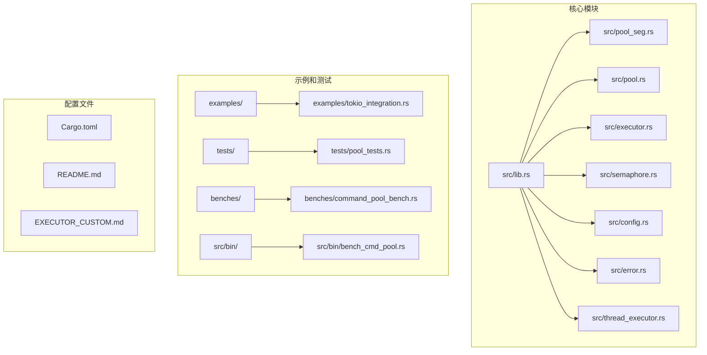
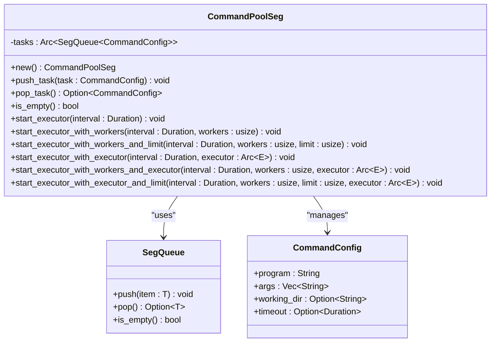
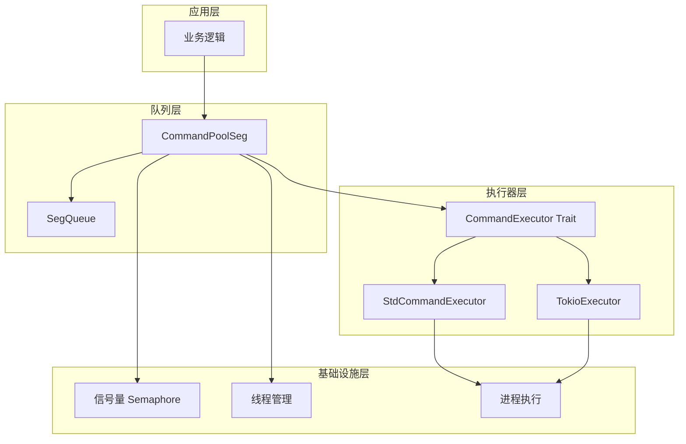
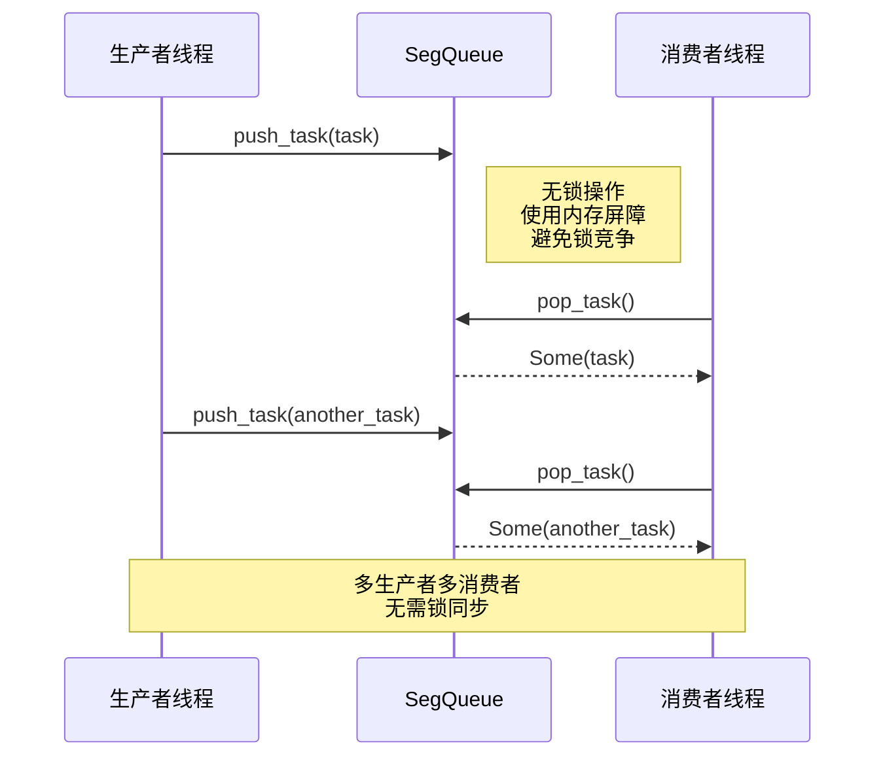
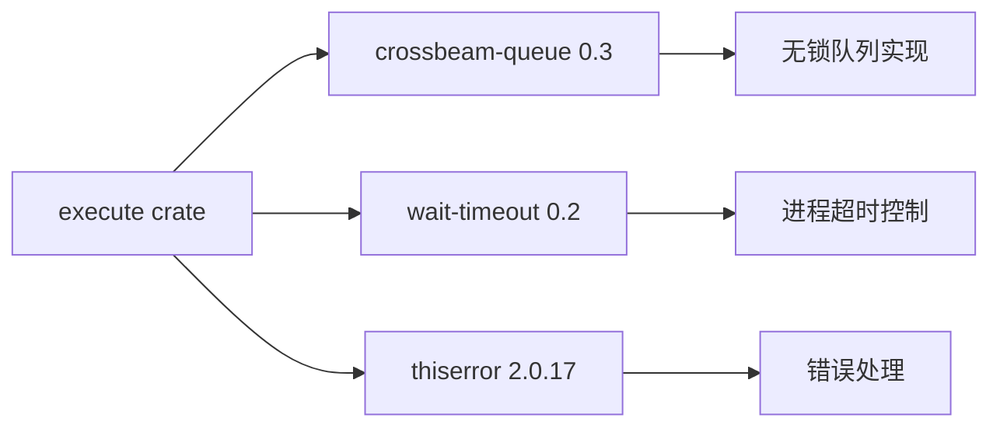
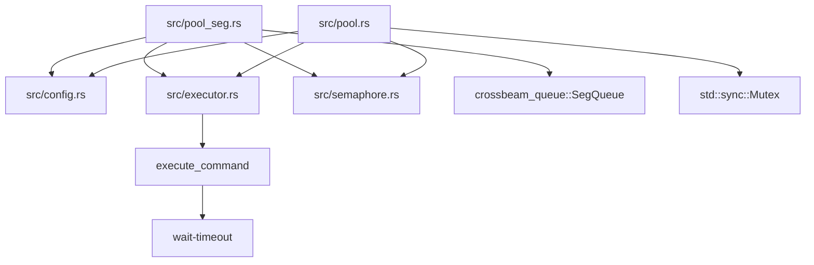
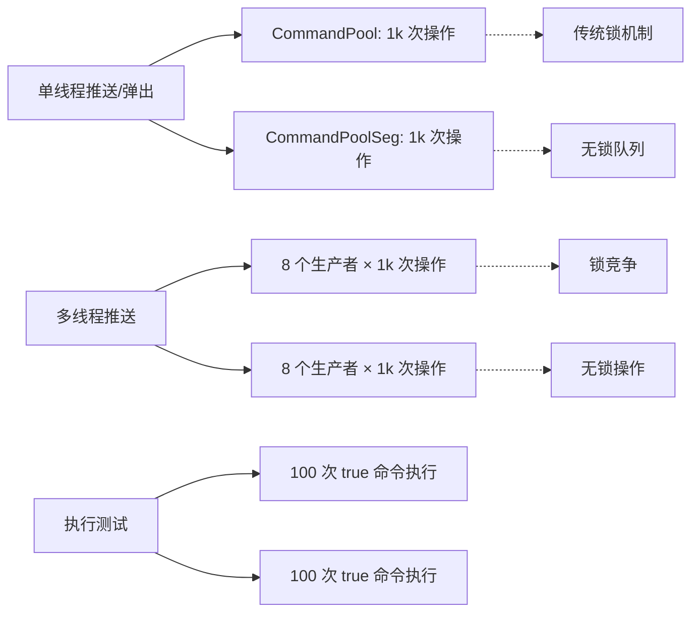

# CommandPoolSeg API

<cite>
**本文档引用的文件**
- [src/lib.rs](file://src/lib.rs)
- [src/pool_seg.rs](file://src/pool_seg.rs)
- [src/pool.rs](file://src/pool.rs)
- [src/executor.rs](file://src/executor.rs)
- [src/semaphore.rs](file://src/semaphore.rs)
- [src/config.rs](file://src/config.rs)
- [src/error.rs](file://src/error.rs)
- [src/thread_executor.rs](file://src/thread_executor.rs)
- [examples/tokio_integration.rs](file://examples/tokio_integration.rs)
- [EXECUTOR_CUSTOM.md](file://EXECUTOR_CUSTOM.md)
- [benches/command_pool_bench.rs](file://benches/command_pool_bench.rs)
- [src/bin/bench_cmd_pool.rs](file://src/bin/bench_cmd_pool.rs)
- [tests/pool_tests.rs](file://tests/pool_tests.rs)
- [README.md](file://README.md)
- [Cargo.toml](file://Cargo.toml)
</cite>

## 目录
1. [简介](#简介)
2. [项目结构](#项目结构)
3. [核心组件](#核心组件)
4. [架构概览](#架构概览)
5. [详细组件分析](#详细组件分析)
6. [依赖关系分析](#依赖关系分析)
7. [性能考量](#性能考量)
8. [故障排除指南](#故障排除指南)
9. [结论](#结论)
10. [附录](#附录)

## 简介

CommandPoolSeg 是一个基于无锁队列（SegQueue）的命令池实现，专为高并发场景设计。与传统的基于互斥锁的 CommandPool 相比，CommandPoolSeg 提供了更高的并发吞吐量，特别是在多生产者场景下表现尤为突出。

### 主要特性

- **无锁队列实现**：使用 `crossbeam_queue::SegQueue` 提供高性能的并发访问
- **多生产者优化**：避免了锁竞争，特别适合高并发生产者环境
- **灵活的执行器支持**：支持标准库执行器和自定义执行器（如 Tokio）
- **并发限制**：内置信号量机制控制同时执行的外部进程数量
- **自动线程管理**：支持自动检测 CPU 核心数并启动相应的工作线程

## 项目结构

该项目采用模块化设计，主要包含以下核心模块：



**图表来源**
- [src/lib.rs](file://src/lib.rs#L1-L17)
- [src/pool_seg.rs](file://src/pool_seg.rs#L1-L157)
- [src/pool.rs](file://src/pool.rs#L1-L296)

**章节来源**
- [src/lib.rs](file://src/lib.rs#L1-L17)
- [Cargo.toml](file://Cargo.toml#L1-L13)

## 核心组件

### CommandPoolSeg 结构体

CommandPoolSeg 是基于无锁队列的命令池实现，其核心结构如下：



**图表来源**
- [src/pool_seg.rs](file://src/pool_seg.rs#L16-L150)
- [src/pool_seg.rs](file://src/pool_seg.rs#L17-L25)

### 关键接口说明

| 方法名 | 参数 | 返回值 | 描述 |
|--------|------|--------|------|
| `new()` | 无 | `CommandPoolSeg` | 创建新的无锁命令池实例 |
| `push_task(task)` | `CommandConfig` | `void` | 无阻塞地推送任务到队列 |
| `pop_task()` | 无 | `Option<CommandConfig>` | 无阻塞地从队列弹出任务 |
| `is_empty()` | 无 | `bool` | 检查队列是否为空 |
| `start_executor(interval)` | `Duration` | `void` | 启动自动线程数的执行器 |
| `start_executor_with_workers(interval, workers)` | `Duration, usize` | `void` | 启动固定线程数的执行器 |

**章节来源**
- [src/pool_seg.rs](file://src/pool_seg.rs#L20-L150)

## 架构概览

CommandPoolSeg 采用了分层架构设计，实现了清晰的关注点分离：



**图表来源**
- [src/pool_seg.rs](file://src/pool_seg.rs#L1-L157)
- [src/executor.rs](file://src/executor.rs#L9-L24)
- [src/semaphore.rs](file://src/semaphore.rs#L7-L43)

## 详细组件分析

### 无锁队列实现原理

CommandPoolSeg 的核心优势在于其无锁队列实现。让我们深入分析其实现机制：



**图表来源**
- [src/pool_seg.rs](file://src/pool_seg.rs#L29-L36)
- [src/pool_seg.rs](file://src/pool_seg.rs#L56-L67)

### 线程安全保证机制

虽然使用了无锁队列，但 CommandPoolSeg 通过以下机制确保线程安全：

1. **Arc 包装**：所有共享状态都通过 `Arc` 进行引用计数管理
2. **SegQueue 原语**：底层使用跨线程安全的无锁队列原语
3. **原子操作**：内部使用原子操作确保状态一致性

### 执行器启动流程

```mermaid
flowchart TD
A[调用 start_executor] --> B[检测 CPU 核心数]
B --> C[计算工作线程数]
C --> D[创建线程池]
D --> E[每个线程循环执行]
E --> F{队列是否为空?}
F --> |否| G[pop_task 并执行]
G --> H[execute_command]
H --> F
F --> |是| I[sleep(interval)]
I --> E
```

**图表来源**
- [src/pool_seg.rs](file://src/pool_seg.rs#L46-L67)
- [src/pool_seg.rs](file://src/pool_seg.rs#L112-L123)

**章节来源**
- [src/pool_seg.rs](file://src/pool_seg.rs#L11-L157)

### 与标准 CommandPool 的对比

| 特性 | CommandPool (Mutex) | CommandPoolSeg (无锁) |
|------|-------------------|---------------------|
| **锁机制** | Mutex 锁 | 无锁队列 |
| **性能** | 中等 | 高 |
| **锁竞争** | 存在 | 不存在 |
| **内存开销** | 较低 | 适中 |
| **复杂度** | 简单 | 中等 |
| **适用场景** | 一般应用 | 高并发应用 |

**章节来源**
- [src/pool_seg.rs](file://src/pool_seg.rs#L13-L14)
- [src/pool.rs](file://src/pool.rs#L13-L21)

## 依赖关系分析

### 外部依赖



**图表来源**
- [Cargo.toml](file://Cargo.toml#L6-L9)

### 内部模块依赖



**图表来源**
- [src/pool_seg.rs](file://src/pool_seg.rs#L1-L9)
- [src/pool.rs](file://src/pool.rs#L1-L11)

**章节来源**
- [Cargo.toml](file://Cargo.toml#L6-L9)

## 性能考量

### 基准测试结果

通过基准测试，我们可以看到 CommandPoolSeg 在不同场景下的性能表现：



**图表来源**
- [benches/command_pool_bench.rs](file://benches/command_pool_bench.rs#L6-L82)
- [src/bin/bench_cmd_pool.rs](file://src/bin/bench_cmd_pool.rs#L6-L82)

### 性能优化建议

1. **选择合适的执行器**
   - 对于 I/O 密集型任务：优先选择 CommandPoolSeg
   - 对于 CPU 密集型任务：考虑使用 CommandPool

2. **线程数配置**
   - 使用 `start_executor` 自动检测 CPU 核心数
   - 根据任务类型调整工作线程数

3. **并发限制**
   - 使用 `start_executor_with_workers_and_limit` 控制并发
   - 避免系统资源耗尽

**章节来源**
- [benches/command_pool_bench.rs](file://benches/command_pool_bench.rs#L1-L93)
- [src/bin/bench_cmd_pool.rs](file://src/bin/bench_cmd_pool.rs#L1-L125)

## 故障排除指南

### 常见问题及解决方案

#### 1. 线程创建过多导致系统资源耗尽

**问题症状**：系统响应缓慢，CPU 使用率异常升高

**解决方案**：
```rust
// 使用并发限制
pool.start_executor_with_workers_and_limit(
    Duration::from_millis(100),
    8,  // 工作线程数
    4   // 最大并发数
);
```

#### 2. 任务积压导致内存占用过高

**问题症状**：内存使用持续增长

**解决方案**：
```rust
// 监控队列长度并采取措施
while !pool.is_empty() {
    thread.sleep(Duration::from_millis(100));
    // 可以在此处添加队列长度检查
}
```

#### 3. 执行器无法正确停止

**问题症状**：程序无法优雅退出

**解决方案**：
```rust
// 确保正确管理执行器生命周期
let executor_handle = pool.start_executor(Duration::from_millis(100));
// 在程序退出时清理资源
drop(executor_handle);
```

**章节来源**
- [src/pool_seg.rs](file://src/pool_seg.rs#L71-L91)
- [src/pool_seg.rs](file://src/pool_seg.rs#L127-L149)

## 结论

CommandPoolSeg 为高并发场景提供了优秀的无锁队列实现，具有以下优势：

1. **高性能**：避免锁竞争，提供更好的并发性能
2. **易用性**：保持与 CommandPool 相同的 API 设计
3. **灵活性**：支持多种执行器和并发控制策略
4. **可靠性**：通过完善的测试覆盖和错误处理机制

在选择使用 CommandPoolSeg 时，建议根据具体的应用场景和性能需求进行权衡。对于高并发、多生产者的场景，CommandPoolSeg 是更好的选择；而对于一般的应用场景，CommandPool 提供了更简单可靠的解决方案。

## 附录

### API 使用示例

#### 基本使用示例

```rust
use execute::{CommandPoolSeg, CommandConfig};
use std::time::Duration;

let pool = CommandPoolSeg::new();
pool.push_task(CommandConfig::new("echo", vec!["hello".to_string()]));
pool.start_executor(Duration::from_millis(100));
```

#### 自定义执行器集成

```rust
use execute::{CommandPoolSeg, CommandExecutor, CommandConfig};
use std::process::Output;
use std::sync::Arc;
use std::time::Duration;

struct CustomExecutor;

impl CommandExecutor for CustomExecutor {
    fn execute(&self, config: &CommandConfig) -> Result<Output, ExecuteError> {
        // 实现自定义执行逻辑
        todo!()
    }
}

let pool = CommandPoolSeg::new();
let executor = Arc::new(CustomExecutor);
pool.start_executor_with_executor(Duration::from_millis(100), executor);
```

### 性能对比总结

| 场景 | CommandPool | CommandPoolSeg | 优势 |
|------|-------------|----------------|------|
| 单线程操作 | ✅ 适合 | ❌ 不必要 | 无锁开销 |
| 多线程推送 | ⚠️ 有锁竞争 | ✅ 无锁 | 性能提升 |
| 多线程弹出 | ⚠️ 有锁竞争 | ✅ 无锁 | 性能提升 |
| 高并发场景 | ❌ 性能瓶颈 | ✅ 最佳选择 | 无锁队列 |

**章节来源**
- [examples/tokio_integration.rs](file://examples/tokio_integration.rs#L1-L62)
- [EXECUTOR_CUSTOM.md](file://EXECUTOR_CUSTOM.md#L157-L171)