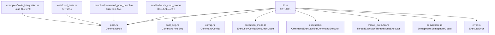
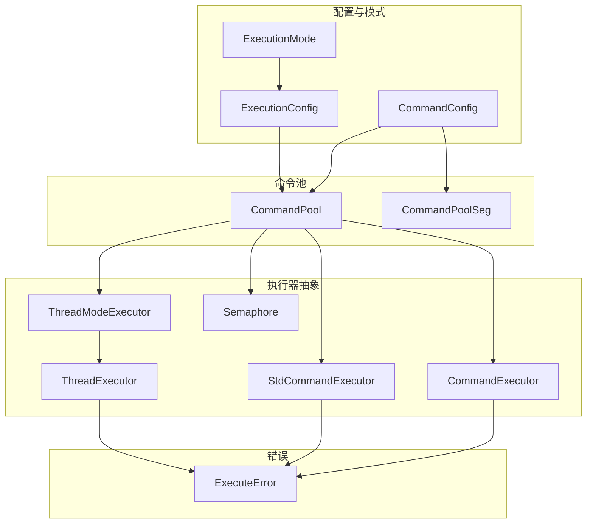
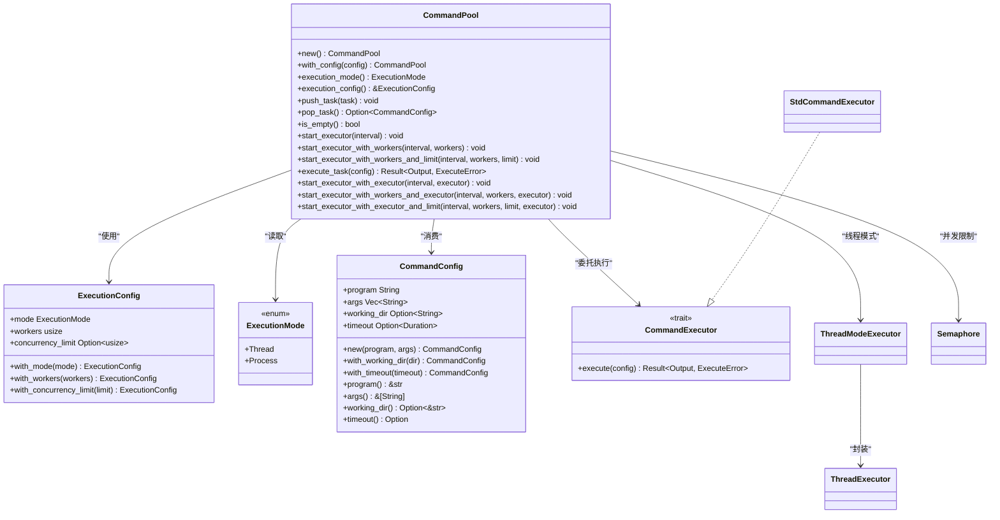
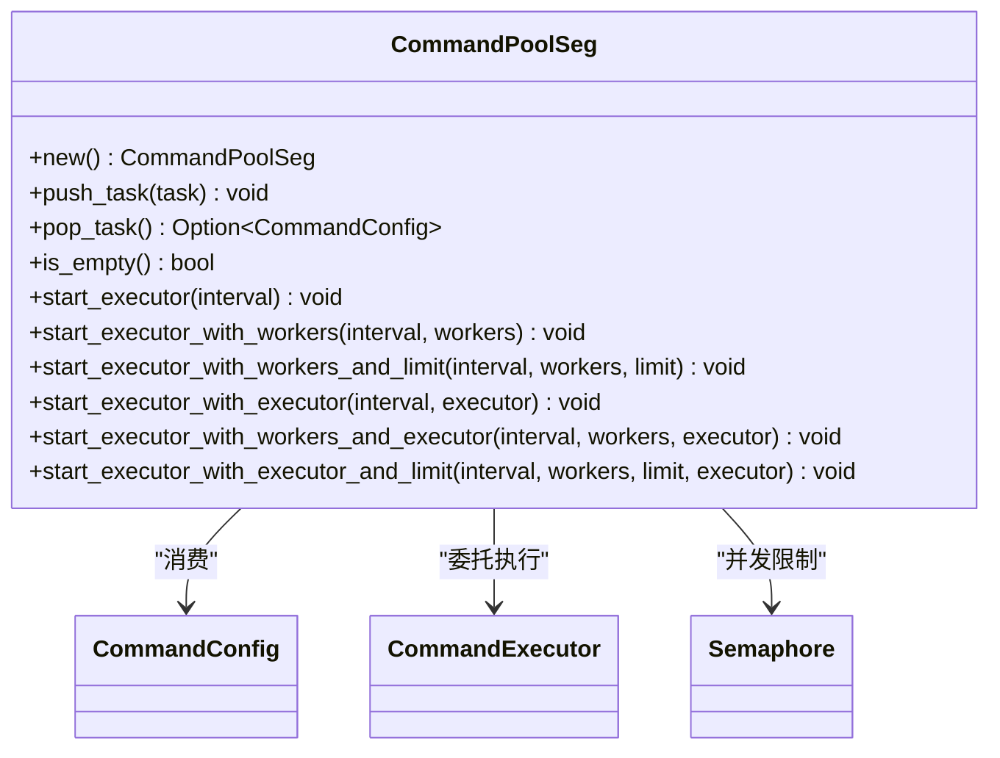
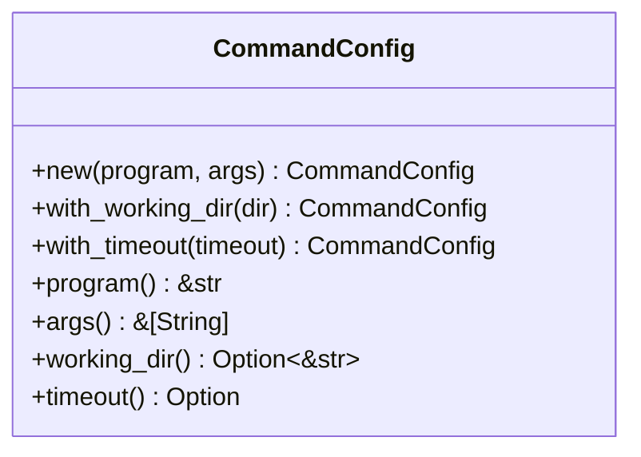
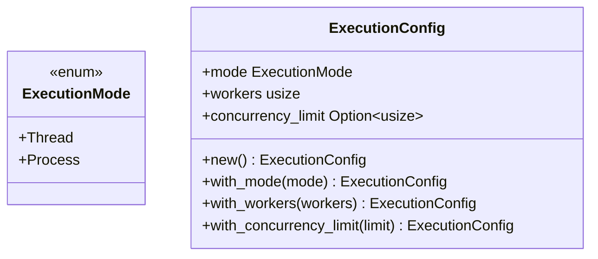
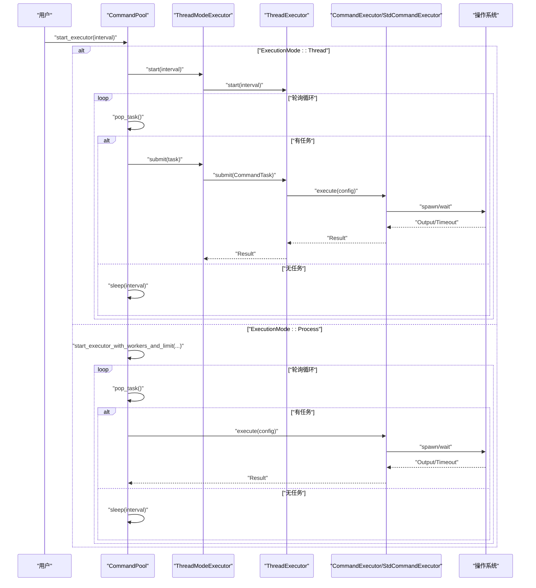
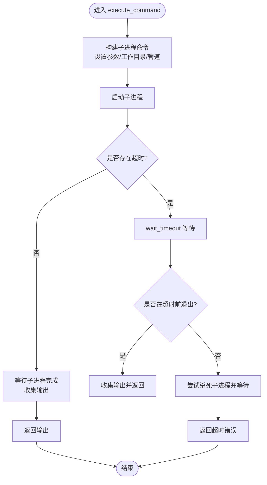
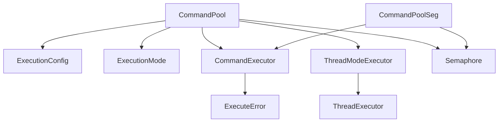

# 核心 API 参考

<cite>
**本文档引用的文件**
- [src/lib.rs](file://src/lib.rs)
- [src/pool.rs](file://src/pool.rs)
- [src/pool_seg.rs](file://src/pool_seg.rs)
- [src/config.rs](file://src/config.rs)
- [src/execution_mode.rs](file://src/execution_mode.rs)
- [src/error.rs](file://src/error.rs)
- [src/executor.rs](file://src/executor.rs)
- [src/thread_executor.rs](file://src/thread_executor.rs)
- [src/semaphore.rs](file://src/semaphore.rs)
- [examples/tokio_integration.rs](file://examples/tokio_integration.rs)
- [tests/pool_tests.rs](file://tests/pool_tests.rs)
- [benches/command_pool_bench.rs](file://benches/command_pool_bench.rs)
- [src/bin/bench_cmd_pool.rs](file://src/bin/bench_cmd_pool.rs)
- [README.md](file://README.md)
- [Cargo.toml](file://Cargo.toml)
</cite>

## 目录
1. [简介](#简介)
2. [项目结构](#项目结构)
3. [核心组件](#核心组件)
4. [架构总览](#架构总览)
5. [详细组件分析](#详细组件分析)
6. [依赖关系分析](#依赖关系分析)
7. [性能考量](#性能考量)
8. [故障排查指南](#故障排查指南)
9. [结论](#结论)
10. [附录](#附录)

## 简介
本参考文档聚焦 execute 库的核心公共 API，涵盖以下主要接口：
- CommandPool：基于互斥锁的命令池，支持多线程与多进程两种执行模式。
- CommandPoolSeg：基于无锁队列的命令池，适用于高并发多生产者场景。
- CommandConfig：命令配置对象，描述要执行的外部命令及其参数、工作目录、超时等。
- ExecutionConfig / ExecutionMode：执行模式与配置，支持线程模式与进程模式、工作线程/进程数、并发限制等。

文档将逐一说明各 API 的参数、返回值、使用方法、注意事项、错误处理机制、性能特征与适用场景，并提供多种使用模式的示例路径与图示。

## 项目结构
- 公共 API 通过 lib.rs 统一导出，便于上层使用者按需引入。
- 核心模块划分清晰：配置、执行模式、执行器、线程执行器、信号量、错误类型等。
- 示例与测试分别位于 examples 与 tests 目录，便于对照学习与验证行为。

**图表来源**
- [src/lib.rs](file://src/lib.rs#L10-L16)
- [src/pool.rs](file://src/pool.rs#L13-L21)
- [src/pool_seg.rs](file://src/pool_seg.rs#L11-L18)
- [src/config.rs](file://src/config.rs#L3-L25)
- [src/execution_mode.rs](file://src/execution_mode.rs#L21-L32)
- [src/executor.rs](file://src/executor.rs#L5-L24)
- [src/thread_executor.rs](file://src/thread_executor.rs#L16-L24)
- [src/semaphore.rs](file://src/semaphore.rs#L3-L9)
- [src/error.rs](file://src/error.rs#L4-L17)

**章节来源**
- [src/lib.rs](file://src/lib.rs#L10-L16)
- [README.md](file://README.md#L6-L13)

## 核心组件
本节对四个核心公共 API 进行深入解析，包括用途、参数、返回值、使用要点与注意事项。

- CommandPool
  - 作用：命令池，支持多线程与多进程两种模式；提供任务入队、出队、启动执行器等能力。
  - 关键方法与要点：
    - 构造：new()、with_config(ExecutionConfig)
    - 查询：execution_mode()、execution_config()
    - 任务管理：push_task()、pop_task()、is_empty()
    - 执行器启动：start_executor()、start_executor_with_workers()、start_executor_with_workers_and_limit()、start_executor_with_executor()/start_executor_with_workers_and_executor()/start_executor_with_executor_and_limit()
    - 单任务执行：execute_task(&CommandConfig) -> Result<Output, ExecuteError>
  - 注意事项：
    - 线程模式下内部使用线程池转发任务；进程模式下可结合并发限制信号量。
    - 若未设置超时，execute_task 将阻塞直至子进程完成。
  - 示例路径：
    - [README 快速开始示例](file://README.md#L28-L37)
    - [tests 测试用例](file://tests/pool_tests.rs#L6-L16)

- CommandPoolSeg
  - 作用：基于无锁队列的命令池，适合高并发多生产者场景，避免锁竞争。
  - 关键方法与要点：
    - 构造：new()
    - 任务管理：push_task()、pop_task()、is_empty()
    - 执行器启动：start_executor()、start_executor_with_workers()、start_executor_with_workers_and_limit()、start_executor_with_executor()/start_executor_with_workers_and_executor()/start_executor_with_executor_and_limit()
  - 注意事项：
    - 无阻塞入队/出队，适合高吞吐场景；单线程环境下 pop 后应为空。
  - 示例路径：
    - [tests 测试用例](file://tests/pool_tests.rs#L18-L30)

- CommandConfig
  - 作用：描述一次命令执行的完整配置，包括程序名、参数、工作目录、超时。
  - 关键方法与要点：
    - 构造：new(program, args)
    - 配置：with_working_dir(dir)、with_timeout(timeout)
    - 查询：program()、args()、working_dir()、timeout()
  - 注意事项：
    - 默认超时通常存在，可在构建后显式覆盖。
  - 示例路径：
    - [README 示例](file://README.md#L11-L18)
    - [tests 测试用例](file://tests/pool_tests.rs#L6-L16)

- ExecutionConfig / ExecutionMode
  - 作用：执行模式与配置，支持线程模式与进程模式、工作线程/进程数、并发限制。
  - 关键字段与方法：
    - ExecutionMode：Thread、Process
    - ExecutionConfig：mode、workers、concurrency_limit；with_mode()、with_workers()、with_concurrency_limit()
  - 注意事项：
    - 默认为多进程模式，工作线程数自动检测；可切换至线程模式并设置并发限制。
  - 示例路径：
    - [tests 测试用例](file://tests/pool_tests.rs#L32-L64)

**章节来源**
- [src/pool.rs](file://src/pool.rs#L13-L296)
- [src/pool_seg.rs](file://src/pool_seg.rs#L11-L157)
- [src/config.rs](file://src/config.rs#L3-L108)
- [src/execution_mode.rs](file://src/execution_mode.rs#L1-L70)
- [tests/pool_tests.rs](file://tests/pool_tests.rs#L1-L90)

## 架构总览
下图展示了核心组件之间的交互关系与数据流，帮助理解从配置到执行的整体流程。

**图表来源**
- [src/config.rs](file://src/config.rs#L19-L25)
- [src/execution_mode.rs](file://src/execution_mode.rs#L24-L32)
- [src/executor.rs](file://src/executor.rs#L9-L24)
- [src/thread_executor.rs](file://src/thread_executor.rs#L16-L137)
- [src/pool.rs](file://src/pool.rs#L13-L21)
- [src/pool_seg.rs](file://src/pool_seg.rs#L11-L18)
- [src/semaphore.rs](file://src/semaphore.rs#L7-L52)
- [src/error.rs](file://src/error.rs#L7-L17)

## 详细组件分析

### CommandPool 分析
- 设计理念
  - 支持两种执行模式：线程模式（共享内存、线程池调度）与进程模式（子进程隔离、可并发限制）。
  - 提供统一的队列接口与多种启动执行器的方式，满足不同并发与资源控制需求。
- 数据结构与复杂度
  - 基于 Mutex<VecDeque<CommandConfig>>，入队/出队为 O(1)，查询空为 O(1)。
- 关键流程
  - 启动执行器：根据 ExecutionConfig.mode 分派到线程执行器或进程执行器。
  - 进程模式可选并发限制：通过信号量控制同时运行的外部进程数量。
- 性能特征
  - 适合中低并发或需要进程隔离的场景；配合并发限制可避免资源耗尽。
- 适用场景
  - 需要子进程隔离、超时控制、并发限制的批处理任务。

**图表来源**
- [src/pool.rs](file://src/pool.rs#L13-L296)
- [src/execution_mode.rs](file://src/execution_mode.rs#L24-L63)
- [src/config.rs](file://src/config.rs#L19-L108)
- [src/executor.rs](file://src/executor.rs#L9-L24)
- [src/thread_executor.rs](file://src/thread_executor.rs#L16-L137)
- [src/semaphore.rs](file://src/semaphore.rs#L7-L52)

**章节来源**
- [src/pool.rs](file://src/pool.rs#L13-L296)
- [src/execution_mode.rs](file://src/execution_mode.rs#L21-L63)
- [src/config.rs](file://src/config.rs#L19-L108)
- [src/executor.rs](file://src/executor.rs#L9-L24)
- [src/thread_executor.rs](file://src/thread_executor.rs#L16-L137)
- [src/semaphore.rs](file://src/semaphore.rs#L7-L52)

### CommandPoolSeg 分析
- 设计理念
  - 基于无锁队列，提升多生产者场景下的吞吐量，避免锁竞争。
- 数据结构与复杂度
  - 基于 SegQueue，push/pop 为无阻塞操作，适合高并发写入。
- 关键流程
  - 与 CommandPool 类似的执行器启动方式，支持并发限制与自定义执行器。
- 性能特征
  - 在多生产者、高吞吐场景表现更佳；单线程环境下 pop 后应为空。
- 适用场景
  - 多线程/多任务并发入队、低延迟出队的批处理任务。

**图表来源**
- [src/pool_seg.rs](file://src/pool_seg.rs#L11-L157)
- [src/config.rs](file://src/config.rs#L19-L108)
- [src/executor.rs](file://src/executor.rs#L9-L24)
- [src/semaphore.rs](file://src/semaphore.rs#L7-L52)

**章节来源**
- [src/pool_seg.rs](file://src/pool_seg.rs#L11-L157)

### CommandConfig 分析
- 设计理念
  - 封装一次命令执行所需的所有信息，支持链式配置与只读查询。
- 关键字段
  - program、args、working_dir、timeout。
- 使用建议
  - 通过 with_working_dir/with_timeout 进行链式配置；在多进程模式下，超时会触发子进程终止与错误返回。

**图表来源**
- [src/config.rs](file://src/config.rs#L19-L108)

**章节来源**
- [src/config.rs](file://src/config.rs#L3-L108)

### ExecutionConfig / ExecutionMode 分析
- 设计理念
  - 通过 ExecutionConfig 统一配置执行模式、工作线程/进程数与并发限制；ExecutionMode 提供模式选择。
- 关键点
  - 默认多进程模式，工作线程数自动检测；可切换为线程模式并设置并发限制。
- 适用场景
  - 需要进程隔离与资源控制的批处理任务；或需要线程池共享内存的计算/IO混合任务。

**图表来源**
- [src/execution_mode.rs](file://src/execution_mode.rs#L5-L63)

**章节来源**
- [src/execution_mode.rs](file://src/execution_mode.rs#L1-L70)

### 执行序列与错误处理（CommandPool.start_executor）
下图展示了 CommandPool 在不同执行模式下的典型调用序列，包括线程模式与进程模式的差异。

**图表来源**
- [src/pool.rs](file://src/pool.rs#L134-L288)
- [src/thread_executor.rs](file://src/thread_executor.rs#L128-L136)
- [src/executor.rs](file://src/executor.rs#L30-L70)

**章节来源**
- [src/pool.rs](file://src/pool.rs#L134-L288)
- [src/thread_executor.rs](file://src/thread_executor.rs#L128-L136)
- [src/executor.rs](file://src/executor.rs#L30-L70)

### 算法流程（execute_command）
下图展示了单个命令执行的内部算法流程，包括超时处理与子进程终止逻辑。

**图表来源**
- [src/executor.rs](file://src/executor.rs#L30-L70)

**章节来源**
- [src/executor.rs](file://src/executor.rs#L30-L70)

## 依赖关系分析
- 外部依赖
  - crossbeam-queue：提供无锁队列 SegQueue。
  - wait-timeout：在同一线程中等待子进程，避免额外等待线程。
  - thiserror：统一错误类型与错误传播。
- 内部依赖
  - CommandPool 依赖 ExecutionConfig/ExecutionMode、CommandExecutor、ThreadModeExecutor、Semaphore。
  - CommandPoolSeg 依赖 CommandExecutor、Semaphore。
  - ThreadModeExecutor 内部持有 ThreadExecutor，用于线程池任务调度。
  - Semaphore 提供并发限制的 RAII 守卫。

**图表来源**
- [src/pool.rs](file://src/pool.rs#L13-L21)
- [src/pool_seg.rs](file://src/pool_seg.rs#L11-L18)
- [src/thread_executor.rs](file://src/thread_executor.rs#L16-L137)
- [src/semaphore.rs](file://src/semaphore.rs#L7-L52)
- [src/error.rs](file://src/error.rs#L7-L17)

**章节来源**
- [Cargo.toml](file://Cargo.toml#L6-L9)
- [src/pool.rs](file://src/pool.rs#L13-L21)
- [src/pool_seg.rs](file://src/pool_seg.rs#L11-L18)
- [src/thread_executor.rs](file://src/thread_executor.rs#L16-L137)
- [src/semaphore.rs](file://src/semaphore.rs#L7-L52)
- [src/error.rs](file://src/error.rs#L7-L17)

## 性能考量
- 队列选择
  - CommandPool：基于 Mutex<VecDeque>，适合中低并发与需要线程模式的场景。
  - CommandPoolSeg：基于 SegQueue，适合高并发多生产者场景，减少锁竞争。
- 执行模式
  - 线程模式：共享内存，适合计算/IO混合任务；进程模式：子进程隔离，适合需要稳定性的批处理任务。
- 并发限制
  - 通过 Semaphore 控制同时运行的外部进程数量，避免系统资源耗尽。
- 基准测试
  - 提供 Criterion 与自定义基准二进制，覆盖 push/pop、多线程入队、执行 true 命令等场景，便于对比两种队列实现的性能差异。

**章节来源**
- [benches/command_pool_bench.rs](file://benches/command_pool_bench.rs#L1-L93)
- [src/bin/bench_cmd_pool.rs](file://src/bin/bench_cmd_pool.rs#L1-L126)

## 故障排查指南
- 常见错误类型
  - IO 错误：命令启动失败、权限问题、路径不存在等。
  - 超时错误：超过配置的超时时间仍未完成，系统会尝试终止子进程。
  - 子进程错误：子进程状态异常或非零退出码。
- 处理策略
  - 对于 IO 错误：检查命令路径、参数、工作目录与权限。
  - 对于超时：适当增加超时时间或优化命令执行效率；必要时调整并发限制。
  - 对于子进程错误：检查命令返回码与输出日志，定位业务逻辑问题。
- 调试建议
  - 使用 tests/pool_tests.rs 中的断言与模式验证执行配置与模式切换。
  - 结合 examples/tokio_integration.rs 自定义执行器进行异步与超时控制调试。

**章节来源**
- [src/error.rs](file://src/error.rs#L7-L17)
- [src/executor.rs](file://src/executor.rs#L30-L70)
- [tests/pool_tests.rs](file://tests/pool_tests.rs#L1-L90)
- [examples/tokio_integration.rs](file://examples/tokio_integration.rs#L1-L62)

## 结论
execute 库提供了简洁而强大的命令池 API，支持多线程与多进程两种执行模式、无锁队列变体、可插拔执行器接口与并发限制策略。通过 CommandConfig、ExecutionConfig/ExecutionMode、CommandPool、CommandPoolSeg 与 CommandExecutor，用户可以在不同场景下灵活选择最适合的执行方式，并借助超时与错误处理机制保障稳定性与可观测性。

## 附录
- 使用示例路径
  - 快速开始（标准库执行器）：[README 示例](file://README.md#L28-L37)
  - Tokio 集成与超时控制：[examples/tokio_integration.rs](file://examples/tokio_integration.rs#L1-L62)
- 测试与验证
  - 单元测试：[tests/pool_tests.rs](file://tests/pool_tests.rs#L1-L90)
- 性能基准
  - Criterion 基准：[benches/command_pool_bench.rs](file://benches/command_pool_bench.rs#L1-L93)
  - 简单基准二进制：[src/bin/bench_cmd_pool.rs](file://src/bin/bench_cmd_pool.rs#L1-L126)