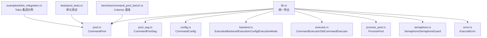
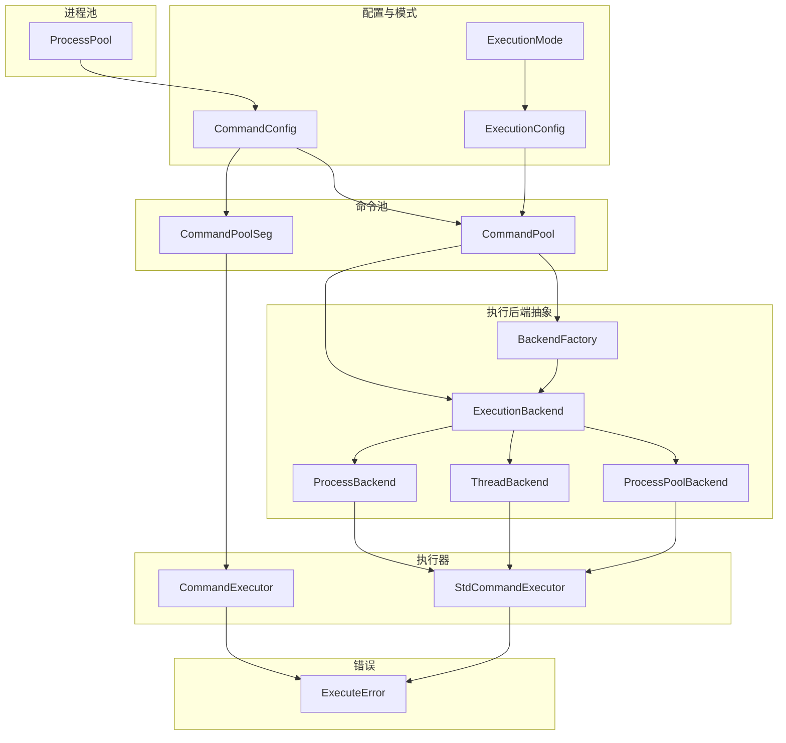
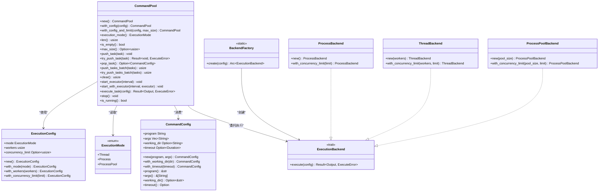
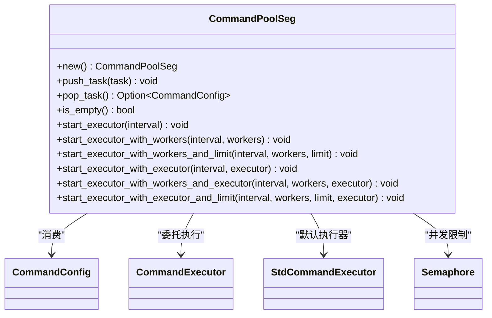
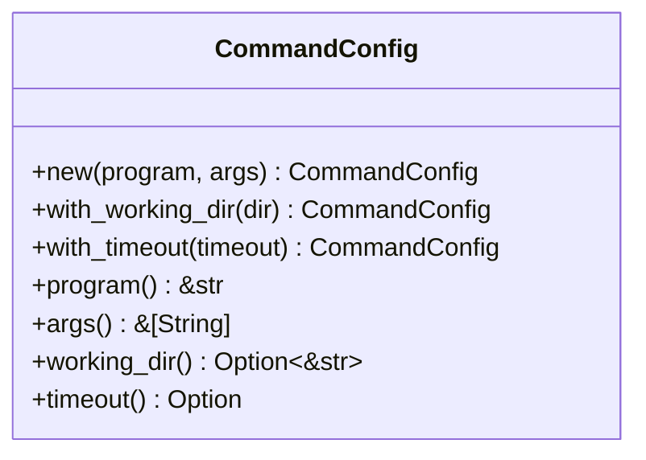
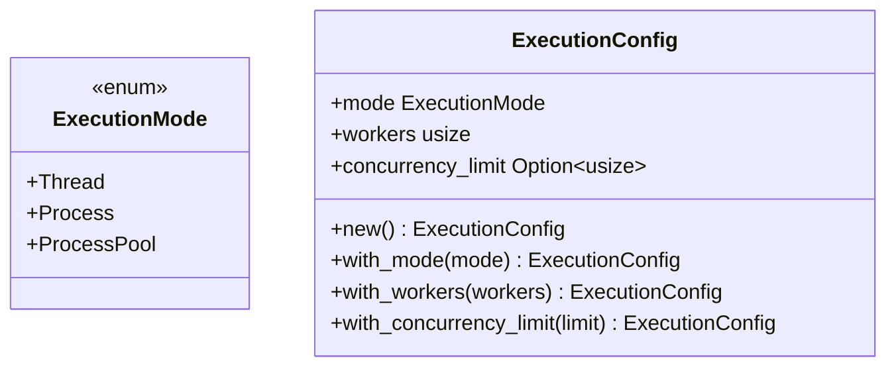
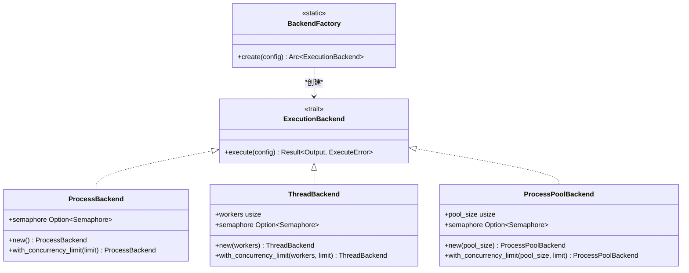
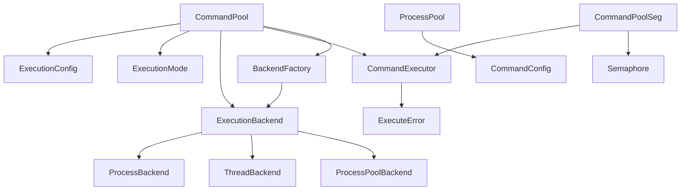

# 核心 API 参考

<cite>
**本文档引用的文件**
- [src/lib.rs](file://src/lib.rs)
- [src/pool.rs](file://src/pool.rs)
- [src/pool_seg.rs](file://src/pool_seg.rs)
- [src/config.rs](file://src/config.rs)
- [src/backend.rs](file://src/backend.rs)
- [src/executor.rs](file://src/executor.rs)
- [src/process_pool.rs](file://src/process_pool.rs)
- [src/semaphore.rs](file://src/semaphore.rs)
- [src/error.rs](file://src/error.rs)
- [examples/tokio_integration.rs](file://examples/tokio_integration.rs)
- [tests/pool_tests.rs](file://tests/pool_tests.rs)
- [benches/command_pool_bench.rs](file://benches/command_pool_bench.rs)
- [README.md](file://README.md)
- [Cargo.toml](file://Cargo.toml)
</cite>

## 目录
1. [简介](#简介)
2. [项目结构](#项目结构)
3. [核心组件](#核心组件)
4. [架构总览](#架构总览)
5. [详细组件分析](#详细组件分析)
6. [依赖关系分析](#依赖关系分析)
7. [性能考量](#性能考量)
8. [故障排查指南](#故障排查指南)
9. [结论](#结论)
10. [附录](#附录)

## 简介
本参考文档聚焦 execute 库的核心公共 API，涵盖以下主要接口：
- CommandPool：基于互斥锁的命令池，支持多线程、多进程与进程池三种执行模式。
- CommandPoolSeg：基于无锁队列的命令池，适用于高并发多生产者场景。
- CommandConfig：命令配置对象，描述要执行的外部命令及其参数、工作目录、超时等。
- ExecutionConfig / ExecutionMode：执行模式与配置，支持线程模式、进程模式与进程池模式、工作线程/进程数、并发限制等。
- ExecutionBackend：统一的执行后端抽象，替代原有的分散执行模式模块，提供可扩展的执行策略。

文档将逐一说明各 API 的参数、返回值、使用方法、注意事项、错误处理机制、性能特征与适用场景，并提供多种使用模式的示例路径与图示。

## 项目结构
- 公共 API 通过 lib.rs 统一导出，便于上层使用者按需引入。
- 核心模块划分清晰：配置、执行后端、执行器、进程池、信号量、错误类型等。
- 新增的 ExecutionBackend 抽象统一了执行策略，替代了原有的分散执行模式模块。
- 示例与测试分别位于 examples 与 tests 目录，便于对照学习与验证行为。



**图表来源**
- [src/lib.rs](file://src/lib.rs#L12-L21)
- [src/pool.rs](file://src/pool.rs#L13-L20)
- [src/pool_seg.rs](file://src/pool_seg.rs#L16-L18)
- [src/config.rs](file://src/config.rs#L19-L25)
- [src/backend.rs](file://src/backend.rs#L12-L65)
- [src/executor.rs](file://src/executor.rs#L9-L24)
- [src/process_pool.rs](file://src/process_pool.rs#L96-L100)
- [src/semaphore.rs](file://src/semaphore.rs#L7-L14)
- [src/error.rs](file://src/error.rs#L7-L17)

**章节来源**
- [src/lib.rs](file://src/lib.rs#L1-L22)
- [README.md](file://README.md#L6-L13)

## 核心组件
本节对五个核心公共 API 进行深入解析，包括用途、参数、返回值、使用要点与注意事项。

- CommandPool
  - 作用：命令池，支持多线程、多进程与进程池三种执行模式；提供任务入队、出队、启动执行器等能力。
  - 关键方法与要点：
    - 构造：new()、with_config(ExecutionConfig)、with_config_and_limit(ExecutionConfig, max_size)
    - 查询：execution_mode()、len()、is_empty()、max_size()
    - 任务管理：push_task()、try_push_task()、pop_task()、push_tasks_batch()、try_push_tasks_batch()、clear()
    - 执行器启动：start_executor()、start_executor_with_workers()、start_executor_with_workers_and_limit()、start_with_executor()
    - 单任务执行：execute_task(&CommandConfig) -> Result<Output, ExecuteError>
  - 注意事项：
    - 支持队列大小限制，满队列时 push 会阻塞，try_push 会返回错误。
    - 不同执行模式下内部使用相应的 ExecutionBackend 实现。
    - 若未设置超时，execute_task 将阻塞直至子进程完成。
  - 示例路径：
    - [README 快速开始示例](file://README.md#L28-L37)
    - [tests 测试用例](file://tests/pool_tests.rs#L4-L14)

- CommandPoolSeg
  - 作用：基于无锁队列的命令池，适合高并发多生产者场景，避免锁竞争。
  - 关键方法与要点：
    - 构造：new()
    - 任务管理：push_task()、pop_task()、is_empty()
    - 执行器启动：start_executor()、start_executor_with_workers()、start_executor_with_workers_and_limit()、start_executor_with_executor()、start_executor_with_workers_and_executor()、start_executor_with_executor_and_limit()
  - 注意事项：
    - 无阻塞入队/出队，适合高吞吐场景；单线程环境下 pop 后应为空。
    - 支持自定义执行器，可集成异步运行时如 Tokio。
  - 示例路径：
    - [tests 测试用例](file://tests/pool_tests.rs#L17-L27)
    - [examples/tokio_integration.rs](file://examples/tokio_integration.rs#L1-L62)

- CommandConfig
  - 作用：描述一次命令执行的完整配置，包括程序名、参数、工作目录、超时。
  - 关键方法与要点：
    - 构造：new(program, args)
    - 配置：with_working_dir(dir)、with_timeout(timeout)
    - 查询：program()、args()、working_dir()、timeout()
  - 注意事项：
    - 默认超时通常存在，可在构建后显式覆盖。
    - 工作目录为 None 时使用当前目录。
  - 示例路径：
    - [README 示例](file://README.md#L11-L18)
    - [tests 测试用例](file://tests/pool_tests.rs#L4-L14)

- ExecutionConfig / ExecutionMode
  - 作用：执行模式与配置，支持线程模式、进程模式与进程池模式、工作线程/进程数、并发限制。
  - 关键字段与方法：
    - ExecutionMode：Thread、Process、ProcessPool
    - ExecutionConfig：mode、workers、concurrency_limit；with_mode()、with_workers()、with_concurrency_limit()
  - 注意事项：
    - 默认为多进程模式，工作线程数自动检测；可切换至线程模式或进程池模式并设置并发限制。
    - ProcessPool 模式目前为简化实现，未来将支持真正的进程池逻辑。
  - 示例路径：
    - [tests 测试用例](file://tests/pool_tests.rs#L30-L81)

- ExecutionBackend
  - 作用：统一的执行后端抽象，替代原有的分散执行模式模块，提供可扩展的执行策略。
  - 关键实现：
    - ProcessBackend：每个命令独立子进程，适用于命令执行频率不高或需要完全隔离的场景。
    - ThreadBackend：使用线程池调度任务，任务仍通过子进程执行。
    - ProcessPoolBackend：预创建一组子进程，复用执行命令，适用于高频短命令场景。
  - 注意事项：
    - 通过 BackendFactory 根据 ExecutionConfig 动态创建相应的后端实例。
    - 支持可选的并发限制信号量控制。
  - 示例路径：
    - [tests 测试用例](file://tests/pool_tests.rs#L30-L81)

**章节来源**
- [src/pool.rs](file://src/pool.rs#L13-L324)
- [src/pool_seg.rs](file://src/pool_seg.rs#L16-L157)
- [src/config.rs](file://src/config.rs#L19-L109)
- [src/backend.rs](file://src/backend.rs#L12-L277)
- [tests/pool_tests.rs](file://tests/pool_tests.rs#L1-L155)

## 架构总览
下图展示了核心组件之间的交互关系与数据流，重点体现了新的 ExecutionBackend 抽象如何统一执行策略。



**图表来源**
- [src/config.rs](file://src/config.rs#L19-L25)
- [src/backend.rs](file://src/backend.rs#L24-L65)
- [src/backend.rs](file://src/backend.rs#L12-L22)
- [src/backend.rs](file://src/backend.rs#L136-L167)
- [src/backend.rs](file://src/backend.rs#L169-L202)
- [src/backend.rs](file://src/backend.rs#L204-L242)
- [src/backend.rs](file://src/backend.rs#L244-L276)
- [src/executor.rs](file://src/executor.rs#L9-L24)
- [src/pool.rs](file://src/pool.rs#L13-L20)
- [src/process_pool.rs](file://src/process_pool.rs#L96-L100)
- [src/semaphore.rs](file://src/semaphore.rs#L7-L52)
- [src/error.rs](file://src/error.rs#L7-L17)

## 详细组件分析

### CommandPool 分析
- 设计理念
  - 支持三种执行模式：线程模式（共享内存、线程池调度）、进程模式（子进程隔离、可并发限制）与进程池模式（常驻子进程池、复用执行）。
  - 通过 ExecutionBackend 抽象统一执行策略，提供统一的队列接口与多种启动执行器的方式。
- 数据结构与复杂度
  - 基于 Mutex<VecDeque<CommandConfig>>，入队/出队为 O(1)，查询空为 O(1)。
  - 支持可选的队列大小限制，满队列时 push 会阻塞等待。
- 关键流程
  - 启动执行器：根据 ExecutionConfig.mode 分派到相应的 ExecutionBackend 实现。
  - 执行单个任务：通过 backend.execute(config) 统一调用后端执行。
  - 进程池模式：复用工作线程，但后端使用进程池执行命令。
- 性能特征
  - 适合中低并发或需要进程隔离的场景；配合并发限制可避免资源耗尽。
  - 队列大小限制功能提供背压控制，防止内存无限增长。
- 适用场景
  - 需要子进程隔离、超时控制、并发限制的批处理任务。
  - 需要队列大小控制的生产者-消费者场景。



**图表来源**
- [src/pool.rs](file://src/pool.rs#L13-L324)
- [src/backend.rs](file://src/backend.rs#L12-L277)
- [src/config.rs](file://src/config.rs#L19-L109)
- [src/backend.rs](file://src/backend.rs#L244-L276)

**章节来源**
- [src/pool.rs](file://src/pool.rs#L13-L324)
- [src/backend.rs](file://src/backend.rs#L12-L277)
- [src/config.rs](file://src/config.rs#L19-L109)

### CommandPoolSeg 分析
- 设计理念
  - 基于无锁队列，提升多生产者场景下的吞吐量，避免锁竞争。
  - 支持自定义执行器，可集成异步运行时如 Tokio。
- 数据结构与复杂度
  - 基于 SegQueue，push/pop 为无阻塞操作，适合高并发写入。
- 关键流程
  - 与 CommandPool 类似的执行器启动方式，支持并发限制与自定义执行器。
  - 支持多种启动变体：自动检测工作线程数、固定工作线程数、带并发限制等。
- 性能特征
  - 在多生产者、高吞吐场景表现更佳；单线程环境下 pop 后应为空。
  - 支持异步执行器，可充分利用现代异步运行时的优势。
- 适用场景
  - 多线程/多任务并发入队、低延迟出队的批处理任务。
  - 需要异步执行器集成的高性能场景。



**图表来源**
- [src/pool_seg.rs](file://src/pool_seg.rs#L16-L157)
- [src/config.rs](file://src/config.rs#L19-L109)
- [src/executor.rs](file://src/executor.rs#L9-L24)
- [src/semaphore.rs](file://src/semaphore.rs#L7-L52)

**章节来源**
- [src/pool_seg.rs](file://src/pool_seg.rs#L16-L157)

### CommandConfig 分析
- 设计理念
  - 封装一次命令执行所需的所有信息，支持链式配置与只读查询。
  - 提供默认超时设置，工作目录为可选配置。
- 关键字段
  - program、args、working_dir、timeout。
- 使用建议
  - 通过 with_working_dir/with_timeout 进行链式配置；在多进程模式下，超时会触发子进程终止与错误返回。
  - 默认超时时间为 10 秒，可根据具体需求调整。



**图表来源**
- [src/config.rs](file://src/config.rs#L19-L109)

**章节来源**
- [src/config.rs](file://src/config.rs#L19-L109)

### ExecutionConfig / ExecutionMode 分析
- 设计理念
  - 通过 ExecutionConfig 统一配置执行模式、工作线程/进程数与并发限制；ExecutionMode 提供模式选择。
  - 支持三种执行模式：线程模式、进程模式与进程池模式。
- 关键点
  - 默认多进程模式，工作线程数自动检测；可切换为线程模式或进程池模式并设置并发限制。
  - ProcessPool 模式目前为简化实现，未来将支持真正的进程池逻辑。
- 适用场景
  - 需要进程隔离与资源控制的批处理任务；或需要线程池共享内存的计算/IO混合任务。
  - 高频短命令场景，需要减少进程创建开销。



**图表来源**
- [src/backend.rs](file://src/backend.rs#L24-L65)

**章节来源**
- [src/backend.rs](file://src/backend.rs#L24-L134)

### ExecutionBackend 抽象分析
- 设计理念
  - 统一的执行后端抽象，替代原有的分散执行模式模块，提供可扩展的执行策略。
  - 通过 BackendFactory 根据 ExecutionConfig 动态创建相应的后端实例。
- 关键实现
  - ProcessBackend：每个命令独立子进程，适用于命令执行频率不高或需要完全隔离的场景。
  - ThreadBackend：使用线程池调度任务，任务仍通过子进程执行。
  - ProcessPoolBackend：预创建一组子进程，复用执行命令，适用于高频短命令场景。
- 关键流程
  - 后端工厂：根据 ExecutionConfig.mode 和 concurrency_limit 创建相应后端。
  - 并发控制：可选的信号量控制同时运行的外部进程数量。
- 适用场景
  - 需要灵活选择执行策略的场景。
  - 需要扩展自定义执行后端的场景。



**图表来源**
- [src/backend.rs](file://src/backend.rs#L12-L22)
- [src/backend.rs](file://src/backend.rs#L136-L167)
- [src/backend.rs](file://src/backend.rs#L169-L202)
- [src/backend.rs](file://src/backend.rs#L204-L242)
- [src/backend.rs](file://src/backend.rs#L244-L276)

**章节来源**
- [src/backend.rs](file://src/backend.rs#L12-L277)

### 执行序列与错误处理（CommandPool.start_executor）
下图展示了 CommandPool 在不同执行模式下的典型调用序列，包括线程模式、进程模式与进程池模式的差异。

```mermaid
sequenceDiagram
participant U as "用户"
participant P as "CommandPool"
participant BF as "BackendFactory"
participant EB as "ExecutionBackend"
participant EX as "execute_command"
participant OS as "操作系统"
U->>P : "start_executor(interval)"
P->>BF : "create(config)"
BF-->>P : "Arc<ExecutionBackend>"
P->>P : "start_executor_for_mode()"
alt "ExecutionMode : Thread"
loop "轮询循环"
P->>P : "pop_task()"
alt "有任务"
P->>EB : "execute(task)"
EB->>EX : "execute_command(task)"
EX->>OS : "spawn/wait"
OS-->>EX : "Output/Timeout"
EX-->>EB : "Result"
EB-->>P : "Result"
else "无任务"
P->>P : "sleep(interval)"
end
end
else "ExecutionMode : Process"
P->>P : "start_process_executor(interval)"
loop "轮询循环"
P->>P : "pop_task()"
alt "有任务"
P->>EB : "execute(task)"
EB->>EX : "execute_command(task)"
EX->>OS : "spawn/wait"
OS-->>EX : "Output/Timeout"
EX-->>EB : "Result"
EB-->>P : "Result"
else "无任务"
P->>P : "sleep(interval)"
end
end
else "ExecutionMode : ProcessPool"
P->>P : "start_process_pool_executor(interval)"
loop "轮询循环"
P->>P : "pop_task()"
alt "有任务"
P->>EB : "execute(task)"
EB->>EX : "execute_command(task)"
EX->>OS : "spawn/wait"
OS-->>EX : "Output/Timeout"
EX-->>EB : "Result"
EB-->>P : "Result"
else "无任务"
P->>P : "sleep(interval)"
end
end
```

**图表来源**
- [src/pool.rs](file://src/pool.rs#L180-L265)
- [src/backend.rs](file://src/backend.rs#L244-L276)
- [src/executor.rs](file://src/executor.rs#L30-L70)

**章节来源**
- [src/pool.rs](file://src/pool.rs#L180-L265)
- [src/backend.rs](file://src/backend.rs#L244-L276)
- [src/executor.rs](file://src/executor.rs#L30-L70)

### 算法流程（execute_command）
下图展示了单个命令执行的内部算法流程，包括超时处理与子进程终止逻辑。


**图表来源**
- [src/executor.rs](file://src/executor.rs#L30-L70)

**章节来源**
- [src/executor.rs](file://src/executor.rs#L30-L70)

## 依赖关系分析
- 外部依赖
  - crossbeam-queue：提供无锁队列 SegQueue。
  - wait-timeout：在同一线程中等待子进程，避免额外等待线程。
  - thiserror：统一错误类型与错误传播。
- 内部依赖
  - CommandPool 依赖 ExecutionConfig/ExecutionMode、ExecutionBackend、CommandExecutor。
  - CommandPoolSeg 依赖 CommandExecutor、Semaphore。
  - ExecutionBackend 提供统一的执行策略抽象。
  - BackendFactory 根据配置动态创建执行后端实例。
  - ProcessPool 提供常驻子进程池功能。



**图表来源**
- [src/pool.rs](file://src/pool.rs#L13-L20)
- [src/pool_seg.rs](file://src/pool_seg.rs#L16-L18)
- [src/backend.rs](file://src/backend.rs#L12-L22)
- [src/backend.rs](file://src/backend.rs#L244-L276)
- [src/process_pool.rs](file://src/process_pool.rs#L96-L100)
- [src/semaphore.rs](file://src/semaphore.rs#L7-L52)
- [src/error.rs](file://src/error.rs#L7-L17)

**章节来源**
- [Cargo.toml](file://Cargo.toml#L6-L9)
- [src/pool.rs](file://src/pool.rs#L13-L20)
- [src/pool_seg.rs](file://src/pool_seg.rs#L16-L18)
- [src/backend.rs](file://src/backend.rs#L12-L22)
- [src/backend.rs](file://src/backend.rs#L244-L276)
- [src/process_pool.rs](file://src/process_pool.rs#L96-L100)
- [src/semaphore.rs](file://src/semaphore.rs#L7-L52)
- [src/error.rs](file://src/error.rs#L7-L17)

## 性能考量
- 队列选择
  - CommandPool：基于 Mutex<VecDeque>，适合中低并发与需要线程模式的场景。
  - CommandPoolSeg：基于 SegQueue，适合高并发多生产者场景，减少锁竞争。
- 执行模式
  - 线程模式：共享内存，适合计算/IO混合任务；进程模式：子进程隔离，适合需要稳定性的批处理任务。
  - 进程池模式：预创建子进程，复用执行命令，减少进程创建开销，适合高频短命令场景。
- 并发限制
  - 通过 Semaphore 控制同时运行的外部进程数量，避免系统资源耗尽。
- 队列大小限制
  - CommandPool 支持可选的队列大小限制，提供背压控制，防止内存无限增长。
- 基准测试
  - 提供 Criterion 基准测试，覆盖 push/pop、多线程入队、执行 true 命令等场景。
  - 支持对比两种队列实现的性能差异。

**章节来源**
- [benches/command_pool_bench.rs](file://benches/command_pool_bench.rs#L1-L93)
- [src/bin/bench_cmd_pool.rs](file://src/bin/bench_cmd_pool.rs#L1-L126)

## 故障排查指南
- 常见错误类型
  - IO 错误：命令启动失败、权限问题、路径不存在等。
  - 超时错误：超过配置的超时时间仍未完成，系统会尝试终止子进程。
  - 子进程错误：子进程状态异常或非零退出码。
  - 队列满错误：当使用 try_push_task 或带队列限制的构造函数时，队列满会返回错误。
- 处理策略
  - 对于 IO 错误：检查命令路径、参数、工作目录与权限。
  - 对于超时：适当增加超时时间或优化命令执行效率；必要时调整并发限制。
  - 对于子进程错误：检查命令返回码与输出日志，定位业务逻辑问题。
  - 对于队列满：使用 try_push_task 或增加队列大小限制；或实现适当的背压机制。
- 调试建议
  - 使用 tests/pool_tests.rs 中的断言与模式验证执行配置与模式切换。
  - 结合 examples/tokio_integration.rs 自定义执行器进行异步与超时控制调试。
  - 利用队列大小限制功能进行压力测试，验证系统的背压控制能力。

**章节来源**
- [src/error.rs](file://src/error.rs#L7-L17)
- [src/executor.rs](file://src/executor.rs#L30-L70)
- [tests/pool_tests.rs](file://tests/pool_tests.rs#L1-L155)
- [examples/tokio_integration.rs](file://examples/tokio_integration.rs#L1-L62)

## 结论
execute 库经过重大架构重构，提供了更加统一和灵活的命令池 API。新的 ExecutionBackend 抽象替代了原有的分散执行模式模块，支持线程模式、进程模式与进程池模式三种执行策略。通过 CommandConfig、ExecutionConfig/ExecutionMode、CommandPool、CommandPoolSeg 与 ExecutionBackend，用户可以在不同场景下灵活选择最适合的执行方式，并借助超时与错误处理机制保障稳定性与可观测性。新增的队列大小限制功能提供了更好的背压控制，ProcessPool 模式为高频短命令场景提供了性能优化。整体架构更加清晰，扩展性更强，为未来的功能增强奠定了坚实基础。

## 附录
- 使用示例路径
  - 快速开始（标准库执行器）：[README 示例](file://README.md#L28-L37)
  - Tokio 集成与超时控制：[examples/tokio_integration.rs](file://examples/tokio_integration.rs#L1-L62)
  - 进程池模式使用：[src/process_pool.rs](file://src/process_pool.rs#L96-L147)
- 测试与验证
  - 单元测试：[tests/pool_tests.rs](file://tests/pool_tests.rs#L1-L155)
  - 基准测试：[benches/command_pool_bench.rs](file://benches/command_pool_bench.rs#L1-L93)
- 架构演进
  - 执行后端抽象：[src/backend.rs](file://src/backend.rs#L12-L277)
  - 执行器接口：[src/executor.rs](file://src/executor.rs#L9-L24)
  - 信号量控制：[src/semaphore.rs](file://src/semaphore.rs#L7-L52)