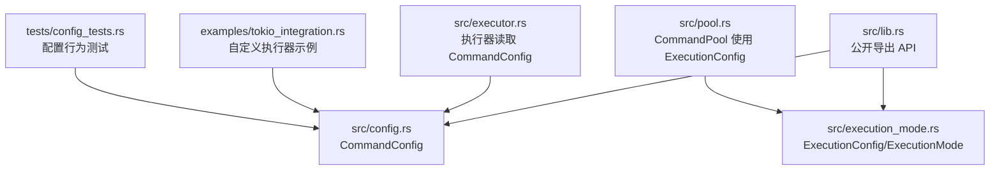
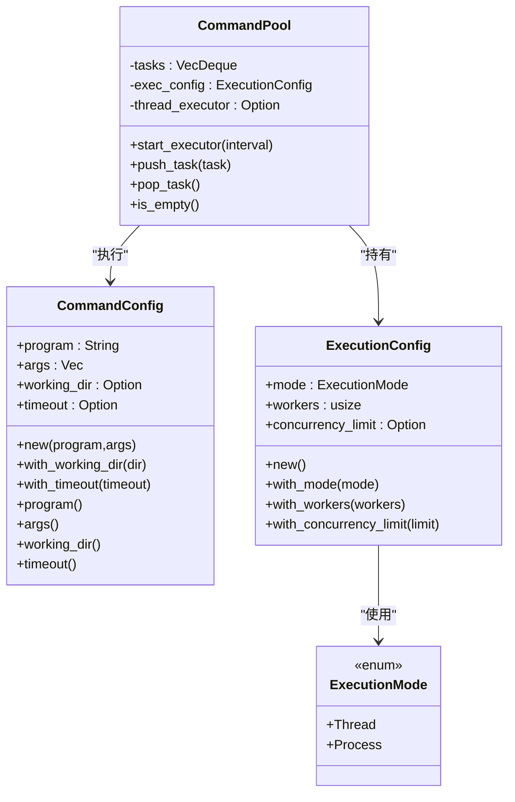
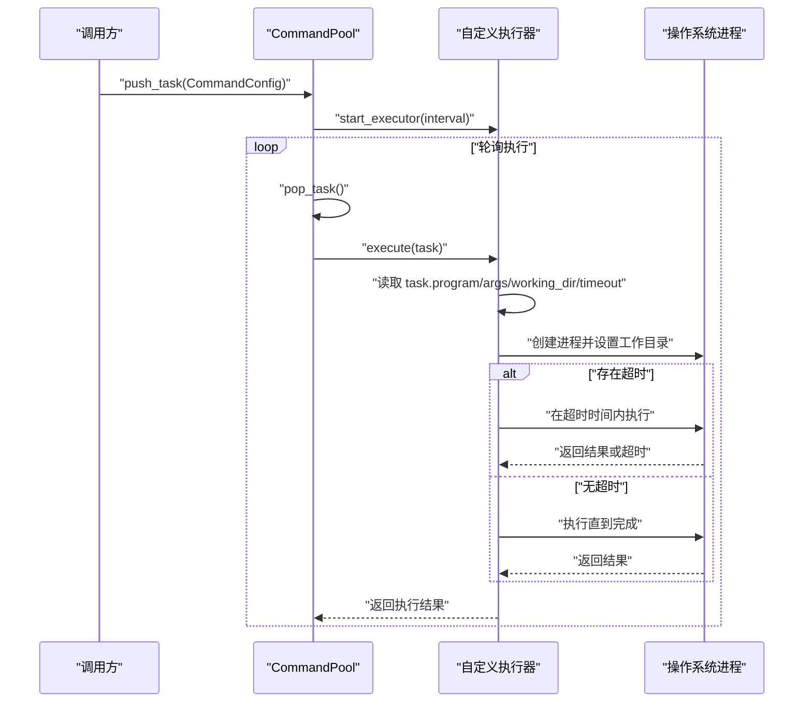
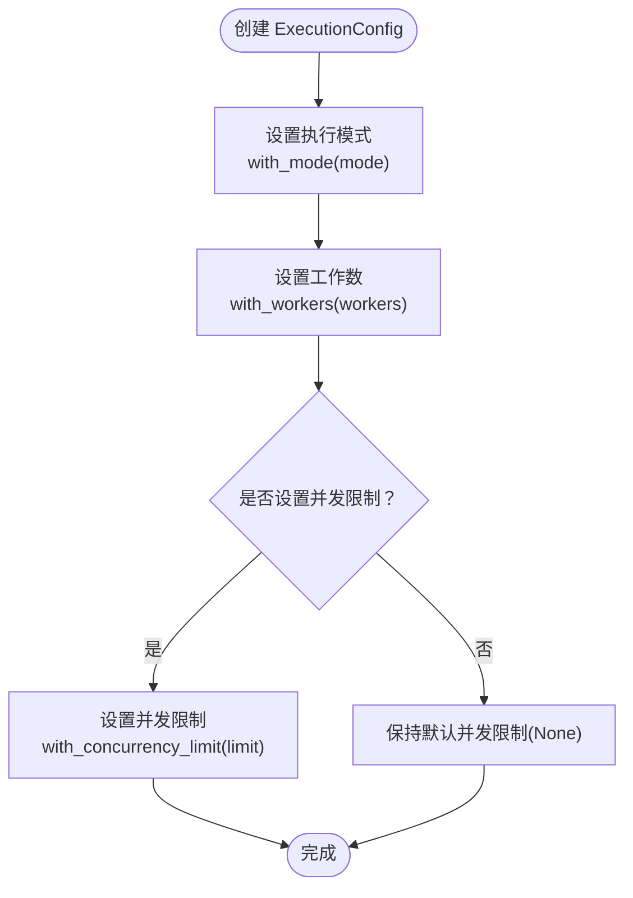
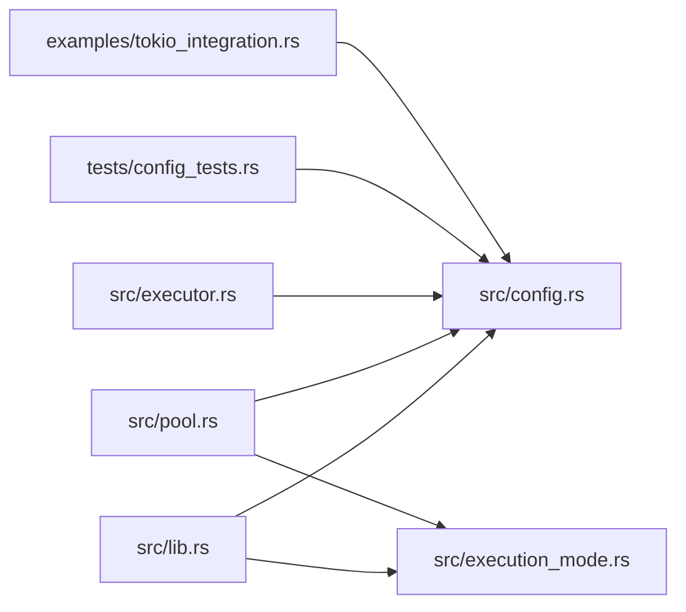

# 配置 API

<cite>
**本文引用的文件**
- [src/config.rs](file://src/config.rs)
- [src/execution_mode.rs](file://src/execution_mode.rs)
- [src/lib.rs](file://src/lib.rs)
- [src/pool.rs](file://src/pool.rs)
- [src/executor.rs](file://src/executor.rs)
- [tests/config_tests.rs](file://tests/config_tests.rs)
- [examples/tokio_integration.rs](file://examples/tokio_integration.rs)
- [EXECUTOR_CUSTOM.md](file://EXECUTOR_CUSTOM.md)
</cite>

## 目录
1. [简介](#简介)
2. [项目结构](#项目结构)
3. [核心组件](#核心组件)
4. [架构总览](#架构总览)
5. [详细组件分析](#详细组件分析)
6. [依赖分析](#依赖分析)
7. [性能考量](#性能考量)
8. [故障排查指南](#故障排查指南)
9. [结论](#结论)
10. [附录](#附录)

## 简介
本文件为配置相关 API 的权威参考，重点覆盖两大配置结构体：
- CommandConfig：描述一次外部命令执行的参数与行为，包括程序名、参数、工作目录、超时时间等。
- ExecutionConfig：描述命令池的执行模式与并发控制，包括执行模式（线程/进程）、工作线程/进程数、并发限制等。

文档将逐项说明字段含义、默认值、可用方法、典型用法、配置间的优先级与相互关系，并提供最佳实践与性能影响分析，帮助读者在不同场景下正确配置与优化。

## 项目结构
与配置 API 直接相关的模块与文件如下：
- 配置定义：src/config.rs（CommandConfig）、src/execution_mode.rs（ExecutionConfig、ExecutionMode）
- 公开导出：src/lib.rs（向外部暴露 API）
- 命令池集成：src/pool.rs（使用 ExecutionConfig 控制执行策略）
- 执行器与错误：src/executor.rs、src/error.rs（执行器如何读取 CommandConfig，错误类型）
- 示例与测试：examples/tokio_integration.rs（演示在自定义执行器中使用 CommandConfig 的工作目录与超时）、tests/config_tests.rs（验证默认值与方法行为）

图表来源
- [src/lib.rs](file://src/lib.rs#L10-L16)
- [src/config.rs](file://src/config.rs#L3-L25)
- [src/execution_mode.rs](file://src/execution_mode.rs#L21-L32)
- [src/pool.rs](file://src/pool.rs#L13-L21)
- [src/executor.rs](file://src/executor.rs#L1-L20)
- [examples/tokio_integration.rs](file://examples/tokio_integration.rs#L21-L40)
- [tests/config_tests.rs](file://tests/config_tests.rs#L4-L27)

章节来源
- [src/lib.rs](file://src/lib.rs#L10-L16)
- [src/config.rs](file://src/config.rs#L3-L25)
- [src/execution_mode.rs](file://src/execution_mode.rs#L21-L32)
- [src/pool.rs](file://src/pool.rs#L13-L21)
- [src/executor.rs](file://src/executor.rs#L1-L20)
- [examples/tokio_integration.rs](file://examples/tokio_integration.rs#L21-L40)
- [tests/config_tests.rs](file://tests/config_tests.rs#L4-L27)

## 核心组件
本节聚焦两大配置结构体的字段、方法与默认行为。

- CommandConfig
  - 字段
    - program: 命令程序名或可执行路径（字符串）
    - args: 传递给程序的参数列表（字符串向量）
    - working_dir: 可选的工作目录（字符串），未设置时使用当前目录
    - timeout: 可选的超时时间（Duration），未设置时默认 10 秒
  - 关键方法
    - new(program, args): 构造函数，设置默认超时为 10 秒，工作目录为 None
    - with_working_dir(dir): 设置工作目录并返回新的配置实例（链式）
    - with_timeout(timeout): 设置超时时间并返回新的配置实例（链式）
    - program(): 获取程序名
    - args(): 获取参数列表
    - working_dir(): 获取工作目录（可选）
    - timeout(): 获取超时时间（可选）
  - 默认值与行为
    - 默认超时：10 秒
    - 默认工作目录：None（使用当前目录）
    - 测试验证：tests/config_tests.rs 展示了默认值与方法行为

- ExecutionConfig
  - 字段
    - mode: 执行模式（ExecutionMode::Thread 或 ExecutionMode::Process）
    - workers: 工作线程数（线程模式）或工作进程数（进程模式）
    - concurrency_limit: 可选的并发限制（进程模式下的外部进程并发上限）
  - 关键方法
    - new(): 创建默认配置（进程模式，workers 为系统可用并行度或 4）
    - with_mode(mode): 设置执行模式
    - with_workers(workers): 设置工作线程/进程数
    - with_concurrency_limit(limit): 设置并发限制
  - 默认值与行为
    - 默认模式：进程模式（Process）
    - workers：优先使用系统可用并行度，否则回退为 4
    - concurrency_limit：默认 None（不限制）

章节来源
- [src/config.rs](file://src/config.rs#L3-L25)
- [src/config.rs](file://src/config.rs#L27-L108)
- [tests/config_tests.rs](file://tests/config_tests.rs#L4-L27)
- [src/execution_mode.rs](file://src/execution_mode.rs#L21-L32)
- [src/execution_mode.rs](file://src/execution_mode.rs#L34-L63)
- [src/execution_mode.rs](file://src/execution_mode.rs#L15-L19)
- [src/execution_mode.rs](file://src/execution_mode.rs#L65-L69)

## 架构总览
CommandConfig 与 ExecutionConfig 在命令池中的协作关系如下：
- CommandPool 内部持有 ExecutionConfig，并据此选择执行策略（线程模式或进程模式）
- 执行器在执行 CommandConfig 时，读取其 program、args、working_dir、timeout 等字段
- 自定义执行器可直接使用 CommandConfig 的只读访问方法

图表来源
- [src/config.rs](file://src/config.rs#L19-L25)
- [src/execution_mode.rs](file://src/execution_mode.rs#L21-L32)
- [src/execution_mode.rs](file://src/execution_mode.rs#L5-L13)
- [src/pool.rs](file://src/pool.rs#L13-L21)

章节来源
- [src/pool.rs](file://src/pool.rs#L13-L21)
- [src/execution_mode.rs](file://src/execution_mode.rs#L5-L13)
- [src/config.rs](file://src/config.rs#L19-L25)

## 详细组件分析

### CommandConfig 详解
- 字段与作用
  - program：外部命令的可执行文件名或绝对/相对路径
  - args：传递给命令的参数列表
  - working_dir：命令执行的工作目录；None 表示使用当前目录
  - timeout：命令的最大执行时间；None 表示不设置超时
- 默认值
  - timeout 默认为 10 秒
  - working_dir 默认为 None
- 方法与用法
  - new：创建配置并设置默认超时
  - with_working_dir：设置工作目录（链式）
  - with_timeout：设置超时（链式）
  - program/args/working_dir/timeout：只读访问
- 与执行器的关系
  - 自定义执行器通过只读方法读取上述字段，决定如何构建子进程、设置工作目录与超时
- 示例与测试
  - tests/config_tests.rs 验证默认值与方法行为
  - examples/tokio_integration.rs 展示在自定义执行器中如何使用 working_dir 与 timeout

图表来源
- [src/pool.rs](file://src/pool.rs#L134-L143)
- [src/pool.rs](file://src/pool.rs#L165-L172)
- [src/executor.rs](file://src/executor.rs#L1-L20)
- [examples/tokio_integration.rs](file://examples/tokio_integration.rs#L21-L40)

章节来源
- [src/config.rs](file://src/config.rs#L3-L25)
- [src/config.rs](file://src/config.rs#L27-L108)
- [tests/config_tests.rs](file://tests/config_tests.rs#L4-L27)
- [examples/tokio_integration.rs](file://examples/tokio_integration.rs#L21-L40)

### ExecutionConfig 详解
- 字段与作用
  - mode：执行模式（线程模式或进程模式）
  - workers：工作线程数（线程模式）或工作进程数（进程模式）
  - concurrency_limit：进程模式下对外部进程的并发限制
- 默认值
  - mode 默认为进程模式（Process）
  - workers 默认为系统可用并行度，若不可用则为 4
  - concurrency_limit 默认为 None（不限制）
- 方法与用法
  - new：创建默认配置
  - with_mode/with_workers/with_concurrency_limit：链式设置各配置项
- 与 CommandPool 的关系
  - CommandPool::with_config 接受 ExecutionConfig，并据此初始化线程执行器或进程执行器
  - 进程模式下，若设置了并发限制，则使用带信号量的执行器变体

图表来源
- [src/execution_mode.rs](file://src/execution_mode.rs#L34-L63)

章节来源
- [src/execution_mode.rs](file://src/execution_mode.rs#L21-L32)
- [src/execution_mode.rs](file://src/execution_mode.rs#L34-L63)
- [src/execution_mode.rs](file://src/execution_mode.rs#L15-L19)
- [src/execution_mode.rs](file://src/execution_mode.rs#L65-L69)
- [src/pool.rs](file://src/pool.rs#L55-L67)
- [src/pool.rs](file://src/pool.rs#L165-L172)

### 配置优先级与相互关系
- CommandConfig 的优先级
  - 单条任务级配置：每条 CommandConfig 可独立设置 working_dir 与 timeout
  - 若某条任务未设置 working_dir，则使用当前目录
  - 若某条任务未设置 timeout，则不强制超时
- ExecutionConfig 的优先级
  - 池级配置：CommandPool 的执行模式、工作线程/进程数、并发限制
  - 进程模式下，concurrency_limit 用于限制同时运行的外部进程数量
- 组合关系
  - CommandPool 根据 ExecutionConfig 决定执行策略（线程模式 vs 进程模式）
  - 自定义执行器在执行时读取 CommandConfig 的 working_dir 与 timeout，从而实现任务级超时与工作目录控制

章节来源
- [src/config.rs](file://src/config.rs#L3-L25)
- [src/execution_mode.rs](file://src/execution_mode.rs#L21-L32)
- [src/pool.rs](file://src/pool.rs#L134-L143)
- [src/pool.rs](file://src/pool.rs#L165-L172)

## 依赖分析
- 模块耦合
  - CommandPool 依赖 ExecutionConfig 决策执行策略
  - 执行器（含自定义执行器）依赖 CommandConfig 的只读访问方法
  - 错误类型 ExecuteError 由执行器返回，包含超时错误
- 外部依赖
  - 标准库 Duration 用于超时
  - tokio（示例）用于异步执行器实现

图表来源
- [src/lib.rs](file://src/lib.rs#L10-L16)
- [src/pool.rs](file://src/pool.rs#L6-L11)
- [src/executor.rs](file://src/executor.rs#L1-L20)
- [tests/config_tests.rs](file://tests/config_tests.rs#L1-L2)
- [examples/tokio_integration.rs](file://examples/tokio_integration.rs#L1-L7)

章节来源
- [src/lib.rs](file://src/lib.rs#L10-L16)
- [src/pool.rs](file://src/pool.rs#L6-L11)
- [src/executor.rs](file://src/executor.rs#L1-L20)
- [tests/config_tests.rs](file://tests/config_tests.rs#L1-L2)
- [examples/tokio_integration.rs](file://examples/tokio_integration.rs#L1-L7)

## 性能考量
- 超时设置
  - 合理设置 timeout 可避免长时间阻塞，提升整体吞吐与稳定性
  - 对于 I/O 密集型命令，建议设置适中的超时，避免资源占用
- 并发限制
  - 进程模式下，concurrency_limit 可有效防止资源耗尽（CPU/内存/句柄）
  - 结合 workers 数量，平衡吞吐与资源占用
- 工作目录
  - 在需要隔离或权限控制的场景设置 working_dir，避免跨目录 I/O 影响
- 执行模式
  - 线程模式适合轻量、快速命令且需要共享状态的场景
  - 进程模式更稳定，适合易崩溃或需要强隔离的命令

章节来源
- [src/execution_mode.rs](file://src/execution_mode.rs#L34-L63)
- [EXECUTOR_CUSTOM.md](file://EXECUTOR_CUSTOM.md#L173-L179)

## 故障排查指南
- 超时错误
  - 现象：执行器返回 ExecuteError::Timeout
  - 排查：检查 CommandConfig.timeout 是否过短；确认命令本身是否阻塞
  - 参考：tests/config_tests.rs 中的超时断言
- 工作目录无效
  - 现象：命令无法找到文件或权限不足
  - 排查：确认 working_dir 路径存在且可访问
  - 参考：examples/tokio_integration.rs 展示如何设置工作目录
- 并发过高导致资源耗尽
  - 现象：系统响应缓慢或进程被杀
  - 排查：降低 workers 或设置 concurrency_limit
  - 参考：EXECUTOR_CUSTOM.md 的性能注意事项

章节来源
- [tests/config_tests.rs](file://tests/config_tests.rs#L21-L27)
- [examples/tokio_integration.rs](file://examples/tokio_integration.rs#L21-L40)
- [EXECUTOR_CUSTOM.md](file://EXECUTOR_CUSTOM.md#L173-L179)

## 结论
- CommandConfig 提供任务级的执行参数与超时控制，适合细粒度配置
- ExecutionConfig 提供池级的执行模式与并发控制，适合粗粒度策略
- 两者结合可实现灵活、稳定的命令执行体系：任务级 working_dir/timeout 与池级并发/模式控制相辅相成
- 建议在实际部署中根据任务类型与资源情况，合理设置超时、并发限制与执行模式

## 附录

### 常见配置场景与最佳实践
- 场景一：简单命令，无需超时
  - 设置 CommandConfig.timeout 为 None
  - ExecutionConfig 使用默认值（进程模式，workers 为系统并行度）
- 场景二：I/O 密集命令，需要超时保护
  - 为 CommandConfig 设置合理的 timeout
  - ExecutionConfig 设置 concurrency_limit，避免过多并发导致资源争用
- 场景三：需要隔离工作目录
  - 为 CommandConfig 设置 working_dir
  - ExecutionConfig 使用进程模式，确保更强隔离
- 场景四：高吞吐线程模式
  - ExecutionConfig 设置 mode 为 Thread
  - workers 根据 CPU 核心数与任务特性调整

章节来源
- [src/config.rs](file://src/config.rs#L39-L46)
- [src/execution_mode.rs](file://src/execution_mode.rs#L34-L44)
- [EXECUTOR_CUSTOM.md](file://EXECUTOR_CUSTOM.md#L173-L179)