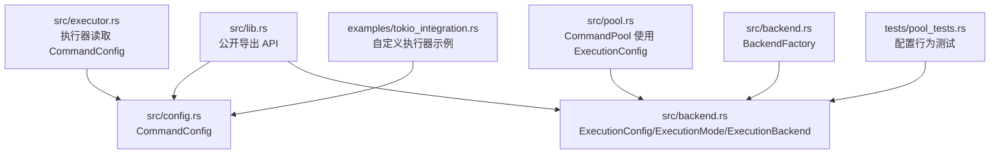
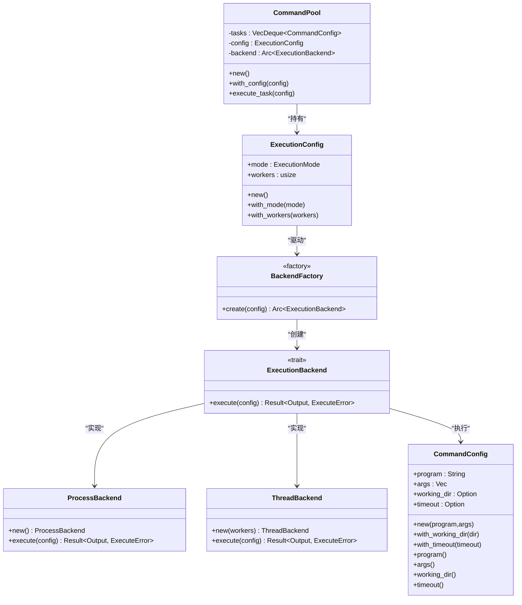
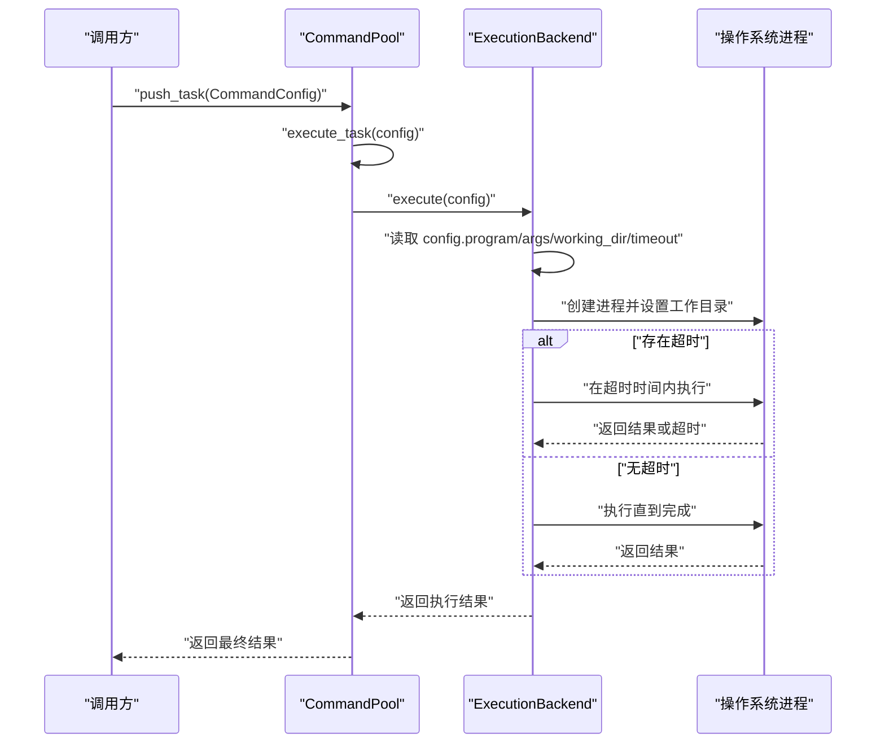
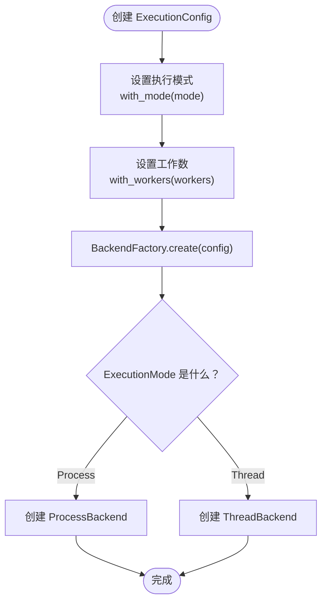
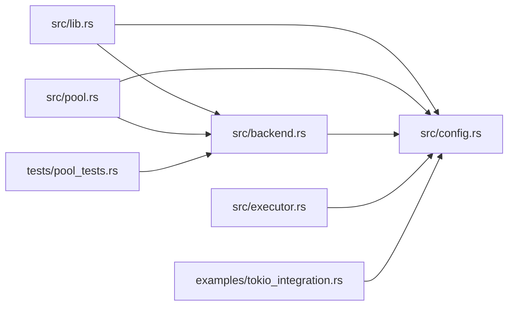

# 配置 API

<cite>
**本文引用的文件**
- [src/config.rs](file://src/config.rs)
- [src/backend.rs](file://src/backend.rs)
- [src/lib.rs](file://src/lib.rs)
- [src/pool.rs](file://src/pool.rs)
- [src/executor.rs](file://src/executor.rs)
- [tests/config_tests.rs](file://tests/config_tests.rs)
- [tests/pool_tests.rs](file://tests/pool_tests.rs)
- [examples/tokio_integration.rs](file://examples/tokio_integration.rs)
- [EXECUTOR_CUSTOM.md](file://EXECUTOR_CUSTOM.md)
</cite>

## 更新摘要
**所做更改**
- 新增后端配置系统章节，详细介绍 BackendConfig 与 ExecutionConfig 的兼容映射
- 更新架构总览图，展示新的后端工厂模式
- 新增 BackendFactory 和 ExecutionBackend 的详细说明
- 更新配置优先级章节，反映后端系统的引入
- 新增后端系统最佳实践和性能影响分析

## 目录
1. [简介](#简介)
2. [项目结构](#项目结构)
3. [核心组件](#核心组件)
4. [架构总览](#架构总览)
5. [详细组件分析](#详细组件分析)
6. [后端配置系统](#后端配置系统)
7. [依赖分析](#依赖分析)
8. [性能考量](#性能考量)
9. [故障排查指南](#故障排查指南)
10. [结论](#结论)
11. [附录](#附录)

## 简介
本文件为配置相关 API 的权威参考，重点覆盖三大配置系统：
- CommandConfig：描述一次外部命令执行的参数与行为，包括程序名、参数、工作目录、超时时间等。
- ExecutionConfig：描述命令池的执行模式与并发控制，包括执行模式（线程/进程）、工作线程/进程数等。
- BackendConfig：新的后端配置系统，提供与旧的 ExecutionConfig 的兼容映射，支持可扩展的后端执行器。

文档将逐项说明字段含义、默认值、可用方法、典型用法、配置间的优先级与相互关系，并提供最佳实践与性能影响分析，帮助读者在不同场景下正确配置与优化。

## 项目结构
与配置 API 直接相关的模块与文件如下：
- 配置定义：src/config.rs（CommandConfig）、src/backend.rs（ExecutionConfig、ExecutionMode、ExecutionBackend、BackendFactory）
- 公开导出：src/lib.rs（向外部暴露 API）
- 命令池集成：src/pool.rs（使用 ExecutionConfig 控制执行策略）
- 执行器与错误：src/executor.rs（执行器如何读取 CommandConfig，错误类型）
- 示例与测试：examples/tokio_integration.rs（演示在自定义执行器中使用 CommandConfig 的工作目录与超时）、tests/pool_tests.rs（验证后端配置行为）

**图表来源**
- [src/lib.rs](file://src/lib.rs#L9-L14)
- [src/config.rs](file://src/config.rs#L3-L25)
- [src/backend.rs](file://src/backend.rs#L7-L27)
- [src/pool.rs](file://src/pool.rs#L12-L17)
- [src/executor.rs](file://src/executor.rs#L30-L70)
- [src/backend.rs](file://src/backend.rs#L97-L107)
- [examples/tokio_integration.rs](file://examples/tokio_integration.rs#L1-L62)
- [tests/pool_tests.rs](file://tests/pool_tests.rs#L1-L43)

**章节来源**
- [src/lib.rs](file://src/lib.rs#L9-L14)
- [src/config.rs](file://src/config.rs#L3-L25)
- [src/backend.rs](file://src/backend.rs#L7-L27)
- [src/pool.rs](file://src/pool.rs#L12-L17)
- [src/executor.rs](file://src/executor.rs#L30-L70)
- [src/backend.rs](file://src/backend.rs#L97-L107)
- [examples/tokio_integration.rs](file://examples/tokio_integration.rs#L1-L62)
- [tests/pool_tests.rs](file://tests/pool_tests.rs#L1-L43)

## 核心组件
本节聚焦三大配置结构体的字段、方法与默认行为。

### CommandConfig
- 字段
  - program: 命令程序名或可执行路径（字符串）
  - args: 传递给程序的参数列表（字符串向量）
  - working_dir: 可选的工作目录（字符串），未设置时使用当前目录
  - timeout: 可选的超时时间（Duration），未设置时默认 10 秒
- 关键方法
  - new(program, args): 构造函数，设置默认超时为 10 秒，工作目录为 None
  - with_working_dir(dir): 设置工作目录并返回新的配置实例（链式）
  - with_timeout(timeout): 设置超时时间并返回新的配置实例（链式）
  - program(): 获取程序名
  - args(): 获取参数列表
  - working_dir(): 获取工作目录（可选）
  - timeout(): 获取超时时间（可选）
- 默认值与行为
  - 默认超时：10 秒
  - 默认工作目录：None（使用当前目录）
  - 测试验证：tests/config_tests.rs 展示了默认值与方法行为

### ExecutionConfig
- 字段
  - mode: 执行模式（ExecutionMode::Thread 或 ExecutionMode::Process）
  - workers: 工作线程数（线程模式）或工作进程数（进程模式）
- 关键方法
  - new(): 创建默认配置（进程模式，workers 为系统可用并行度或 4）
  - with_mode(mode): 设置执行模式
  - with_workers(workers): 设置工作线程/进程数
- 默认值与行为
  - 默认模式：进程模式（Process）
  - workers：优先使用系统可用并行度，否则回退为 4

### ExecutionBackend
- 接口定义
  - execute(config: &CommandConfig): Result<Output, ExecuteError>
- 实现类型
  - ProcessBackend: 每个命令独立子进程执行
  - ThreadBackend: 使用线程池调度任务执行
- 工厂模式
  - BackendFactory::create(config: &ExecutionConfig): Arc<dyn ExecutionBackend>
  - 根据 ExecutionMode 返回对应的后端实现

**章节来源**
- [src/config.rs](file://src/config.rs#L3-L25)
- [src/config.rs](file://src/config.rs#L27-L108)
- [tests/config_tests.rs](file://tests/config_tests.rs#L4-L27)
- [src/backend.rs](file://src/backend.rs#L22-L48)
- [src/backend.rs](file://src/backend.rs#L13-L20)
- [src/backend.rs](file://src/backend.rs#L56-L95)
- [src/backend.rs](file://src/backend.rs#L97-L107)

## 架构总览
CommandConfig、ExecutionConfig 与 ExecutionBackend 在命令池中的协作关系如下：
- CommandPool 内部持有 ExecutionConfig，并通过 BackendFactory 创建对应的 ExecutionBackend 实例
- ExecutionBackend 定义统一的执行接口，支持多种后端实现
- 执行器在执行 CommandConfig 时，通过 ExecutionBackend 的 execute 方法处理具体执行逻辑
- 自定义执行器可直接使用 CommandConfig 的只读访问方法

**图表来源**
- [src/config.rs](file://src/config.rs#L19-L25)
- [src/backend.rs](file://src/backend.rs#L22-L27)
- [src/backend.rs](file://src/backend.rs#L7-L10)
- [src/backend.rs](file://src/backend.rs#L56-L69)
- [src/backend.rs](file://src/backend.rs#L77-L95)
- [src/backend.rs](file://src/backend.rs#L97-L107)
- [src/pool.rs](file://src/pool.rs#L12-L17)

**章节来源**
- [src/pool.rs](file://src/pool.rs#L12-L17)
- [src/backend.rs](file://src/backend.rs#L7-L10)
- [src/config.rs](file://src/config.rs#L19-L25)
- [src/backend.rs](file://src/backend.rs#L97-L107)

## 详细组件分析

### CommandConfig 详解
- 字段与作用
  - program：外部命令的可执行文件名或绝对/相对路径
  - args：传递给命令的参数列表
  - working_dir：命令执行的工作目录；None 表示使用当前目录
  - timeout：命令的最大执行时间；None 表示不设置超时
- 默认值
  - timeout 默认为 10 秒
  - working_dir 默认为 None
- 方法与用法
  - new：创建配置并设置默认超时
  - with_working_dir：设置工作目录（链式）
  - with_timeout：设置超时（链式）
  - program/args/working_dir/timeout：只读访问
- 与执行器的关系
  - 自定义执行器通过只读方法读取上述字段，决定如何构建子进程、设置工作目录与超时
- 示例与测试
  - tests/config_tests.rs 验证默认值与方法行为
  - examples/tokio_integration.rs 展示在自定义执行器中如何使用 working_dir 与 timeout

**图表来源**
- [src/pool.rs](file://src/pool.rs#L91-L94)
- [src/backend.rs](file://src/backend.rs#L8-L10)
- [src/executor.rs](file://src/executor.rs#L30-L70)
- [examples/tokio_integration.rs](file://examples/tokio_integration.rs#L21-L40)

**章节来源**
- [src/config.rs](file://src/config.rs#L3-L25)
- [src/config.rs](file://src/config.rs#L27-L108)
- [tests/config_tests.rs](file://tests/config_tests.rs#L4-L27)
- [examples/tokio_integration.rs](file://examples/tokio_integration.rs#L21-L40)

### ExecutionConfig 详解
- 字段与作用
  - mode：执行模式（线程模式或进程模式）
  - workers：工作线程数（线程模式）或工作进程数（进程模式）
- 默认值
  - mode 默认为进程模式（Process）
  - workers 默认为系统可用并行度，若不可用则为 4
- 方法与用法
  - new：创建默认配置
  - with_mode/with_workers：链式设置各配置项
- 与 CommandPool 的关系
  - CommandPool::with_config 接受 ExecutionConfig，并通过 BackendFactory 创建对应的 ExecutionBackend
  - 不同的 ExecutionMode 决定创建 ProcessBackend 或 ThreadBackend 实例

**图表来源**
- [src/backend.rs](file://src/backend.rs#L39-L47)
- [src/backend.rs](file://src/backend.rs#L100-L107)

**章节来源**
- [src/backend.rs](file://src/backend.rs#L22-L48)
- [src/backend.rs](file://src/backend.rs#L39-L47)
- [src/backend.rs](file://src/backend.rs#L100-L107)
- [src/pool.rs](file://src/pool.rs#L26-L34)

### 配置优先级与相互关系
- CommandConfig 的优先级
  - 单条任务级配置：每条 CommandConfig 可独立设置 working_dir 与 timeout
  - 若某条任务未设置 working_dir，则使用当前目录
  - 若某条任务未设置 timeout，则不强制超时
- ExecutionConfig 的优先级
  - 池级配置：CommandPool 的执行模式、工作线程/进程数
  - ExecutionMode 决定后端实现的选择
- 后端系统的影响
  - ExecutionConfig 通过 BackendFactory 转换为具体的 ExecutionBackend 实现
  - 不同后端实现对任务执行有不同性能特征
  - 后端系统提供了可扩展的执行器架构

**章节来源**
- [src/config.rs](file://src/config.rs#L3-L25)
- [src/backend.rs](file://src/backend.rs#L22-L48)
- [src/pool.rs](file://src/pool.rs#L26-L34)
- [src/backend.rs](file://src/backend.rs#L100-L107)

## 后端配置系统

### ExecutionBackend 接口
ExecutionBackend 是新的后端执行接口，定义了统一的任务执行标准：

- 接口方法
  - execute(&self, config: &CommandConfig): 执行命令配置并返回结果
- 设计优势
  - 抽象化执行逻辑，支持多种后端实现
  - 统一错误处理机制
  - 支持异步和同步执行器的统一接口

### 后端实现类型

#### ProcessBackend
- 特点：每个命令独立子进程执行
- 适用场景：需要强隔离、易崩溃命令的场景
- 性能特征：进程创建开销较大，但隔离性好
- 实现方式：直接调用标准库执行器

#### ThreadBackend  
- 特点：使用线程池调度任务执行
- 适用场景：轻量、快速命令且需要共享状态的场景
- 性能特征：线程切换开销小，但共享状态需谨慎处理
- 实现方式：通过线程池管理执行上下文

### BackendFactory 工厂模式
BackendFactory 提供了统一的后端创建接口：

- 核心方法
  - create(config: &ExecutionConfig): Arc<dyn ExecutionBackend>
- 工作原理
  - 根据 ExecutionMode 枚举值选择对应的后端实现
  - 返回 Arc 包装的动态分发对象
- 扩展性
  - 支持添加新的后端实现而无需修改现有代码
  - 符合开闭原则，对扩展开放，对修改封闭

### 兼容映射机制
新的后端系统与旧的 ExecutionConfig 保持完全兼容：

- 向后兼容
  - 旧的 ExecutionConfig 代码无需修改即可继续使用
  - 后端工厂自动处理配置转换
- 功能增强
  - 保持原有执行模式和并发控制功能
  - 提供更清晰的架构分离
  - 支持未来扩展新的执行后端

**章节来源**
- [src/backend.rs](file://src/backend.rs#L7-L10)
- [src/backend.rs](file://src/backend.rs#L56-L69)
- [src/backend.rs](file://src/backend.rs#L77-L95)
- [src/backend.rs](file://src/backend.rs#L97-L107)
- [src/pool.rs](file://src/pool.rs#L26-L34)

## 依赖分析
- 模块耦合
  - CommandPool 依赖 ExecutionConfig 通过 BackendFactory 决策后端实现
  - ExecutionBackend 定义统一接口，支持多种实现
  - 执行器（含自定义执行器）依赖 CommandConfig 的只读访问方法
  - 错误类型 ExecuteError 由执行器返回，包含超时错误
- 外部依赖
  - 标准库 Duration 用于超时
  - tokio（示例）用于异步执行器实现

**图表来源**
- [src/lib.rs](file://src/lib.rs#L9-L14)
- [src/pool.rs](file://src/pool.rs#L6-L9)
- [src/backend.rs](file://src/backend.rs#L1-L6)
- [src/executor.rs](file://src/executor.rs#L3-L4)
- [tests/pool_tests.rs](file://tests/pool_tests.rs#L1)
- [examples/tokio_integration.rs](file://examples/tokio_integration.rs#L1)

**章节来源**
- [src/lib.rs](file://src/lib.rs#L9-L14)
- [src/pool.rs](file://src/pool.rs#L6-L9)
- [src/backend.rs](file://src/backend.rs#L1-L6)
- [src/executor.rs](file://src/executor.rs#L3-L4)
- [tests/pool_tests.rs](file://tests/pool_tests.rs#L1)
- [examples/tokio_integration.rs](file://examples/tokio_integration.rs#L1)

## 性能考量
- 超时设置
  - 合理设置 timeout 可避免长时间阻塞，提升整体吞吐与稳定性
  - 对于 I/O 密集型命令，建议设置适中的超时，避免资源占用
- 并发限制
  - ExecutionConfig 的 workers 数量影响后端执行效率
  - 不同后端实现对并发的支持程度不同
- 工作目录
  - 在需要隔离或权限控制的场景设置 working_dir，避免跨目录 I/O 影响
- 执行模式
  - 线程模式适合轻量、快速命令且需要共享状态的场景
  - 进程模式更稳定，适合易崩溃或需要强隔离的命令
- 后端选择
  - ProcessBackend：强隔离，适合复杂命令，但开销较大
  - ThreadBackend：低开销，适合简单命令，需注意状态共享
  - 新后端实现可根据特定需求优化性能

**章节来源**
- [src/backend.rs](file://src/backend.rs#L22-L48)
- [src/backend.rs](file://src/backend.rs#L56-L95)
- [EXECUTOR_CUSTOM.md](file://EXECUTOR_CUSTOM.md#L173-L179)

## 故障排查指南
- 超时错误
  - 现象：执行器返回 ExecuteError::Timeout
  - 排查：检查 CommandConfig.timeout 是否过短；确认命令本身是否阻塞
  - 参考：tests/config_tests.rs 中的超时断言
- 工作目录无效
  - 现象：命令无法找到文件或权限不足
  - 排查：确认 working_dir 路径存在且可访问
  - 参考：examples/tokio_integration.rs 展示如何设置工作目录
- 后端选择问题
  - 现象：执行性能异常或资源使用不当
  - 排查：确认 ExecutionMode 设置是否符合任务特性
  - 参考：tests/pool_tests.rs 中的后端配置测试
- 并发过高导致资源耗尽
  - 现象：系统响应缓慢或进程被杀
  - 排查：降低 workers 数量或考虑使用不同的后端实现
  - 参考：EXECUTOR_CUSTOM.md 的性能注意事项

**章节来源**
- [tests/config_tests.rs](file://tests/config_tests.rs#L21-L27)
- [examples/tokio_integration.rs](file://examples/tokio_integration.rs#L21-L40)
- [tests/pool_tests.rs](file://tests/pool_tests.rs#L30-L43)
- [EXECUTOR_CUSTOM.md](file://EXECUTOR_CUSTOM.md#L173-L179)

## 结论
- CommandConfig 提供任务级的执行参数与超时控制，适合细粒度配置
- ExecutionConfig 提供池级的执行模式与并发控制，适合粗粒度策略
- 新的后端配置系统通过 ExecutionBackend 接口和 BackendFactory 工厂模式，提供了可扩展的执行架构
- ExecutionBackend 支持多种后端实现，ProcessBackend 和 ThreadBackend 各有优势
- 后端系统保持与旧配置的完全兼容，同时为未来扩展提供基础
- 建议在实际部署中根据任务类型与资源情况，合理设置超时、并发限制与执行模式

## 附录

### 常见配置场景与最佳实践
- 场景一：简单命令，无需超时
  - 设置 CommandConfig.timeout 为 None
  - ExecutionConfig 使用默认值（进程模式，workers 为系统并行度）
- 场景二：I/O 密集命令，需要超时保护
  - 为 CommandConfig 设置合理的 timeout
  - ExecutionConfig 设置合适的 workers 数量，避免过多并发导致资源争用
- 场景三：需要隔离工作目录
  - 为 CommandConfig 设置 working_dir
  - ExecutionConfig 使用进程模式，确保更强隔离
- 场景四：高吞吐线程模式
  - ExecutionConfig 设置 mode 为 Thread
  - workers 根据 CPU 核心数与任务特性调整
- 场景五：新后端系统集成
  - 保持现有 ExecutionConfig 配置不变
  - 后端工厂自动选择合适的 ExecutionBackend 实现
  - 可通过自定义 ExecutionBackend 实现扩展新的执行能力

**章节来源**
- [src/config.rs](file://src/config.rs#L39-L46)
- [src/backend.rs](file://src/backend.rs#L22-L48)
- [src/backend.rs](file://src/backend.rs#L56-L95)
- [EXECUTOR_CUSTOM.md](file://EXECUTOR_CUSTOM.md#L173-L179)