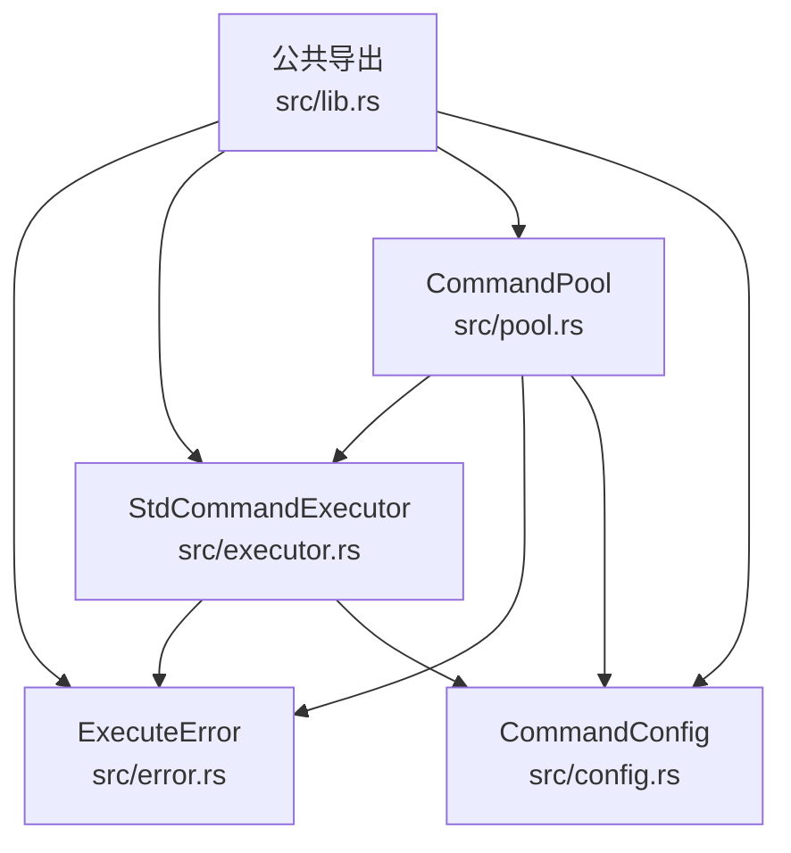
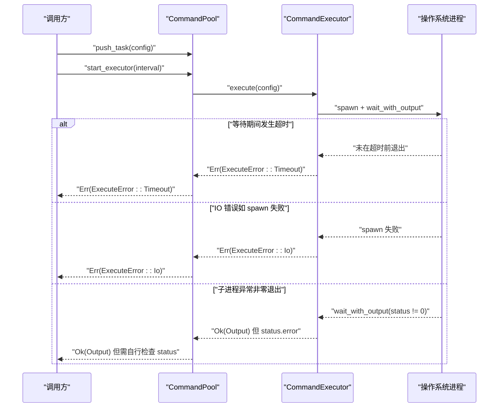
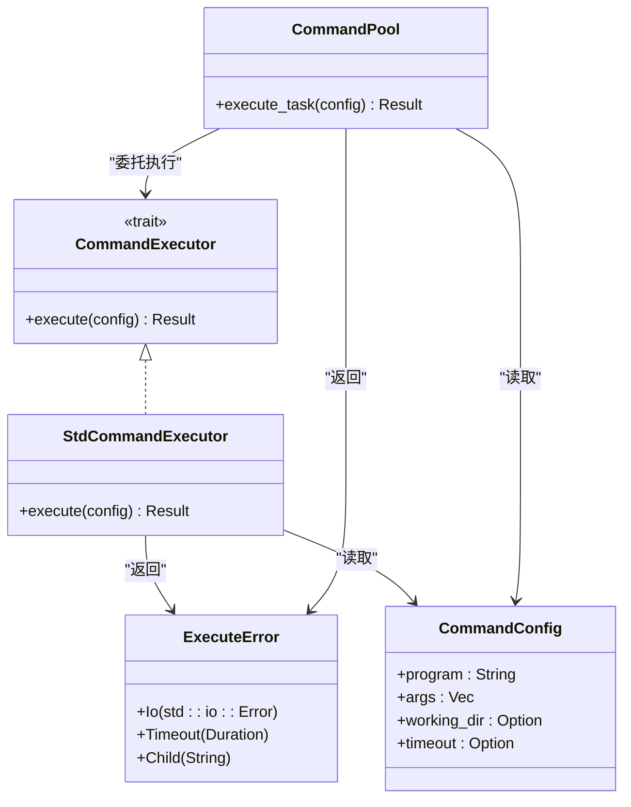

# 错误处理 API

<cite>
**本文引用的文件**
- [src/error.rs](file://src/error.rs)
- [src/executor.rs](file://src/executor.rs)
- [src/pool.rs](file://src/pool.rs)
- [src/config.rs](file://src/config.rs)
- [src/lib.rs](file://src/lib.rs)
- [examples/tokio_integration.rs](file://examples/tokio_integration.rs)
- [EXECUTOR_CUSTOM.md](file://EXECUTOR_CUSTOM.md)
- [README.md](file://README.md)
</cite>

## 目录
1. [简介](#简介)
2. [项目结构](#项目结构)
3. [核心组件](#核心组件)
4. [架构总览](#架构总览)
5. [详细组件分析](#详细组件分析)
6. [依赖关系分析](#依赖关系分析)
7. [性能考量](#性能考量)
8. [故障排查指南](#故障排查指南)
9. [结论](#结论)

## 简介
本文件面向“错误处理 API”的参考文档，聚焦于 ExecuteError 枚举及其在命令执行与命令池中的传播与恢复策略。内容涵盖：
- ExecuteError 的所有错误类型与错误信息
- 每种错误的触发条件、错误码含义与处理建议
- 错误在执行器与命令池中的传播机制
- 具体的代码示例路径（以源码路径代替具体代码）
- 错误诊断与调试技巧

## 项目结构
围绕错误处理的关键模块如下：
- 错误定义：src/error.rs
- 执行器与命令执行：src/executor.rs
- 命令池与任务执行：src/pool.rs
- 命令配置：src/config.rs
- 公共导出：src/lib.rs
- 示例与自定义执行器：examples/tokio_integration.rs、EXECUTOR_CUSTOM.md
- 顶层说明：README.md

图表来源
- [src/error.rs](file://src/error.rs#L1-L18)
- [src/executor.rs](file://src/executor.rs#L1-L100)
- [src/pool.rs](file://src/pool.rs#L1-L296)
- [src/config.rs](file://src/config.rs#L1-L109)
- [src/lib.rs](file://src/lib.rs#L1-L17)

章节来源
- [src/lib.rs](file://src/lib.rs#L1-L17)
- [README.md](file://README.md#L1-L60)

## 核心组件
- ExecuteError：统一的执行错误抽象，覆盖 IO 错误、超时错误、子进程错误等。
- CommandExecutor：命令执行接口，定义 execute(config) -> Result<Output, ExecuteError>。
- StdCommandExecutor：基于标准库的同步执行器实现。
- CommandPool：命令池，负责任务调度与执行，内部委托执行器执行并传播错误。
- CommandConfig：命令配置，包含程序名、参数、工作目录、超时等。

章节来源
- [src/error.rs](file://src/error.rs#L1-L18)
- [src/executor.rs](file://src/executor.rs#L1-L100)
- [src/pool.rs](file://src/pool.rs#L1-L296)
- [src/config.rs](file://src/config.rs#L1-L109)
- [src/lib.rs](file://src/lib.rs#L10-L16)

## 架构总览
下面的序列图展示了命令执行从配置到输出的完整流程，以及错误在各层的传播路径。

图表来源
- [src/pool.rs](file://src/pool.rs#L222-L227)
- [src/executor.rs](file://src/executor.rs#L20-L70)
- [src/error.rs](file://src/error.rs#L8-L17)

## 详细组件分析

### ExecuteError 枚举详解
ExecuteError 是统一的错误抽象，定义于 src/error.rs，包含以下变体：
- Io(std::io::Error)
  - 触发条件：进程启动失败、读写管道失败、等待子进程失败等底层 IO 异常。
  - 错误码含义：映射为标准 IO 错误类型，可通过 std::io::Error 的错误码与上下文识别具体原因。
  - 处理建议：检查程序路径、权限、环境变量、工作目录、资源限制等；必要时重试或降级策略。
  - 传播路径：StdCommandExecutor.execute 与 CommandPool.execute_task 直接返回该错误。
- Timeout(Duration)
  - 触发条件：CommandConfig 设置了超时，且 wait_timeout 检测到子进程未在超时时间内退出。
  - 错误码含义：表示“在指定 Duration 时间内未完成”，通常伴随子进程仍在运行。
  - 处理建议：记录超时详情（命令、参数、超时值），尝试 kill 子进程并清理资源；对关键任务可重试或降级。
  - 传播路径：StdCommandExecutor.execute 在超时分支返回该错误；Tokio 自定义执行器也可返回该错误。
- Child(String)
  - 触发条件：当前代码中未直接构造该变体；该变体保留用于未来扩展或上层封装。
  - 错误码含义：字符串化描述子进程错误信息。
  - 处理建议：结合子进程输出与日志进行诊断；在上层业务中可将其转换为更具体的业务错误。
  - 传播路径：当前未在核心执行路径中使用，可在自定义执行器中按需使用。

章节来源
- [src/error.rs](file://src/error.rs#L8-L17)

### 执行器与错误传播
- StdCommandExecutor.execute
  - 通过 execute_command(config) 实现，内部使用 wait-timeout 进行超时等待。
  - 若 spawn 失败或 wait_with_output 失败，返回 ExecuteError::Io。
  - 若 wait_timeout 返回 None，则尝试 kill 并返回 ExecuteError::Timeout。
- CommandPool.execute_task
  - 直接委托 execute_command(config)，并将错误原样返回，保证上层调用可感知具体错误类型。

章节来源
- [src/executor.rs](file://src/executor.rs#L20-L70)
- [src/pool.rs](file://src/pool.rs#L222-L227)

### 自定义执行器与错误处理
- Tokio 异步执行器示例
  - 在 examples/tokio_integration.rs 中展示了如何实现 CommandExecutor，并在超时分支返回 ExecuteError::Timeout。
  - 通过 tokio::time::timeout 包装异步命令执行，超时即返回 Timeout 错误。
- 自定义执行器指南
  - EXECUTOR_CUSTOM.md 提供了完整的自定义执行器实现思路与示例，强调在同步 trait 中使用 block_on 或运行时管理，以及如何正确返回 ExecuteError。

章节来源
- [examples/tokio_integration.rs](file://examples/tokio_integration.rs#L1-L62)
- [EXECUTOR_CUSTOM.md](file://EXECUTOR_CUSTOM.md#L1-L228)

### 命令配置与超时
- CommandConfig
  - 提供 with_timeout 设置超时，影响 StdCommandExecutor.execute 的等待行为。
  - 提供 with_working_dir 设置工作目录，影响进程启动与 IO 行为。
- 超时语义
  - 超时并不自动终止子进程，而是返回 ExecuteError::Timeout；调用方可选择进一步 kill 子进程。

章节来源
- [src/config.rs](file://src/config.rs#L19-L109)
- [src/executor.rs](file://src/executor.rs#L42-L69)

### 错误处理最佳实践与恢复策略
- 捕获与匹配
  - 在调用 CommandPool.execute_task 或自定义执行器 execute 时，使用 match 或 if let 捕获 ExecuteError::Timeout/ExecuteError::Io。
- 超时恢复
  - 记录命令、参数、超时值与时间戳；可选择重试（指数退避）、降级为短超时或取消任务。
- IO 错误处理
  - 分类处理：权限不足、路径不存在、资源耗尽等；必要时切换到备用执行器或回退策略。
- 子进程状态检查
  - 对于 ExecuteError::Io 之外的 Ok(Output)，仍需检查 Output.status 是否成功，以区分“IO 失败”与“命令失败”。

章节来源
- [src/executor.rs](file://src/executor.rs#L72-L99)
- [src/pool.rs](file://src/pool.rs#L222-L227)

## 依赖关系分析
- ExecuteError 作为统一错误类型，被 StdCommandExecutor.execute 与 CommandPool.execute_task 直接使用。
- CommandExecutor 作为接口，允许注入自定义实现（如 Tokio），并保持错误类型一致性。
- CommandConfig 为执行输入，其字段（尤其是 timeout）直接影响错误触发与处理策略。

图表来源
- [src/error.rs](file://src/error.rs#L8-L17)
- [src/executor.rs](file://src/executor.rs#L9-L24)
- [src/pool.rs](file://src/pool.rs#L222-L227)
- [src/config.rs](file://src/config.rs#L19-L25)

## 性能考量
- wait-timeout 避免为每个任务生成额外等待线程，减少系统开销。
- 超时检测与 kill 操作需谨慎，避免频繁中断子进程导致抖动。
- 在高并发场景下，建议结合并发限制与工作线程数优化，降低资源竞争与错误概率。

章节来源
- [README.md](file://README.md#L12-L13)
- [src/executor.rs](file://src/executor.rs#L42-L69)

## 故障排查指南
- 快速定位
  - 检查 ExecuteError::Timeout：确认 CommandConfig.timeout 设置是否合理，观察任务耗时分布。
  - 检查 ExecuteError::Io：关注 spawn 失败、权限问题、路径错误、资源限制等。
  - 检查子进程状态：即使返回 ExecuteError::Io，也需检查 Output.status，区分“IO 失败”与“命令失败”。
- 日志与指标
  - 记录命令、参数、工作目录、超时值、执行耗时、错误类型与错误消息。
- 恢复策略
  - 超时：重试（带退避）、缩短超时、降级任务。
  - IO：修复权限/路径/环境，切换执行器，或回退到同步执行器。
  - 子进程异常：解析输出与日志，定位业务错误并上报。

章节来源
- [src/executor.rs](file://src/executor.rs#L72-L99)
- [src/pool.rs](file://src/pool.rs#L222-L227)

## 结论
ExecuteError 为命令执行提供了统一、清晰的错误抽象，覆盖 IO、超时与子进程错误三大类。通过 StdCommandExecutor 与 CommandPool 的协作，错误在执行链路中逐层传播，便于上层进行分类处理与恢复。结合自定义执行器与合理的超时与并发策略，可构建健壮的命令执行系统。