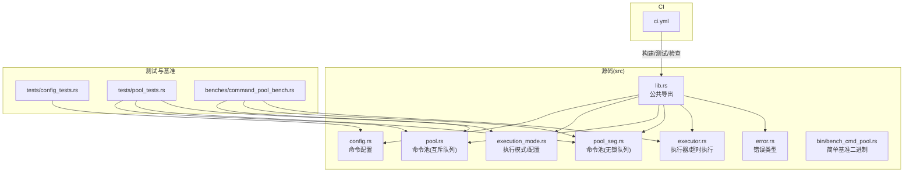
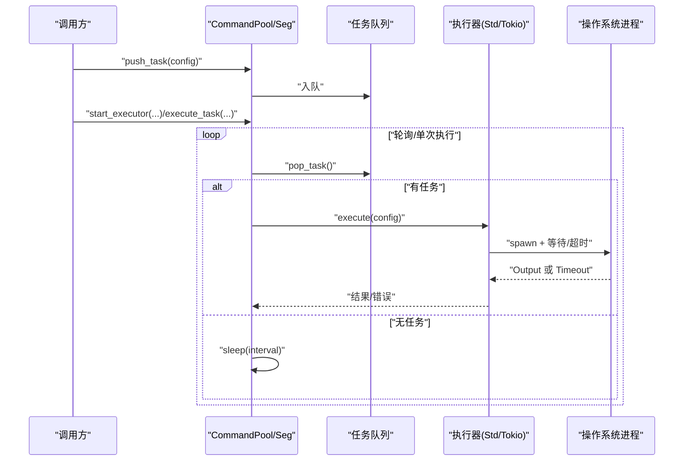
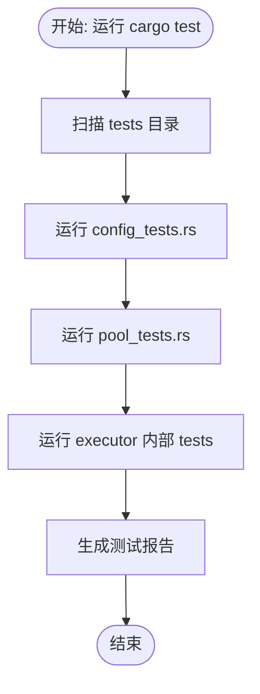
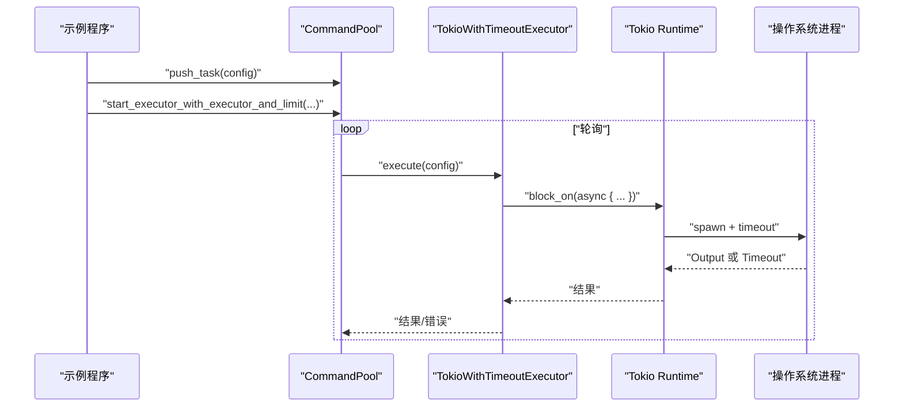
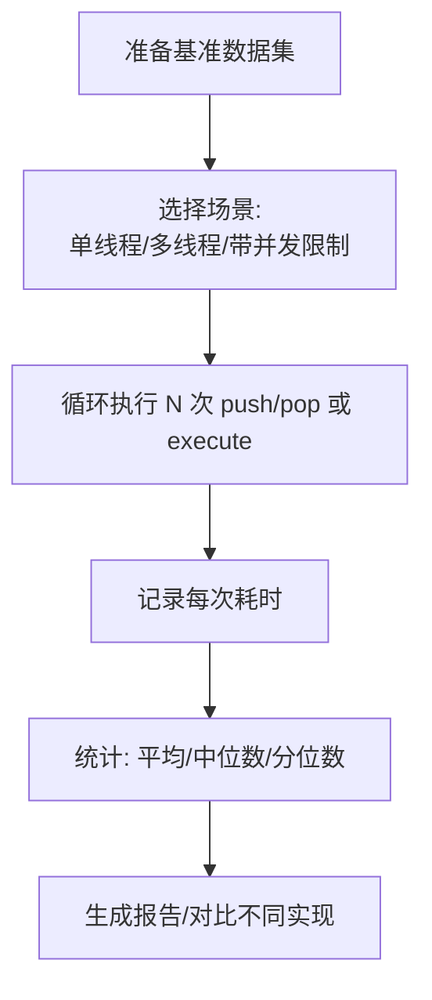
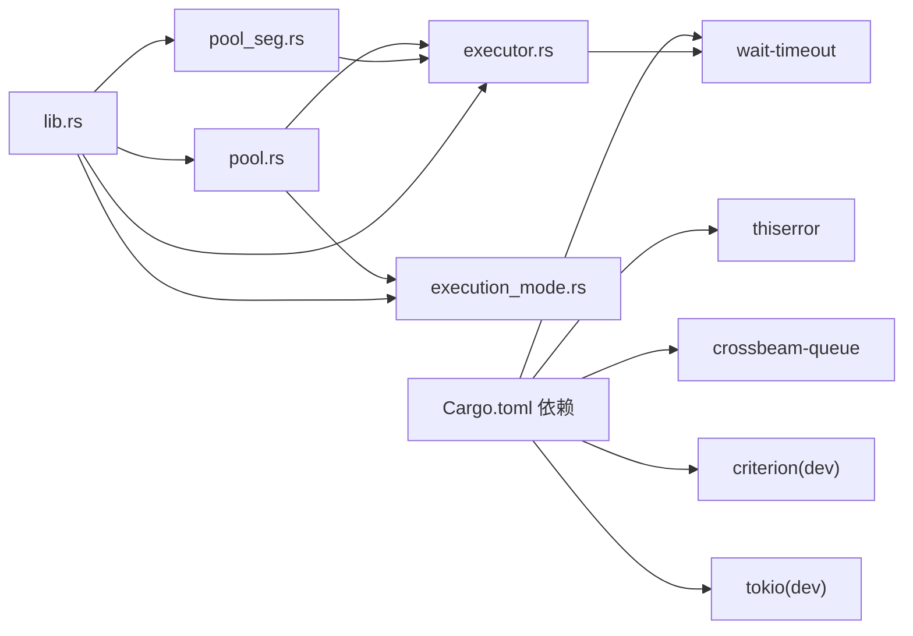

# 测试与基准

<cite>
**本文引用的文件**
- [Cargo.toml](file://Cargo.toml)
- [README.md](file://README.md)
- [.github/workflows/ci.yml](file://.github/workflows/ci.yml)
- [src/lib.rs](file://src/lib.rs)
- [src/config.rs](file://src/config.rs)
- [src/pool.rs](file://src/pool.rs)
- [src/pool_seg.rs](file://src/pool_seg.rs)
- [src/execution_mode.rs](file://src/execution_mode.rs)
- [src/executor.rs](file://src/executor.rs)
- [src/error.rs](file://src/error.rs)
- [src/bin/bench_cmd_pool.rs](file://src/bin/bench_cmd_pool.rs)
- [benches/command_pool_bench.rs](file://benches/command_pool_bench.rs)
- [tests/config_tests.rs](file://tests/config_tests.rs)
- [tests/pool_tests.rs](file://tests/pool_tests.rs)
- [examples/tokio_integration.rs](file://examples/tokio_integration.rs)
</cite>

## 目录
1. [简介](#简介)
2. [项目结构](#项目结构)
3. [核心组件](#核心组件)
4. [架构总览](#架构总览)
5. [详细组件分析](#详细组件分析)
6. [依赖关系分析](#依赖关系分析)
7. [性能考虑](#性能考虑)
8. [故障排查指南](#故障排查指南)
9. [结论](#结论)
10. [附录](#附录)

## 简介
本指南围绕“测试与基准”主题，结合代码库现有实现，系统阐述单元测试、集成测试、性能基准测试的设计与实施方法，并给出持续集成配置、自动化测试流程、测试覆盖率要求与质量保证流程建议，以及测试驱动开发的实践要点。读者无需深入底层即可理解如何在该项目中开展高质量的测试工作。

## 项目结构
该项目采用标准 Rust crate 结构，核心功能位于 src 目录，测试与基准分别位于 tests 与 benches 目录，CI 配置位于 .github/workflows。模块化设计清晰，公共 API 通过 lib.rs 汇总导出，便于测试覆盖。

图表来源
- [src/lib.rs](file://src/lib.rs#L1-L17)
- [src/config.rs](file://src/config.rs#L1-L109)
- [src/execution_mode.rs](file://src/execution_mode.rs#L1-L70)
- [src/pool.rs](file://src/pool.rs#L1-L296)
- [src/pool_seg.rs](file://src/pool_seg.rs#L1-L157)
- [src/executor.rs](file://src/executor.rs#L1-L100)
- [src/error.rs](file://src/error.rs#L1-L18)
- [src/bin/bench_cmd_pool.rs](file://src/bin/bench_cmd_pool.rs#L1-L126)
- [tests/config_tests.rs](file://tests/config_tests.rs#L1-L28)
- [tests/pool_tests.rs](file://tests/pool_tests.rs#L1-L90)
- [benches/command_pool_bench.rs](file://benches/command_pool_bench.rs#L1-L93)
- [.github/workflows/ci.yml](file://.github/workflows/ci.yml#L1-L33)

章节来源
- [src/lib.rs](file://src/lib.rs#L1-L17)
- [.github/workflows/ci.yml](file://.github/workflows/ci.yml#L1-L33)

## 核心组件
- 命令配置 CommandConfig：封装程序名、参数、工作目录、超时等，提供链式设置与只读访问。
- 执行模式 ExecutionConfig/ExecutionMode：支持多进程与多线程两种执行模式，可配置工作线程数与并发限制。
- 命令池 CommandPool/CommandPoolSeg：提供任务入队、出队、空判断、定时轮询执行与并发限制能力；后者基于无锁队列提升多生产者场景吞吐。
- 执行器 CommandExecutor/StdCommandExecutor：抽象执行接口，内置基于标准库的同步执行实现；支持自定义异步执行器（示例见集成示例）。
- 错误类型 ExecuteError：统一处理 IO 错误、超时与子进程异常。

章节来源
- [src/config.rs](file://src/config.rs#L1-L109)
- [src/execution_mode.rs](file://src/execution_mode.rs#L1-L70)
- [src/pool.rs](file://src/pool.rs#L1-L296)
- [src/pool_seg.rs](file://src/pool_seg.rs#L1-L157)
- [src/executor.rs](file://src/executor.rs#L1-L100)
- [src/error.rs](file://src/error.rs#L1-L18)

## 架构总览
下图展示命令池、执行器与超时控制的整体交互流程，体现多线程/多进程模式切换与并发限制的协作关系。

图表来源
- [src/pool.rs](file://src/pool.rs#L134-L289)
- [src/pool_seg.rs](file://src/pool_seg.rs#L56-L149)
- [src/executor.rs](file://src/executor.rs#L30-L70)

## 详细组件分析

### 单元测试策略与示例
- 测试范围
  - 命令配置：验证默认值、工作目录设置、超时设置。
  - 命令池：验证入队/出队、空判断、执行模式与配置构建。
  - 执行器：验证同步执行与超时行为。
- 测试组织
  - tests/config_tests.rs：针对 CommandConfig 的构造与链式设置。
  - tests/pool_tests.rs：针对 CommandPool/CommandPoolSeg 的基本操作与 ExecutionConfig 的构建与校验。
  - src/executor.rs 内部 tests：针对 execute_command 的成功与超时分支。
- 编写要点
  - 使用断言验证状态与行为边界（如空队列、模式切换、默认并发限制）。
  - 对超时场景使用短超时时间，确保测试稳定且快速。
  - 对平台相关行为（如 Unix 命令）使用条件编译标记。

图表来源
- [tests/config_tests.rs](file://tests/config_tests.rs#L1-L28)
- [tests/pool_tests.rs](file://tests/pool_tests.rs#L1-L90)
- [src/executor.rs](file://src/executor.rs#L72-L99)

章节来源
- [tests/config_tests.rs](file://tests/config_tests.rs#L1-L28)
- [tests/pool_tests.rs](file://tests/pool_tests.rs#L1-L90)
- [src/executor.rs](file://src/executor.rs#L72-L99)

### 集成测试示例与最佳实践
- 示例目标
  - 验证自定义执行器（Tokio）在命令池中的集成与超时控制。
- 关键点
  - 自定义执行器实现 CommandExecutor trait，在 block_on 中执行异步命令并应用超时。
  - 使用 start_executor_with_executor_and_limit 控制工作线程与并发上限。
  - 通过 sleep 等待任务完成，确保端到端行为可观察。
- 最佳实践
  - 将外部命令替换为可预期的本地命令（如 echo、true），避免网络依赖。
  - 对超时与失败路径分别编写用例，覆盖不同 timeout 配置。
  - 使用独立的集成测试文件，避免与单元测试混杂。

图表来源
- [examples/tokio_integration.rs](file://examples/tokio_integration.rs#L1-L62)
- [src/pool.rs](file://src/pool.rs#L233-L288)
- [src/executor.rs](file://src/executor.rs#L9-L24)

章节来源
- [examples/tokio_integration.rs](file://examples/tokio_integration.rs#L1-L62)
- [src/pool.rs](file://src/pool.rs#L233-L288)
- [src/executor.rs](file://src/executor.rs#L9-L24)

### 性能基准测试设计与实施
- 基准类型
  - push/pop 吞吐：单线程与多线程下的入队/出队性能对比。
  - 执行性能：execute_task 的执行耗时。
  - 并发限制：在 workers 与 limit 组合下的执行效率。
- 基准实现
  - benches/command_pool_bench.rs：使用 criterion 宏组织分组与主函数，覆盖 CommandPool 与 CommandPoolSeg 的多场景。
  - src/bin/bench_cmd_pool.rs：提供简单迭代计时的基准二进制，便于快速验证。
- 设计要点
  - 固定迭代次数与任务规模，避免噪声波动。
  - 多轮运行取统计值，关注中位数与左右四分位区间。
  - 对比不同队列实现（互斥 vs 无锁）与不同执行模式（线程/进程）。
  - 明确并发限制对吞吐与延迟的影响。

图表来源
- [benches/command_pool_bench.rs](file://benches/command_pool_bench.rs#L1-L93)
- [src/bin/bench_cmd_pool.rs](file://src/bin/bench_cmd_pool.rs#L1-L126)

章节来源
- [benches/command_pool_bench.rs](file://benches/command_pool_bench.rs#L1-L93)
- [src/bin/bench_cmd_pool.rs](file://src/bin/bench_cmd_pool.rs#L1-L126)

### 测试覆盖率与质量保证流程
- 覆盖率要求建议
  - 语句覆盖率：主线逻辑不低于 80%，关键路径不低于 90%。
  - 分支覆盖率：所有 if/else 与 match 分支至少覆盖一次。
  - 边界与异常：超时、空队列、并发限制、错误传播等路径必须覆盖。
- 质量门禁
  - CI 中强制执行 cargo test、clippy（严格警告）、格式检查。
  - 建议增加覆盖率统计步骤（如使用 cargo-tarpaulin），并将阈值纳入 CI。
- 文档与示例
  - README 与示例文件应随测试更新保持一致，避免文档漂移。

章节来源
- [.github/workflows/ci.yml](file://.github/workflows/ci.yml#L1-L33)
- [README.md](file://README.md#L1-L60)

### 持续集成与自动化测试
- 触发条件
  - 推送至 master/main/feature/* 分支与拉取请求。
- 步骤
  - 安装 Rust 工具链 → 构建（含所有目标）→ 运行测试 → 代码检查（Clippy）→ 格式检查（rustfmt）。
- 建议增强
  - 增加覆盖率报告与阈值比较。
  - 对基准测试单独 job，避免与常规测试争抢资源。

章节来源
- [.github/workflows/ci.yml](file://.github/workflows/ci.yml#L1-L33)

### 测试驱动开发(TDD)指导原则
- 原则
  - 先写失败的测试，再写最小实现使其通过，最后重构优化。
  - 小步快跑：每次迭代聚焦单一行为或边界。
  - 优先测试易变与复杂逻辑（如超时、并发限制、模式切换）。
- 实践
  - 为新功能先编写单元测试与集成测试，再实现对应逻辑。
  - 使用 mock 或本地命令替代外部依赖，确保可重复性。
  - 将基准测试作为回归指标，防止性能回退。

## 依赖关系分析
- 外部依赖
  - thiserror：统一错误模型。
  - crossbeam-queue：无锁队列实现。
  - wait-timeout：在同一线程内等待子进程并处理超时。
  - criterion：高性能基准测试框架。
  - tokio：异步运行时，用于集成示例。
- 内部耦合
  - CommandPool/Seg 依赖 ExecutionConfig/Mode、CommandExecutor、Semaphore。
  - StdCommandExecutor 依赖 execute_command 实现超时控制。
  - lib.rs 汇总导出，形成稳定的公共 API。

图表来源
- [Cargo.toml](file://Cargo.toml#L6-L12)
- [src/pool.rs](file://src/pool.rs#L1-L12)
- [src/pool_seg.rs](file://src/pool_seg.rs#L1-L10)
- [src/executor.rs](file://src/executor.rs#L1-L70)
- [src/lib.rs](file://src/lib.rs#L1-L17)

章节来源
- [Cargo.toml](file://Cargo.toml#L6-L12)
- [src/lib.rs](file://src/lib.rs#L1-L17)

## 性能考虑
- 队列选择
  - 多生产者高并发场景优先考虑 CommandPoolSeg（无锁队列）以减少锁竞争。
- 并发限制
  - 使用 start_executor_with_workers_and_limit 控制外部进程并发，避免系统资源耗尽。
- 超时策略
  - 为长时间运行命令设置合理超时，结合 wait-timeout 在同一线程内处理，降低额外线程开销。
- 基准设计
  - 固定迭代次数与任务规模，多轮统计，避免环境抖动影响结果。

章节来源
- [src/pool_seg.rs](file://src/pool_seg.rs#L1-L157)
- [src/pool.rs](file://src/pool.rs#L189-L210)
- [src/executor.rs](file://src/executor.rs#L26-L70)
- [benches/command_pool_bench.rs](file://benches/command_pool_bench.rs#L1-L93)

## 故障排查指南
- 常见问题
  - 超时未生效：确认 CommandConfig 的 timeout 是否正确设置，以及执行路径是否使用 execute_command。
  - 并发过高导致系统卡顿：调整 workers 与 concurrency_limit，观察基准结果。
  - 无锁队列在单线程下 pop 后仍非空：注意 CommandPoolSeg 的 pop 行为与测试断言。
- 定位手段
  - 使用集成示例验证自定义执行器与超时控制。
  - 通过基准二进制快速测量不同场景下的耗时变化。
  - 在 CI 中启用严格 clippy 与格式检查，尽早发现潜在问题。

章节来源
- [src/executor.rs](file://src/executor.rs#L30-L70)
- [src/pool_seg.rs](file://src/pool_seg.rs#L33-L41)
- [examples/tokio_integration.rs](file://examples/tokio_integration.rs#L1-L62)
- [src/bin/bench_cmd_pool.rs](file://src/bin/bench_cmd_pool.rs#L1-L126)

## 结论
本指南基于现有代码库总结了测试与基准的最佳实践：以单元测试保障基础行为，以集成测试验证端到端流程，以基准测试量化性能表现，并通过 CI 强化质量门禁。建议在后续迭代中引入覆盖率门槛与自动化回归，持续提升代码质量与稳定性。

## 附录
- 快速命令参考
  - 运行测试：cargo test
  - 运行基准：cargo bench
  - 代码检查：cargo clippy
  - 格式检查：cargo fmt
- 相关文件索引
  - 单元测试：tests/config_tests.rs、tests/pool_tests.rs
  - 集成示例：examples/tokio_integration.rs
  - 基准实现：benches/command_pool_bench.rs、src/bin/bench_cmd_pool.rs
  - CI 配置：.github/workflows/ci.yml