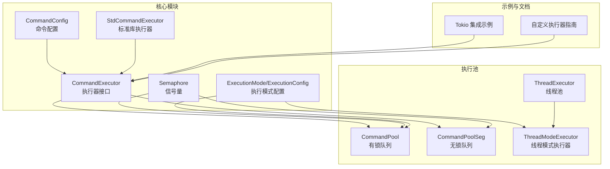
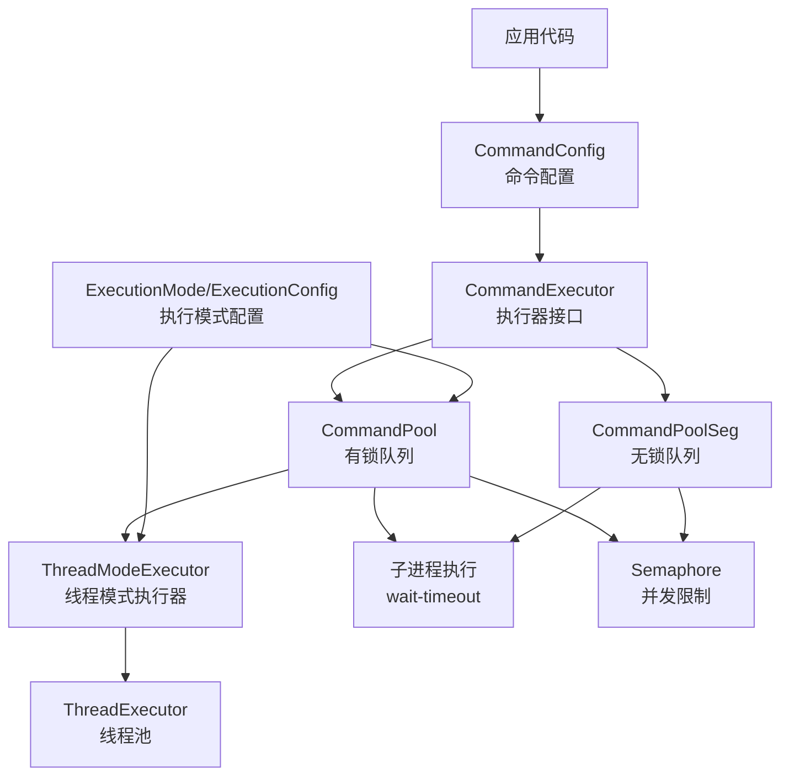
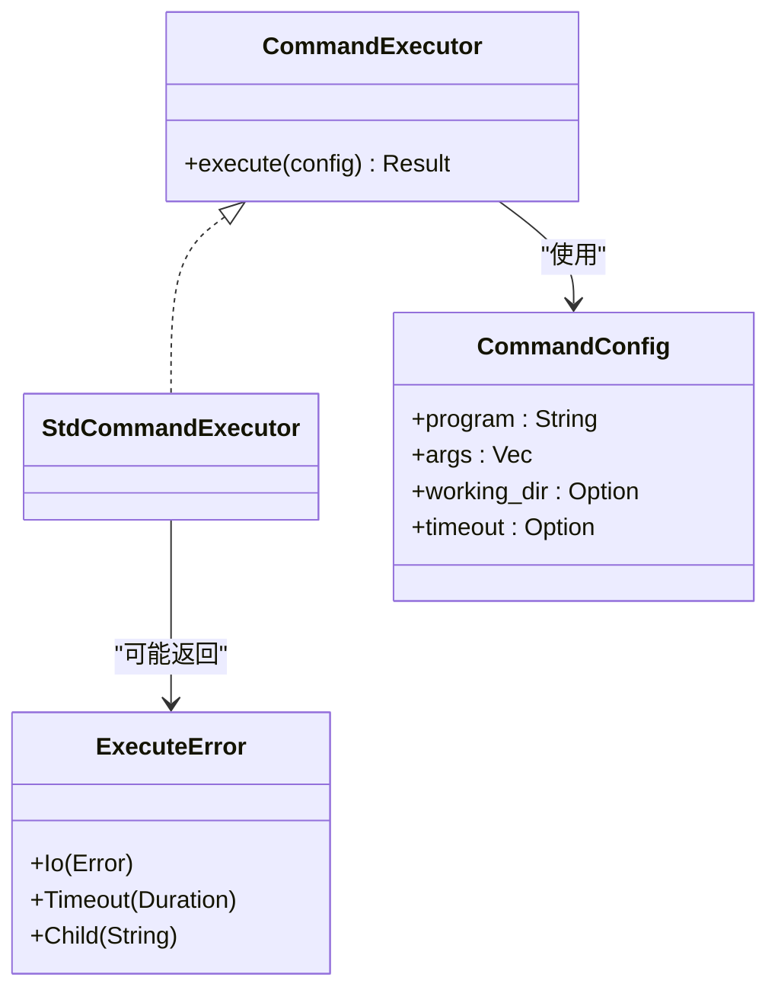
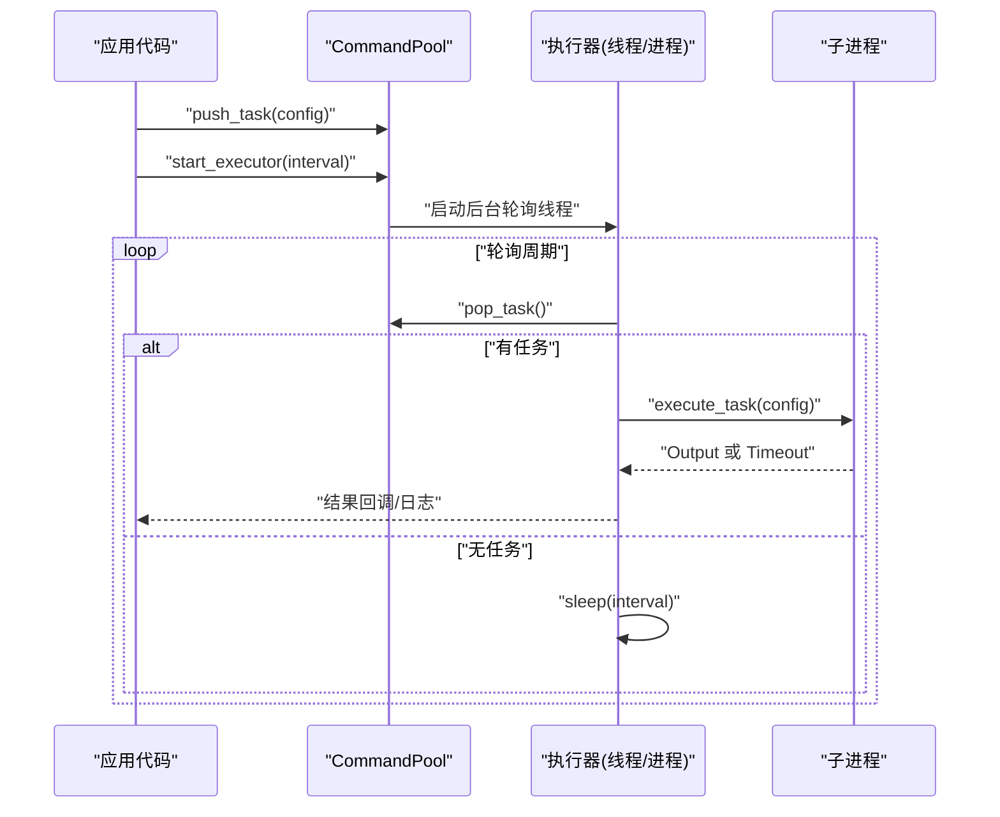
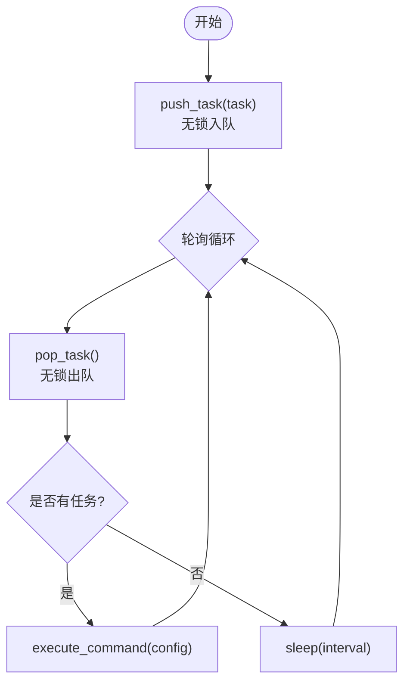
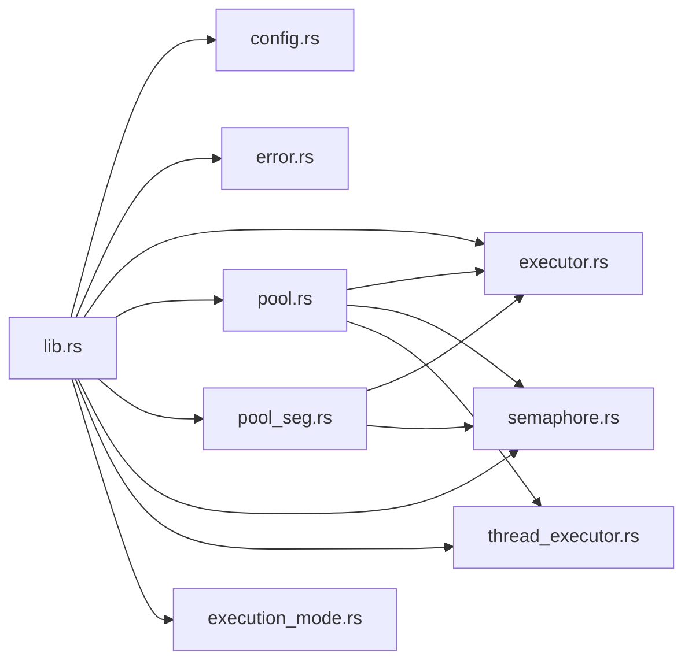

# 项目概述

<cite>
**本文引用的文件**
- [README.md](file://README.md)
- [Cargo.toml](file://Cargo.toml)
- [src/lib.rs](file://src/lib.rs)
- [src/main.rs](file://src/main.rs)
- [src/pool.rs](file://src/pool.rs)
- [src/pool_seg.rs](file://src/pool_seg.rs)
- [src/executor.rs](file://src/executor.rs)
- [src/thread_executor.rs](file://src/thread_executor.rs)
- [src/semaphore.rs](file://src/semaphore.rs)
- [src/config.rs](file://src/config.rs)
- [src/execution_mode.rs](file://src/execution_mode.rs)
- [src/error.rs](file://src/error.rs)
- [examples/tokio_integration.rs](file://examples/tokio_integration.rs)
- [EXECUTOR_CUSTOM.md](file://EXECUTOR_CUSTOM.md)
- [benches/command_pool_bench.rs](file://benches/command_pool_bench.rs)
- [tests/pool_tests.rs](file://tests/pool_tests.rs)
</cite>

## 目录
1. [简介](#简介)
2. [项目结构](#项目结构)
3. [核心组件](#核心组件)
4. [架构总览](#架构总览)
5. [详细组件分析](#详细组件分析)
6. [依赖关系分析](#依赖关系分析)
7. [性能考量](#性能考量)
8. [故障排查指南](#故障排查指南)
9. [结论](#结论)
10. [附录](#附录)

## 简介
本项目是一个轻量级的 Rust 命令执行池库，旨在为需要批量、并发执行外部命令的场景提供统一抽象与高性能实现。其核心价值主张包括：
- 可插拔的命令执行器：通过统一的执行器接口，支持标准库、Tokio、async-std 等多种运行时。
- 双队列实现：既提供基于互斥锁的有锁队列版本，也提供基于无锁队列的高并发版本，满足不同吞吐需求。
- 线程池与并发限制：内置线程模式执行器与信号量并发限制，帮助在多线程与多进程模式之间灵活取舍。
- 超时与安全等待：基于 wait-timeout 的超时等待机制，避免额外等待线程，提升资源利用率。

主要特性概览：
- 多线程安全的任务队列：CommandPool（基于 Mutex<VecDeque>）
- 无锁队列变体：CommandPoolSeg（基于 crossbeam_queue::SegQueue）
- 可扩展执行器接口：CommandExecutor（可集成 tokio / async-std）
- 子进程超时与安全等待：使用 wait-timeout 避免额外等待线程
- 线程池、并发限制（信号量）和多种执行模式

安装与快速开始：
- 在 Cargo.toml 中添加依赖与 wait-timeout、crossbeam-queue、thiserror 等必要依赖
- 使用标准库执行器的最小示例：创建命令池、推送任务、启动后台执行器
- 更多示例与 Tokio 集成示例位于 examples/tokio_integration.rs

许可证：MIT

**章节来源**
- [README.md](file://README.md#L1-L60)
- [Cargo.toml](file://Cargo.toml#L1-L13)

## 项目结构
该项目采用模块化组织，核心模块围绕“命令配置 → 执行器 → 执行池 → 线程池/并发限制”展开，同时提供无锁队列变体与示例、基准测试与测试用例。

**图表来源**
- [src/lib.rs](file://src/lib.rs#L1-L17)
- [src/config.rs](file://src/config.rs#L1-L109)
- [src/executor.rs](file://src/executor.rs#L1-L100)
- [src/pool.rs](file://src/pool.rs#L1-L296)
- [src/pool_seg.rs](file://src/pool_seg.rs#L1-L157)
- [src/thread_executor.rs](file://src/thread_executor.rs#L1-L148)
- [src/semaphore.rs](file://src/semaphore.rs#L1-L53)
- [src/execution_mode.rs](file://src/execution_mode.rs#L1-L70)
- [examples/tokio_integration.rs](file://examples/tokio_integration.rs#L1-L62)
- [EXECUTOR_CUSTOM.md](file://EXECUTOR_CUSTOM.md#L1-L228)

**章节来源**
- [src/lib.rs](file://src/lib.rs#L1-L17)
- [src/pool.rs](file://src/pool.rs#L1-L296)
- [src/pool_seg.rs](file://src/pool_seg.rs#L1-L157)
- [src/executor.rs](file://src/executor.rs#L1-L100)
- [src/thread_executor.rs](file://src/thread_executor.rs#L1-L148)
- [src/semaphore.rs](file://src/semaphore.rs#L1-L53)
- [src/execution_mode.rs](file://src/execution_mode.rs#L1-L70)
- [examples/tokio_integration.rs](file://examples/tokio_integration.rs#L1-L62)
- [EXECUTOR_CUSTOM.md](file://EXECUTOR_CUSTOM.md#L1-L228)

## 核心组件
- 命令配置（CommandConfig）：封装程序名、参数、工作目录与超时时间，支持链式构建与查询。
- 执行器接口（CommandExecutor）：统一命令执行抽象，标准库实现（StdCommandExecutor）与自定义实现（如 Tokio）。
- 执行池（CommandPool / CommandPoolSeg）：提供任务入队、出队与执行器启动能力；支持多线程/多进程模式与并发限制。
- 线程模式执行器（ThreadExecutor / ThreadModeExecutor）：在共享进程内复用线程执行任务，适合计算/调度密集场景。
- 并发限制（Semaphore）：基于 Mutex+Condvar 的轻量信号量，限制同时执行的外部进程数量。
- 执行模式（ExecutionMode/ExecutionConfig）：在 Thread 与 Process 模式间切换，并可配置工作线程/进程数与并发上限。

**章节来源**
- [src/config.rs](file://src/config.rs#L1-L109)
- [src/executor.rs](file://src/executor.rs#L1-L100)
- [src/pool.rs](file://src/pool.rs#L1-L296)
- [src/pool_seg.rs](file://src/pool_seg.rs#L1-L157)
- [src/thread_executor.rs](file://src/thread_executor.rs#L1-L148)
- [src/semaphore.rs](file://src/semaphore.rs#L1-L53)
- [src/execution_mode.rs](file://src/execution_mode.rs#L1-L70)

## 架构总览
下图展示了命令执行池的整体架构：命令配置经由执行器接口进入执行池，执行池根据执行模式选择线程池或直接派生子进程；无锁队列变体提供更高吞吐的多生产者场景支持；并发限制通过信号量控制外部进程数量。

**图表来源**
- [src/pool.rs](file://src/pool.rs#L1-L296)
- [src/pool_seg.rs](file://src/pool_seg.rs#L1-L157)
- [src/executor.rs](file://src/executor.rs#L1-L100)
- [src/thread_executor.rs](file://src/thread_executor.rs#L1-L148)
- [src/semaphore.rs](file://src/semaphore.rs#L1-L53)
- [src/execution_mode.rs](file://src/execution_mode.rs#L1-L70)

## 详细组件分析

### 命令配置（CommandConfig）
- 职责：描述一次外部命令的完整执行信息，包括程序名、参数、工作目录与超时时间。
- 关键点：提供 with_working_dir 与 with_timeout 链式方法，支持默认超时；提供只读访问器用于执行阶段读取。
- 复杂度：常数时间读写，无额外数据结构开销。

**章节来源**
- [src/config.rs](file://src/config.rs#L1-L109)

### 执行器接口（CommandExecutor）
- 职责：定义统一的 execute 方法，屏蔽底层运行时差异（标准库、Tokio、async-std 等）。
- 标准实现：StdCommandExecutor 基于 std::process::Command，内部通过 wait-timeout 实现超时等待。
- 自定义扩展：参考自定义执行器指南，实现异步运行时的同步 trait 包装。

**图表来源**
- [src/executor.rs](file://src/executor.rs#L1-L100)
- [src/config.rs](file://src/config.rs#L1-L109)
- [src/error.rs](file://src/error.rs#L1-L18)

**章节来源**
- [src/executor.rs](file://src/executor.rs#L1-L100)
- [src/error.rs](file://src/error.rs#L1-L18)

### 执行池（CommandPool）
- 职责：维护任务队列、启动执行器、分发任务、执行单个任务；支持多线程/多进程模式与并发限制。
- 关键实现：
  - start_executor 根据 ExecutionMode 分派线程模式或进程模式执行器。
  - start_executor_with_workers / start_executor_with_workers_and_limit 支持固定工作线程与并发限制。
  - start_executor_with_executor 系列方法支持自定义执行器注入。
- 线程模式：通过 ThreadModeExecutor 将任务提交至线程池，线程池内部使用 ThreadExecutor 复用线程。
- 进程模式：直接派生子进程执行命令，结合 wait-timeout 实现超时控制。

**图表来源**
- [src/pool.rs](file://src/pool.rs#L1-L296)
- [src/thread_executor.rs](file://src/thread_executor.rs#L1-L148)
- [src/executor.rs](file://src/executor.rs#L1-L100)

**章节来源**
- [src/pool.rs](file://src/pool.rs#L1-L296)
- [src/thread_executor.rs](file://src/thread_executor.rs#L1-L148)

### 无锁队列变体（CommandPoolSeg）
- 职责：提供基于 SegQueue 的无锁队列实现，适用于高并发多生产者场景，避免锁竞争。
- 关键实现：push_task/pop_task 无阻塞；支持与 CommandPool 相同的执行器启动与并发限制能力。
- 性能：在多生产者场景下通常优于基于 Mutex 的队列。

**图表来源**
- [src/pool_seg.rs](file://src/pool_seg.rs#L1-L157)
- [src/executor.rs](file://src/executor.rs#L1-L100)

**章节来源**
- [src/pool_seg.rs](file://src/pool_seg.rs#L1-L157)

### 线程池与线程模式执行器（ThreadExecutor / ThreadModeExecutor）
- 职责：在线程模式下，将命令包装为可执行任务并提交至线程池，由工作线程复用执行。
- 关键实现：ThreadExecutor 维护共享任务队列与工作线程；ThreadModeExecutor 提供对外的 submit/start 接口。
- 适用场景：共享内存、计算/调度密集型任务，避免频繁创建子进程带来的开销。

**章节来源**
- [src/thread_executor.rs](file://src/thread_executor.rs#L1-L148)

### 并发限制（Semaphore）
- 职责：通过信号量限制同时执行的外部进程数量，防止系统资源耗尽。
- 关键实现：基于 Mutex+Condvar 的 RAII 守卫，acquire_guard 在作用域结束时自动释放许可证。
- 使用场景：多进程模式下限制子进程并发数，或自定义执行器中保护外部资源。

**章节来源**
- [src/semaphore.rs](file://src/semaphore.rs#L1-L53)

### 执行模式与配置（ExecutionMode / ExecutionConfig）
- 职责：在 Thread 与 Process 模式间切换，并配置工作线程/进程数与并发限制。
- 关键实现：with_mode/with_workers/with_concurrency_limit 构建器模式；默认多进程模式，自动探测可用并行度。

**章节来源**
- [src/execution_mode.rs](file://src/execution_mode.rs#L1-L70)

### 错误模型（ExecuteError）
- 职责：统一表示 IO 错误、超时错误与子进程异常，便于上层处理与日志记录。
- 关键实现：基于 thiserror 的派生宏，提供清晰的错误消息与来源映射。

**章节来源**
- [src/error.rs](file://src/error.rs#L1-L18)

## 依赖关系分析
- 外部依赖：thiserror（错误派生）、crossbeam-queue（无锁队列）、wait-timeout（子进程超时等待）。
- 内部模块：lib.rs 汇总导出公共 API；各模块职责清晰，耦合度低，便于替换与扩展。

**图表来源**
- [src/lib.rs](file://src/lib.rs#L1-L17)
- [src/pool.rs](file://src/pool.rs#L1-L296)
- [src/pool_seg.rs](file://src/pool_seg.rs#L1-L157)
- [src/executor.rs](file://src/executor.rs#L1-L100)
- [src/thread_executor.rs](file://src/thread_executor.rs#L1-L148)
- [src/semaphore.rs](file://src/semaphore.rs#L1-L53)
- [src/config.rs](file://src/config.rs#L1-L109)
- [src/error.rs](file://src/error.rs#L1-L18)
- [src/execution_mode.rs](file://src/execution_mode.rs#L1-L70)

**章节来源**
- [src/lib.rs](file://src/lib.rs#L1-L17)
- [Cargo.toml](file://Cargo.toml#L1-L13)

## 性能考量
- 队列选择：在多生产者场景优先考虑 CommandPoolSeg；在单线程或少量生产者场景，CommandPool 的实现更简单可靠。
- 并发限制：通过信号量限制外部进程数量，避免系统资源耗尽；根据任务类型与硬件条件调整并发上限。
- 工作线程数：根据 CPU 核心数与任务类型（I/O 密集 vs 计算密集）调整工作线程数；I/O 密集可适当增加线程数。
- 超时等待：使用 wait-timeout 在当前线程等待，避免额外等待线程带来的上下文切换开销。
- 基准测试：提供 Criterion 基准测试，覆盖入队/出队与执行性能，便于对比不同实现与配置。

**章节来源**
- [benches/command_pool_bench.rs](file://benches/command_pool_bench.rs#L1-L93)
- [src/pool.rs](file://src/pool.rs#L1-L296)
- [src/pool_seg.rs](file://src/pool_seg.rs#L1-L157)
- [src/executor.rs](file://src/executor.rs#L1-L100)

## 故障排查指南
- 超时处理：确认 CommandConfig 的超时设置是否合理；检查 wait-timeout 是否正确触发并尝试终止子进程。
- 并发限制：当出现资源耗尽或性能下降时，检查并发限制配置与信号量使用情况。
- 线程模式问题：线程模式下任务仍通过子进程执行，注意工作目录与环境变量的传递。
- 自定义执行器：确保在同步 trait 中正确管理异步运行时生命周期，避免重复创建导致的性能问题。
- 测试验证：使用单元测试验证队列行为、模式切换与默认配置；参考测试用例与示例文件定位问题。

**章节来源**
- [src/error.rs](file://src/error.rs#L1-L18)
- [src/executor.rs](file://src/executor.rs#L1-L100)
- [tests/pool_tests.rs](file://tests/pool_tests.rs#L1-L90)
- [examples/tokio_integration.rs](file://examples/tokio_integration.rs#L1-L62)

## 结论
本项目以“可插拔执行器 + 多队列实现 + 并发限制”的设计，为命令执行提供了轻量、灵活且高性能的解决方案。通过统一的接口抽象与清晰的模块划分，既能满足初学者的快速上手，也能为有经验的开发者提供扩展与优化空间。建议在生产环境中结合基准测试与监控，持续优化队列选择、并发限制与工作线程数配置。

## 附录

### 安装与快速开始
- 在 Cargo.toml 中添加依赖与 wait-timeout、crossbeam-queue、thiserror 等必要依赖
- 使用标准库执行器的最小示例：创建命令池、推送任务、启动后台执行器
- 更多示例与 Tokio 集成示例位于 examples/tokio_integration.rs

**章节来源**
- [README.md](file://README.md#L18-L42)
- [src/main.rs](file://src/main.rs#L1-L48)

### 自定义执行器指南
- 实现 CommandExecutor trait，支持同步 trait 中的异步运行时包装
- 提供标准库与 Tokio 的实现示例，展示超时控制与错误处理
- 支持与 CommandPool/CommandPoolSeg 的无缝集成

**章节来源**
- [EXECUTOR_CUSTOM.md](file://EXECUTOR_CUSTOM.md#L1-L228)
- [examples/tokio_integration.rs](file://examples/tokio_integration.rs#L1-L62)