# 任务生命周期管理

<cite>
**本文档引用的文件**
- [README.md](file://README.md)
- [Cargo.toml](file://Cargo.toml)
- [src/lib.rs](file://src/lib.rs)
- [src/main.rs](file://src/main.rs)
- [src/pool.rs](file://src/pool.rs)
- [src/backend.rs](file://src/backend.rs)
- [src/executor.rs](file://src/executor.rs)
- [src/task_status.rs](file://src/task_status.rs)
- [src/task_handle.rs](file://src/task_handle.rs)
- [src/process_pool.rs](file://src/process_pool.rs)
- [src/config.rs](file://src/config.rs)
- [src/semaphore.rs](file://src/semaphore.rs)
- [src/pool_seg.rs](file://src/pool_seg.rs)
- [src/error.rs](file://src/error.rs)
- [examples/tokio_integration.rs](file://examples/tokio_integration.rs)
</cite>

## 目录
1. [简介](#简介)
2. [项目结构](#项目结构)
3. [核心组件](#核心组件)
4. [架构概览](#架构概览)
5. [详细组件分析](#详细组件分析)
6. [依赖关系分析](#依赖关系分析)
7. [性能考虑](#性能考虑)
8. [故障排除指南](#故障排除指南)
9. [结论](#结论)

## 简介

Execute 是一个轻量级的命令池库（Rust），专门设计用于高效管理和执行外部命令任务。该项目提供了可插拔的命令执行器、锁/无锁任务队列、线程池与并发限制策略，支持多种执行模式和任务生命周期管理。

该库的核心目标是提供一个灵活而高效的框架，用于处理大量外部命令的执行需求，特别适用于需要并发执行、超时控制、任务状态跟踪和优雅关闭的场景。

## 项目结构

项目采用模块化的 Rust 设计，主要包含以下核心模块：

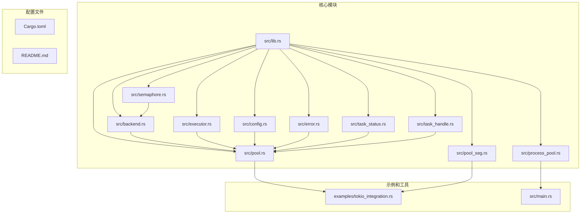

**图表来源**
- [src/lib.rs](file://src/lib.rs#L1-L22)
- [src/pool.rs](file://src/pool.rs#L1-L324)
- [src/pool_seg.rs](file://src/pool_seg.rs#L1-L157)

**章节来源**
- [src/lib.rs](file://src/lib.rs#L1-L22)
- [Cargo.toml](file://Cargo.toml#L1-L13)

## 核心组件

### 命令池（CommandPool）

CommandPool 是整个系统的核心组件，负责任务的队列管理、执行器启动和生命周期控制。它支持三种执行模式：

1. **多线程模式（Thread）**：在主进程中使用线程池调度任务
2. **多进程模式（Process）**：每个命令独立子进程执行
3. **进程池模式（ProcessPool）**：预创建常驻子进程池

### 执行后端（ExecutionBackend）

执行后端提供了统一的命令执行接口，支持不同的执行策略：

- **ProcessBackend**：每个命令创建独立子进程
- **ThreadBackend**：线程池调度但通过子进程执行
- **ProcessPoolBackend**：常驻子进程池执行

### 任务状态管理

系统提供了完整的任务状态追踪机制：

- **TaskStatus**：Pending、Running、Completed、Failed 四种状态
- **TaskStatusTracker**：线程安全的状态追踪器
- **TaskIdGenerator**：原子递增的任务ID生成器

### 任务结果处理

通过异步通道机制处理任务结果：

- **TaskHandle**：任务结果的异步获取接口
- **TaskWithResult**：带结果通道的任务封装
- **TaskResult**：统一的结果类型定义

**章节来源**
- [src/pool.rs](file://src/pool.rs#L12-L324)
- [src/backend.rs](file://src/backend.rs#L8-L277)
- [src/task_status.rs](file://src/task_status.rs#L5-L178)
- [src/task_handle.rs](file://src/task_handle.rs#L7-L211)

## 架构概览

系统采用分层架构设计，实现了清晰的关注点分离：

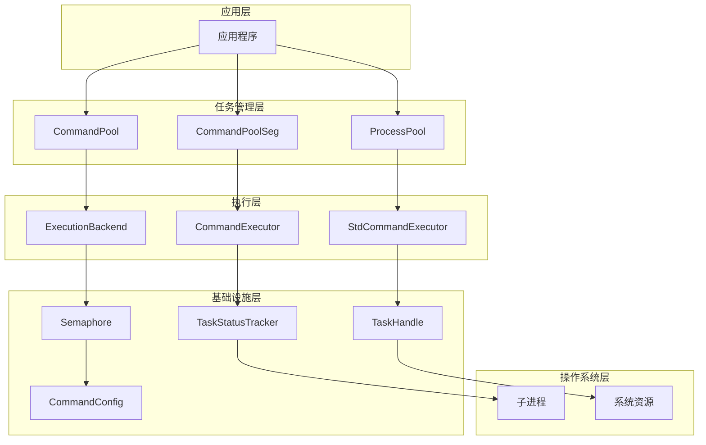

**图表来源**
- [src/pool.rs](file://src/pool.rs#L12-L324)
- [src/backend.rs](file://src/backend.rs#L8-L277)
- [src/executor.rs](file://src/executor.rs#L5-L100)
- [src/semaphore.rs](file://src/semaphore.rs#L1-L53)

## 详细组件分析

### 命令池生命周期管理

命令池的生命周期包括创建、启动、执行和停止四个阶段：

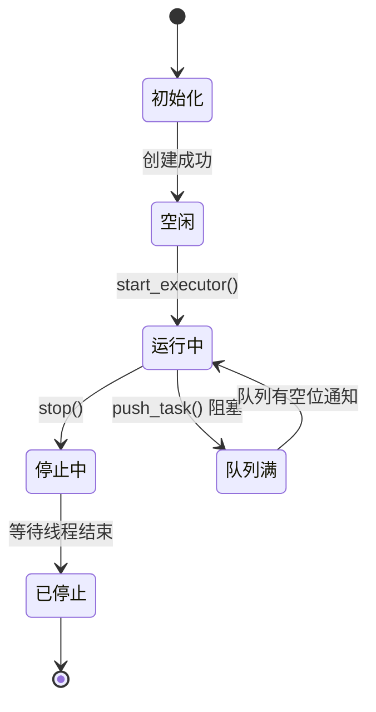

**图表来源**
- [src/pool.rs](file://src/pool.rs#L180-L210)

#### 执行器启动流程

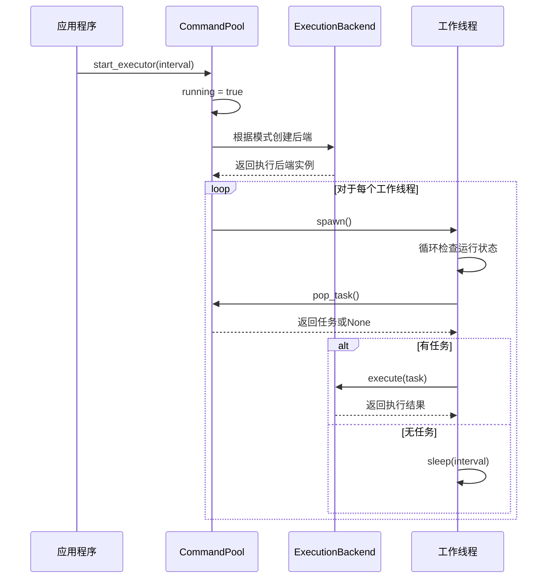

**图表来源**
- [src/pool.rs](file://src/pool.rs#L180-L303)
- [src/backend.rs](file://src/backend.rs#L244-L276)

**章节来源**
- [src/pool.rs](file://src/pool.rs#L180-L303)

### 任务队列管理

系统提供了两种队列实现以满足不同性能需求：

#### 有界队列（CommandPool）

基于 `Mutex<VecDeque>` 的线程安全队列，支持队列大小限制：

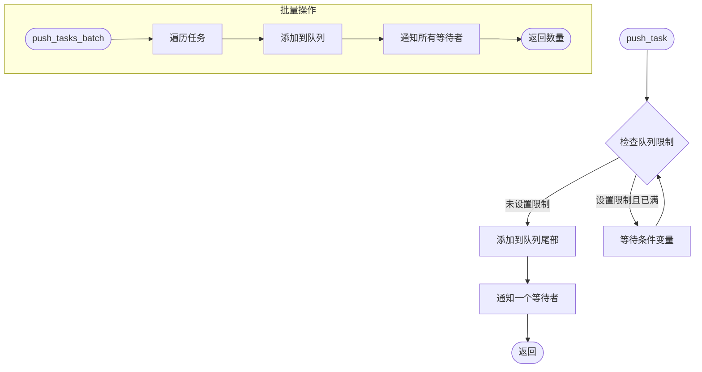

**图表来源**
- [src/pool.rs](file://src/pool.rs#L56-L122)

#### 无锁队列（CommandPoolSeg）

基于 `crossbeam_queue::SegQueue` 的高性能无锁队列：

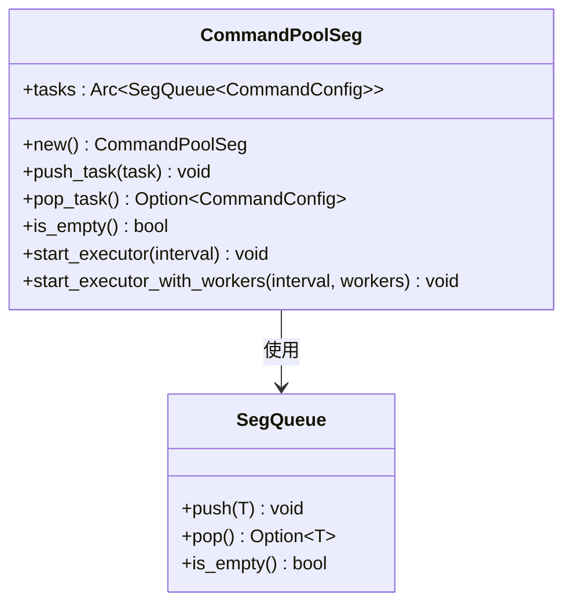

**图表来源**
- [src/pool_seg.rs](file://src/pool_seg.rs#L15-L157)

**章节来源**
- [src/pool.rs](file://src/pool.rs#L56-L146)
- [src/pool_seg.rs](file://src/pool_seg.rs#L15-L157)

### 任务状态追踪系统

任务状态追踪提供了完整的生命周期监控：

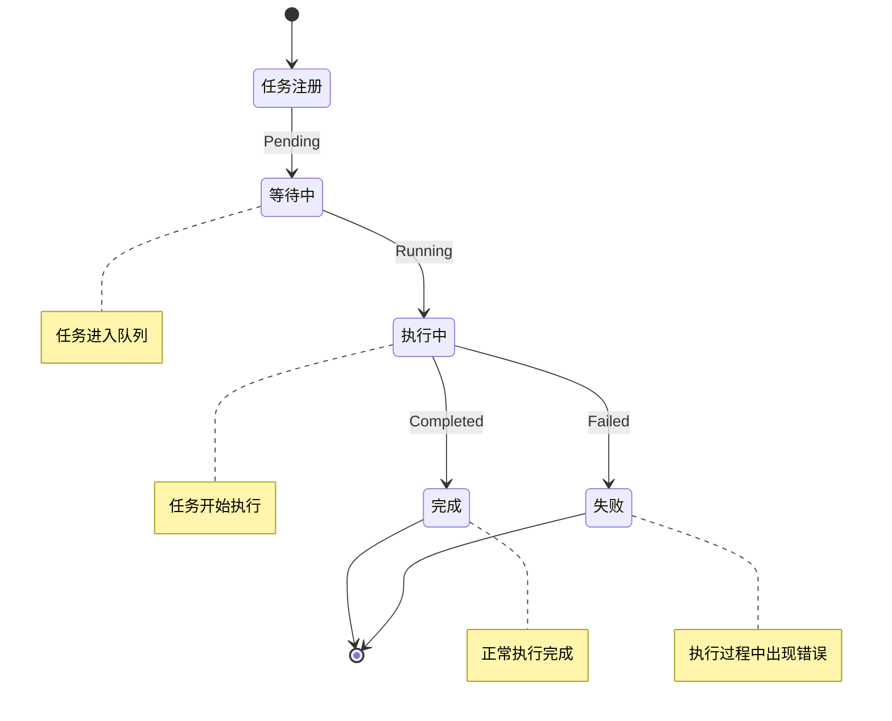

**图表来源**
- [src/task_status.rs](file://src/task_status.rs#L5-L108)

#### 状态转换流程

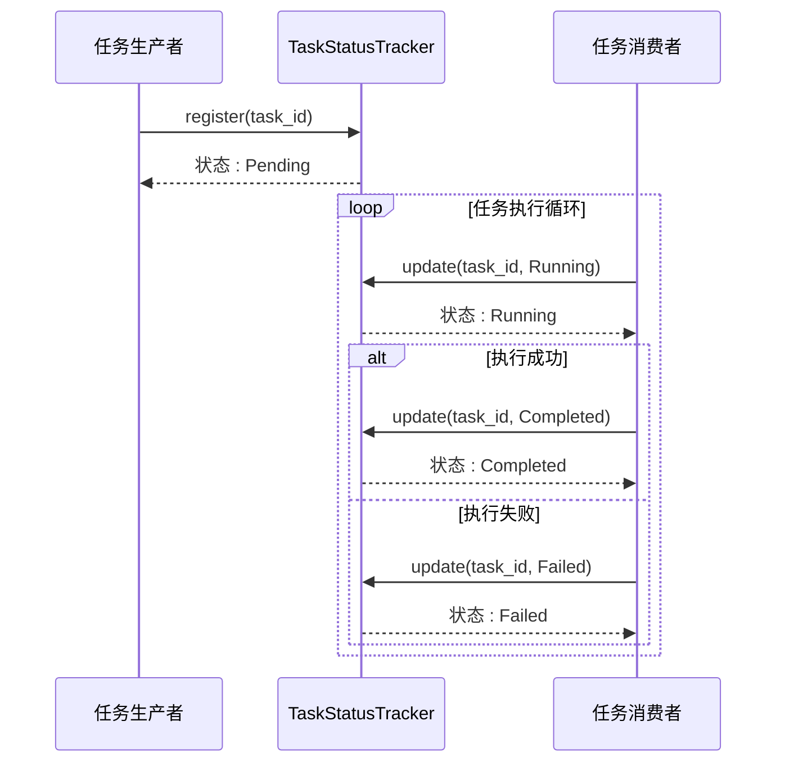

**图表来源**
- [src/task_status.rs](file://src/task_status.rs#L67-L89)

**章节来源**
- [src/task_status.rs](file://src/task_status.rs#L54-L122)

### 任务结果异步处理

通过异步通道机制实现任务结果的非阻塞获取：

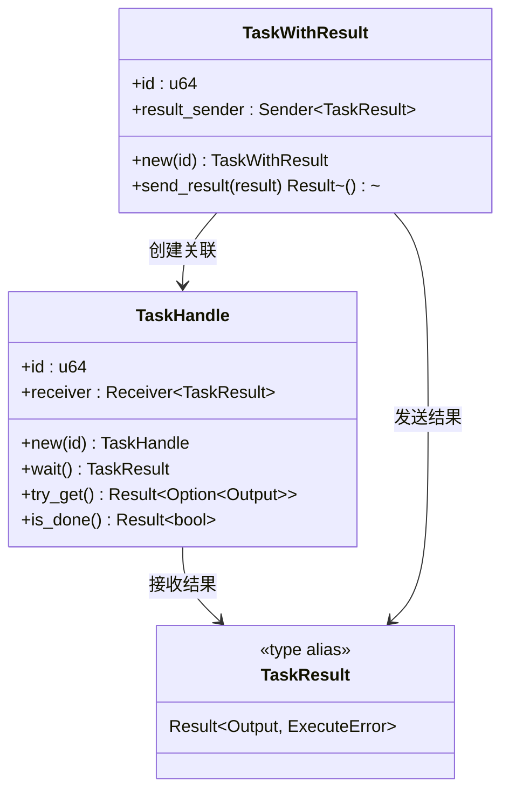

**图表来源**
- [src/task_handle.rs](file://src/task_handle.rs#L10-L120)

**章节来源**
- [src/task_handle.rs](file://src/task_handle.rs#L10-L81)

### 并发控制机制

系统通过信号量实现并发限制：

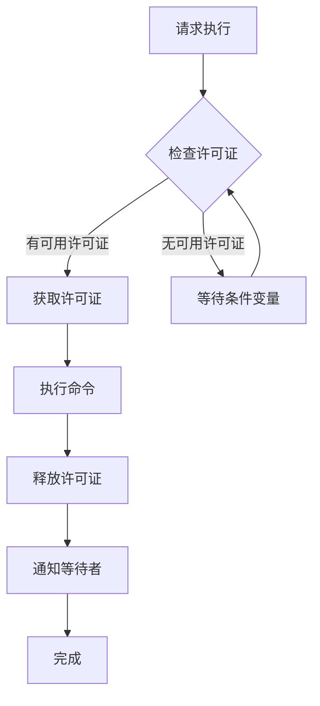

**图表来源**
- [src/semaphore.rs](file://src/semaphore.rs#L24-L42)

**章节来源**
- [src/semaphore.rs](file://src/semaphore.rs#L1-L53)

## 依赖关系分析

项目的主要依赖关系如下：

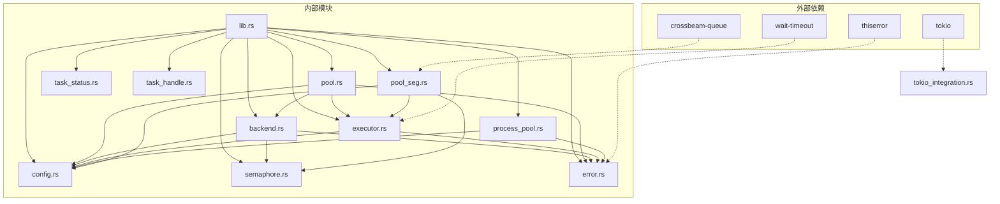

**图表来源**
- [Cargo.toml](file://Cargo.toml#L6-L12)
- [src/lib.rs](file://src/lib.rs#L1-L22)

**章节来源**
- [Cargo.toml](file://Cargo.toml#L6-L12)
- [src/lib.rs](file://src/lib.rs#L1-L22)

## 性能考虑

### 队列性能对比

| 特性 | 有锁队列 (VecDeque) | 无锁队列 (SegQueue) |
|------|-------------------|-------------------|
| 线程安全 | ✅ Mutex保护 | ✅ 无锁设计 |
| 性能 | ⚠️ 锁竞争 | ✅ 高并发 |
| 内存占用 | ⚠️ 额外锁开销 | ✅ 更低 |
| 复杂度 | O(n) 队列操作 | O(1) 队列操作 |
| 适用场景 | 小规模并发 | 大规模并发 |

### 执行模式性能分析

| 模式 | 进程创建开销 | 内存共享 | 隔离性 | 适用场景 |
|------|-------------|---------|-------|----------|
| 多线程 | 低 | ✅ 共享 | ❌ 低 | I/O密集 |
| 多进程 | 高 | ❌ 独立 | ✅ 高 | CPU密集 |
| 进程池 | 中等 | ❌ 独立 | ✅ 高 | 高频短命令 |

### 并发限制策略

系统提供了灵活的并发控制机制：

1. **基于信号量的限制**：通过许可证数量控制同时执行的任务数
2. **动态调整**：根据CPU核心数自动调整工作线程数
3. **优雅降级**：当资源不足时自动降低并发度

## 故障排除指南

### 常见错误类型

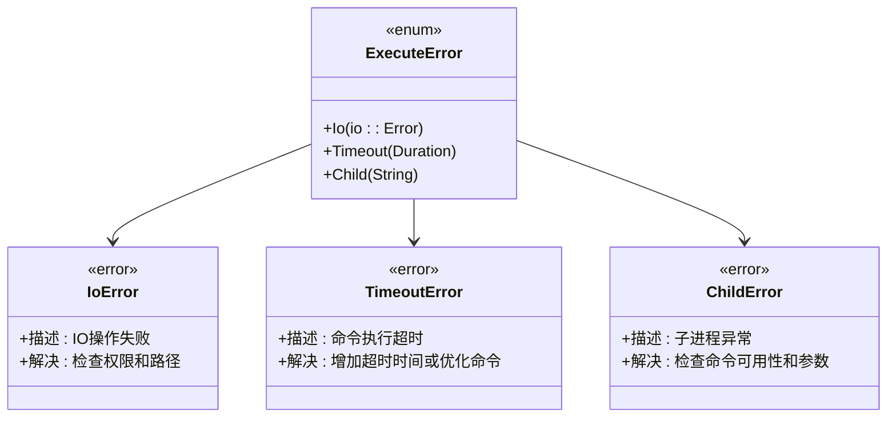

**图表来源**
- [src/error.rs](file://src/error.rs#L7-L17)

### 调试技巧

1. **启用详细日志**：在生产环境中添加适当的日志记录
2. **监控队列长度**：定期检查任务队列长度防止内存泄漏
3. **验证超时设置**：确保超时时间合理，避免过短导致频繁超时
4. **检查资源使用**：监控CPU和内存使用情况

### 性能优化建议

1. **选择合适的队列类型**：大规模并发场景使用无锁队列
2. **合理设置工作线程数**：根据CPU核心数和任务特性调整
3. **实施并发限制**：避免过度并发导致系统资源耗尽
4. **优化命令执行**：减少不必要的I/O操作和进程创建

**章节来源**
- [src/error.rs](file://src/error.rs#L1-L18)

## 结论

Execute 库提供了一个完整而高效的命令执行框架，具有以下特点：

### 主要优势

1. **灵活的执行模式**：支持多线程、多进程和进程池三种模式
2. **完整的生命周期管理**：从创建到销毁的全流程控制
3. **高性能设计**：提供有锁和无锁两种队列实现
4. **强大的并发控制**：通过信号量实现精细的并发限制
5. **完善的错误处理**：统一的错误类型和详细的错误信息

### 适用场景

- 大规模外部命令执行
- 需要超时控制的应用
- 需要任务状态跟踪的系统
- 高并发的批处理作业
- 需要优雅关闭的长期运行服务

### 发展方向

1. **进程池功能完善**：实现真正的常驻子进程池
2. **异步执行支持**：提供纯异步的执行模式
3. **监控和指标**：添加详细的性能监控和指标收集
4. **配置管理**：提供更灵活的配置管理和热更新

该库为需要高效执行外部命令的Rust应用提供了一个可靠的基础框架，通过其模块化设计和丰富的功能集，能够满足各种复杂的应用需求。