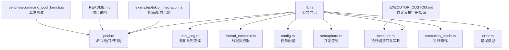
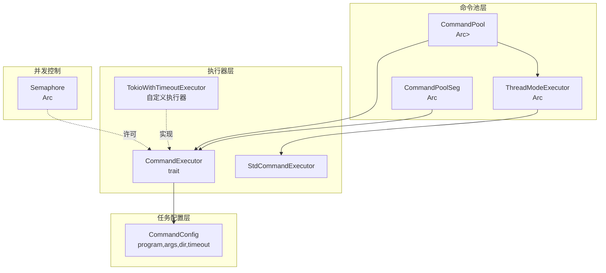
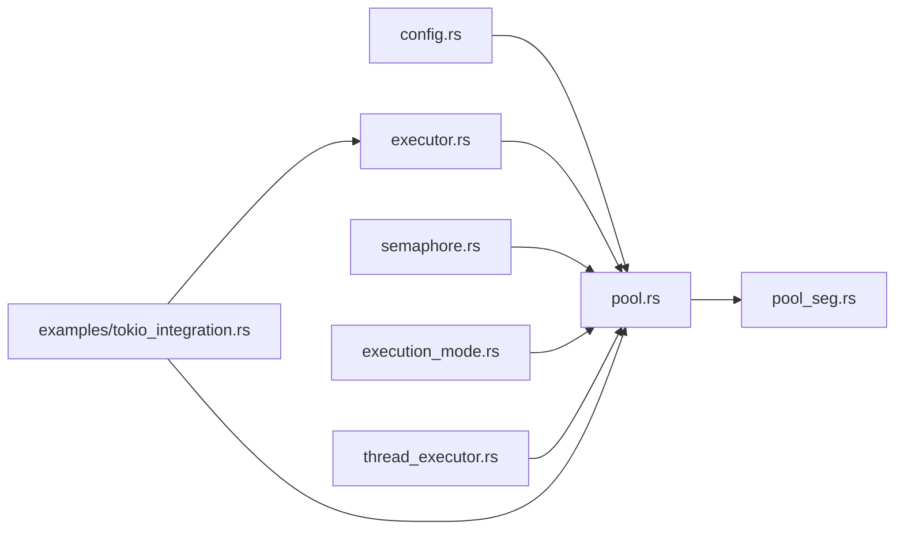
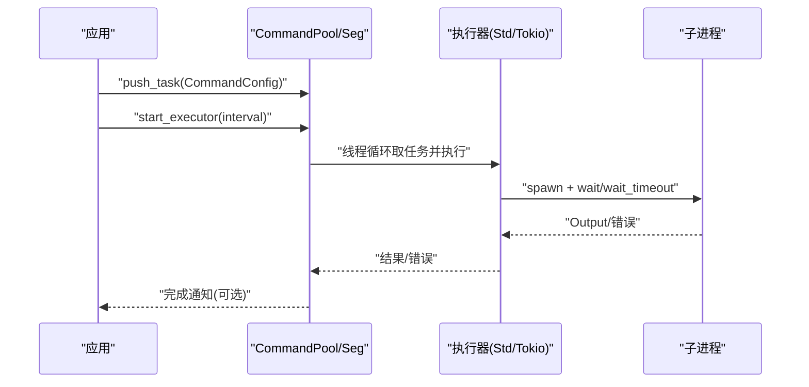
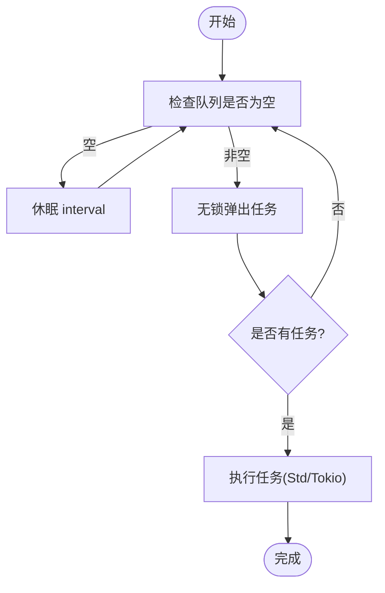

# 内存管理策略

<cite>
**本文引用的文件**
- [src/lib.rs](file://src/lib.rs)
- [src/pool.rs](file://src/pool.rs)
- [src/pool_seg.rs](file://src/pool_seg.rs)
- [src/thread_executor.rs](file://src/thread_executor.rs)
- [src/executor.rs](file://src/executor.rs)
- [src/config.rs](file://src/config.rs)
- [src/semaphore.rs](file://src/semaphore.rs)
- [src/execution_mode.rs](file://src/execution_mode.rs)
- [src/error.rs](file://src/error.rs)
- [examples/tokio_integration.rs](file://examples/tokio_integration.rs)
- [EXECUTOR_CUSTOM.md](file://EXECUTOR_CUSTOM.md)
- [README.md](file://README.md)
- [benches/command_pool_bench.rs](file://benches/command_pool_bench.rs)
</cite>

## 目录
1. [引言](#引言)
2. [项目结构](#项目结构)
3. [核心组件](#核心组件)
4. [架构总览](#架构总览)
5. [详细组件分析](#详细组件分析)
6. [依赖关系分析](#依赖关系分析)
7. [性能考量](#性能考量)
8. [故障排查指南](#故障排查指南)
9. [结论](#结论)
10. [附录](#附录)

## 引言
本文件聚焦于内存管理策略，围绕以下主题展开：
- Arc 智能指针在无锁队列中的使用模式与引用计数机制
- 任务配置对象的生命周期管理与内存回收
- 执行器线程的内存占用与资源释放
- 内存泄漏预防与性能监控方法
- 大任务处理与内存压力下的应对策略
- 跨线程数据共享的安全内存管理模式

目标是帮助读者在理解现有实现的基础上，安全、高效地扩展与优化命令池的内存使用。

## 项目结构
该项目采用模块化设计，核心围绕“命令池”“执行器”“执行模式”“信号量”“线程执行器”等模块组织。公共 API 通过 lib.rs 暴露，内部通过模块化实现职责分离。

图表来源
- [src/lib.rs](file://src/lib.rs#L1-L17)
- [src/pool.rs](file://src/pool.rs#L1-L296)
- [src/pool_seg.rs](file://src/pool_seg.rs#L1-L157)
- [src/thread_executor.rs](file://src/thread_executor.rs#L1-L148)
- [src/executor.rs](file://src/executor.rs#L1-L100)
- [src/config.rs](file://src/config.rs#L1-L109)
- [src/semaphore.rs](file://src/semaphore.rs#L1-L53)
- [src/execution_mode.rs](file://src/execution_mode.rs#L1-L70)
- [src/error.rs](file://src/error.rs#L1-L18)
- [examples/tokio_integration.rs](file://examples/tokio_integration.rs#L1-L62)
- [EXECUTOR_CUSTOM.md](file://EXECUTOR_CUSTOM.md#L1-L228)
- [README.md](file://README.md#L1-L60)
- [benches/command_pool_bench.rs](file://benches/command_pool_bench.rs#L1-L93)

章节来源
- [src/lib.rs](file://src/lib.rs#L1-L17)
- [README.md](file://README.md#L1-L60)

## 核心组件
- 命令池与无锁队列
  - 锁队列变体：基于 Arc<Mutex<VecDeque<CommandConfig>>> 的 CommandPool
  - 无锁队列变体：基于 Arc<SegQueue<CommandConfig>> 的 CommandPoolSeg
- 执行器与执行模式
  - CommandExecutor trait 与 StdCommandExecutor
  - ExecutionMode/ExecutionConfig 控制线程/进程模式与并发限制
- 线程执行器
  - ThreadExecutor/ThreadModeExecutor 支持线程模式下的任务调度
- 并发控制
  - Semaphore 与 SemaphoreGuard 提供 RAII 风格的并发许可管理
- 任务配置
  - CommandConfig 结构体承载任务元数据，支持工作目录与超时

章节来源
- [src/pool.rs](file://src/pool.rs#L13-L296)
- [src/pool_seg.rs](file://src/pool_seg.rs#L11-L157)
- [src/executor.rs](file://src/executor.rs#L5-L70)
- [src/execution_mode.rs](file://src/execution_mode.rs#L21-L70)
- [src/thread_executor.rs](file://src/thread_executor.rs#L16-L148)
- [src/semaphore.rs](file://src/semaphore.rs#L7-L53)
- [src/config.rs](file://src/config.rs#L19-L109)

## 架构总览
下图展示命令池、执行器与线程/进程模式之间的交互，以及 Arc 引用计数在跨线程共享中的作用。

图表来源
- [src/pool.rs](file://src/pool.rs#L14-L67)
- [src/pool_seg.rs](file://src/pool_seg.rs#L15-L26)
- [src/thread_executor.rs](file://src/thread_executor.rs#L112-L137)
- [src/executor.rs](file://src/executor.rs#L9-L24)
- [src/config.rs](file://src/config.rs#L19-L25)
- [src/semaphore.rs](file://src/semaphore.rs#L7-L43)
- [examples/tokio_integration.rs](file://examples/tokio_integration.rs#L10-L40)

## 详细组件分析

### Arc 智能指针与引用计数机制
- 共享所有权
  - CommandPool/CommandPoolSeg/ThreadModeExecutor/CommandPoolSeg 等结构体广泛使用 Arc 进行共享所有权，避免复制大对象（如 VecDeque 或 SegQueue），并允许多线程安全访问。
  - 线程模式下，CommandPool 内部持有 Option<Arc<ThreadModeExecutor>>，在 Thread 模式启用时通过 Arc 共享线程执行器实例。
- 引用计数
  - Arc 内部维护引用计数，当 clone 时增加计数，Drop 时减少计数。当计数归零时，底层资源被释放。
  - 在多线程启动场景中，每个线程持有 Arc 的克隆，形成稳定的共享生命周期。
- 与锁的组合
  - 锁队列变体通过 Arc<Mutex<...>> 组合，既保证共享，又保证互斥访问；无锁队列变体通过 SegQueue 避免锁竞争，提升吞吐。

章节来源
- [src/pool.rs](file://src/pool.rs#L14-L21)
- [src/pool_seg.rs](file://src/pool_seg.rs#L15-L18)
- [src/thread_executor.rs](file://src/thread_executor.rs#L112-L118)

### 无锁队列中的使用模式与引用计数
- SegQueue 的无锁特性
  - CommandPoolSeg 使用 Arc<SegQueue<CommandConfig>>，在多生产者/多消费者场景下避免锁竞争，提升并发性能。
  - push/pop 操作为无阻塞操作，适合高吞吐场景。
- Arc 在无锁队列中的角色
  - Arc 仅用于共享队列句柄，不参与队列内部的锁竞争；引用计数在所有克隆间共享，确保队列生命周期与使用者一致。
- 生命周期与内存回收
  - 当所有克隆被 Drop，Arc 计数降至 0，底层 SegQueue 被释放，避免内存泄漏。

章节来源
- [src/pool_seg.rs](file://src/pool_seg.rs#L11-L41)

### 任务配置对象的生命周期管理与内存回收
- 结构体设计
  - CommandConfig 为值类型结构体，包含 String/Option<String>/Option<Duration> 等字段，通过 Clone 传递，避免不必要的 Arc 包裹。
- 生命周期与跨线程传递
  - 在线程模式下，CommandPool 将 CommandConfig 通过 Arc 包裹后交给 ThreadModeExecutor/ThreadExecutor，从而在多线程间安全共享。
  - 在进程模式下，CommandConfig 作为参数直接传递给执行器，执行器内部通过 execute_command 启动子进程并等待结果，任务对象在执行完成后即可被释放。
- 内存回收
  - 由于 CommandConfig 为小对象且通过 Clone 传递，生命周期清晰；Arc 包裹仅在需要跨线程共享时使用，随 Arc 计数降为 0 自动释放。

章节来源
- [src/config.rs](file://src/config.rs#L19-L25)
- [src/pool.rs](file://src/pool.rs#L146-L163)
- [src/thread_executor.rs](file://src/thread_executor.rs#L91-L101)

### 执行器线程的内存占用与资源释放
- 线程启动与任务消费
  - CommandPool/CommandPoolSeg 在启动执行器时，会根据配置派生若干工作线程；每个线程循环从队列中取任务并执行。
  - 线程内部持有 Arc 的克隆，确保在生命周期内稳定访问共享资源。
- 资源释放
  - 线程执行完成后不会常驻；在进程退出或不再需要时，Arc 计数降为 0，相关资源被释放。
  - SemaphoreGuard 在作用域结束时自动释放许可，避免死锁与资源泄露。

章节来源
- [src/pool.rs](file://src/pool.rs#L174-L210)
- [src/pool_seg.rs](file://src/pool_seg.rs#L56-L91)
- [src/semaphore.rs](file://src/semaphore.rs#L45-L52)

### 线程模式下的内存管理要点
- 线程池与任务队列
  - ThreadExecutor 内部维护 Vec<Box<dyn ThreadTask>>，通过 Arc<Mutex<...>> 保护；任务通过 Box 动态分配，执行完成后由 Drop 释放。
- 线程模式执行器
  - ThreadModeExecutor 通过 Arc<ThreadExecutor> 共享线程池，避免重复创建线程带来的内存与上下文切换开销。
- 跨线程安全
  - 通过 Arc + Mutex 实现线程安全；CommandTask 包装 CommandConfig，确保在执行线程中安全访问。

章节来源
- [src/thread_executor.rs](file://src/thread_executor.rs#L16-L76)
- [src/thread_executor.rs](file://src/thread_executor.rs#L112-L137)

### 自定义执行器与内存管理
- 自定义执行器接口
  - CommandExecutor trait 定义统一的执行接口，允许注入异步运行时（如 Tokio）实现；通过 Arc 共享执行器实例，避免重复初始化。
- Tokio 集成示例
  - TokioWithTimeoutExecutor 在每次 execute 调用中创建 Runtime 并 block_on 异步任务；建议在实际生产中复用 Runtime 或使用全局运行时以减少内存与初始化开销。
- 并发限制
  - 通过 start_executor_with_executor_and_limit 等方法结合 Semaphore，限制同时执行的外部进程数量，防止资源耗尽。

章节来源
- [src/executor.rs](file://src/executor.rs#L9-L24)
- [examples/tokio_integration.rs](file://examples/tokio_integration.rs#L10-L40)
- [EXECUTOR_CUSTOM.md](file://EXECUTOR_CUSTOM.md#L109-L155)

## 依赖关系分析
- 模块耦合
  - pool.rs 与 pool_seg.rs 分别依赖 config.rs、executor.rs、semaphore.rs、execution_mode.rs、thread_executor.rs；两者在功能上互补，分别提供锁队列与无锁队列两种实现。
  - thread_executor.rs 与 executor.rs 彼此协作，前者负责线程模式的任务调度，后者负责具体命令执行。
- 外部依赖
  - crossbeam-queue 提供无锁队列；wait-timeout 用于子进程超时等待；thiserror 提供错误类型。
- 循环依赖
  - 未发现直接循环依赖；模块间通过公共导出与参数传递建立松耦合关系。

图表来源
- [src/pool.rs](file://src/pool.rs#L6-L11)
- [src/pool_seg.rs](file://src/pool_seg.rs#L7-L9)
- [src/thread_executor.rs](file://src/thread_executor.rs#L1-L6)
- [examples/tokio_integration.rs](file://examples/tokio_integration.rs#L1-L7)

章节来源
- [src/pool.rs](file://src/pool.rs#L6-L11)
- [src/pool_seg.rs](file://src/pool_seg.rs#L7-L9)
- [src/thread_executor.rs](file://src/thread_executor.rs#L1-L6)
- [examples/tokio_integration.rs](file://examples/tokio_integration.rs#L1-L7)

## 性能考量
- 队列选择
  - 多生产者场景优先选择 CommandPoolSeg（无锁队列），以减少锁竞争；单生产者/小规模场景可使用 CommandPool（锁队列）。
- 线程与进程模式
  - 线程模式共享内存，适合计算密集型任务；进程模式隔离性强，适合 I/O 密集与稳定性要求高的场景。
- 并发限制
  - 使用 Semaphore 限制外部进程并发数，避免系统资源耗尽；结合工作线程数动态调整，平衡吞吐与资源占用。
- 运行时初始化
  - 自定义执行器中避免在 execute 内频繁创建运行时；建议复用或延迟初始化，减少内存与启动开销。
- 基准测试参考
  - benches/command_pool_bench.rs 展示了不同队列与线程数下的性能对比，可用于评估内存与吞吐表现。

章节来源
- [README.md](file://README.md#L8-L13)
- [EXECUTOR_CUSTOM.md](file://EXECUTOR_CUSTOM.md#L173-L179)
- [benches/command_pool_bench.rs](file://benches/command_pool_bench.rs#L1-L93)

## 故障排查指南
- 常见错误类型
  - ExecuteError 包含 IO 错误、超时错误、子进程异常等；通过错误类型定位问题根因。
- 超时与资源清理
  - 超时场景下会尝试终止子进程并返回超时错误；确保在上层逻辑中正确处理并释放相关资源。
- 并发控制问题
  - 若出现死锁或许可无法释放，检查 SemaphoreGuard 的作用域是否提前返回；确保许可在异常路径也能释放。
- 线程泄漏
  - 确保所有工作线程在不再需要时能够自然退出；避免在闭包中持有过期引用导致 Arc 计数不降为 0。

章节来源
- [src/error.rs](file://src/error.rs#L7-L17)
- [src/executor.rs](file://src/executor.rs#L26-L70)
- [src/semaphore.rs](file://src/semaphore.rs#L45-L52)

## 结论
本项目通过 Arc 共享与锁/无锁队列组合，实现了高效、安全的命令池内存管理。线程模式与进程模式在内存占用与资源释放方面各有侧重，配合并发控制与自定义执行器，可在不同负载下保持稳定性能。遵循本文的内存管理策略与最佳实践，可有效预防内存泄漏并提升系统整体性能。

## 附录

### 关键流程图：命令池启动与任务执行序列

图表来源
- [src/pool.rs](file://src/pool.rs#L134-L143)
- [src/pool_seg.rs](file://src/pool_seg.rs#L56-L68)
- [src/executor.rs](file://src/executor.rs#L26-L70)
- [examples/tokio_integration.rs](file://examples/tokio_integration.rs#L21-L40)

### 流程图：无锁队列任务消费

图表来源
- [src/pool_seg.rs](file://src/pool_seg.rs#L56-L68)