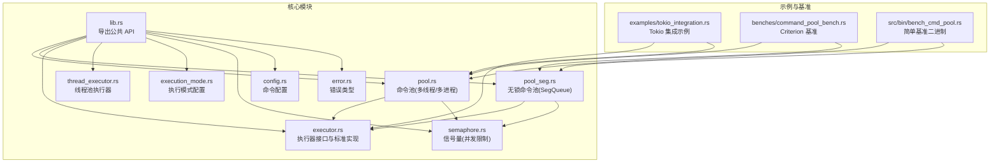
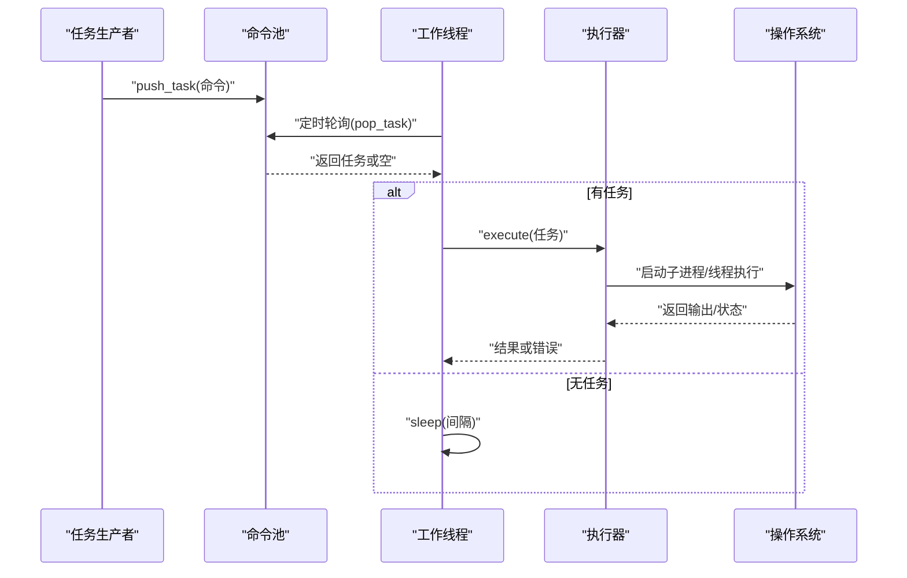
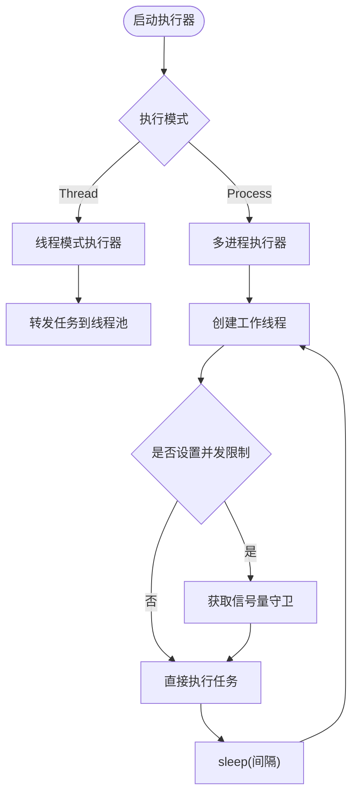
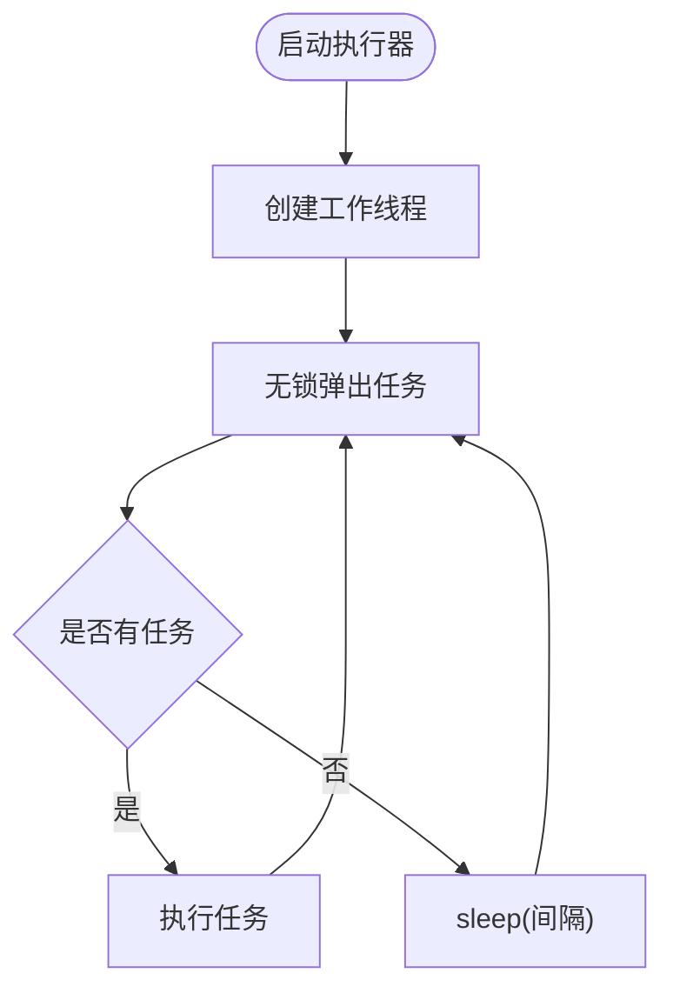
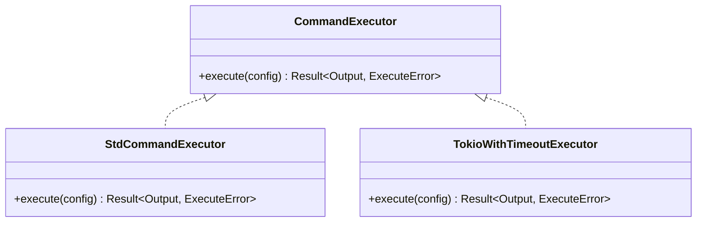
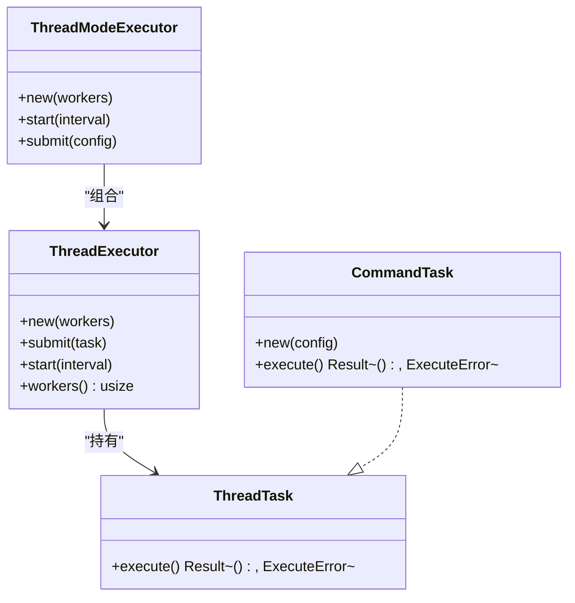
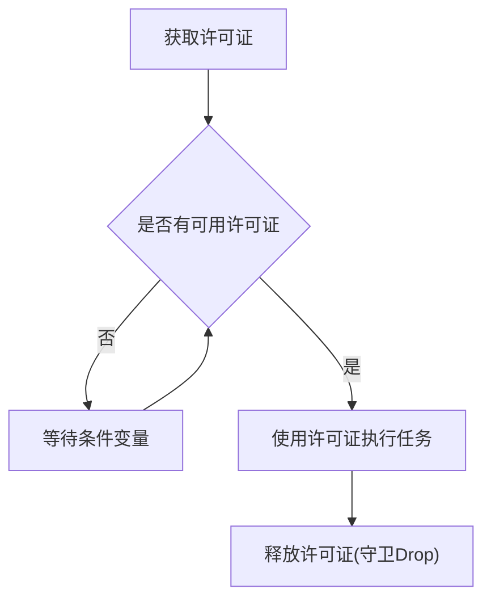
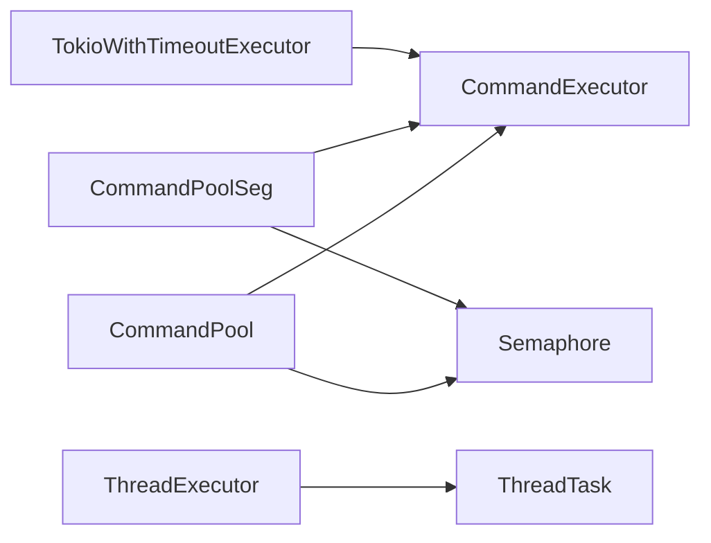
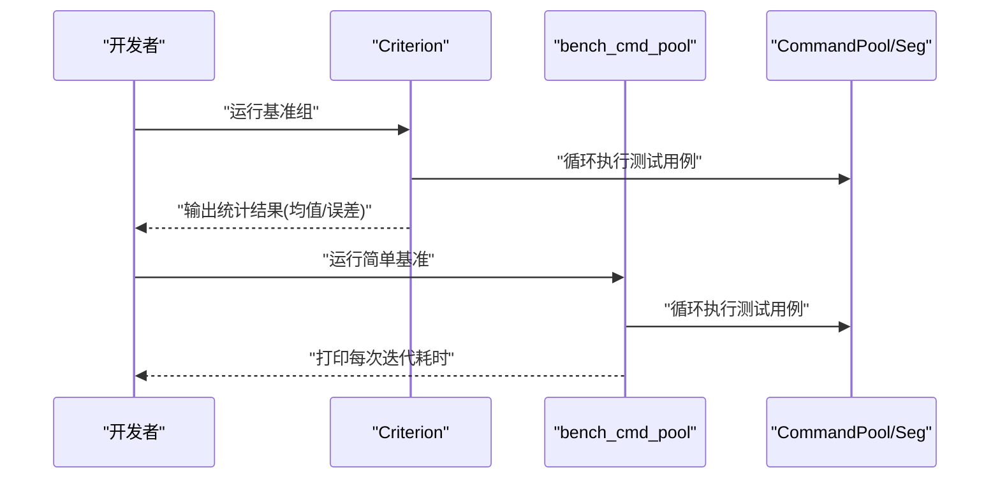

# 性能优化技巧

<cite>
**本文引用的文件**
- [Cargo.toml](file://Cargo.toml)
- [README.md](file://README.md)
- [src/lib.rs](file://src/lib.rs)
- [src/pool.rs](file://src/pool.rs)
- [src/pool_seg.rs](file://src/pool_seg.rs)
- [src/executor.rs](file://src/executor.rs)
- [src/thread_executor.rs](file://src/thread_executor.rs)
- [src/execution_mode.rs](file://src/execution_mode.rs)
- [src/semaphore.rs](file://src/semaphore.rs)
- [src/config.rs](file://src/config.rs)
- [src/error.rs](file://src/error.rs)
- [benches/command_pool_bench.rs](file://benches/command_pool_bench.rs)
- [src/bin/bench_cmd_pool.rs](file://src/bin/bench_cmd_pool.rs)
- [examples/tokio_integration.rs](file://examples/tokio_integration.rs)
- [EXECUTOR_CUSTOM.md](file://EXECUTOR_CUSTOM.md)
- [tests/pool_tests.rs](file://tests/pool_tests.rs)
</cite>

## 目录
1. [引言](#引言)
2. [项目结构](#项目结构)
3. [核心组件](#核心组件)
4. [架构总览](#架构总览)
5. [详细组件分析](#详细组件分析)
6. [依赖关系分析](#依赖关系分析)
7. [性能考量](#性能考量)
8. [故障排查指南](#故障排查指南)
9. [结论](#结论)
10. [附录](#附录)

## 引言
本指南围绕命令执行池的性能优化展开，目标是帮助读者识别并解决性能瓶颈，掌握基准测试设计与实施方法，并在不同使用场景下制定线程数配置、工作间隔调优与内存管理的优化策略。文档结合代码库中的实现细节，提供可操作的优化建议与实测案例分析。

## 项目结构
该项目采用模块化组织，核心围绕“命令池”“执行器”“执行模式”“信号量”“配置”“错误类型”等模块构建，提供多线程与多进程两种执行模式，并支持无锁队列变体以提升高并发吞吐。

图表来源
- [src/lib.rs](file://src/lib.rs#L1-L17)
- [src/pool.rs](file://src/pool.rs#L1-L296)
- [src/pool_seg.rs](file://src/pool_seg.rs#L1-L157)
- [src/executor.rs](file://src/executor.rs#L1-L100)
- [src/thread_executor.rs](file://src/thread_executor.rs#L1-L148)
- [src/execution_mode.rs](file://src/execution_mode.rs#L1-L70)
- [src/semaphore.rs](file://src/semaphore.rs#L1-L53)
- [src/config.rs](file://src/config.rs#L1-L109)
- [src/error.rs](file://src/error.rs#L1-L18)
- [examples/tokio_integration.rs](file://examples/tokio_integration.rs#L1-L62)
- [benches/command_pool_bench.rs](file://benches/command_pool_bench.rs#L1-L93)
- [src/bin/bench_cmd_pool.rs](file://src/bin/bench_cmd_pool.rs#L1-L126)

章节来源
- [src/lib.rs](file://src/lib.rs#L1-L17)
- [README.md](file://README.md#L1-L60)

## 核心组件
- 命令池 CommandPool：支持多线程与多进程两种模式，内部使用互斥队列存储任务，提供定时轮询与任务执行能力。
- 无锁命令池 CommandPoolSeg：基于跨线程无锁队列，适合高并发多生产者场景，减少锁竞争。
- 执行器 CommandExecutor：抽象命令执行接口，标准实现使用子进程执行；可扩展为 Tokio 等异步运行时。
- 线程模式执行器 ThreadModeExecutor：在共享进程内使用线程池执行任务，适合计算/IO混合场景。
- 信号量 Semaphore：轻量级并发控制，限制同时执行的外部进程数量。
- 执行模式 ExecutionConfig：统一配置执行模式、工作线程/进程数与并发限制。
- 配置 CommandConfig：封装程序名、参数、工作目录与超时。
- 错误 ExecuteError：统一错误类型，包含 IO、超时与子进程错误。

章节来源
- [src/pool.rs](file://src/pool.rs#L13-L296)
- [src/pool_seg.rs](file://src/pool_seg.rs#L11-L157)
- [src/executor.rs](file://src/executor.rs#L5-L70)
- [src/thread_executor.rs](file://src/thread_executor.rs#L16-L148)
- [src/semaphore.rs](file://src/semaphore.rs#L7-L53)
- [src/execution_mode.rs](file://src/execution_mode.rs#L21-L70)
- [src/config.rs](file://src/config.rs#L19-L109)
- [src/error.rs](file://src/error.rs#L7-L18)

## 架构总览
命令池在启动后，按配置创建若干工作线程，周期性轮询任务队列并执行。多线程模式下，任务通过线程池执行；多进程模式下，每个任务以子进程方式执行，并支持超时与并发限制。

图表来源
- [src/pool.rs](file://src/pool.rs#L134-L288)
- [src/executor.rs](file://src/executor.rs#L26-L70)
- [src/thread_executor.rs](file://src/thread_executor.rs#L47-L76)

## 详细组件分析

### 命令池 CommandPool（多线程/多进程）
- 关键点
  - 多线程模式：通过线程模式执行器将任务提交至线程池，适合共享内存、低线程切换开销场景。
  - 多进程模式：每个任务以子进程执行，适合隔离性强、稳定性要求高的场景。
  - 并发限制：通过信号量限制同时执行的外部进程数量，避免系统资源耗尽。
  - 轮询间隔：通过 sleep 控制轮询频率，平衡吞吐与延迟。
- 性能影响因素
  - 互斥锁竞争：在高并发多生产者场景下，锁竞争可能成为瓶颈。
  - 子进程开销：多进程模式下，进程创建/销毁与上下文切换成本较高。
  - 超时等待：使用等待超时库避免额外等待线程，降低系统开销。

图表来源
- [src/pool.rs](file://src/pool.rs#L134-L210)
- [src/semaphore.rs](file://src/semaphore.rs#L16-L43)

章节来源
- [src/pool.rs](file://src/pool.rs#L36-L288)

### 无锁命令池 CommandPoolSeg
- 关键点
  - 基于跨线程无锁队列，多生产者场景下吞吐更高，锁竞争显著降低。
  - 支持与 CommandPool 相同的自定义执行器与并发限制能力。
- 适用场景
  - 高并发写入、低延迟读取的任务队列。
  - 生产者远多于消费者的场景。

图表来源
- [src/pool_seg.rs](file://src/pool_seg.rs#L53-L91)

章节来源
- [src/pool_seg.rs](file://src/pool_seg.rs#L20-L150)

### 执行器 CommandExecutor 与标准实现
- 关键点
  - 抽象接口允许替换为异步运行时（如 Tokio），以提升 I/O 密集型任务的并发效率。
  - 标准实现使用子进程执行，并在单线程内处理超时，避免额外等待线程。
- 性能影响因素
  - 运行时选择：Tokio 等异步运行时在 I/O 密集型任务上通常表现更好。
  - 超时处理：等待超时库减少线程数量，降低上下文切换成本。

图表来源
- [src/executor.rs](file://src/executor.rs#L9-L24)
- [examples/tokio_integration.rs](file://examples/tokio_integration.rs#L10-L40)

章节来源
- [src/executor.rs](file://src/executor.rs#L9-L70)
- [examples/tokio_integration.rs](file://examples/tokio_integration.rs#L21-L40)

### 线程模式执行器 ThreadModeExecutor 与 ThreadExecutor
- 关键点
  - 线程池在共享进程内执行任务，适合计算/IO混合场景。
  - 任务通过 Box<dyn ThreadTask> 承载，便于扩展。
- 性能影响因素
  - 线程数量：过多线程导致上下文切换开销上升；过少则无法充分利用 CPU。
  - 轮询间隔：过短增加 CPU 占用，过长增加延迟。

图表来源
- [src/thread_executor.rs](file://src/thread_executor.rs#L8-L148)

章节来源
- [src/thread_executor.rs](file://src/thread_executor.rs#L16-L148)

### 信号量 Semaphore（并发限制）
- 关键点
  - 基于条件变量的轻量级计数信号量，限制同时执行的外部进程数量。
  - RAII 守卫在作用域结束时自动释放许可证，避免死锁。
- 性能影响因素
  - 限制过小：任务排队时间增加，吞吐下降。
  - 限制过大：系统资源占用上升，可能导致 OOM 或系统不稳定。

图表来源
- [src/semaphore.rs](file://src/semaphore.rs#L16-L52)

章节来源
- [src/semaphore.rs](file://src/semaphore.rs#L7-L53)

### 执行模式与配置 ExecutionConfig
- 关键点
  - 统一配置执行模式、工作线程/进程数与并发限制。
  - 默认多进程模式，工作线程数自动检测 CPU 并发度。
- 性能影响因素
  - 模式选择：多线程适合共享内存任务；多进程适合隔离需求强的任务。
  - 工作数：I/O 密集型可适当增加；CPU 密集型接近物理核数更佳。

章节来源
- [src/execution_mode.rs](file://src/execution_mode.rs#L21-L70)

### 命令配置 CommandConfig 与错误类型 ExecuteError
- 关键点
  - CommandConfig 提供工作目录与超时设置，便于精细化控制。
  - ExecuteError 统一错误类型，便于上层处理与监控。
- 性能影响因素
  - 超时设置：合理设置可避免长时间卡顿，提升整体吞吐。
  - 工作目录：避免频繁切换目录带来的额外开销。

章节来源
- [src/config.rs](file://src/config.rs#L19-L109)
- [src/error.rs](file://src/error.rs#L7-L18)

## 依赖关系分析
- 外部依赖
  - 等待超时：用于在单线程内处理子进程超时，避免额外等待线程。
  - 无锁队列：跨线程无锁队列，提升多生产者场景吞吐。
  - 异步运行时：Tokio 提供异步执行器实现，提升 I/O 密集型任务并发。
- 内部耦合
  - 命令池与执行器解耦，通过 trait 注入执行策略。
  - 信号量与命令池解耦，通过 Arc 共享，便于复用。

图表来源
- [src/pool.rs](file://src/pool.rs#L1-L20)
- [src/pool_seg.rs](file://src/pool_seg.rs#L1-L15)
- [src/executor.rs](file://src/executor.rs#L9-L24)
- [src/thread_executor.rs](file://src/thread_executor.rs#L8-L24)
- [examples/tokio_integration.rs](file://examples/tokio_integration.rs#L10-L40)

章节来源
- [Cargo.toml](file://Cargo.toml#L6-L12)

## 性能考量

### 线程数配置
- 建议
  - I/O 密集型：线程数可略大于 CPU 核数，以补偿等待时间。
  - CPU 密集型：线程数接近物理核数，避免过度上下文切换。
  - 默认策略：使用系统并发度检测作为起点，再根据实测微调。
- 参考实现
  - 多线程/多进程模式均使用系统并发度检测作为默认工作线程数。

章节来源
- [src/pool.rs](file://src/pool.rs#L238-L241)
- [src/pool_seg.rs](file://src/pool_seg.rs#L47-L50)
- [src/thread_executor.rs](file://src/thread_executor.rs#L80-L84)

### 工作间隔调优
- 建议
  - 较短间隔：降低延迟，但增加 CPU 占用与唤醒频率。
  - 较长间隔：降低 CPU 占用，但增加任务延迟。
  - 动态策略：根据队列长度与负载动态调整间隔。
- 参考实现
  - 所有执行器在每次轮询后 sleep 间隔时间。

章节来源
- [src/pool.rs](file://src/pool.rs#L178-L186)
- [src/pool_seg.rs](file://src/pool_seg.rs#L59-L67)

### 内存管理
- 建议
  - 避免在热路径中频繁分配大对象；复用缓冲区与结构体。
  - 对于无锁队列，注意任务大小与生命周期，避免长生命周期对象驻留。
  - 合理设置超时，避免长时间占用句柄与缓冲区。
- 参考实现
  - 无锁队列直接存储任务配置，减少中间层拷贝。
  - 标准执行器在单线程内等待子进程，避免额外线程。

章节来源
- [src/pool_seg.rs](file://src/pool_seg.rs#L28-L41)
- [src/executor.rs](file://src/executor.rs#L26-L70)

### 基准测试设计与实施
- 设计思路
  - 单线程入队/出队：评估互斥锁与数据结构开销。
  - 多线程入队：评估锁竞争与上下文切换。
  - 执行真实命令：评估子进程开销与超时处理。
  - 无锁队列对比：验证跨线程无锁队列在高并发下的优势。
- 实施方法
  - Criterion 基准：提供统计显著的性能数据。
  - 简单二进制基准：便于快速迭代与回归测试。
- 参考实现
  - Criterion 基准覆盖入队/出队、执行真实命令与无锁队列对比。
  - 简单二进制基准提供多次迭代与平均耗时统计。

图表来源
- [benches/command_pool_bench.rs](file://benches/command_pool_bench.rs#L84-L92)
- [src/bin/bench_cmd_pool.rs](file://src/bin/bench_cmd_pool.rs#L6-L19)

章节来源
- [benches/command_pool_bench.rs](file://benches/command_pool_bench.rs#L1-L93)
- [src/bin/bench_cmd_pool.rs](file://src/bin/bench_cmd_pool.rs#L1-L126)

### 性能监控指标与测量方法
- 指标建议
  - 吞吐量：单位时间内完成的任务数。
  - 延迟：从入队到完成的端到端时间，分位延迟（P50/P95/P99）。
  - CPU 占用：工作线程与系统 CPU 使用率。
  - 内存占用：堆内存与常驻内存峰值。
  - 超时率：因超时失败的任务比例。
- 测量方法
  - 使用基准测试统计吞吐与延迟分布。
  - 结合系统监控工具观察 CPU/内存指标。
  - 通过错误类型统计超时与失败次数。

章节来源
- [src/error.rs](file://src/error.rs#L7-L18)
- [benches/command_pool_bench.rs](file://benches/command_pool_bench.rs#L1-L93)
- [src/bin/bench_cmd_pool.rs](file://src/bin/bench_cmd_pool.rs#L84-L115)

### 不同使用场景的最佳实践
- 场景一：大量 I/O 密集型命令（如网络请求、文件读写）
  - 建议：使用多线程模式或自定义异步执行器（Tokio），适当增加工作线程数，启用并发限制。
  - 参考实现：Tokio 集成示例展示了异步执行与超时控制。
- 场景二：高并发多生产者
  - 建议：优先使用无锁命令池，减少锁竞争；根据生产速率调整轮询间隔。
  - 参考实现：无锁队列变体提供相同功能但更低锁竞争。
- 场景三：需要强隔离与稳定性
  - 建议：使用多进程模式，配合并发限制与超时控制，避免单个任务拖垮系统。
- 场景四：计算/IO 混合
  - 建议：使用线程模式执行器，将任务在共享内存中高效调度。

章节来源
- [examples/tokio_integration.rs](file://examples/tokio_integration.rs#L1-L62)
- [src/pool_seg.rs](file://src/pool_seg.rs#L11-L15)
- [src/thread_executor.rs](file://src/thread_executor.rs#L16-L20)

### 实际性能测试案例与结果分析
- 案例一：单线程入队/出队与多线程入队
  - 目标：评估互斥锁与多线程竞争。
  - 方法：基准测试循环入队/出队，记录耗时。
  - 分析：多线程入队在高并发下存在锁竞争，可通过无锁队列缓解。
- 案例二：执行真实命令（如“true”）
  - 目标：评估子进程开销与超时处理。
  - 方法：循环执行短命令，统计耗时。
  - 分析：子进程创建/销毁成本显著，应尽量复用执行器与减少不必要的进程切换。
- 案例三：无锁队列对比
  - 目标：验证跨线程无锁队列在高并发下的优势。
  - 方法：分别测试有锁与无锁命令池的入队/出队性能。
  - 分析：无锁队列在多生产者场景下吞吐更高。
- 案例四：并发限制下的执行器
  - 目标：评估并发限制对吞吐与延迟的影响。
  - 方法：设置不同并发限制，观察完成时间与超时率。
  - 分析：合适的并发限制可在资源与吞吐间取得平衡。

章节来源
- [benches/command_pool_bench.rs](file://benches/command_pool_bench.rs#L6-L82)
- [src/bin/bench_cmd_pool.rs](file://src/bin/bench_cmd_pool.rs#L6-L115)

## 故障排查指南
- 常见问题
  - 任务长时间不执行：检查轮询间隔是否过大，或是否存在大量阻塞任务。
  - 超时频繁：检查超时设置是否过短，或系统负载过高。
  - 内存增长：确认任务生命周期管理，避免长生命周期对象驻留。
  - 并发过高导致系统不稳定：调整并发限制与工作线程数。
- 定位手段
  - 使用基准测试定位瓶颈（入队/出队、执行开销）。
  - 观察错误类型统计（超时、IO 错误）。
  - 结合系统监控工具查看 CPU/内存/线程状态。

章节来源
- [src/error.rs](file://src/error.rs#L7-L18)
- [benches/command_pool_bench.rs](file://benches/command_pool_bench.rs#L1-L93)
- [src/bin/bench_cmd_pool.rs](file://src/bin/bench_cmd_pool.rs#L1-L126)

## 结论
命令执行池的性能优化涉及队列选择、执行模式、并发限制与轮询间隔等多个维度。通过合理的线程数配置、工作间隔调优与内存管理策略，并结合基准测试与监控指标，可以在不同使用场景下取得稳定且高效的性能表现。对于 I/O 密集型任务，优先考虑异步执行器与无锁队列；对于需要强隔离的场景，多进程模式更为稳妥；在任何场景下，都应以实测数据为依据持续迭代优化。

## 附录
- 相关文件索引
  - 核心 API 导出：[src/lib.rs](file://src/lib.rs#L1-L17)
  - 命令池实现：[src/pool.rs](file://src/pool.rs#L1-L296)
  - 无锁命令池实现：[src/pool_seg.rs](file://src/pool_seg.rs#L1-L157)
  - 执行器接口与标准实现：[src/executor.rs](file://src/executor.rs#L1-L100)
  - 线程模式执行器：[src/thread_executor.rs](file://src/thread_executor.rs#L1-L148)
  - 执行模式配置：[src/execution_mode.rs](file://src/execution_mode.rs#L1-L70)
  - 信号量实现：[src/semaphore.rs](file://src/semaphore.rs#L1-L53)
  - 命令配置：[src/config.rs](file://src/config.rs#L1-L109)
  - 错误类型：[src/error.rs](file://src/error.rs#L1-L18)
  - 基准测试（Criterion）：[benches/command_pool_bench.rs](file://benches/command_pool_bench.rs#L1-L93)
  - 基准测试（简单二进制）：[src/bin/bench_cmd_pool.rs](file://src/bin/bench_cmd_pool.rs#L1-L126)
  - Tokio 集成示例：[examples/tokio_integration.rs](file://examples/tokio_integration.rs#L1-L62)
  - 自定义执行器指南：[EXECUTOR_CUSTOM.md](file://EXECUTOR_CUSTOM.md#L1-L228)
  - 测试用例：[tests/pool_tests.rs](file://tests/pool_tests.rs#L1-L90)