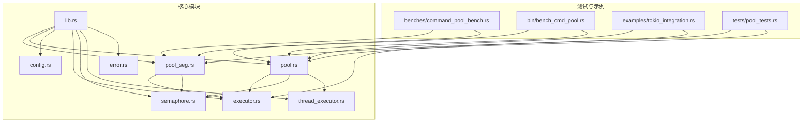
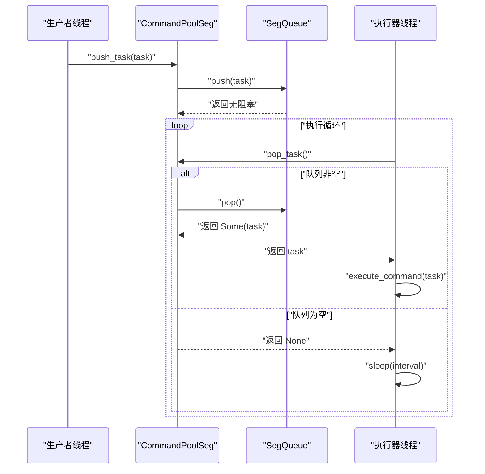
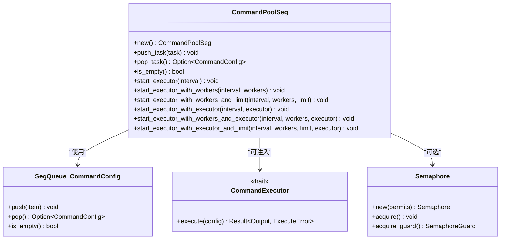
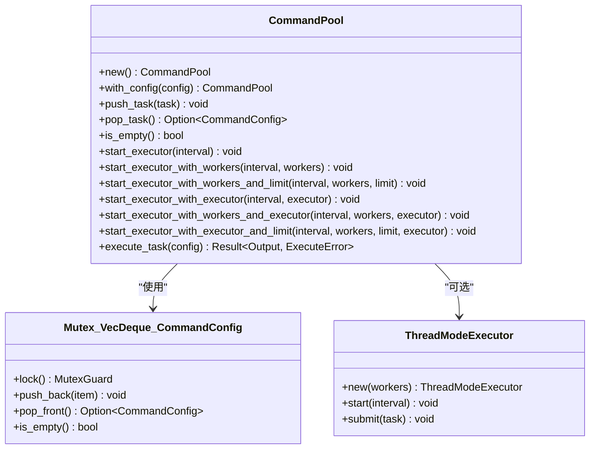
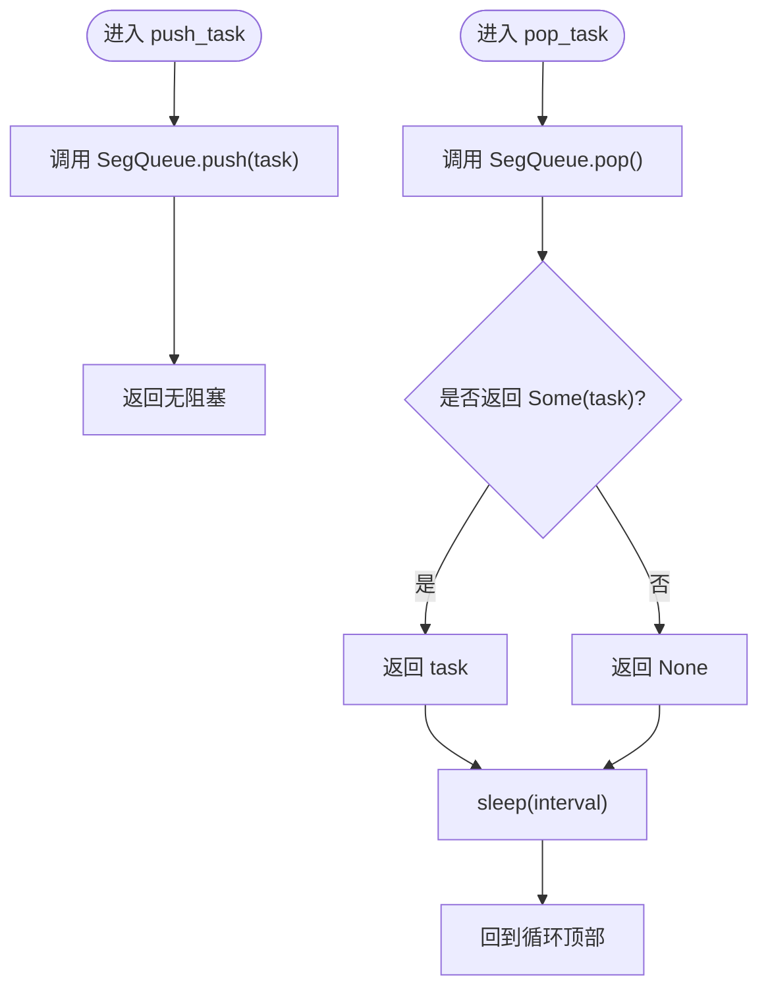
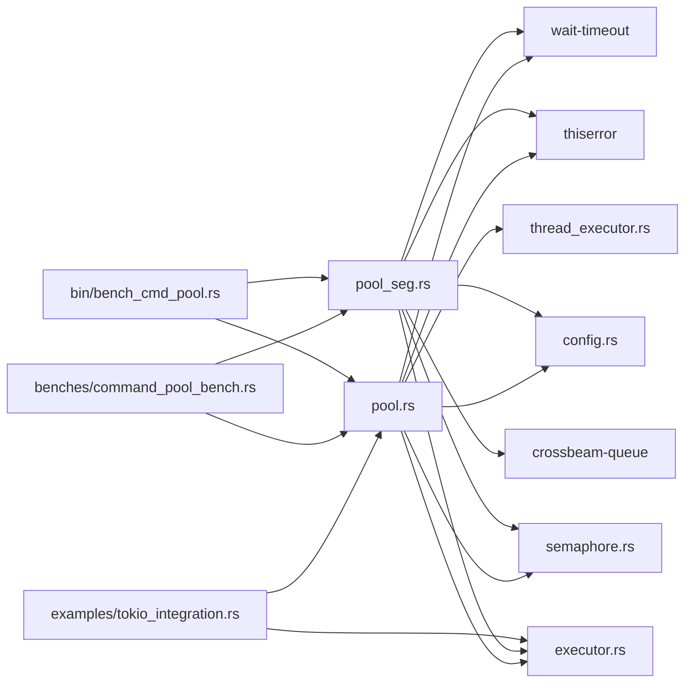

# 无锁队列实现

<cite>
**本文档引用的文件**
- [src/lib.rs](file://src/lib.rs)
- [src/pool_seg.rs](file://src/pool_seg.rs)
- [src/pool.rs](file://src/pool.rs)
- [src/config.rs](file://src/config.rs)
- [src/executor.rs](file://src/executor.rs)
- [src/semaphore.rs](file://src/semaphore.rs)
- [src/thread_executor.rs](file://src/thread_executor.rs)
- [src/error.rs](file://src/error.rs)
- [benches/command_pool_bench.rs](file://benches/command_pool_bench.rs)
- [src/bin/bench_cmd_pool.rs](file://src/bin/bench_cmd_pool.rs)
- [examples/tokio_integration.rs](file://examples/tokio_integration.rs)
- [README.md](file://README.md)
- [Cargo.toml](file://Cargo.toml)
- [tests/pool_tests.rs](file://tests/pool_tests.rs)
</cite>

## 目录
1. [简介](#简介)
2. [项目结构](#项目结构)
3. [核心组件](#核心组件)
4. [架构总览](#架构总览)
5. [详细组件分析](#详细组件分析)
6. [依赖关系分析](#依赖关系分析)
7. [性能考量](#性能考量)
8. [故障排查指南](#故障排查指南)
9. [结论](#结论)
10. [附录](#附录)

## 简介
本项目提供了一个轻量的命令池库，支持两种任务队列实现：
- 基于互斥锁的命令池（多线程安全，适合通用场景）
- 基于无锁队列的命令池（多生产者友好，避免锁竞争）

本文档聚焦于无锁队列实现 CommandPoolSeg 的内部机制与无锁设计原理，详细说明任务推送、弹出与状态检查的无锁操作，解释多生产者场景下的性能优势与锁竞争避免机制，并提供在高并发环境下的使用指南与最佳实践，最后给出与传统互斥锁实现的性能对比分析。

## 项目结构
该项目采用模块化组织，核心模块如下：
- lib.rs：对外导出公共 API
- pool_seg.rs：无锁队列实现（基于 SegQueue）
- pool.rs：互斥锁队列实现（基于 Mutex<VecDeque>）
- config.rs：命令配置数据结构
- executor.rs：命令执行器抽象与标准实现
- semaphore.rs：基于 Mutex+Condvar 的简单信号量
- thread_executor.rs：线程模式执行器与线程池
- error.rs：执行错误类型
- benches/：基准测试
- examples/：Tokio 集成示例
- tests/：单元测试

图表来源
- [src/lib.rs](file://src/lib.rs#L1-L17)
- [src/pool_seg.rs](file://src/pool_seg.rs#L1-L157)
- [src/pool.rs](file://src/pool.rs#L1-L296)
- [src/config.rs](file://src/config.rs#L1-L109)
- [src/executor.rs](file://src/executor.rs#L1-L100)
- [src/semaphore.rs](file://src/semaphore.rs#L1-L53)
- [src/thread_executor.rs](file://src/thread_executor.rs#L1-L148)
- [src/error.rs](file://src/error.rs#L1-L18)
- [benches/command_pool_bench.rs](file://benches/command_pool_bench.rs#L1-L93)
- [src/bin/bench_cmd_pool.rs](file://src/bin/bench_cmd_pool.rs#L1-L126)
- [examples/tokio_integration.rs](file://examples/tokio_integration.rs#L1-L62)
- [tests/pool_tests.rs](file://tests/pool_tests.rs#L1-L90)

章节来源
- [src/lib.rs](file://src/lib.rs#L1-L17)
- [README.md](file://README.md#L1-L60)

## 核心组件
- CommandPoolSeg：基于无锁队列的命令池，提供无阻塞的 push/pop/is_empty 操作，适合多生产者高并发场景。
- CommandPool：基于互斥锁的命令池，提供相同接口，适合通用多线程/多进程场景。
- CommandConfig：描述要执行的外部命令及其参数、工作目录、超时等。
- CommandExecutor：命令执行器抽象，支持标准库、Tokio 等不同运行时。
- Semaphore：轻量级并发控制工具，用于限制同时执行的外部进程数量。
- ThreadModeExecutor：线程模式执行器，将命令封装为线程任务在线程池中执行。

章节来源
- [src/pool_seg.rs](file://src/pool_seg.rs#L11-L157)
- [src/pool.rs](file://src/pool.rs#L13-L296)
- [src/config.rs](file://src/config.rs#L19-L109)
- [src/executor.rs](file://src/executor.rs#L5-L70)
- [src/semaphore.rs](file://src/semaphore.rs#L3-L53)
- [src/thread_executor.rs](file://src/thread_executor.rs#L16-L148)

## 架构总览
无锁队列 CommandPoolSeg 的核心是跨线程安全的环形分段队列 SegQueue。生产者线程通过无阻塞 push 操作将任务加入队列；消费者线程通过无阻塞 pop 操作取出任务。由于 SegQueue 的内部结构与算法保证了多生产者/多消费者的无锁一致性，因此在高并发场景下能显著减少锁竞争带来的性能损耗。

图表来源
- [src/pool_seg.rs](file://src/pool_seg.rs#L28-L91)
- [src/executor.rs](file://src/executor.rs#L26-L70)

章节来源
- [src/pool_seg.rs](file://src/pool_seg.rs#L11-L157)
- [src/executor.rs](file://src/executor.rs#L26-L70)

## 详细组件分析

### CommandPoolSeg 组件分析
CommandPoolSeg 是无锁队列的核心实现，其关键点包括：
- 内部持有 Arc<SegQueue<CommandConfig>>，通过引用计数共享队列实例。
- push_task：无阻塞地将任务推入队列，底层由 SegQueue 的 push 实现。
- pop_task：无阻塞地尝试弹出任务，底层由 SegQueue 的 pop 实现。
- is_empty：查询队列是否为空，底层由 SegQueue 的 is_empty 实现。
- 执行器启动方法：
  - start_executor/start_executor_with_workers：根据 CPU 并发度自动或固定数量创建工作线程，循环从队列取任务并执行。
  - start_executor_with_workers_and_limit：在执行器中引入信号量，限制同时执行的外部进程数量。
  - start_executor_with_executor/start_executor_with_workers_and_executor：允许注入自定义 CommandExecutor，支持 Tokio 等异步运行时。
  - start_executor_with_executor_and_limit：结合自定义执行器与并发限制。

图表来源
- [src/pool_seg.rs](file://src/pool_seg.rs#L16-L150)
- [src/executor.rs](file://src/executor.rs#L9-L12)
- [src/semaphore.rs](file://src/semaphore.rs#L7-L43)

章节来源
- [src/pool_seg.rs](file://src/pool_seg.rs#L11-L157)

### CommandPool 组件分析（对比参考）
CommandPool 作为互斥锁实现的对比参考，其要点包括：
- 内部持有 Arc<Mutex<VecDeque<CommandConfig>>>，通过互斥锁保护队列。
- push_task/pop_task/is_empty：每次操作均需要获取/释放互斥锁，存在锁竞争风险。
- 执行器启动方法：与 CommandPoolSeg 类似的多种启动方式，但内部使用互斥锁队列。
- 线程模式执行器：当执行模式为 Thread 时，使用 ThreadModeExecutor 将命令封装为线程任务在线程池中执行。

图表来源
- [src/pool.rs](file://src/pool.rs#L15-L289)
- [src/thread_executor.rs](file://src/thread_executor.rs#L112-L147)

章节来源
- [src/pool.rs](file://src/pool.rs#L13-L296)
- [src/thread_executor.rs](file://src/thread_executor.rs#L16-L148)

### 无锁操作流程图
以下流程图展示了 CommandPoolSeg 的无锁 push/pop 流程，突出其无阻塞与低竞争特性。

图表来源
- [src/pool_seg.rs](file://src/pool_seg.rs#L28-L91)

章节来源
- [src/pool_seg.rs](file://src/pool_seg.rs#L28-L91)

### 多生产者场景下的性能优势
- 锁竞争避免：CommandPoolSeg 使用 SegQueue，内部采用分段与无锁算法，避免了多生产者/多消费者场景下的全局锁竞争。
- 无阻塞操作：push/pop 操作通常不阻塞，只有在队列为空或满时才进行必要的协调，整体延迟更低。
- 扩展性：随着生产者线程数量增加，CommandPoolSeg 的吞吐量提升更明显，而 CommandPool 的互斥锁会成为瓶颈。

章节来源
- [src/pool_seg.rs](file://src/pool_seg.rs#L11-L15)
- [src/pool.rs](file://src/pool.rs#L13-L23)

### 与传统 Mutex 实现的性能对比
基准测试覆盖了单线程与多线程下的 push/pop 性能，以及执行命令的性能。通过对比 CommandPool 与 CommandPoolSeg 的测试用例，可以直观看到无锁队列在多生产者场景下的优势。

章节来源
- [benches/command_pool_bench.rs](file://benches/command_pool_bench.rs#L6-L93)
- [src/bin/bench_cmd_pool.rs](file://src/bin/bench_cmd_pool.rs#L6-L126)

## 依赖关系分析
- 外部依赖
  - crossbeam-queue：提供 SegQueue，是无锁队列实现的基础。
  - wait-timeout：用于在单线程中等待子进程并处理超时，避免额外等待线程。
  - thiserror：用于统一错误类型。
  - criterion（开发依赖）：用于基准测试。
  - tokio（开发依赖）：用于异步执行器示例。
- 内部模块依赖
  - CommandPoolSeg 依赖 executor.rs 提供的 execute_command 与 CommandExecutor 抽象。
  - 两者都依赖 config.rs 的 CommandConfig 数据结构。
  - 两者都可选依赖 semaphore.rs 的并发限制能力。
  - CommandPool 还依赖 thread_executor.rs 的线程模式执行器。

图表来源
- [Cargo.toml](file://Cargo.toml#L6-L12)
- [src/pool_seg.rs](file://src/pool_seg.rs#L5-L9)
- [src/pool.rs](file://src/pool.rs#L1-L11)
- [src/executor.rs](file://src/executor.rs#L1-L3)
- [src/semaphore.rs](file://src/semaphore.rs#L1-L1)
- [src/thread_executor.rs](file://src/thread_executor.rs#L1-L3)
- [examples/tokio_integration.rs](file://examples/tokio_integration.rs#L1-L7)
- [benches/command_pool_bench.rs](file://benches/command_pool_bench.rs#L1-L4)
- [src/bin/bench_cmd_pool.rs](file://src/bin/bench_cmd_pool.rs#L1-L4)

章节来源
- [Cargo.toml](file://Cargo.toml#L6-L12)

## 性能考量
- 无锁队列的优势
  - 多生产者高并发：SegQueue 在多生产者场景下吞吐更高，锁竞争更少。
  - 低延迟：push/pop 通常为 O(1)，且无阻塞等待。
  - 可扩展性：CPU 核心数越多，无锁队列的收益越明显。
- 互斥锁队列的权衡
  - 简单可靠：Mutex+VecDeque 实现简单，易于理解和调试。
  - 锁竞争：在高并发下，锁竞争可能导致上下文切换增多，影响吞吐。
- 并发限制
  - 使用信号量限制同时执行的外部进程数量，避免系统资源耗尽。
  - 结合自定义执行器（如 Tokio）可进一步优化异步场景下的性能。
- 调度间隔
  - 执行器的 sleep(interval) 会影响空闲时的响应速度，可根据负载调整。

章节来源
- [src/pool_seg.rs](file://src/pool_seg.rs#L43-L91)
- [src/pool.rs](file://src/pool.rs#L134-L289)
- [src/semaphore.rs](file://src/semaphore.rs#L16-L43)

## 故障排查指南
- 常见错误类型
  - IO 错误：命令启动失败或读写子进程输出时发生错误。
  - 超时错误：命令执行超过设定的超时时间。
  - 子进程错误：子进程状态异常或无法终止。
- 超时处理
  - execute_command 使用 wait-timeout 在当前线程中等待，避免额外线程开销。
  - 超时后尝试杀死子进程并返回超时错误。
- 并发限制问题
  - 若并发过高导致资源不足，可通过信号量限制同时执行的外部进程数量。
  - 检查 workers 与 limit 的配置是否合理。
- 线程模式与进程模式
  - 线程模式共享内存，适合计算密集型任务；进程模式隔离性强，适合外部命令执行。
- 单元测试与基准测试
  - 使用 tests/pool_tests.rs 验证基本功能。
  - 使用 benches/command_pool_bench.rs 与 src/bin/bench_cmd_pool.rs 进行性能评估。

章节来源
- [src/error.rs](file://src/error.rs#L7-L17)
- [src/executor.rs](file://src/executor.rs#L26-L70)
- [src/semaphore.rs](file://src/semaphore.rs#L16-L53)
- [tests/pool_tests.rs](file://tests/pool_tests.rs#L1-L90)
- [benches/command_pool_bench.rs](file://benches/command_pool_bench.rs#L1-L93)
- [src/bin/bench_cmd_pool.rs](file://src/bin/bench_cmd_pool.rs#L1-L126)

## 结论
CommandPoolSeg 通过 SegQueue 实现了高性能的无锁队列，特别适用于多生产者高并发场景。相比基于互斥锁的 CommandPool，它显著减少了锁竞争，提升了吞吐量与响应速度。结合信号量与自定义执行器，可以在保证稳定性的同时获得更好的性能表现。在实际应用中，建议根据业务负载选择合适的队列实现与执行模式，并通过基准测试持续验证性能。

## 附录
- 使用指南
  - 选择无锁队列：当生产者线程较多、任务推送频率较高时，优先考虑 CommandPoolSeg。
  - 选择互斥锁队列：当需要简单可靠的实现或与现有系统兼容时，选择 CommandPool。
  - 并发限制：通过 start_executor_with_workers_and_limit 或 start_executor_with_executor_and_limit 控制外部进程并发数。
  - 自定义执行器：实现 CommandExecutor trait，支持 Tokio 等异步运行时。
- 最佳实践
  - 合理设置 workers：根据 CPU 核心数与任务类型调整工作线程数量。
  - 调整 sleep 间隔：平衡响应速度与 CPU 占用。
  - 超时设置：为命令配置合理的超时时间，避免长时间阻塞。
  - 监控与调优：通过基准测试与日志监控队列长度与执行时延。

章节来源
- [examples/tokio_integration.rs](file://examples/tokio_integration.rs#L1-L62)
- [src/pool_seg.rs](file://src/pool_seg.rs#L43-L150)
- [src/pool.rs](file://src/pool.rs#L134-L289)