# 管道系统

<cite>
**本文档引用的文件**
- [README.md](file://README.md)
- [Cargo.toml](file://Cargo.toml)
- [src/lib.rs](file://src/lib.rs)
- [src/main.rs](file://src/main.rs)
- [src/pipeline.rs](file://src/pipeline.rs)
- [src/config.rs](file://src/config.rs)
- [src/pool.rs](file://src/pool.rs)
- [src/pool_seg.rs](file://src/pool_seg.rs)
- [src/process_pool.rs](file://src/process_pool.rs)
- [src/executor.rs](file://src/executor.rs)
- [src/backend.rs](file://src/backend.rs)
- [src/semaphore.rs](file://src/semaphore.rs)
- [src/task_handle.rs](file://src/task_handle.rs)
- [src/task_status.rs](file://src/task_status.rs)
- [examples/tokio_integration.rs](file://examples/tokio_integration.rs)
- [EXECUTOR_CUSTOM.md](file://EXECUTOR_CUSTOM.md)
</cite>

## 更新摘要
**所做更改**
- 增强了管道执行器的文档内容，新增完整的管道执行器示例
- 详细说明了管道阶段配置和 ignore_input 功能
- 新增异步执行功能的完整说明和使用示例
- 添加了与 EXECUTOR_CUSTOM.md 的交叉引用链接
- 完善了管道系统的架构图和组件关系说明

## 目录
1. [简介](#简介)
2. [项目结构](#项目结构)
3. [核心组件](#核心组件)
4. [架构概览](#架构概览)
5. [详细组件分析](#详细组件分析)
6. [管道系统详解](#管道系统详解)
7. [异步执行功能](#异步执行功能)
8. [依赖关系分析](#依赖关系分析)
9. [性能考虑](#性能考虑)
10. [故障排除指南](#故障排除指南)
11. [结论](#结论)

## 简介

execute 是一个轻量级的 Rust 命令池库，提供了可插拔的命令执行器、锁/无锁任务队列、线程池与并发限制策略。该库的核心特性包括：

- 多线程安全的任务队列：CommandPool（基于 Mutex<VecDeque>）
- 无锁队列变体：CommandPoolSeg（基于 crossbeam_queue::SegQueue）
- 可扩展执行器接口：CommandExecutor（可集成 tokio/async-std）
- 子进程超时与安全等待：使用 wait-timeout 避免额外等待线程
- 线程池、并发限制（信号量）和多种执行模式
- 执行器停止机制：优雅关闭执行器线程
- 队列大小限制：支持有界队列，防止内存无限增长
- 批量操作接口：批量提交任务，提高吞吐量
- 任务状态查询：追踪任务状态（Pending/Running/Completed/Failed）
- 任务结果获取：异步获取任务执行结果（TaskHandle）
- 真正的进程池：常驻子进程池，通过 IPC 通信执行命令
- **管道执行系统**：完整的命令管道支持，支持多阶段命令链式执行

## 项目结构

该项目采用模块化设计，主要文件组织如下：

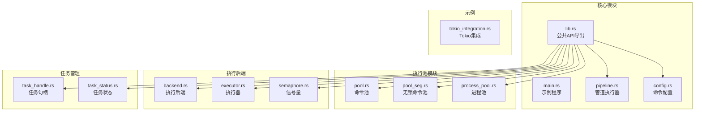

**图表来源**
- [src/lib.rs](file://src/lib.rs#L1-L24)
- [src/main.rs](file://src/main.rs#L1-L175)
- [src/pipeline.rs](file://src/pipeline.rs#L1-L268)

**章节来源**
- [src/lib.rs](file://src/lib.rs#L1-L24)
- [Cargo.toml](file://Cargo.toml#L1-L13)

## 核心组件

### 命令配置系统

CommandConfig 提供了完整的命令执行配置能力：

- **程序名称和参数**：支持任意外部程序的参数传递
- **工作目录设置**：可选的工作目录配置
- **超时控制**：可选的超时时间配置，支持精确的超时处理
- **链式配置**：提供 with_working_dir 和 with_timeout 方法

### 执行后端系统

执行后端系统提供了三种执行模式：

1. **多进程模式（Process）**：每个命令独立子进程，完全隔离
2. **多线程模式（Thread）**：线程池调度任务，共享内存空间
3. **进程池模式（ProcessPool）**：预创建子进程池，复用执行环境

### 任务队列系统

系统提供了两种队列实现：

1. **有锁队列（CommandPool）**：基于 Mutex<VecDeque>，支持队列大小限制
2. **无锁队列（CommandPoolSeg）**：基于 crossbeam_queue::SegQueue，提供更高并发性能

### 任务管理

- **任务句柄（TaskHandle）**：异步获取任务结果
- **任务状态追踪器（TaskStatusTracker）**：跟踪任务生命周期状态
- **任务ID生成器（TaskIdGenerator）**：生成唯一任务标识符

**章节来源**
- [src/config.rs](file://src/config.rs#L1-L109)
- [src/backend.rs](file://src/backend.rs#L1-L277)
- [src/pool.rs](file://src/pool.rs#L1-L324)
- [src/pool_seg.rs](file://src/pool_seg.rs#L1-L157)
- [src/task_handle.rs](file://src/task_handle.rs#L1-L211)
- [src/task_status.rs](file://src/task_status.rs#L1-L178)

## 架构概览

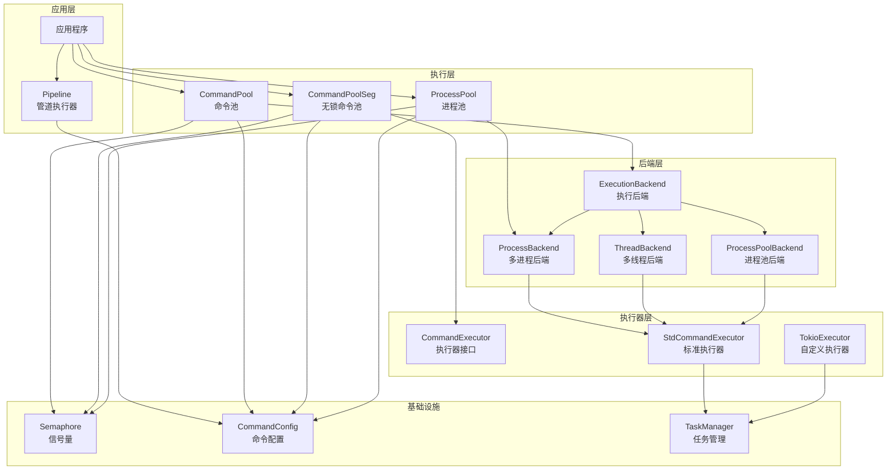

**图表来源**
- [src/pipeline.rs](file://src/pipeline.rs#L1-L268)
- [src/pool.rs](file://src/pool.rs#L1-L324)
- [src/pool_seg.rs](file://src/pool_seg.rs#L1-L157)
- [src/process_pool.rs](file://src/process_pool.rs#L1-L173)
- [src/backend.rs](file://src/backend.rs#L1-L277)
- [src/executor.rs](file://src/executor.rs#L1-L100)

## 详细组件分析

### 管道执行器（PipelineExecutor）

管道执行器提供了命令管道的完整实现：

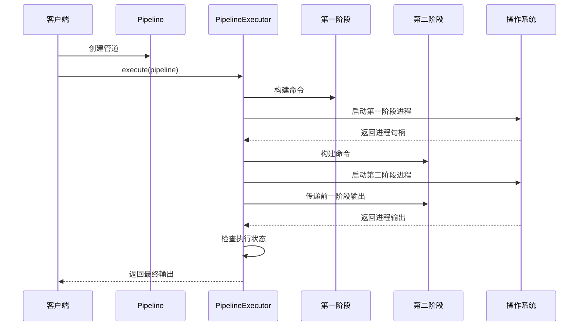

**图表来源**
- [src/pipeline.rs](file://src/pipeline.rs#L106-L175)

管道执行器的关键特性：

- **阶段链式处理**：支持多个命令阶段的串联执行
- **输入输出传递**：自动将前一阶段的标准输出传递给下一阶段的标准输入
- **独立阶段支持**：某些阶段可以选择忽略前一阶段的输入
- **异步执行**：提供异步执行选项，避免阻塞主线程

**章节来源**
- [src/pipeline.rs](file://src/pipeline.rs#L1-L268)

### 命令池（CommandPool）

命令池提供了多线程安全的任务队列：

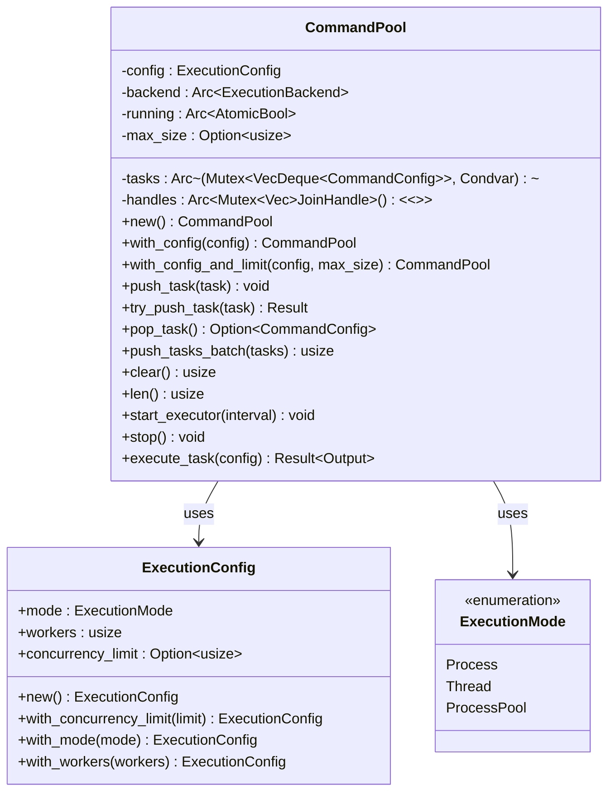

**图表来源**
- [src/pool.rs](file://src/pool.rs#L13-L324)
- [src/backend.rs](file://src/backend.rs#L58-L128)

命令池的主要功能：

- **队列管理**：支持有界和无界队列，防止内存无限增长
- **批量操作**：提供批量任务提交，提高吞吐量
- **执行模式切换**：支持多进程、多线程和进程池三种执行模式
- **优雅停机**：提供执行器停止机制，确保资源正确释放

**章节来源**
- [src/pool.rs](file://src/pool.rs#L1-L324)
- [src/backend.rs](file://src/backend.rs#L1-L277)

### 无锁命令池（CommandPoolSeg）

无锁命令池针对高并发场景进行了优化：

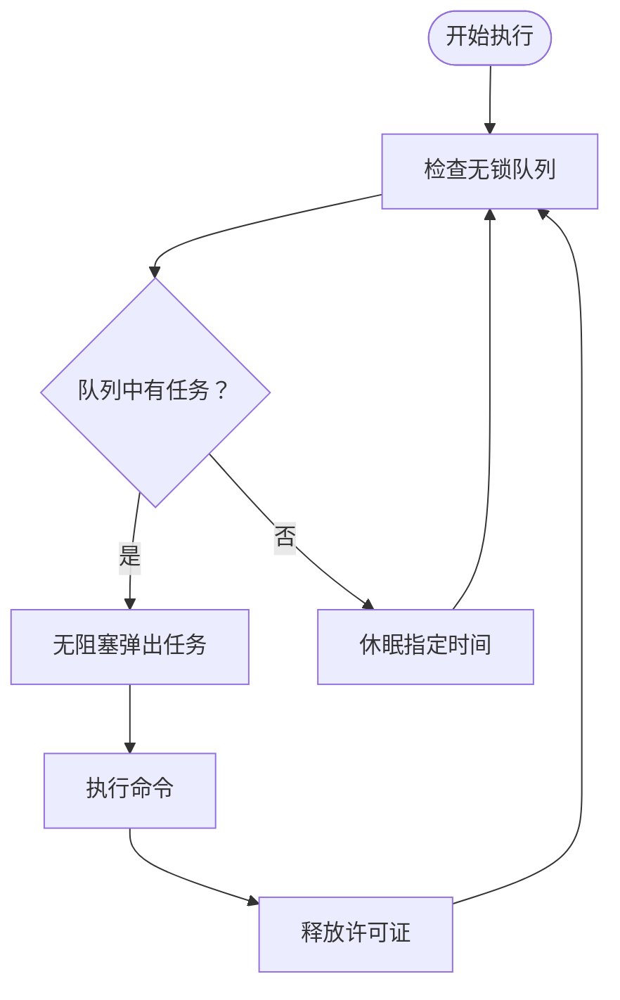

**图表来源**
- [src/pool_seg.rs](file://src/pool_seg.rs#L59-L91)

无锁命令池的优势：

- **高性能**：基于 SegQueue，避免锁竞争
- **自动调节**：根据 CPU 核心数自动调整工作线程数
- **并发限制**：支持信号量限制同时执行的进程数量
- **灵活配置**：支持自定义执行器和工作线程数

**章节来源**
- [src/pool_seg.rs](file://src/pool_seg.rs#L1-L157)

### 进程池（ProcessPool）

进程池提供了真正的进程复用能力：

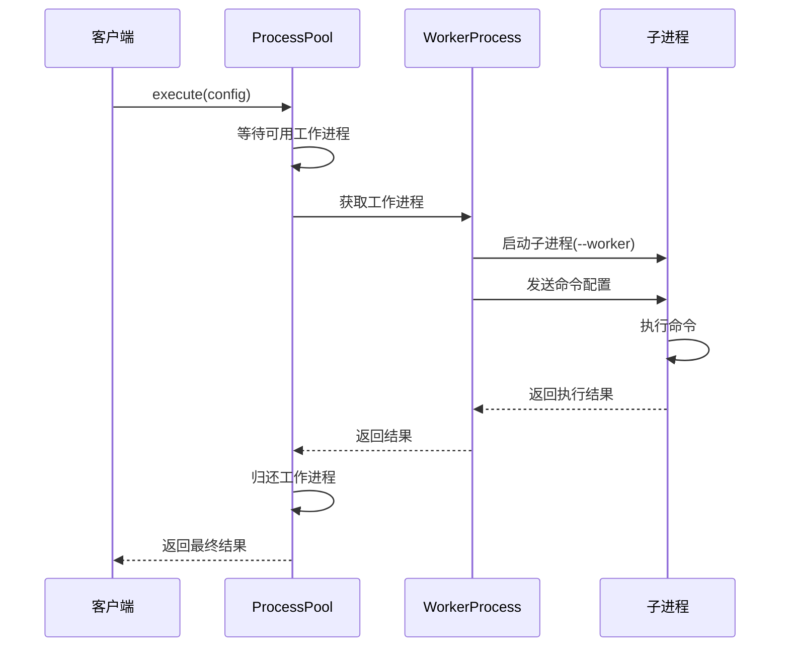

**图表来源**
- [src/process_pool.rs](file://src/process_pool.rs#L124-L147)

进程池的特点：

- **常驻进程**：预创建子进程，避免频繁创建销毁开销
- **IPC通信**：通过标准输入输出与子进程通信
- **资源管理**：自动管理工作进程的生命周期
- **错误处理**：完善的错误处理和资源清理机制

**章节来源**
- [src/process_pool.rs](file://src/process_pool.rs#L1-L173)

### 执行器接口（CommandExecutor）

执行器接口提供了可插拔的执行能力：

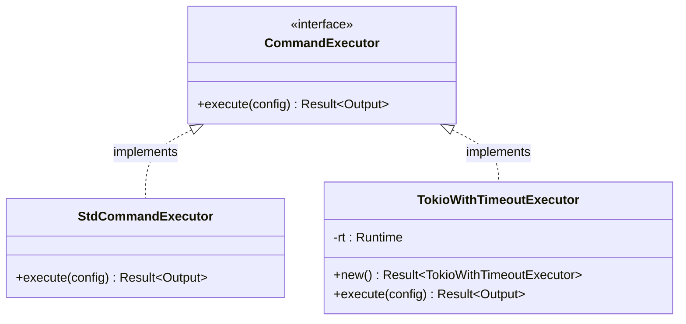

**图表来源**
- [src/executor.rs](file://src/executor.rs#L9-L24)
- [examples/tokio_integration.rs](file://examples/tokio_integration.rs#L10-L40)

执行器接口的设计优势：

- **可扩展性**：支持自定义执行器实现
- **统一接口**：所有执行器遵循相同的接口规范
- **异步支持**：天然支持异步执行模型
- **超时控制**：内置超时处理机制

**章节来源**
- [src/executor.rs](file://src/executor.rs#L1-L100)
- [examples/tokio_integration.rs](file://examples/tokio_integration.rs#L1-L62)

## 管道系统详解

### 管道阶段配置

管道系统的核心是 PipelineStage 结构，它提供了灵活的阶段配置能力：

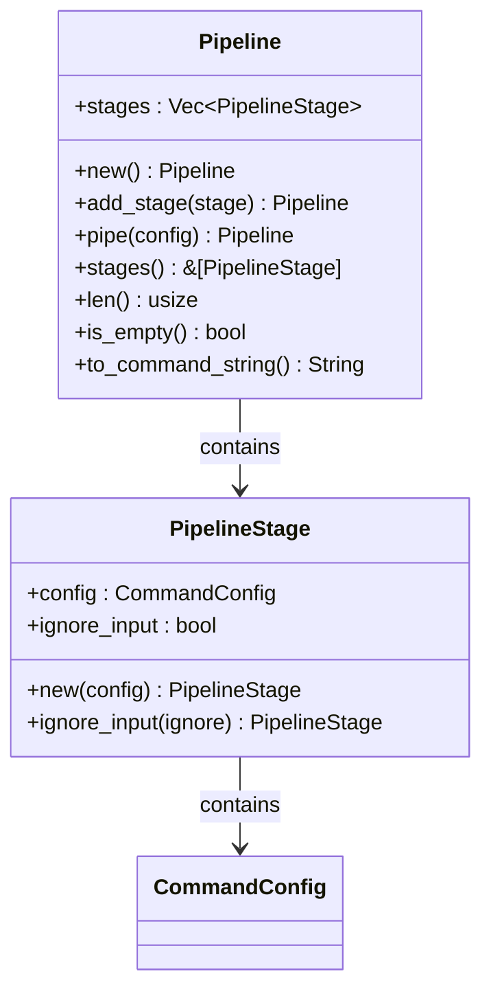

**图表来源**
- [src/pipeline.rs](file://src/pipeline.rs#L6-L89)

管道阶段的关键特性：

- **独立配置**：每个阶段都有自己的 CommandConfig
- **输入控制**：通过 ignore_input 属性控制是否使用前一阶段的输出
- **链式构建**：支持流畅的管道构建语法
- **调试支持**：提供 to_command_string 方法用于调试输出

### 管道构建器模式

Pipeline 构建器提供了直观的管道创建方式：

```rust
// 创建一个简单的管道：echo "hello" | tr 'a-z' 'A-Z'
let pipeline = Pipeline::new()
    .pipe(CommandConfig::new("echo", vec!["hello".to_string()]))
    .pipe(CommandConfig::new(
        "tr",
        vec!["a-z".to_string(), "A-Z".to_string()],
    ));
```

**章节来源**
- [src/pipeline.rs](file://src/pipeline.rs#L33-L89)

### 管道执行流程

管道执行器的执行流程如下：

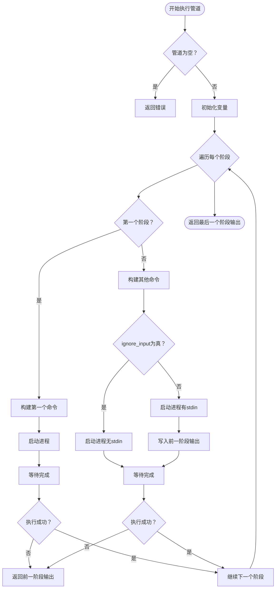

**图表来源**
- [src/pipeline.rs](file://src/pipeline.rs#L102-L175)

**章节来源**
- [src/pipeline.rs](file://src/pipeline.rs#L97-L175)

## 异步执行功能

### 异步管道执行

管道系统不仅支持同步执行，还提供了完整的异步执行能力：

```rust
// 异步执行管道
let handle = PipelineExecutor::execute_async(pipeline);

// 在其他地方获取结果
let result = handle.join().unwrap();
```

异步执行的优势：

- **非阻塞**：不会阻塞主线程
- **并发处理**：可以同时执行多个管道
- **资源利用**：更好地利用系统资源

### 异步执行器集成

管道系统可以与自定义异步执行器无缝集成：

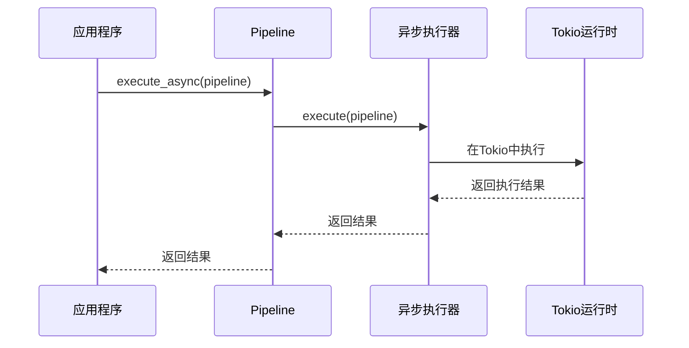

**图表来源**
- [src/pipeline.rs](file://src/pipeline.rs#L169-L175)
- [examples/tokio_integration.rs](file://examples/tokio_integration.rs#L21-L40)

**章节来源**
- [src/pipeline.rs](file://src/pipeline.rs#L169-L175)
- [examples/tokio_integration.rs](file://examples/tokio_integration.rs#L1-L62)

## 依赖关系分析

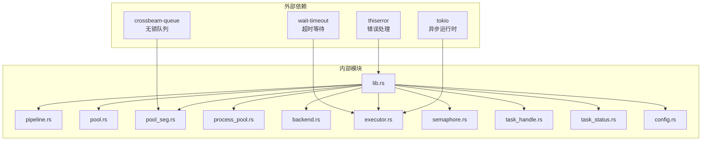

**图表来源**
- [Cargo.toml](file://Cargo.toml#L6-L12)
- [src/lib.rs](file://src/lib.rs#L1-L24)

依赖关系特点：

- **最小依赖**：只引入必要的外部依赖
- **功能分离**：每个依赖服务于特定功能领域
- **版本管理**：明确的版本约束和兼容性要求
- **可选依赖**：Tokio 仅用于示例和自定义执行器

**章节来源**
- [Cargo.toml](file://Cargo.toml#L1-L13)
- [src/lib.rs](file://src/lib.rs#L1-L24)

## 性能考虑

### 并发性能优化

1. **无锁队列选择**：在高并发场景下优先使用 CommandPoolSeg
2. **信号量限制**：通过 Semaphore 控制同时执行的进程数量
3. **工作线程自适应**：根据 CPU 核心数自动调整线程数量
4. **批量操作**：使用 push_tasks_batch 提高吞吐量

### 内存管理

1. **队列大小限制**：防止任务过多导致内存溢出
2. **优雅停机**：确保执行器停止时正确释放资源
3. **进程池复用**：避免频繁创建销毁子进程的开销

### 执行效率

1. **wait-timeout**：避免为每个任务创建额外等待线程
2. **异步执行**：支持非阻塞的任务执行模式
3. **智能调度**：根据任务类型选择最优执行策略

### 管道执行优化

1. **零拷贝传递**：管道阶段间的数据传递避免不必要的复制
2. **流式处理**：支持大数据量的流式管道处理
3. **错误早发现**：管道中任何阶段失败都会立即返回

## 故障排除指南

### 常见问题及解决方案

1. **任务队列满**
   - 检查 max_size 配置
   - 使用 try_push_task 进行非阻塞插入
   - 实现适当的背压机制

2. **进程超时**
   - 检查 CommandConfig.timeout 配置
   - 确认 wait-timeout 正常工作
   - 实现超时后的资源清理

3. **执行器无法停止**
   - 确认 running 标志正确设置
   - 检查所有工作线程的 join 操作
   - 实现优雅停机逻辑

4. **进程池通信失败**
   - 检查子进程启动参数
   - 验证 IPC 数据格式
   - 实现错误重试机制

5. **管道执行失败**
   - 检查管道阶段的 ignore_input 配置
   - 验证命令的可执行性和参数正确性
   - 使用 to_command_string 方法调试管道

**章节来源**
- [src/pool.rs](file://src/pool.rs#L56-L90)
- [src/executor.rs](file://src/executor.rs#L42-L70)
- [src/process_pool.rs](file://src/process_pool.rs#L48-L93)
- [src/pipeline.rs](file://src/pipeline.rs#L177-L268)

## 结论

execute 库提供了一个完整而灵活的命令执行解决方案，具有以下优势：

1. **模块化设计**：清晰的模块分离和职责划分
2. **高性能实现**：针对不同场景提供最优的执行策略
3. **易于扩展**：通过 CommandExecutor 接口支持自定义执行器
4. **生产就绪**：完善的错误处理和资源管理机制
5. **文档完善**：详细的 API 文档和使用示例
6. **管道系统**：完整的命令管道支持，包括多阶段执行和异步处理
7. **异步集成**：与现代异步运行时（如 Tokio）无缝集成

该库特别适合需要高效执行大量外部命令的应用场景，如批处理系统、CI/CD 工具、数据处理管道等。通过合理选择执行模式和配置参数，可以在性能和资源使用之间找到最佳平衡点。

**章节来源**
- [EXECUTOR_CUSTOM.md](file://EXECUTOR_CUSTOM.md#L1-L228)
- [src/pipeline.rs](file://src/pipeline.rs#L1-L268)
- [src/lib.rs](file://src/lib.rs#L1-L24)