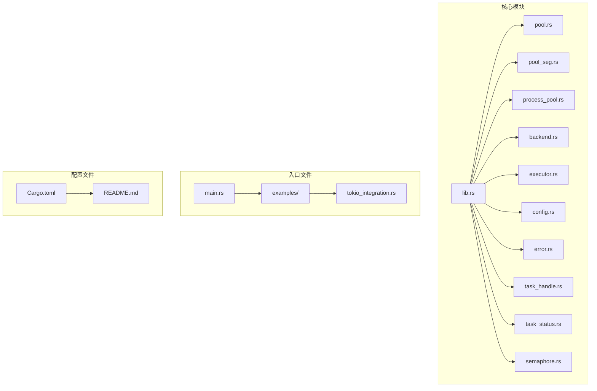
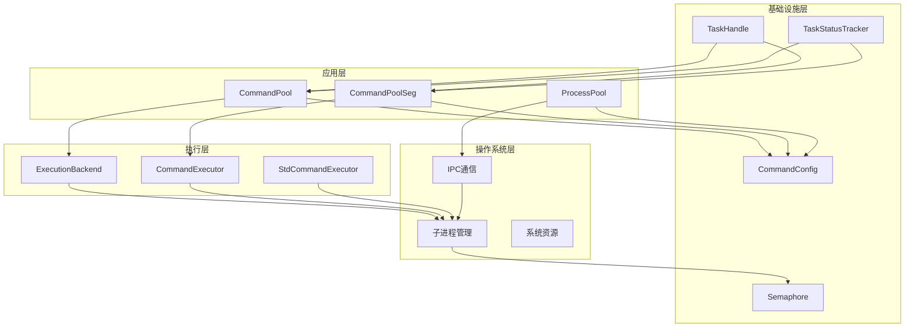
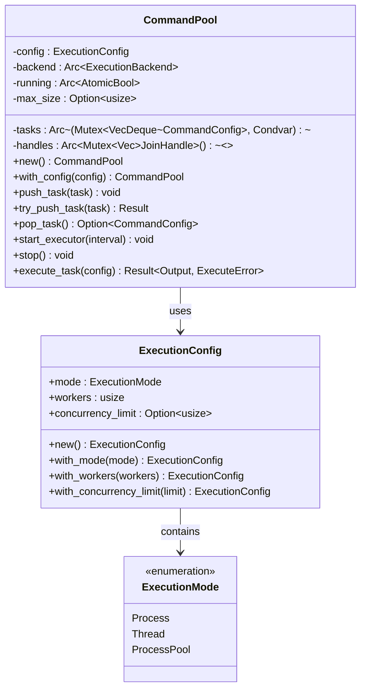
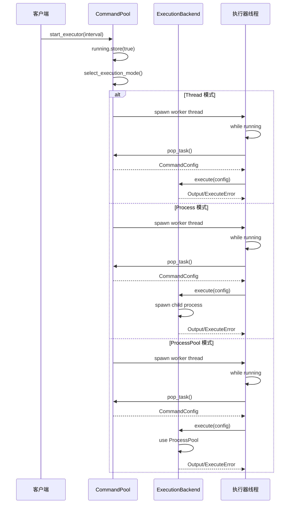
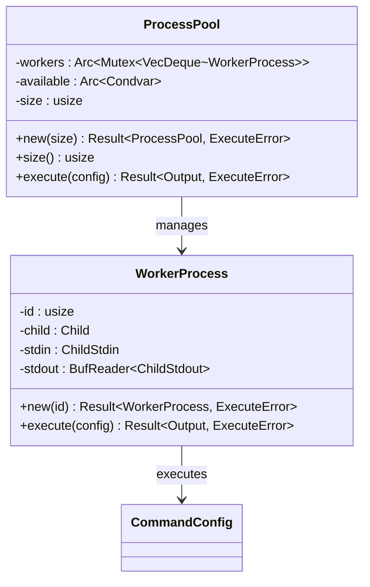
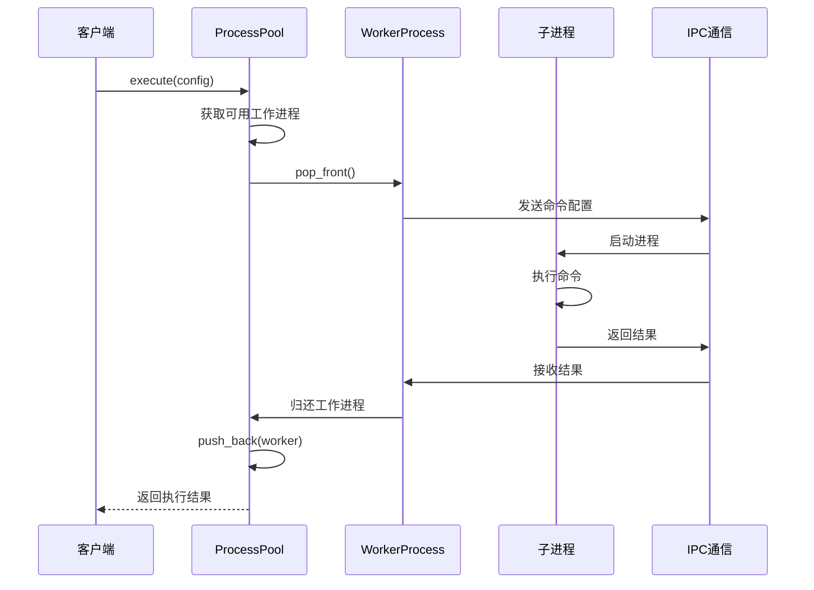
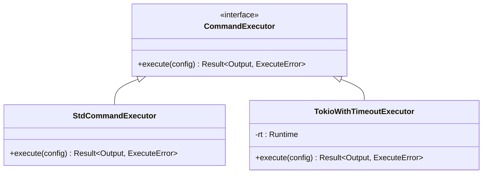
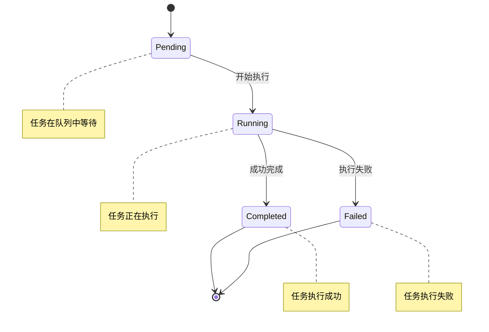
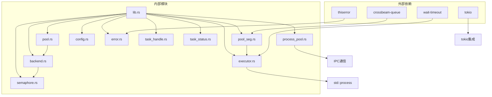
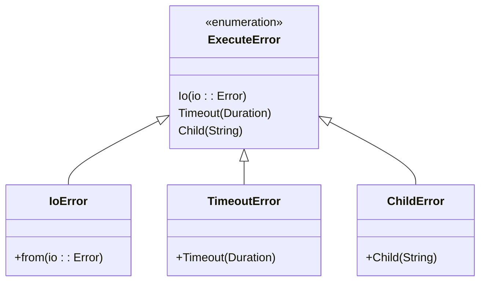

# 进程池系统

<cite>
**本文档引用的文件**
- [lib.rs](file://src/lib.rs)
- [main.rs](file://src/main.rs)
- [process_pool.rs](file://src/process_pool.rs)
- [pool.rs](file://src/pool.rs)
- [pool_seg.rs](file://src/pool_seg.rs)
- [config.rs](file://src/config.rs)
- [backend.rs](file://src/backend.rs)
- [executor.rs](file://src/executor.rs)
- [error.rs](file://src/error.rs)
- [task_handle.rs](file://src/task_handle.rs)
- [task_status.rs](file://src/task_status.rs)
- [semaphore.rs](file://src/semaphore.rs)
- [Cargo.toml](file://Cargo.toml)
- [README.md](file://README.md)
- [tokio_integration.rs](file://examples/tokio_integration.rs)
</cite>

## 目录
1. [简介](#简介)
2. [项目结构](#项目结构)
3. [核心组件](#核心组件)
4. [架构概览](#架构概览)
5. [详细组件分析](#详细组件分析)
6. [依赖关系分析](#依赖关系分析)
7. [性能考虑](#性能考虑)
8. [故障排除指南](#故障排除指南)
9. [结论](#结论)

## 简介

进程池系统是一个轻量级的 Rust 命令执行库，提供了可插拔的命令执行器、锁/无锁任务队列、线程池与并发限制策略。该系统支持多种执行模式，包括多线程模式、多进程模式和进程池模式，能够高效地管理和执行外部命令。

主要特性包括：
- 多线程安全的任务队列：CommandPool（基于 Mutex<VecDeque>）
- 无锁队列变体：CommandPoolSeg（基于 crossbeam_queue::SegQueue）
- 可扩展执行器接口：CommandExecutor（可集成 tokio / async-std）
- 子进程超时与安全等待：使用 wait-timeout 避免额外等待线程
- 线程池、并发限制（信号量）和多种执行模式
- 执行器停止机制：优雅关闭执行器线程
- 队列大小限制：支持有界队列，防止内存无限增长
- 批量操作接口：批量提交任务，提高吞吐量
- 任务状态查询：追踪任务状态（Pending/Running/Completed/Failed）
- 任务结果获取：异步获取任务执行结果（TaskHandle）
- 真正的进程池：常驻子进程池，通过 IPC 通信执行命令

## 项目结构

该项目采用模块化设计，主要文件组织如下：



**图表来源**
- [lib.rs](file://src/lib.rs#L1-L22)
- [main.rs](file://src/main.rs#L1-L175)
- [Cargo.toml](file://Cargo.toml#L1-L13)

**章节来源**
- [lib.rs](file://src/lib.rs#L1-L22)
- [Cargo.toml](file://Cargo.toml#L1-L13)

## 核心组件

### 命令配置系统
CommandConfig 结构体定义了要执行的外部命令及其执行参数，支持工作目录和超时设置。

### 执行后端系统
ExecutionBackend trait 定义了命令执行的抽象接口，支持多种执行策略：
- ProcessBackend：每个命令独立子进程
- ThreadBackend：线程池调度任务
- ProcessPoolBackend：常驻子进程池

### 任务队列系统
提供两种队列实现：
- CommandPool：基于 Mutex 的线程安全队列
- CommandPoolSeg：基于 SegQueue 的无锁队列

### 进程池系统
ProcessPool 提供真正的进程池功能，通过常驻子进程执行命令，支持 IPC 通信。

**章节来源**
- [config.rs](file://src/config.rs#L19-L25)
- [backend.rs](file://src/backend.rs#L8-L22)
- [pool.rs](file://src/pool.rs#L12-L20)
- [pool_seg.rs](file://src/pool_seg.rs#L11-L18)
- [process_pool.rs](file://src/process_pool.rs#L95-L100)

## 架构概览

系统采用分层架构设计，各组件职责明确：



**图表来源**
- [pool.rs](file://src/pool.rs#L12-L20)
- [pool_seg.rs](file://src/pool_seg.rs#L15-L18)
- [process_pool.rs](file://src/process_pool.rs#L95-L100)
- [backend.rs](file://src/backend.rs#L8-L22)
- [executor.rs](file://src/executor.rs#L5-L12)

## 详细组件分析

### 命令池系统（CommandPool）

CommandPool 是系统的核心组件，提供了完整的任务队列和执行管理功能。



**图表来源**
- [pool.rs](file://src/pool.rs#L12-L54)
- [backend.rs](file://src/backend.rs#L24-L65)

#### 执行器启动流程



**图表来源**
- [pool.rs](file://src/pool.rs#L180-L265)
- [backend.rs](file://src/backend.rs#L244-L276)

**章节来源**
- [pool.rs](file://src/pool.rs#L22-L324)

### 无锁队列系统（CommandPoolSeg）

CommandPoolSeg 提供基于 SegQueue 的无锁队列实现，具有更好的并发性能。

```mermaid
flowchart TD
A[创建无锁队列] --> B[push_task(task)]
B --> C[SegQueue.push(task)]
C --> D[pop_task()]
D --> E{队列是否为空?}
E --> |否| F[返回任务]
E --> |是| G[返回 None]
F --> H[start_executor_with_workers]
G --> H
H --> I[循环执行]
I --> J{有任务?}
J --> |是| K[execute_command]
J --> |否| L[sleep(interval)]
K --> I
L --> I
```

**图表来源**
- [pool_seg.rs](file://src/pool_seg.rs#L20-L91)

**章节来源**
- [pool_seg.rs](file://src/pool_seg.rs#L1-L157)

### 进程池系统（ProcessPool）

ProcessPool 提供真正的进程池功能，通过常驻子进程执行命令。



**图表来源**
- [process_pool.rs](file://src/process_pool.rs#L95-L148)

#### 进程池执行流程



**图表来源**
- [process_pool.rs](file://src/process_pool.rs#L124-L147)

**章节来源**
- [process_pool.rs](file://src/process_pool.rs#L1-L173)

### 执行器系统

系统支持多种执行器实现：



**图表来源**
- [executor.rs](file://src/executor.rs#L5-L24)
- [tokio_integration.rs](file://examples/tokio_integration.rs#L10-L40)

**章节来源**
- [executor.rs](file://src/executor.rs#L1-L100)
- [tokio_integration.rs](file://examples/tokio_integration.rs#L1-L62)

### 任务管理系统

系统提供完整任务状态跟踪和结果获取功能：



**图表来源**
- [task_status.rs](file://src/task_status.rs#L5-L16)

**章节来源**
- [task_handle.rs](file://src/task_handle.rs#L1-L211)
- [task_status.rs](file://src/task_status.rs#L1-L178)

## 依赖关系分析

系统依赖关系清晰，采用松耦合设计：



**图表来源**
- [Cargo.toml](file://Cargo.toml#L6-L12)
- [lib.rs](file://src/lib.rs#L1-L22)

**章节来源**
- [Cargo.toml](file://Cargo.toml#L1-L13)
- [lib.rs](file://src/lib.rs#L1-L22)

## 性能考虑

### 并发性能优化

1. **无锁队列优势**：CommandPoolSeg 使用 SegQueue 提供更好的多生产者性能
2. **信号量并发控制**：通过 Semaphore 限制同时执行的外部进程数量
3. **智能线程数量**：根据 CPU 核心数自动调整工作线程数
4. **超时优化**：使用 wait-timeout 避免额外等待线程

### 内存管理

1. **有界队列**：支持队列大小限制，防止内存无限增长
2. **RAII 资源管理**：信号量守卫自动释放许可证
3. **优雅关闭**：执行器停止时优雅关闭所有线程

### 执行效率

1. **进程池复用**：ProcessPool 复用工作进程，减少进程创建开销
2. **批量操作**：支持批量提交任务，提高吞吐量
3. **异步结果获取**：TaskHandle 提供异步结果获取机制

## 故障排除指南

### 常见错误类型

系统定义了三种主要错误类型：



**图表来源**
- [error.rs](file://src/error.rs#L7-L17)

### 调试建议

1. **超时问题**：检查命令配置的超时设置和系统负载
2. **进程池问题**：验证子进程的可执行权限和环境配置
3. **队列阻塞**：监控队列大小和执行器状态
4. **内存泄漏**：确认执行器正确停止和资源清理

**章节来源**
- [error.rs](file://src/error.rs#L1-L18)

## 结论

进程池系统是一个设计精良的 Rust 命令执行库，具有以下特点：

1. **模块化设计**：清晰的分层架构和职责分离
2. **高性能实现**：支持多种执行模式和并发优化
3. **易用性**：简洁的 API 和丰富的配置选项
4. **可扩展性**：可插拔的执行器接口和自定义扩展能力
5. **稳定性**：完善的错误处理和资源管理机制

该系统适用于需要高效执行大量外部命令的各种应用场景，包括批处理任务、定时任务调度和实时命令执行等。