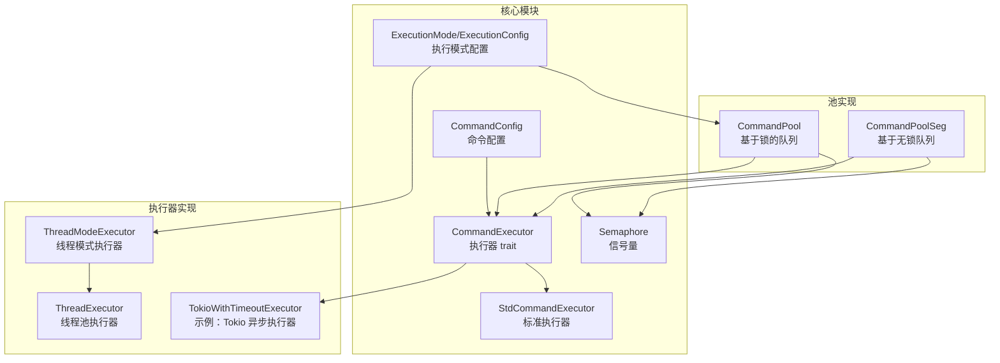
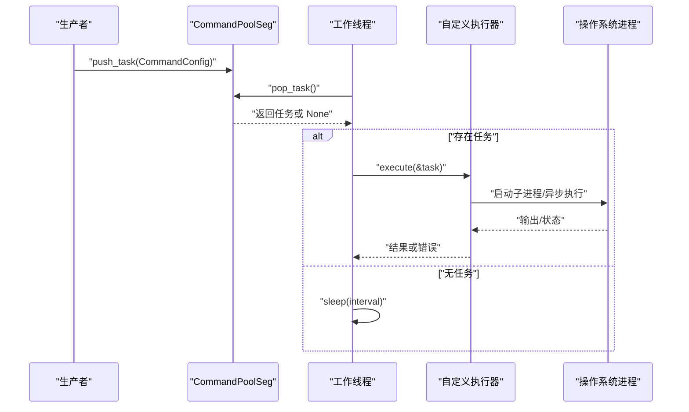
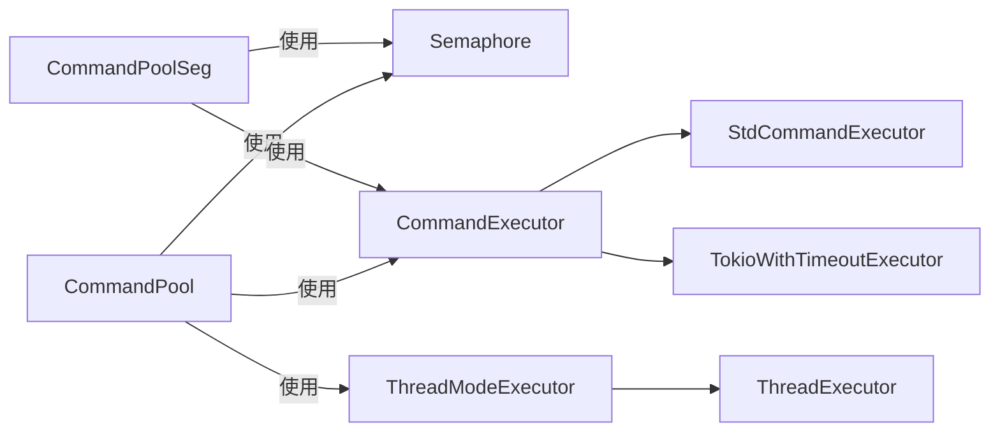

# 高级使用模式

<cite>
**本文引用的文件**
- [src/pool_seg.rs](file://src/pool_seg.rs)
- [src/pool.rs](file://src/pool.rs)
- [src/config.rs](file://src/config.rs)
- [src/executor.rs](file://src/executor.rs)
- [src/thread_executor.rs](file://src/thread_executor.rs)
- [src/semaphore.rs](file://src/semaphore.rs)
- [src/execution_mode.rs](file://src/execution_mode.rs)
- [src/error.rs](file://src/error.rs)
- [src/lib.rs](file://src/lib.rs)
- [examples/tokio_integration.rs](file://examples/tokio_integration.rs)
- [EXECUTOR_CUSTOM.md](file://EXECUTOR_CUSTOM.md)
- [Cargo.toml](file://Cargo.toml)
- [benches/command_pool_bench.rs](file://benches/command_pool_bench.rs)
- [tests/pool_tests.rs](file://tests/pool_tests.rs)
- [tests/config_tests.rs](file://tests/config_tests.rs)
</cite>

## 目录
1. [简介](#简介)
2. [项目结构](#项目结构)
3. [核心组件](#核心组件)
4. [架构总览](#架构总览)
5. [详细组件分析](#详细组件分析)
6. [依赖关系分析](#依赖关系分析)
7. [性能考量](#性能考量)
8. [故障排查指南](#故障排查指南)
9. [结论](#结论)
10. [附录](#附录)

## 简介
本指南聚焦于 CommandPoolSeg 的高级使用模式与扩展能力，系统阐述以下主题：
- 高级配置选项：工作线程数、并发限制、轮询间隔、执行模式切换。
- 自定义执行器集成：实现 CommandExecutor trait，适配异步运行时（如 Tokio），并结合并发限制。
- 复杂场景策略：多生产者高并发、I/O 密集与 CPU 密集任务混合、资源保护与限流。
- 架构设计建议：线程模型选择、队列策略（锁与无锁）、执行器复用与生命周期管理。
- 动态调整与热更新：参数变更策略、运行时行为观察与安全切换。
- 实战案例与经验总结：结合示例工程与基准测试，提炼可复用的最佳实践。

## 项目结构
该项目采用模块化组织，围绕“命令配置”“执行器抽象”“执行模式”“线程与进程执行器”“无锁队列池”“信号量并发控制”等模块构建。核心导出入口位于库入口文件，便于外部使用。

图表来源
- [src/lib.rs](file://src/lib.rs#L1-L17)
- [src/config.rs](file://src/config.rs#L19-L108)
- [src/executor.rs](file://src/executor.rs#L9-L24)
- [src/execution_mode.rs](file://src/execution_mode.rs#L5-L32)
- [src/thread_executor.rs](file://src/thread_executor.rs#L20-L85)
- [src/pool.rs](file://src/pool.rs#L14-L21)
- [src/pool_seg.rs](file://src/pool_seg.rs#L16-L18)

章节来源
- [src/lib.rs](file://src/lib.rs#L1-L17)
- [src/config.rs](file://src/config.rs#L1-L109)
- [src/executor.rs](file://src/executor.rs#L1-L100)
- [src/execution_mode.rs](file://src/execution_mode.rs#L1-L70)
- [src/thread_executor.rs](file://src/thread_executor.rs#L1-L148)
- [src/pool.rs](file://src/pool.rs#L1-L296)
- [src/pool_seg.rs](file://src/pool_seg.rs#L1-L157)

## 核心组件
- CommandConfig：描述外部命令及其执行参数（程序名、参数、工作目录、超时）。提供链式配置方法，便于构建与复用。
- CommandExecutor：统一的命令执行接口，支持多种运行时（标准库、Tokio 等）。
- ExecutionMode/ExecutionConfig：执行模式（多线程/多进程）与工作线程/进程数、并发限制等配置。
- CommandPool：基于锁的队列，支持线程模式与进程模式，内置并发限制与自定义执行器扩展。
- CommandPoolSeg：基于无锁队列的命令池，提供更高的并发吞吐，适用于多生产者场景。
- Semaphore：基于 Mutex+Condvar 的简单计数信号量，用于限制同时执行的外部进程数量。
- ThreadExecutor/ThreadModeExecutor：线程模式下的任务调度与执行器封装。

章节来源
- [src/config.rs](file://src/config.rs#L19-L108)
- [src/executor.rs](file://src/executor.rs#L9-L24)
- [src/execution_mode.rs](file://src/execution_mode.rs#L5-L32)
- [src/pool.rs](file://src/pool.rs#L14-L21)
- [src/pool_seg.rs](file://src/pool_seg.rs#L16-L18)
- [src/semaphore.rs](file://src/semaphore.rs#L7-L43)
- [src/thread_executor.rs](file://src/thread_executor.rs#L20-L85)

## 架构总览
CommandPoolSeg 的高级使用围绕“无锁队列 + 自定义执行器 + 并发限制 + 线程复用”的组合展开。其核心流程如下：

图表来源
- [src/pool_seg.rs](file://src/pool_seg.rs#L28-L41)
- [src/pool_seg.rs](file://src/pool_seg.rs#L93-L124)
- [src/executor.rs](file://src/executor.rs#L9-L12)

章节来源
- [src/pool_seg.rs](file://src/pool_seg.rs#L28-L124)
- [src/executor.rs](file://src/executor.rs#L9-L24)

## 详细组件分析

### CommandPoolSeg 高级配置与扩展点
- 无锁队列与并发特性
  - 基于 SegQueue，多生产者高并发写入，避免锁竞争，适合高吞吐场景。
  - 支持无阻塞 push/pop，空队列检测，便于低开销轮询。
- 执行器启动方式
  - 自动线程数：根据可用并行度自动确定工作线程数，最小值保障。
  - 固定线程数：复用线程，减少频繁创建销毁开销。
  - 并发限制：通过信号量限制同时执行的外部进程数量，防止资源耗尽。
  - 自定义执行器：支持任意实现 CommandExecutor 的执行器，适配异步运行时。
- 关键方法与用途
  - push_task/pop_task/is_empty：无锁队列操作。
  - start_executor/start_executor_with_workers：自动/固定线程数启动。
  - start_executor_with_workers_and_limit：带并发限制的启动。
  - start_executor_with_executor/start_executor_with_workers_and_executor/start_executor_with_executor_and_limit：自定义执行器系列。
- 设计权衡
  - 无锁队列在多生产者场景优势明显，但在单消费者场景下仍需轮询 sleep 控制 CPU 占用。
  - 自定义执行器需注意同步 trait 的异步实现方式，避免每次调用创建运行时。

章节来源
- [src/pool_seg.rs](file://src/pool_seg.rs#L16-L157)
- [src/semaphore.rs](file://src/semaphore.rs#L7-L43)

### 自定义执行器集成与扩展点
- CommandExecutor 接口
  - 统一的 execute 方法签名，接收 CommandConfig，返回标准输出或错误。
  - 通过 Arc 包装实现跨线程共享与克隆。
- 标准库执行器
  - StdCommandExecutor 基于 std::process::Command，内部使用 wait-timeout 进行超时控制。
- 异步运行时集成
  - 示例：TokioWithTimeoutExecutor 展示如何在同步 trait 中使用异步运行时，结合超时控制。
  - 通过 block_on 或在异步上下文调用，确保与同步接口兼容。
- 扩展点与最佳实践
  - 避免在 execute 内部反复创建运行时，优先复用或使用全局运行时。
  - 明确错误映射：将底层错误转换为 ExecuteError，便于上层统一处理。
  - 结合并发限制，防止大量 I/O 密集任务导致系统资源紧张。

章节来源
- [src/executor.rs](file://src/executor.rs#L9-L24)
- [src/executor.rs](file://src/executor.rs#L26-L70)
- [examples/tokio_integration.rs](file://examples/tokio_integration.rs#L10-L40)
- [EXECUTOR_CUSTOM.md](file://EXECUTOR_CUSTOM.md#L31-L107)

### 复杂场景使用策略与架构设计建议
- 多生产者高并发
  - 优先选择 CommandPoolSeg，利用无锁队列降低锁竞争。
  - 合理设置轮询间隔，平衡吞吐与 CPU 占用。
- I/O 密集与 CPU 密集混合
  - I/O 密集：增加工作线程数，配合并发限制，提升并发度。
  - CPU 密集：谨慎增加线程数，避免上下文切换开销过大。
- 资源保护与限流
  - 使用并发限制信号量，防止同时执行过多外部进程导致系统负载过高。
  - 对超时敏感的任务，明确设置超时并合理处理超时错误。
- 线程模型选择
  - 多线程模式：共享内存，适合计算密集型任务；通过 ThreadModeExecutor 转发任务。
  - 多进程模式：隔离性强，适合外部命令独立运行；通过进程池与信号量控制并发。

章节来源
- [src/pool_seg.rs](file://src/pool_seg.rs#L43-L91)
- [src/pool.rs](file://src/pool.rs#L134-L172)
- [src/execution_mode.rs](file://src/execution_mode.rs#L5-L32)
- [src/thread_executor.rs](file://src/thread_executor.rs#L16-L85)

### 与其他组件的集成模式与最佳实践
- 与 CommandConfig 的集成
  - 通过链式方法设置工作目录与超时，保证任务配置的一致性与可读性。
- 与 ExecutionConfig 的集成
  - 通过 ExecutionConfig 控制执行模式、工作线程数与并发限制，实现灵活切换。
- 与 Semaphore 的集成
  - 在自定义执行器或池启动时注入信号量，统一管理外部进程并发。
- 与线程模式执行器的集成
  - 线程模式下，任务通过 ThreadModeExecutor 提交至线程池，内部仍使用子进程执行外部命令。

章节来源
- [src/config.rs](file://src/config.rs#L48-L87)
- [src/execution_mode.rs](file://src/execution_mode.rs#L34-L63)
- [src/pool.rs](file://src/pool.rs#L145-L172)
- [src/thread_executor.rs](file://src/thread_executor.rs#L112-L147)

### 动态调整参数与热更新配置
- 参数调整策略
  - 轮询间隔：根据任务吞吐与系统负载动态调整，过小导致 CPU 占用升高，过大影响响应性。
  - 工作线程数：根据 CPU 核心数与任务类型调整，I/O 密集可适当增大。
  - 并发限制：根据系统资源与外部进程特性设置上限，避免资源耗尽。
- 热更新建议
  - 通过重新启动执行器应用新配置，避免在运行时频繁修改共享状态。
  - 对于自定义执行器，确保其生命周期与池一致，避免悬挂或竞态。
- 观察与验证
  - 使用基准测试与日志记录监控吞吐与延迟，及时发现异常波动。

章节来源
- [src/pool_seg.rs](file://src/pool_seg.rs#L43-L91)
- [src/pool.rs](file://src/pool.rs#L134-L172)
- [benches/command_pool_bench.rs](file://benches/command_pool_bench.rs#L1-L93)

### 实际项目中的应用案例与经验总结
- 案例：Tokio 异步执行器集成
  - 使用自定义执行器在同步 trait 中运行异步命令，结合超时控制与并发限制。
  - 通过示例工程验证执行器行为与错误处理。
- 案例：无锁队列池在高并发场景
  - 多生产者向 CommandPoolSeg 推送任务，工作线程拉取并执行，显著降低锁竞争。
- 经验总结
  - 优先选择与任务特性匹配的执行模式与队列策略。
  - 明确并发限制与超时策略，确保系统稳定性。
  - 对自定义执行器进行充分测试，覆盖错误路径与边界条件。

章节来源
- [examples/tokio_integration.rs](file://examples/tokio_integration.rs#L42-L61)
- [EXECUTOR_CUSTOM.md](file://EXECUTOR_CUSTOM.md#L181-L227)
- [tests/pool_tests.rs](file://tests/pool_tests.rs#L1-L90)
- [tests/config_tests.rs](file://tests/config_tests.rs#L1-L28)

## 依赖关系分析
- 外部依赖
  - crossbeam-queue：提供无锁队列 SegQueue。
  - wait-timeout：在标准库执行器中实现超时等待。
  - tokio（开发依赖）：用于异步集成示例与基准测试。
- 内部模块耦合
  - CommandPoolSeg 与 CommandPool 共享相同的执行器扩展点与并发控制机制。
  - Semaphore 作为通用并发控制组件，被两类池共同使用。
  - ThreadModeExecutor 与 ThreadExecutor 提供线程模式下的任务调度与执行。

图表来源
- [src/pool_seg.rs](file://src/pool_seg.rs#L7-L9)
- [src/pool.rs](file://src/pool.rs#L9-L11)
- [src/semaphore.rs](file://src/semaphore.rs#L7-L43)
- [src/thread_executor.rs](file://src/thread_executor.rs#L112-L147)
- [src/executor.rs](file://src/executor.rs#L9-L24)

章节来源
- [Cargo.toml](file://Cargo.toml#L6-L12)
- [src/pool_seg.rs](file://src/pool_seg.rs#L7-L9)
- [src/pool.rs](file://src/pool.rs#L9-L11)
- [src/semaphore.rs](file://src/semaphore.rs#L7-L43)
- [src/thread_executor.rs](file://src/thread_executor.rs#L112-L147)
- [src/executor.rs](file://src/executor.rs#L9-L24)

## 性能考量
- 队列选择
  - 多生产者高并发场景优先使用 CommandPoolSeg，降低锁竞争。
  - 单生产者或低并发场景，两类池均可满足需求。
- 线程与轮询
  - 合理设置轮询间隔，避免过度唤醒导致 CPU 占用升高。
  - 固定线程数复用可减少线程创建销毁开销。
- 并发限制
  - 使用信号量限制外部进程并发，防止系统资源耗尽。
- 运行时选择
  - 标准库执行器适合同步场景；异步运行时需注意在同步 trait 中的运行时管理。
- 基准测试
  - 通过基准测试对比不同队列与配置的性能表现，指导参数调优。

章节来源
- [src/pool_seg.rs](file://src/pool_seg.rs#L11-L18)
- [benches/command_pool_bench.rs](file://benches/command_pool_bench.rs#L1-L93)

## 故障排查指南
- 常见错误类型
  - IO 错误：进程启动失败、权限问题等。
  - 超时错误：命令执行超过设定时限，系统尝试终止子进程。
  - 子进程错误：子进程状态异常或输出读取失败。
- 排查步骤
  - 检查命令与参数配置，确认工作目录与超时设置。
  - 观察并发限制是否过严，导致任务长时间无法执行。
  - 验证自定义执行器的错误映射与运行时管理。
- 测试辅助
  - 使用单元测试验证配置与执行器行为。
  - 使用基准测试评估性能变化与回归。

章节来源
- [src/error.rs](file://src/error.rs#L7-L17)
- [src/executor.rs](file://src/executor.rs#L26-L70)
- [tests/config_tests.rs](file://tests/config_tests.rs#L1-L28)
- [tests/pool_tests.rs](file://tests/pool_tests.rs#L1-L90)

## 结论
CommandPoolSeg 提供了高性能、可扩展的无锁队列执行框架，结合自定义执行器与并发限制，能够满足复杂场景下的命令执行需求。通过合理的参数配置、线程模型选择与资源保护策略，可在保证稳定性的同时最大化吞吐与响应性。建议在实际项目中以基准测试与日志监控为依据，持续优化执行器与池配置。

## 附录
- 快速参考
  - 无锁队列池：CommandPoolSeg，适合高并发多生产者场景。
  - 执行器扩展：实现 CommandExecutor trait，支持标准库与异步运行时。
  - 并发控制：通过信号量限制外部进程并发，防止资源耗尽。
  - 线程模式：线程池与线程模式执行器，适合共享内存与计算密集型任务。
- 相关文件索引
  - [src/pool_seg.rs](file://src/pool_seg.rs#L1-L157)
  - [src/pool.rs](file://src/pool.rs#L1-L296)
  - [src/executor.rs](file://src/executor.rs#L1-L100)
  - [src/semaphore.rs](file://src/semaphore.rs#L1-L53)
  - [src/thread_executor.rs](file://src/thread_executor.rs#L1-L148)
  - [examples/tokio_integration.rs](file://examples/tokio_integration.rs#L1-L62)
  - [EXECUTOR_CUSTOM.md](file://EXECUTOR_CUSTOM.md#L1-L228)
  - [benches/command_pool_bench.rs](file://benches/command_pool_bench.rs#L1-L93)