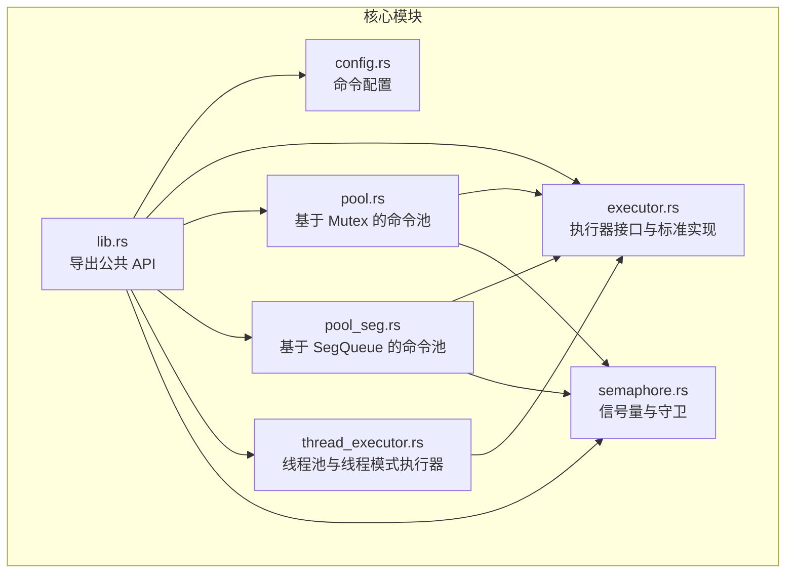
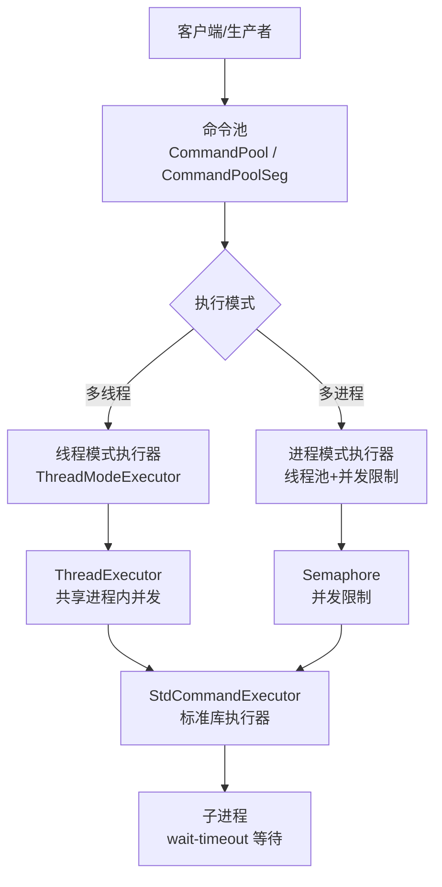
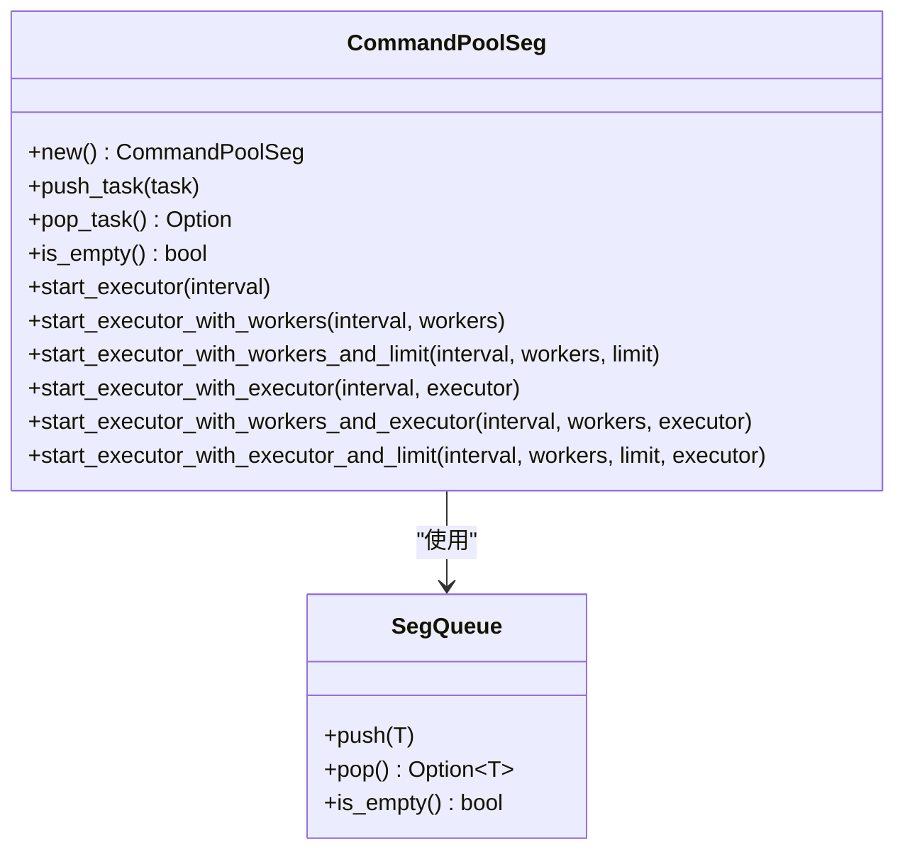
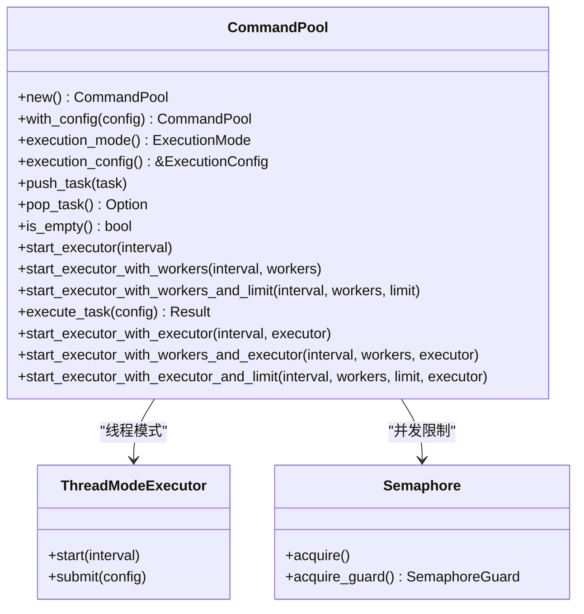
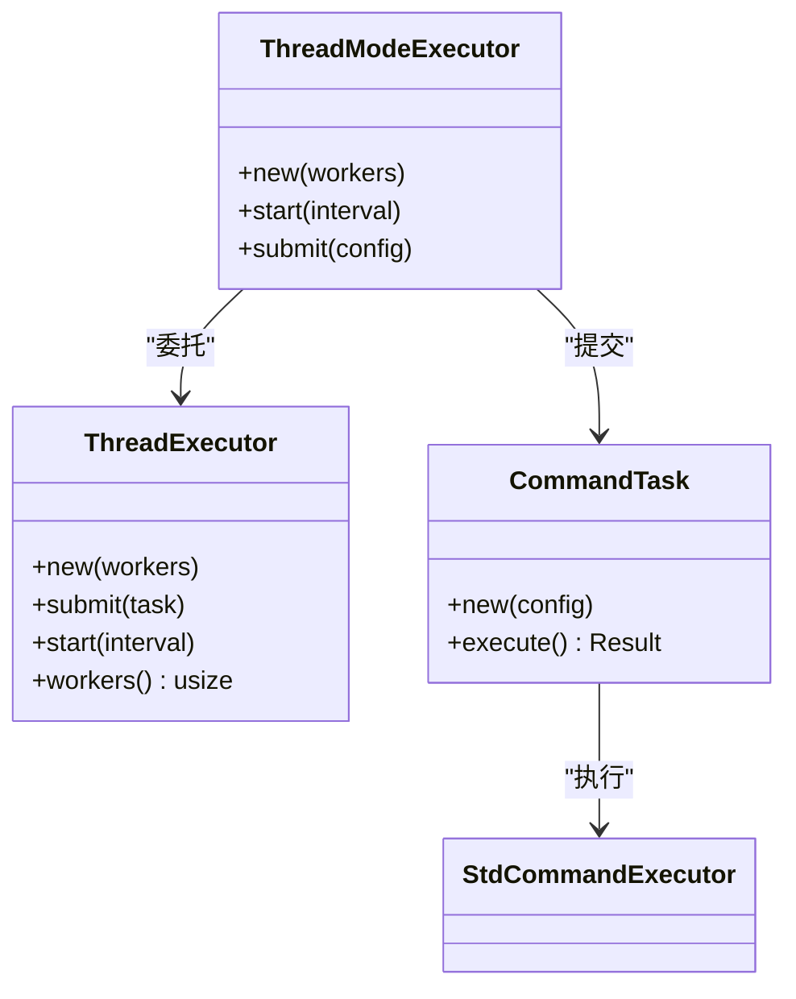
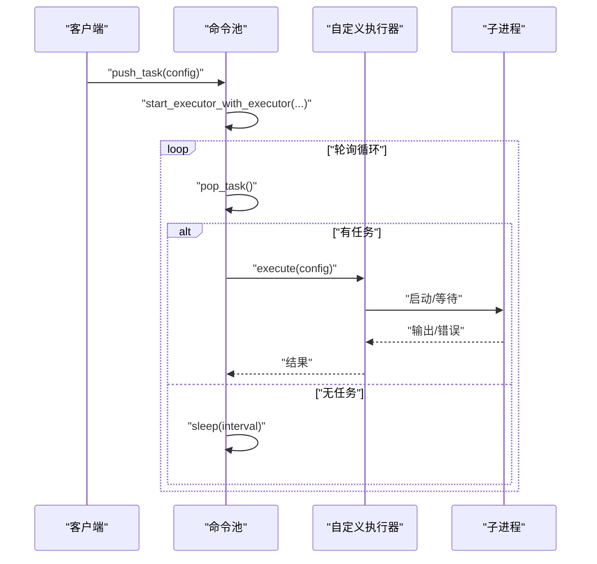
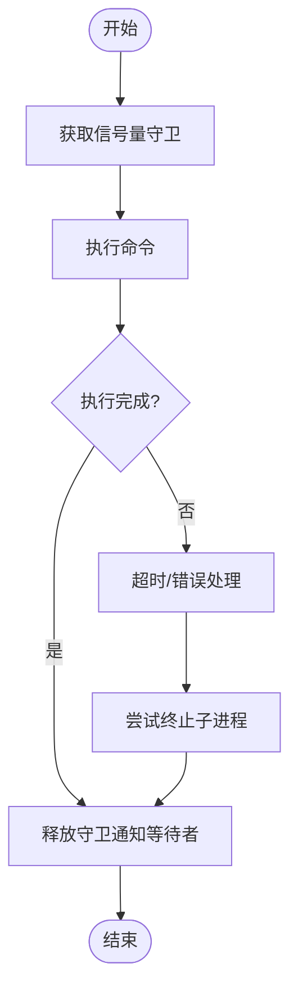
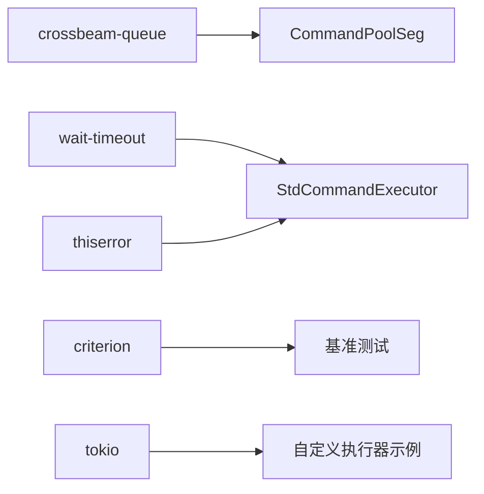

# 高级功能

<cite>
**本文引用的文件**
- [src/lib.rs](file://src/lib.rs)
- [src/pool.rs](file://src/pool.rs)
- [src/pool_seg.rs](file://src/pool_seg.rs)
- [src/executor.rs](file://src/executor.rs)
- [src/thread_executor.rs](file://src/thread_executor.rs)
- [src/semaphore.rs](file://src/semaphore.rs)
- [src/config.rs](file://src/config.rs)
- [benches/command_pool_bench.rs](file://benches/command_pool_bench.rs)
- [examples/tokio_integration.rs](file://examples/tokio_integration.rs)
- [EXECUTOR_CUSTOM.md](file://EXECUTOR_CUSTOM.md)
- [README.md](file://README.md)
- [Cargo.toml](file://Cargo.toml)
- [tests/pool_tests.rs](file://tests/pool_tests.rs)
</cite>

## 目录
1. [简介](#简介)
2. [项目结构](#项目结构)
3. [核心组件](#核心组件)
4. [架构总览](#架构总览)
5. [详细组件分析](#详细组件分析)
6. [依赖关系分析](#依赖关系分析)
7. [性能考量](#性能考量)
8. [故障排查指南](#故障排查指南)
9. [结论](#结论)
10. [附录](#附录)

## 简介
本文件聚焦于“高级功能”，围绕以下主题展开：
- 无锁队列实现的原理与优势
- 任务队列管理的内部机制与性能特征
- 性能优化技巧与基准测试方法
- 内存管理与资源回收策略
- 高级使用模式与扩展点（自定义执行器、并发限制、线程池）
- 性能分析与调优最佳实践

## 项目结构
该项目提供两类任务队列实现：
- 基于互斥锁的命令池：适用于通用场景，简单可靠
- 基于无锁队列的命令池：面向高并发生产者场景，减少锁竞争

此外，提供可插拔的命令执行器接口，支持标准库、Tokio 等运行时，以及线程池、并发限制等高级能力。

图表来源
- [src/lib.rs](file://src/lib.rs#L1-L17)
- [src/config.rs](file://src/config.rs#L1-L109)
- [src/executor.rs](file://src/executor.rs#L1-L100)
- [src/pool.rs](file://src/pool.rs#L1-L296)
- [src/pool_seg.rs](file://src/pool_seg.rs#L1-L157)
- [src/thread_executor.rs](file://src/thread_executor.rs#L1-L148)
- [src/semaphore.rs](file://src/semaphore.rs#L1-L53)

章节来源
- [src/lib.rs](file://src/lib.rs#L1-L17)
- [README.md](file://README.md#L1-L60)

## 核心组件
- 命令配置：封装程序名、参数、工作目录、超时等
- 标准执行器：基于标准库子进程执行，支持超时与安全等待
- 命令池（Mutex 版）：多线程安全的任务队列，支持多线程/多进程两种执行模式
- 命令池（无锁版）：基于跨线程无锁队列，提升多生产者场景吞吐
- 线程池执行器：在共享进程内并发执行任务，适合计算/线程友好型任务
- 并发限制：基于信号量的轻量并发控制，避免系统资源耗尽
- 自定义执行器：通过统一接口接入任意运行时（如 Tokio）

章节来源
- [src/config.rs](file://src/config.rs#L1-L109)
- [src/executor.rs](file://src/executor.rs#L1-L100)
- [src/pool.rs](file://src/pool.rs#L1-L296)
- [src/pool_seg.rs](file://src/pool_seg.rs#L1-L157)
- [src/thread_executor.rs](file://src/thread_executor.rs#L1-L148)
- [src/semaphore.rs](file://src/semaphore.rs#L1-L53)

## 架构总览
整体架构围绕“任务队列 + 执行器”展开，支持多种执行模式与运行时。

图表来源
- [src/pool.rs](file://src/pool.rs#L134-L143)
- [src/thread_executor.rs](file://src/thread_executor.rs#L112-L137)
- [src/semaphore.rs](file://src/semaphore.rs#L1-L53)
- [src/executor.rs](file://src/executor.rs#L26-L70)

## 详细组件分析

### 无锁队列实现（CommandPoolSeg）
- 原理与优势
  - 使用跨线程无锁队列，避免锁竞争，特别适合多生产者场景
  - 支持无阻塞 push/pop，降低上下文切换与锁开销
- 内部机制
  - 任务入队：无阻塞 push
  - 任务出队：无阻塞 try-pop
  - 执行器：固定/自动工作线程数，支持并发限制
- 性能特征
  - 多生产者高并发下吞吐更高
  - 单消费者场景下仍具备良好表现
- 使用建议
  - 生产者数量较多或高并发写入时优先选择
  - 与并发限制配合，避免过多外部进程导致系统资源紧张

图表来源
- [src/pool_seg.rs](file://src/pool_seg.rs#L11-L157)

章节来源
- [src/pool_seg.rs](file://src/pool_seg.rs#L1-L157)

### 基于互斥锁的命令池（CommandPool）
- 内部机制
  - 任务队列：Arc<Mutex<VecDeque<CommandConfig>>>
  - 执行模式：多线程（线程模式执行器）/多进程（固定/带并发限制的工作线程）
  - 并发控制：信号量限制同时执行的外部进程数量
- 性能特征
  - 锁保护下的稳定性和易用性
  - 多生产者/多消费者场景下存在锁竞争
  - 通过并发限制与线程池复用降低系统开销
- 使用建议
  - 通用场景首选
  - 需要线程模式或自定义执行器时可结合线程模式执行器

图表来源
- [src/pool.rs](file://src/pool.rs#L13-L289)
- [src/thread_executor.rs](file://src/thread_executor.rs#L112-L137)
- [src/semaphore.rs](file://src/semaphore.rs#L1-L53)

章节来源
- [src/pool.rs](file://src/pool.rs#L1-L296)

### 线程池与线程模式执行器
- 线程池执行器
  - 维护共享任务队列与工作线程
  - 支持提交实现了线程任务接口的任务
- 线程模式执行器
  - 将命令配置包装为线程任务
  - 在共享进程内并发执行命令（仍通过子进程执行外部命令）

图表来源
- [src/thread_executor.rs](file://src/thread_executor.rs#L16-L148)
- [src/executor.rs](file://src/executor.rs#L14-L24)

章节来源
- [src/thread_executor.rs](file://src/thread_executor.rs#L1-L148)

### 自定义执行器与运行时集成
- 接口设计
  - 统一的命令执行接口，支持不同运行时（标准库、Tokio 等）
- 运行时集成示例
  - Tokio 异步执行器：在同步 trait 中使用运行时阻塞执行
  - 超时控制：结合运行时超时工具实现
- 高级用法
  - 固定/自动工作线程数
  - 并发限制与自定义执行器组合

图表来源
- [src/pool.rs](file://src/pool.rs#L229-L289)
- [examples/tokio_integration.rs](file://examples/tokio_integration.rs#L10-L40)

章节来源
- [src/executor.rs](file://src/executor.rs#L1-L100)
- [examples/tokio_integration.rs](file://examples/tokio_integration.rs#L1-L62)
- [EXECUTOR_CUSTOM.md](file://EXECUTOR_CUSTOM.md#L1-L228)

### 并发限制与资源回收
- 并发限制
  - 基于信号量的轻量并发控制，避免过多外部进程占用系统资源
  - 支持 RAII 守卫，生命周期结束自动释放许可证
- 资源回收
  - 子进程等待与超时处理，避免僵尸进程
  - 线程池工作线程复用，减少频繁创建销毁开销

图表来源
- [src/semaphore.rs](file://src/semaphore.rs#L11-L52)
- [src/executor.rs](file://src/executor.rs#L26-L70)

章节来源
- [src/semaphore.rs](file://src/semaphore.rs#L1-L53)
- [src/executor.rs](file://src/executor.rs#L1-L100)

## 依赖关系分析
- 外部依赖
  - 无锁队列：crossbeam-queue
  - 等待与超时：wait-timeout
  - 错误处理：thiserror
  - 基准测试：criterion
  - 异步运行时：tokio（示例与测试）
- 内部模块耦合
  - 命令池依赖执行器与信号量
  - 线程模式执行器依赖线程池
  - 无锁版本与互斥版本共享执行器接口

图表来源
- [Cargo.toml](file://Cargo.toml#L6-L12)
- [src/pool_seg.rs](file://src/pool_seg.rs#L5-L5)
- [src/executor.rs](file://src/executor.rs#L1-L3)
- [benches/command_pool_bench.rs](file://benches/command_pool_bench.rs#L1-L2)

章节来源
- [Cargo.toml](file://Cargo.toml#L1-L13)

## 性能考量
- 无锁队列 vs 互斥队列
  - 多生产者高并发场景下，无锁队列吞吐更高，锁竞争更少
  - 单生产者/消费者场景下差异较小
- 线程/进程模式选择
  - 多线程：共享内存，适合线程友好型任务；注意 GIL 与数据竞争
  - 多进程：隔离性强，适合 CPU 密集或需要强隔离的任务
- 并发限制
  - 通过信号量限制外部进程数量，避免系统资源耗尽
  - 结合工作线程数与轮询间隔调优
- 超时与等待
  - 使用等待与超时避免额外等待线程，降低系统开销
- 基准测试
  - 提供基准测试样例，覆盖单线程/多线程 push/pop 与执行真实命令
  - 建议在目标硬件上运行，对比互斥与无锁版本

章节来源
- [benches/command_pool_bench.rs](file://benches/command_pool_bench.rs#L1-L93)
- [src/pool_seg.rs](file://src/pool_seg.rs#L21-L41)
- [src/pool.rs](file://src/pool.rs#L165-L210)
- [src/executor.rs](file://src/executor.rs#L26-L70)

## 故障排查指南
- 常见问题
  - 任务未被执行：检查执行器是否启动、轮询间隔是否过大
  - 超时未生效：确认命令配置是否设置超时、等待逻辑是否正确
  - 并发过高导致系统资源紧张：增加并发限制或减少工作线程数
  - 线程模式下内存泄漏：确认线程池生命周期与任务提交节奏
- 调试建议
  - 使用测试用例验证基本行为（空队列、模式切换、默认值）
  - 对比互斥与无锁版本在目标场景下的表现
  - 在示例中替换为实际命令，观察输出与错误

章节来源
- [tests/pool_tests.rs](file://tests/pool_tests.rs#L1-L90)
- [src/pool.rs](file://src/pool.rs#L134-L143)
- [src/executor.rs](file://src/executor.rs#L26-L70)

## 结论
- 无锁队列在多生产者场景显著提升吞吐，互斥队列在通用场景稳定可靠
- 通过自定义执行器与并发限制，可在不同运行时与资源约束下灵活调优
- 建议结合基准测试与实际负载评估，选择合适的队列实现与执行模式

## 附录

### 高级使用模式与扩展点
- 自定义执行器
  - 实现统一接口，接入任意运行时（如 Tokio），支持超时与错误处理
  - 可与固定/自动工作线程数、并发限制组合
- 线程模式
  - 在共享进程内并发执行任务，适合线程友好型任务
- 并发限制
  - 通过信号量限制外部进程数量，避免资源耗尽

章节来源
- [EXECUTOR_CUSTOM.md](file://EXECUTOR_CUSTOM.md#L1-L228)
- [src/thread_executor.rs](file://src/thread_executor.rs#L112-L137)
- [src/semaphore.rs](file://src/semaphore.rs#L1-L53)

### 性能分析与调优最佳实践
- 基准测试
  - 使用提供的基准测试样例，覆盖 push/pop 与真实命令执行
  - 在目标硬件与操作系统上运行，记录互斥与无锁版本差异
- 调优要点
  - 工作线程数：根据 CPU 核心数与任务类型调整
  - 轮询间隔：平衡吞吐与 CPU 占用
  - 并发限制：根据系统资源与外部进程特性设定上限
  - 队列选择：多生产者场景优先无锁版本

章节来源
- [benches/command_pool_bench.rs](file://benches/command_pool_bench.rs#L1-L93)
- [src/pool_seg.rs](file://src/pool_seg.rs#L43-L51)
- [src/pool.rs](file://src/pool.rs#L174-L187)